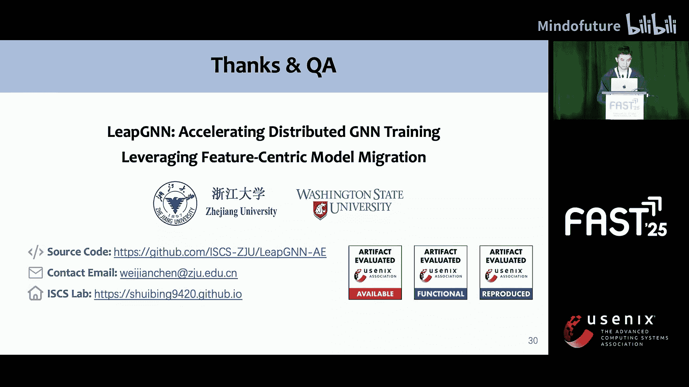

# 017：LeapGNN - 利用以特征为中心的模型迁移加速分布式GNN训练

## 概述

在本节课中，我们将学习一种名为LeapGNN的新框架，它旨在加速分布式图神经网络（GNN）的训练过程。我们将探讨传统分布式GNN训练的性能瓶颈，理解LeapGNN提出的以特征为中心的模型迁移方法，并详细介绍其核心的三大优化技术。

## GNN训练与分布式挑战

图神经网络（GNN）是专门为处理图结构数据而设计的神经网络模型。在我们的日常生活中，人与人、人与产品之间的关系都可以被抽象成图。因此，GNN被广泛应用于推荐系统、社交网络分析等领域。

对于大规模图数据，基于采样的GNN训练是一种标准方法。让我们通过一个简单的文本标签预测例子来快速回顾GNN的训练过程。

训练数据包含两部分：
1.  **图拓扑结构**：表示顶点（vertices）和边（edges）之间的连接关系。部分顶点带有标签（例如，表示用户偏好），部分则没有。
2.  **顶点特征**：每个顶点都有一个嵌入向量，称为特征。

一个GNN模型是一个多层神经网络。以一个两层GNN、最小批处理大小为1为例，训练开始时随机选取一个带标签的顶点（例如顶点5）。然后进行两跳采样以创建子图。接着，工作节点收集子图中所有顶点的特征。最后，将子图拓扑和收集到的特征送入GNN模型，通过前向和后向传播来更新模型参数。训练好的GNN模型可用于预测未知顶点的标签。

然而，现实世界中的图通常太大，无法放入单台机器的内存中。利用多台机器的分布式内存是一个有效的解决方案。

在这种场景下，图拓扑被分割成两部分（例如红色和蓝色）。红色部分的拓扑及其对应特征存储在服务器0上，蓝色部分存储在服务器1上。一小部分拓扑会被冗余存储以减少采样时的通信时间。

## 性能瓶颈分析

让我们通过一个分布式训练迭代的例子来突出性能瓶颈。假设图和特征分布在两台服务器（标记为红和蓝）上，最小批处理大小为2，即每台服务器的worker随机选择两个带标签的顶点进行训练。

以下是训练步骤：
1.  每个worker通过两跳采样生成一个子图。
2.  每个worker收集其子图中所有顶点的特征。如果顶点特征存储在本地，则直接从本地机器收集；否则，需要从远程机器获取。
3.  每个worker的模型使用其子图拓扑和收集到的特征执行前向和后向传播，随后进行梯度同步和参数更新。这就完成了一次训练迭代。

我们发现，从远程机器获取特征的过程是整个训练过程的主要性能瓶颈。在各种数据集和GNN模型上的测试表明，这部分通信时间占比超过44%。

## 现有方法与局限性

近期的工作提出了许多方法来缓解这个瓶颈，例如图分区优化、从本地服务器采样更多顶点、在GPU内存中缓存顶点特征以及引入新的训练方案。然而，这些方法都存在一些局限性。我们将这些方法称为**以模型为中心的方法**，因为在它们的系统中，当模型需要位于远程机器上的特征时，它们会将这些特征获取到本地机器。

## LeapGNN的核心观察与设计

我们观察到，在GNN训练中，从远程服务器获取的数据量远大于模型参数本身。基于这一观察，我们受到启发，利用**模型迁移**来减少GNN训练期间的数据传输量。我们的目标是将模型移动到顶点特征所在的服务器，而不是从远程服务器获取特征。

### 朴素的模型迁移方法

让我们用同一个例子来说明朴素的模型迁移方法。首先关注一个模型（模型0）的计算，它仍被分配用于训练顶点6和3。因此，worker首先生成子图0。

以下是其计算流程：
1.  模型0收集子图第一层中存储在本地顶点的特征，并执行部分前向计算。我们将这些顶点标记为红色圆圈。
2.  接着，模型0及其中间结果迁移到服务器1，在那里它收集剩余顶点的特征，并完成第一层的前向计算。
3.  最后，模型0及其中间数据迁移回服务器0，以完成第二层的前向计算以及整个模型的后向传播。

这两个模型在两台机器之间交替移动并并行执行计算。在两个模型都完成前向和后向传播后，梯度被同步，参数在最后更新。

与现有的以模型为中心的方法相比，朴素的模型迁移方法完全消除了两台机器之间的特征数据传输。

然而，这种朴素的模型迁移方法只在某些情况下比原始方法更高效，在其他情况下则不然。这主要是因为朴素的模型迁移引入了中间数据传输，而这些数据是后向传播所需要的。因此，我们需要进一步改进朴素的模型迁移。

## LeapGNN的三大关键技术

### 1. 基于微图的GNN训练

我们首先注意到，当采样的子图被划分为更小的子图时，数据局部性可以得到改善。具体来说，我们首先定义了一个**微图**，它是一种特殊的子图，只包含一个根顶点。例如，从最小批处理6和3采样得到的子图0，就由微图6和微图3组成。

我们发现，微图中的大多数顶点特征都位于根顶点所在的同一台机器上。例如，在微图6中，大多数顶点特征与根顶点6在同一台机器上，因此它们都是红色的。我们使用各种图分区算法、采样算法、采样层数或服务器数量进行验证，发现微图的局部性总是高于整个子图的局部性。我们认为这是因为图分区算法倾向于将相邻的顶点放在同一台机器上。

基于微图增强的局部性，我们提出了**基于微图的GNN训练**。

让我们再次关注模型0，与朴素模型迁移相比，有两个关键区别：
*   **第一**，一个微图的前向和后向传播在单台机器上完成。例如，微图6仅在服务器0上用于训练，微图3仅在服务器1上用于训练。这样做的好处是，在后向传播完成后，除了梯度之外的所有中间数据都被释放，避免了朴素模型迁移中传输大量中间数据的开销。
*   **第二**，它允许从远程服务器获取微图中非本地的顶点特征。请注意，由于我们之前提到的微图增强的局部性，只有少量特征需要从远程获取。

总体而言，它结合了模型迁移和微图的局部性，以减少跨服务器的数据传输量。同时，模型1遵循类似的过程，但在另一台机器上。在两个模型都完成训练后，梯度被同步，模型参数被更新。此外，由于该方法不改变训练顶点的随机分配和每个模型的训练过程，因此保持了模型精度。

### 2. 顶点特征预收集技术

我们进一步发现，同一服务器上不同时间步之间的特征传输是冗余的。例如，顶点1和4的特征被获取了两次。

因此，我们设计了**顶点特征预收集**技术来减少冗余传输。其核心思想是主动检查在接下来的几个时间步中需要哪些顶点，并一次性从远程获取多个顶点的特征，从而减少冗余的获取请求。

### 3. 微图合并技术

当集群规模较大时，一次迭代涉及更多时间步的计算和同步，导致时间开销增加。例如，三台服务器需要三个时间步来完成一次迭代训练。

为了解决这个问题，我们提出了**微图合并**技术，它通过合并一些微图组来减少时间步之间的同步时间开销。合并后，一次迭代训练只需要两个时间步。

随之而来的问题是：应该合并哪些微图以及合并多少个微图？我们设计了一个简单的贪心算法来解决这些问题，更多细节请参阅我们的论文。

## 实验评估与总结

我们的实验在四台服务器、单块RTX 8000 GPU上进行。我们选择了五种具有不同隐藏大小和层数的流行GNN模型，以及五种不同大小的数据集。我们在性能方面将LeapGNN与DGL、P3和NeuStar进行了比较。此外，我们还比较了LeapGNN与朴素模型迁移方法，以证明我们优化的有效性。

实验结果表明，无论是在小批量训练还是全批量训练下，LeapGNN在各种数据集和模型上的性能均优于其他系统，加速比达到1.1倍至4.8倍。

此外，我们依次启用了每项技术，结果表明每项技术都进一步加速了分布式GNN训练。具体来说：
*   第一项技术（基于微图的训练）显著降低了特征的本地缺失率。
*   第二项技术（特征预收集）最小化了冗余的特征请求。
*   第三项技术（微图合并）自适应地调整了迭代中的时间步数，自动平衡性能提升和额外开销。

我们还通过改变特征维度、批处理大小、采样扇出大小和分布式服务器数量来测试LeapGNN。结果表明，LeapGNN始终优于其他方案。

## 总结

在本节课中，我们一起学习了LeapGNN框架。我们首先识别出特征传输已成为分布式GNN训练瓶颈的问题。为了解决这个问题，我们引入了以特征为中心的模型迁移方法来减少特征传输量。为了使该方法真正有效，我们开发了三大关键技术：基于微图的GNN训练、顶点特征预收集和微图合并。这些创新使LeapGNN相比最先进的对比系统P3，实现了高达4.2倍的加速。我们的代码已开源，并成功通过了制品评估。