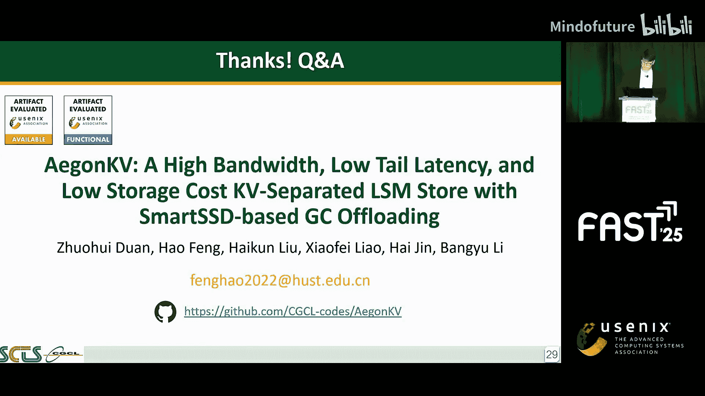

# 021：AegonKV - 一种高带宽、低尾延迟、低存储成本的KV分离存储系统

大家好，我是来自华中科技大学的Bing Tian。本文的作者今天无法到场，我将代表他们分享这项工作的见解。

在本教程中，我们将学习AegonKV（A-KV）的设计，这是一个旨在解决键值（KV）分离存储系统中垃圾回收（GC）瓶颈的系统。我们将从背景和动机开始，逐步解析其核心设计，包括GC管理器、调度器、无验证插入机制以及如何在智能SSD上实现硬件GC。最后，我们将通过实验数据评估其性能优势。

## 背景与动机 🎯

键值分离系统将值从LSM-tree架构中解耦。它包含多个Blob文件来实际存储键值对，而SSTable则存储键及其对应值在Blob文件中的地址引用。值日志的大小显著减小，从而缓解了读写放大问题。

然而，值日志面临着过期数据累积的挑战。为了减少空间冗余，系统引入了垃圾回收机制。在GC过程中，需要扫描整个Blob文件，并查询LSM-tree以确定是丢弃无效数据还是重写有效数据。但这引入了额外的I/O和计算开销。

一种广泛使用的GC策略是将值日志分区，并选择垃圾比例高的Blob文件进行GC。这种由Titan和PebblesDB采用的策略被称为**直接GC**。它有助于选择高收益区域，但仍需要检查LSM-tree，这实际上造成了性能瓶颈。

另一类工作，以Dostoevsky和BadgerDB为代表，试图将Blob文件的单层结构转变为多层结构。当在SSTable上执行压缩时，有效值将被直接迁移到新的Blob中。这种策略被称为**压缩触发GC**。虽然它增加了压缩的开销，但减少了检查LSM-tree的带宽使用，从而提升了系统性能。

## 现有系统的权衡分析 ⚖️

为了理解键值分离的特性，我们首先对Titan、BadgerDB和Dostoevsky进行了写性能测试，并与传统的LSM存储RocksDB进行了比较。

结果如下表所示，我们在图中进一步可视化了这些指标。

与RocksDB相比，BadgerDB和Dostoevsky的吞吐量高出17%以上，尾延迟降低了50%以上，但空间放大显著增加。RocksDB仅需9GB空间存储过期数据，而BadgerDB和Dostoevsky分别需要135GB和53GB。然而，我们看到Titan在空间使用方面表现出色，仅比RocksDB多2GB。Titan在压缩I/O和重写方面也表现最佳，但吞吐量比RocksDB下降了18%。

**总结来说，我们的第一个观察是：现有键值分离系统的性能结果存在权衡，无法同时在吞吐量、尾延迟和空间使用上取得优势。**

基于Dostoevsky和BadgerDB的优化方向是卸载GC操作这一事实，我们进一步关闭了Titan中的GC选项。表A显示，在没有GC的情况下，Titan的吞吐量提升了67%，这表明GC操作仍然是Titan的瓶颈。

然后，我们将可用CPU核心数设置为16，以检查资源竞争的结果。结果显示，没有GC的Titan性能仅下降6%，但Titan进一步遭遇了20-23%的骤降。为了进一步确定竞争条件是否出现，我们使用`perf`工具进行了分析。表B显示，主要瓶颈源于读写I/O与GC竞争计算和带宽资源。

幸运的是，我们观察到直接GC操作可以通过智能SSD上的近数据处理进行优化。

## 智能SSD与挑战 💡

三星的智能计算存储设备是业界首款可定制和可编程的计算存储。智能SSD内部集成了一个FPGA，数据可以通过内部总线传输，因此文件处理可以绕过复杂的软件栈和系统总线。

然而，几个挑战阻碍了在智能SSD上高效卸载GC操作：
1.  **硬件限制**：由于硬件约束，在GC期间查询LSM-tree的逻辑难以实现，需要避免。
2.  **有限的计算资源**：智能SSD内的计算资源无法与主机相比，因此资源控制至关重要。
3.  **带宽竞争**：当硬件GC完成后，结果需要传输回主机，这会竞争带宽，需要设计来重新调度数据移动。

## AegonKV 系统设计 🏗️

以下是AegonKV的架构设计，旨在应对数据重写的挑战。

我们在GC管理器中提出了**有效位图**结构。此外，为了克服智能SSD资源有限的问题，我们设计了**GC调度器**来协调数据移动和资源分配。我们还引入了**无验证插入**机制来解决GC的带宽竞争问题。最后，我们在智能SSD上设计并部署了**GC计算卸载**模块。

### GC管理器设计

对于每个Blob文件，我们创建一个称为`valid_map`的位图，用于指示每个键值对的有效性，其中位0和1分别标记有效和无效记录。GC管理器利用压缩的结果信息来更新`valid_map`，并通过监控每个`valid_map`中的垃圾比例来创建GC任务。

### GC调度器设计

调度器中有三个关键单元：
*   **I/O控制单元**：充分利用智能SSD接口，在SSD和FPGA DRAM之间传输Blob文件，以及在系统总线上传输`valid_map`和重打包的镜像数据。
*   **计算调度单元**：在软件层管理正在使用的核心数量以及为每个任务分配的FPGA资源。
*   **合并插入单元**：合并插入的问题是来自并发调用的写接口竞争。因此，我们添加了一个屏障，帮助协调多个磁盘的合并操作到一个统一的通道中。

### 无验证插入机制

尽管合并插入单元通过批处理进行了优化，但它仍然需要对每个合并数据进行查找，以避免版本冲突。如下图所示，一个包含旧数据的条目可能通过合并插入，覆盖了在GC期间写入的最新版本。

然而，这种查找操作会导致严重的带宽竞争。为了提升性能，我们提出了**无验证插入**。

为了应对由此带来的数据一致性问题，我们将查找验证推迟到`get`和`compaction`过程中。
*   在`get`过程中，首次找到一个键时，它可能是正常数据或GC合并数据。查询到正常数据时没有问题。但当查询到合并数据时，我们不确定在GC期间是否有新的值被写入。因此，我们继续向后查询更旧的版本，并比较其值地址与合并数据中存储的原始地址，以确定哪个是最新版本。
*   在`compaction`过程中，我们也采用继续读取下一个版本的策略。此外，我们在压缩期间将合并数据提升为正常数据，以最小化延迟验证的频率。

### 硬件GC卸载

我们将硬件卸载过程抽象为三个独立的阶段：
1.  **输入解码阶段**：解码Blob文件和`valid_map`。由于数据在文件内是连续的，硬件实现高度并行。
2.  **实际计算阶段**：过滤模块以离散流的方式遍历`valid_map`，产生信号供特征模块选择是重写还是忽略。
3.  **输出编码阶段**：从特征模块检索数据，并将其排列为适合写入SSD的格式，无需主机端迭代。

## 性能评估 📊

我们在配备三星第一代智能SSD的服务器上进行了大量实验来评估AegonKV的设计。我们比较了AegonKV与Titan、BadgerDB、Dostoevsky和RocksDB。使用了YCSB基准测试以及开源的生产环境工作负载：Facebook社交图工作负载和Twitter缓存追踪。

### YCSB写密集型负载

下图显示了在YCSB写密集型负载下的结果。

AegonKV表现出吞吐量提升，范围从1.3倍到4.6倍，并且非常接近无GC场景的性能。AegonKV也实现了最低的尾延迟，降低了14%到85%。在空间使用方面，AegonKV仅需0.75倍于RocksDB的额外冗余空间。键值分离的压缩数据量显著减少，并且AegonKV没有写停顿。

### 其他负载下的表现

*   **读密集型负载**：AegonKV的吞吐量和尾延迟与其他系统非常接近，因为读流本质相同，且GC操作不频繁触发。由于更新比例低，空间使用也相似。
*   **扫描负载**：所有系统的性能保持相对相似，AegonKV通过引入额外的压缩触发GC来调节值日志，从而输出性能。
*   **真实工作负载**：对于社交图和缓存集群，AegonKV的性能结果与YCSB写密集型负载基本一致，吞吐量高出1.22到2倍，尾延迟降低31%到55%，表明AegonKV非常适合真实场景。
*   **混合与读密集型负载**：我们观察到与YCSB读负载类似的结果，所有系统在性能各方面都很接近。除了GC频率低之外，这两个负载中大量的小值也影响了结果。

### 资源与效率

表A报告了硬件资源使用情况。我们充分利用硬件并部署了硬件GC，足以支持系统正常运行。表B显示了CPU利用率，AegonKV实现了约20%的节省，这表明GC卸载有效解决了竞争瓶颈。表C显示了能效，AegonKV提升了15%到17%。

### 参数敏感性分析

我们接下来分析了YCSB在系统参数和工作负载参数方面的敏感性。
*   **系统参数**：对于AegonKV，由于我们将GC从系统关键路径中分离，性能在不同垃圾比例、线程负载下保持不变。与Titan相反，增加GC线程数不影响AegonKV的性能，调整批处理大小参数对系统性能也无影响。**总结：AegonKV的性能优势不受系统参数影响。**
*   **工作负载参数**：
    *   **值大小**：较小的值意味着读写开销减少。AegonKV对值大小的变化较不敏感。
    *   **数据集大小**：数据集大小对每个系统影响很小。
    *   **工作负载比例**：结果与YCSB评估一致。
    *   **Zipfian分布**：AegonKV受多线程冲突的影响最小。
    *   **总结：AegonKV具有良好的工作负载适应性和适度的可扩展性。**

## 总结 🎉

我们观察到现有键值分离系统在GC方面存在竞争和权衡。因此，我们引入了AegonKV，它全面提升了吞吐量、尾延迟和空间使用率。实验证明，AegonKV实现了吞吐量1.3到3.3倍的提升，尾延迟降低37%到66%，空间开销减少15%到85%。

这就是我们工作的介绍。如需更多详细信息，请查阅我们的论文。由于作者无法到场，如果您有任何问题，可以通过电子邮件联系作者。感谢聆听。