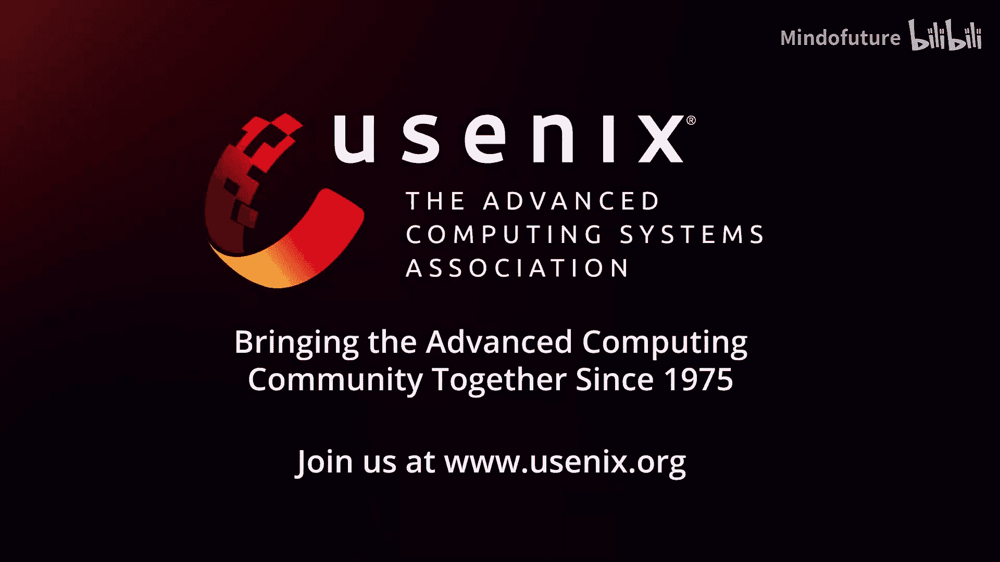

# 022：D2FS - 设备驱动的文件系统垃圾回收 🗑️➡️💾

## 概述

在本节课中，我们将学习一种名为D2FS的新型文件系统设计。它的核心思想是让存储设备来负责文件系统的垃圾回收工作，从而显著提升系统性能。我们将从背景动机开始，逐步解析其设计原理、面临的挑战以及最终的解决方案。

---

## 背景与动机

上一节我们提到了学习D2FS的目标，本节中我们来看看其产生的背景和需要解决的问题。

日志结构文件系统（Log-structured File System， LFS）由Rosenblum于1991年首次提出。LFS是一种写优化文件系统。它将整个文件系统分区视为一个单一的日志，并将数据块写入日志的末尾。例如，当更新一个文件块时，LFS将新块写在日志末尾，并使旧块失效。它通过将文件上的随机写转换为顺序写，从而高效地处理随机写工作负载。

多年来，已经出现了许多为新兴存储设备设计的日志结构文件系统，包括JFFS、YAFFS、F2FS等。LFS因其仅追加（append-only）的特性与闪存存储（需要顺序页写入）的特性高度契合而备受青睐。

然而，当LFS与闪存存储一起使用时，写放大会增加，因为文件系统和闪存存储都会冗余地执行各自的垃圾回收例程。

下图展示了IO栈中的映射关系。要定位一个文件块的物理位置，存在两种映射：FTL映射和L2P映射。FTL映射将文件块映射到文件系统分区内的逻辑块地址（LBA）。L2P映射将LBA映射到闪存空间中的物理页地址（PPA）。

文件系统垃圾回收负责回收无效的文件系统块。它将有效的逻辑块整合到一个空闲段中，并为更新的LBA更新FTL映射。然后，受害段被释放并回收。

另一方面，设备垃圾回收负责回收无效的闪存页。它将有效的闪存页整合到一个空闲的闪存块中，并为更新的PPA更新L2P映射。结果，受害闪存块被释放并回收。

垃圾回收对应用程序性能有严重的负面影响。我们在LFS和闪存存储上执行随机写入。当文件系统和设备同时运行垃圾回收时，应用程序性能下降高达80%。

已有大量研究致力于减轻垃圾回收的开销。一些工作侧重于将具有相似生命周期的文件块聚集在一起以减少写放大。许多研究提出通过向主机暴露设备的内部几何结构，让文件系统直接清理存储设备。最近提出的IPLFS采取了相反的方法，它通过过度扩展文件系统分区来消除文件系统垃圾回收的需求。然而，为了管理如此大的文件系统分区，L2P映射结构变得巨大且复杂，难以在现实世界中部署。

总而言之，一些工作依赖文件系统进行垃圾回收，而另一些工作则依赖设备进行垃圾回收。这引出了我们的问题：系统垃圾回收和设备垃圾回收，哪个更好？

我们比较了它们的开销，发现文件系统垃圾回收比设备垃圾回收成本高得多。其背后的原因是文件系统垃圾回收涉及太多子操作，包括检查点、格式化遍历、元数据更新、主机-设备数据传输和页分配，而设备垃圾回收则不需要。

因此，我们的核心想法是让设备来清理文件系统分区。将系统从运行垃圾回收中解放出来，让设备同时清理存储空间和文件系统分区。

---

## 基本概念

上一节我们分析了传统垃圾回收的弊端，本节中我们来了解D2FS的基本工作原理。

左图显示了主机文件系统中的FTL映射，右图显示了存储设备中的L2P映射。当设备运行垃圾回收时，它会整合有效的闪存页，因此相应的PPA会被更新。同时，设备会更新被整合闪存页对应的逻辑块地址（LBA），使得相应的逻辑块也被整合。因此，设备同时更新了FTL映射和L2P映射。结果，设备垃圾回收同时清理了闪存块和逻辑空间。

然后，设备将更新后的FTL映射同步给主机文件系统。主机文件系统为更新的LBA更新相应的FTL映射，并在不显式迁移文件系统块的情况下回收空闲的文件系统段。我们将这个概念称为**设备驱动的文件系统垃圾回收**。

---

## 挑战

理解了基本概念后，我们来看看实现设备驱动文件系统垃圾回收所面临的三个关键挑战。

以下是实现设备驱动垃圾回收的三个主要挑战：

1.  **第一，传统的IO栈只允许主机更新FTL映射。** 由于主机和设备都会分配LBA，在分配LBA时存在潜在的冲突。
2.  **第二，现有的接口机制（如中断和轮询）不适合同步更新后的FTL映射。** 轮询浪费主机CPU周期；为设备到主机的同步定义一个新的专用中断需要对现有IO栈进行重大更改，例如添加新的中断或新的中断向量表或新的中断处理程序（如果我们幸运地找到一个可用的未使用中断号）。
3.  **第三，设备垃圾回收必须在文件系统耗尽空闲段之前及时运行。** 由于设备根据自己的调度运行垃圾回收，文件系统可能会耗尽空闲段，从而暂停其操作，直到垃圾回收同步完成。

---

## D2FS设计概述

面对这些挑战，D2FS提出了相应的解决方案。本节我们将介绍D2FS的整体设计。

D2FS由三个设计要素组成：耦合垃圾回收、迁移队列和虚拟过度配置。

*   **耦合垃圾回收**：设备更新FTL映射。
*   **迁移队列**：设备用于将更新后的FTL映射同步到主机的IO接口。
*   **虚拟过度配置**：我们虚拟地扩展文件系统分区，以防止文件系统耗尽空闲段。

---

### 耦合垃圾回收

首先，让我们详细了解耦合垃圾回收。

耦合垃圾回收是一种设备垃圾回收。在耦合垃圾回收中，LBA和PPA被耦合在一起并同时更新。当垃圾回收运行时，闪存页和相应的逻辑块被一起整合，从而同时回收闪存块和文件系统段。

为了防止设备与文件系统在分配LBA时发生冲突，我们将文件系统分区划分为两个区域：常规区域和垃圾回收区域。在常规区域，只有主机可以分配LBA。在垃圾回收区域，只有设备可以分配LBA，作为垃圾回收的目标区域。

耦合垃圾回收分三步进行：
1.  选择受害闪存块。
2.  将受害闪存块中的有效页迁移到一个空闲闪存块。
3.  将目标闪存块重新映射到垃圾回收区域中的一个空闲段。

---

### 迁移队列

接下来，我们解释迁移队列。

迁移队列是设备驱动的IO机制，用于将FTL更新发送给主机。一个迁移队列包含一组旧LBA和新LBA的配对。设备将迁移队列发送给主机。然后，主机根据更新的LBA更新FTL映射。之后，主机通过轮询机制向设备发送完成信号。

当迁移队列准备就绪时，设备需要向主机发出信号。对于IO信号链接，设备将队列通知搭载在其他IO命令的完成信号上。我们称这种机制为**队列搭载**。队列搭载既不浪费CPU周期，也不需要定义新的中断。

在使用传统IO栈接口机制时，设备分别发出IO完成信号和队列通知。在队列搭载中，设备将队列通知搭载在后续其他IO命令的完成信号上。为此，设备在IO完成信号中设置一个新定义的队列标志。主机接收队列并从中提取更新后的FTL映射。然后，主机根据更新后的FTL映射更新文件系统状态，从而创建空闲段。

---

### 虚拟过度配置

最后，我们介绍虚拟过度配置。

虚拟过度配置的概念是将文件系统分区大小与存储容量分离，并虚拟地扩展文件系统分区大小。在传统的IO栈中，文件系统分区大小受存储容量限制。因此，设备必须在文件系统耗尽空闲段之前及时运行垃圾回收。否则，文件系统操作将暂停，直到垃圾回收同步完成。

在虚拟过度配置中，文件系统分区被虚拟扩展。它为文件系统提供足够的空闲虚拟段，允许设备按照自己的调度运行垃圾回收。

虚拟过度配置并不意味着文件系统可以存储超出存储容量的数据块。文件系统分区中有三种类型的块：有效块、无效块和空闲块。在传统IO栈中，有效块、无效块和空闲块的总大小受存储容量限制。在虚拟过度配置中，只有有效块的大小受存储容量限制，确保文件系统不会写入超出存储容量。

我们研究了需要将文件系统分区虚拟过度配置多少。我们确定**2.4倍的存储容量**是足够的。回想一下，D2FS文件系统分区由常规区域和垃圾回收区域组成。我们通过实验确定，常规区域需要**1.4倍的存储容量**。如果低于1.3倍，文件系统很可能耗尽空闲段，从而降低应用程序性能。我们将垃圾回收区域的大小设置为等于存储容量，因为存储容量足够大，可以容纳垃圾回收迁移的逻辑块。

---

## 性能评估

了解了D2FS的设计后，本节我们通过实验数据来看看它的实际效果。

以下是评估设置：我们使用一个256GB的模拟SSD（曾在FAST‘23上展示），垃圾回收单元大小为32MB。我们使用5种工作负载：FIO、TPC-C on MySQL、YCSB on MongoDB、Filebench和Fileserver。

我们比较了四种文件系统：
1.  F2FS：涉及文件系统垃圾回收和设备垃圾回收。
2.  Zoned F2FS：采用ZNS方法的F2FS版本，只有文件系统执行垃圾回收。
3.  IPLFS：只有设备执行垃圾回收。
4.  D2FS：只有设备执行垃圾回收。

它们都具有相同的垃圾回收单元大小，即32MB。

这张图显示了4KB随机写入工作负载的性能。由于垃圾回收，所有四种文件系统的性能在大约300秒后开始下降。通过消除昂贵的文件系统垃圾回收，D2FS的性能是F2FS的3倍，是Zoned F2FS的1.7倍。D2FS的性能也优于IPLFS 15%。IPLFS定期重组其L2P映射结构以减少内存占用，此活动会干扰来自主机的IO请求。D2FS没有这种开销。

在宏观基准测试中，D2FS仍然优于其他文件系统。D2FS的性能是F2FS的2.6倍，是Zoned F2FS的1.4倍，是IPLFS的1.5倍。

我们比较了设备垃圾回收和文件系统垃圾回收的开销。该图显示了不同工作负载下每次垃圾回收的延迟。我们发现文件系统垃圾回收所需时间大约是设备垃圾回收的3倍。我们观察到文件系统垃圾回收开销的主要来源是检查点、页分配和格式化遍历。

---

## 总结

本节课中，我们一起学习了D2FS设备驱动文件系统垃圾回收技术。

我们观察到文件系统垃圾回收比设备垃圾回收更昂贵。因此，我们让设备垃圾回收来清理文件系统分区，这与广泛使用的主机驱动垃圾回收方法相反。结果，D2FS的性能分别是F2FS的3倍和Zoned F2FS的1.7倍。

D2FS通过**耦合垃圾回收**让设备同时更新映射，通过**迁移队列**实现高效同步，并通过**虚拟过度配置**确保文件系统不会因设备调度而停滞，从而系统性地解决了性能瓶颈问题。