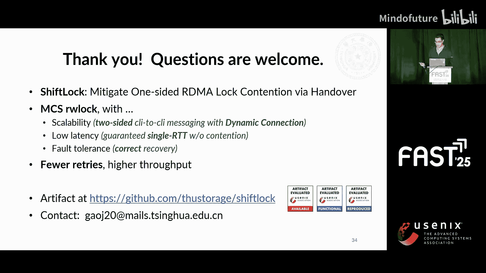
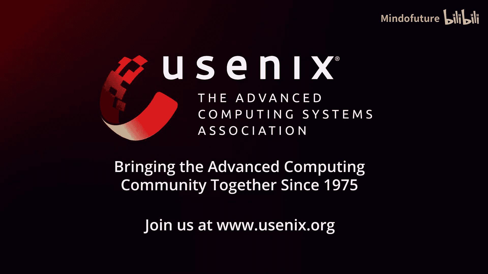

# 023：ShiftLock - 通过交接缓解单边RDMA锁争用

在本教程中，我们将学习一篇来自USENIX FAST 2023会议的研究工作——ShiftLock。这项研究由清华大学的研究团队完成，旨在利用RDMA的硬件特性来加速分布式锁协议，特别是解决高争用场景下的性能下降问题。我们将从RDMA技术基础开始，逐步深入到ShiftLock的核心设计理念、关键技术挑战及其解决方案。

## RDMA技术简介 🔌

上一节我们提到了ShiftLock的研究背景，本节中我们来看看其依赖的核心技术——RDMA。

RDMA意为远程直接内存访问。它是一种用户态网络技术，允许直接访问远程内存，同时绕过远程CPU。由于无需CPU干预，RDMA操作速度极快，网络往返可在微秒级内完成。

RDMA请求被称为“动词”。主要分为两类：

以下是RDMA动词的分类：
*   **单边动词**：无需远程CPU参与，包括读、写和原子操作。
*   **双边动词**：仍需要CPU协助，包括发送和接收。

RDMA硬件发展迅速，其提供的丰富语义为开发新协议创造了机会。本工作重点关注其原子操作动词，它们能操作大于8字节的值，并提供位掩码语义，允许修改操作数的任意部分而保持其余部分不变。可以说，RDMA原子操作比其CPU对应物更强大。

## RDMA锁的优势与挑战 ⚖️

上一节我们介绍了RDMA的基础，本节中我们来看看基于RDMA的锁协议。

在RDMA锁中，客户端直接读写存储在服务器上的锁条目。它们相互协调，就像在单台机器上一样，只不过它们使用RDMA动词访问内存。这种场景也被称为“单边锁”，因为只有客户端CPU是活跃的，服务器CPU几乎不做事。

与传统锁相比，RDMA锁具有优势，包括微秒级延迟、高吞吐量和低CPU使用率。然而，它也有两面性。由于服务器不活跃，客户端在获取锁失败时得不到任何反馈，必须不断重试。RDMA网络不擅长处理大量并发重试，尤其是在存在冲突时。因此，在高争用场景下，RDMA锁的性能会显著下降。例如，200个争用客户端可能导致吞吐量下降约95%。

根本问题在于，有太多来自客户端的重试，它们不断尝试获取已被他人占用的锁。这些重试会消耗I/O资源并导致性能下降。在典型的比较并交换实现中，超过85%的重试在高争用场景下会失败。

## 现有解决方案：锁交接 🔄

上一节我们指出了RDMA锁在高争用下的问题，本节中我们来看看一个经典的解决思路。

好消息是，这不是一个新问题。一个解决方案是让客户端排队并交接锁，这是在著名的MCS锁和CLH锁中已有的思想。

“交接”意味着一个客户端通过点对点消息直接将锁交给另一个客户端，而无需服务器介入。通过交接，客户端可以本地等待接收锁，而不是执行重试。

坏消息是，我们发现很少有RDMA锁采用这个已有34年历史的想法。那么问题出在哪里？实际上，在RDMA网络中实现MCS锁存在一些挑战。

以下是实现MCS锁于RDMA网络的主要挑战：
*   **连接可扩展性**：RDMA控制路径相比数据路径非常慢，在两个客户端之间建立新连接需要毫秒级时间。这导致一个困境：如果预先连接所有客户端，则不可扩展；如果不预先连接，则速度慢。
*   **高网络延迟**：RDMA访问比本地内存访问慢约20倍。这使得难以添加有用功能，例如为MCS锁增加读写者语义。现有的MCS锁读写者变体需要多次触碰锁来获取或释放，这在RDMA上下文中会转化为多次网络往返，增加更高延迟。
*   **容错性**：MCS锁假设客户端永远不会失效，但这在分布式系统中不成立。需要回答两个问题：第一，如何检测故障；第二，如何正确恢复。

## ShiftLock 核心设计 🛠️

上一节我们分析了在RDMA上实现锁交接的挑战，本节中我们正式介绍ShiftLock如何应对这些挑战。

为了解决上述问题，我们开发了ShiftLock。它采用了MCS锁的思想，同时引入了几个关键设计，包括可扩展的客户端间通信、单次往返的读写者协议以及容错机制。

首先，我们快速回顾一下MCS锁协议本身。MCS的原理是将客户端组织在队列中。锁条目是一个指向队列尾部的指针。要获取锁，客户端只需将自己追加到尾部。如果它也是队列头部，则可以成功获取锁。否则，它将有一个队列中的前驱；它会写入前驱的内存以更新其后继信息，然后等待前驱通过更新其内存中的一个标志将锁交给它。

### 1. 可扩展的客户端间通信

现在，我们开始介绍ShiftLock的贡献。首先，讨论如何在RDMA网络中实现MCS锁所需的客户端间通信。

在分布式场景中，客户端运行在不同节点上，必须通过RDMA进行通信。我们需要为它们选择合适的动词并解决可扩展性问题。

MCS锁希望客户端写入彼此的内存，但要在RDMA上执行写入，需要大量元数据，这些元数据必须作为远程指针的一部分嵌入到锁条目中。为了节省空间，我们指出，由于客户端间通信的最终目标是发送一条最终由远程CPU处理的消息，我们可以使用双边发送动词，而不是单边写入，来执行此类通信。只要接收方准备就绪，发送操作具有与写入相似的性能。此外，这些发送不是RPC调用，客户端不需要一直消耗CPU来监控它们。相反，它们只在需要时处理这些接收到的消息。

对于可扩展性问题，由于维护传统连接不可行，我们倾向于使用RDMA动态连接。动态连接允许客户端在数据路径上连接到不同的远程端点，速度非常快，重新连接开销小于1微秒。如前所述，客户端的路由信息作为队列尾指针的一部分嵌入在锁条目中，因此其他人可以使用该信息动态连接到该客户端。

### 2. 单次往返的读写者锁协议

上一节我们解决了通信问题，本节中我们来看看ShiftLock如何高效支持读写者锁。

之前我们假设只有写者存在，锁是互斥锁。当存在读者时，我们必须找到一种方法来管理它们，并在读者和写者之间转移锁所有权，以避免饥饿等问题。

由于网络延迟高，将所有客户端混合在同一个队列中绝对不是好主意。相反，我们只在队列中维护写者，并使用锁条目中的三个新字段来管理读者。

以下是用于管理读者的三个关键字段：
*   **读者计数器**：统计正在尝试获取或正持有锁的活跃读者数量。
*   **锁释放计数器**：客户端释放锁时递增此计数器。
*   **纪元**：标识锁所有权转移的周期。

因此，客户端可以检测是否存在读者或写者，并在没有冲突时获取锁。剩余两个字段用于解决存在冲突的情况。

为了帮助写者在读者持有锁时获取锁，我们引入了第二个字段——锁释放计数器。每当客户端释放锁时，它们就递增此计数器。现在，考虑一个位于队列头部的写者。当它将自己追加到队列尾部时，它也会自动读取整个锁条目。然后它将知道在它之前有多少读者持有锁，并可以自旋等待锁释放计数器，直到其值表明所有先前的读者都已离开。这个值就是读者计数器和释放计数器的总和。

第三个字段“纪元”，帮助读者在写者持有锁时获取锁。为了解释这个名称的含义，我们知道基于队列的读写者锁的整个生命周期可以分为许多“纪元”，每个纪元由三个步骤组成：首先，0个或多个读者获取并释放锁；其次，一个写者出现并获取锁；第三，写者在队列中交接锁。现在，很明显，将锁交给读者就相当于开始一个新的纪元。

因此，当写者持有锁时，我们让读者自旋等待纪元字段。当写者释放锁时，它也会自动递增读者计数器和释放计数器，并改变当前纪元以将锁传递给读者。现在，对于下一个写者的情况与我们之前讨论的类似。当前的写者可以进行一些计算，并发送消息给下一个写者，要求它自旋等待释放计数器，直到所有先前的读者都已离开。

在这个设计中，读者获取锁的信号是纪元的改变，而不是其绝对值。纪元不像模式，而像数字电路中的时钟。它保证了在无争用情况下的单次往返锁获取，因为客户端可以在任何纪元中获取锁。

此外，为了避免读者饥饿，写者必须主动将锁交给读者。我们设置“转移计数”为连续交接的次数。如果达到阈值（在我们的实现中是16次），锁将被交给读者。

### 3. 容错机制

上一节我们设计了高效的锁协议，本节中我们来看看ShiftLock如何处理客户端故障。

最后，我们讨论ShiftLock应如何容错。我们关注客户端故障，因为如果服务器故障，唯一的选择是让所有客户端切换到新服务器并从头开始重试。

尽管ShiftLock引入了客户端间的锁交接，但在故障检测方面没有额外的复杂性。如果一个客户端发生故障，最终所有客户端都会被阻塞，没有人会释放锁。释放计数器将停止变化，因此我们可以采用租约的思想，如果释放计数器在一定时间内保持不变，则检测到故障。当释放计数器几十微秒不变时，客户端可以检测到故障。然而，负责执行恢复的是服务器。

具体来说，服务器维护一个“纪元”计数器，记录发生了多少次恢复。检测到故障的客户端在当前纪元向服务器请求恢复。服务器会将释放计数器增加一个非常大的值，清除锁条目中的所有其他字段，并递增纪元。释放计数器的跳跃将使其他客户端意识到这次恢复，因此它们可以重试获取锁。这个设计有效地防止了客户端执行过时的恢复（由于ABA问题，这种情况有很小的可能发生），否则会导致系统崩溃。

## 性能评估与总结 📊

现在我们已经完成了ShiftLock主要设计要点的介绍。总结来说，它通过双边动词和自动动态连接实现了可扩展且高效的客户端间通信。它开发了一种低延迟读写者锁协议，保证在无争用情况下的单次往返获取和释放。同时，它提供了容错能力。

我们在约7000行Rust代码中实现了ShiftLock，并在六节点测试平台上与一些现有的RDMA锁进行了比较。总体而言，ShiftLock（图表中的深蓝色线）提供了最高的性能。它在不同规模下提高了读写者锁的吞吐量并降低了延迟。

然而，与互斥锁相比，一些写者在ShiftLock中可能等待更长时间，因为如前所述，写者需要主动将锁交给读者以避免饥饿。这可能导致尾部延迟稍高。通过检查硬件计数器，我们发现ShiftLock性能优势背后的原因是它有效地减少了重试，并对服务器端RDMA网卡造成了最低的压力。对回退策略（一种减少重试次数的传统机制）的效果分析表明，它只能部分缓解问题，而不能完全解决。

ShiftLock的优势确实带来了一些恢复开销。在相同的租约时间内，客户端必须比现有的RDMA锁等待更长时间才能确定之前的故障。这是因为ShiftLock允许客户端交接锁，所以我们必须考虑交接所花费的时间。因此，其恢复性能略低于先前的工作，但仍然相似。

本节课中，我们一起学习了ShiftLock，一个针对高争用RDMA锁的优化方案。我们从RDMA基础讲起，分析了传统锁交接思想在RDMA网络中面临的挑战，并详细探讨了ShiftLock在可扩展通信、高效读写者协议和容错机制三个方面的创新设计。这些设计使其在高争用场景下显著提升了性能。

