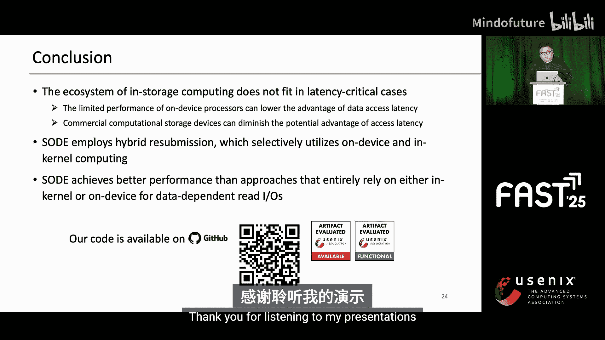

# 024：选择性设备端执行数据依赖型读I/O

在本节课程中，我们将学习一篇来自FAST‘25存储大会的研究工作，主题是“选择性设备端执行数据依赖型读I/O”。这项研究探讨了如何利用存储内计算技术来加速延迟敏感型工作负载，特别是那些涉及数据依赖型读操作的应用。

现代存储设备在速度和带宽方面取得了显著进步。然而，这种演进也带来了两个新问题。

第一个问题是PCIe总线与存储设备内部带宽之间存在差距。下图显示存储内部带宽显著增长，但PCIe互连带宽的增长却相对停滞。因此，即使存储内部带宽很高，**数据移动**本身也成为了瓶颈。

为了解决这个问题，存储内计算技术被提出，它将数据密集型计算任务转移到存储设备内部执行，以减少通过PCIe传输的数据量。存储内计算利用存储设备内部的高带宽来处理诸如图遍历和K近邻搜索等工作负载。它通常通过集成高并行度的设备端处理器（如FPGA）来实现可编程的计算存储设备。

一个存储内计算的例子是Insider，它提出了基于FPGA的可编程行计算。另一个例子是Lambda，它也采用了类似的方法。总的来说，这些技术都将数据密集型计算任务转移到存储设备内部，类似于Insider，但通过实现更快速的数据访问（特别是在页缓存等领域）来提升效率。

现代存储设备演进带来的第二个问题是，随着存储设备速度变快，**内核软件栈**成为了瓶颈。当我们在NVMe存储设备上测量内核栈的延迟时，发现近48%的延迟来自于内核软件栈。

为了应对这个问题，主机端近存储计算通过将延迟关键的计算任务放置在更靠近存储设备的位置，来减少内核栈的开销。例如，XRP分析了数据依赖型读I/O的性能。数据依赖型读I/O指的是读取磁盘上大型数据结构（如数据库引擎常用的B+树索引）的操作。XRP在内核中执行eBPF函数，并提交必要的读操作以绕过内核软件栈。我们将这些需要连续发出读请求的操作称为**重提交任务**。

值得注意的是，我们观察到现有的存储内计算研究主要关注吞吐密集型工作负载，而非延迟关键型场景。因此，我们的研究探索了存储内计算能否加速数据依赖型读I/O这类延迟关键型操作。

然而，我们发现存储内计算的两个特性并不完全适合延迟关键型场景。

第一个特性是计算存储设备的**计算能力有限**。常见方法通过使用高并行度的设备端处理器来优化吞吐密集型工作负载。然而，这种处理器可能会增加设备端计算延迟，因为较低的计算能力会削弱低数据访问延迟带来的优势。

第二个特性是，商业化的计算存储设备在设计上并未充分考虑访问延迟的潜在优势。例如，在三星的智能SSD中，FPGA和SSD控制器通过PCIe连接，因此它们的访问延迟并不比主机处理器低很多，这是因为控制器与设备端处理器之间的通信开销。

这两个特性带来了两个约束，使得处理延迟关键型工作负载变得困难。首先，我们必须考虑有限的计算能力，因为将繁重任务转移到设备端可能会对整体性能产生负面影响。其次，设备端处理器必须尽可能靠近控制器放置，换句话说，控制器与设备端处理器之间不应有显著的通信开销。

考虑到这些约束，我们提出了**选择性设备端执行数据依赖型读I/O**，简称**SOD**。它展示了在数据依赖型读I/O场景中，当重提交数据转移不具优势时，如何有效地利用设备端计算。SOD引入了一种**混合执行模型**，选择性地平衡设备端和存储内计算，以应对有限的计算能力。此外，SOD假设设备端处理器与存储控制器位于同一个片上系统中，以消除两者之间的通信开销。

接下来，让我们看看这个混合执行模型是如何工作的。当应用程序向存储设备提交一个读请求时，SOD会准备元数据来处理设备端和存储内的重提交任务。SOD通过扩展NVMe命令来发送这些元数据，然后存储设备执行读操作。

一旦读请求完成，设备端运行时可以在存储设备内部执行一次设备端重提交。如果需要进一步的重提交，运行时将完成该请求。然而，由于计算能力有限，设备端处理器可能没有可用资源。在这种情况下，执行存储内计算可能比等待设备端任务完成在延迟方面更有效。我们将这个过程称为**反向卸载**。

被反向卸载的任务可以在计算能力更强的**主机CPU**上更快地执行。然而，这些被卸载的任务会承受大约500纳秒到1微秒的PCIe往返延迟惩罚。有趣的是，我们观察到，尽管存在反向卸载的惩罚，重提交操作在延迟关键型场景中仍然可以表现出色。

这是一个SOD在B+树索引查找过程中如何操作的例子。SOD可以像XRP一样遍历磁盘上的大型数据结构，解析节点并读取数据。这些数据通常是局部访问的。如果设备端处理器没有可用资源，反向卸载机制可以弥补设备端处理器计算能力的不足。

我们的论文展示了为SOD所做的更多设计选择。例如，SOD会缓存先前的元数据以加速设备端和存储内的重提交翻译，并支持对繁重的设备端重提交任务进行并行执行。同时，它还利用MPK来减少边界检查的开销。由于时间有限，这部分内容将跳过。

为了实现SOD原型，我们扩展了一个用于NVMe存储设备的开源模拟器。我们选择了英特尔傲腾DC SSD作为超低延迟存储设备的模型，并选择ARM Cortex-A53作为我们设备端处理器的参考，因为ARM CPU在先前的研究中已被用作存储控制器。

重要的是，我们通过降低CPU频率来模拟一个计算能力较弱的设备端处理器。根据我们的微基准测试结果，将CPU频率降至1.2 GHz是模拟弱计算能力设备端处理器的合理方式，因为此时ARM CPU的性能与降频后的英特尔CPU相似。

我们在此环境中评估SOD。具体来说，我们使用102.4 GB内存和一个单节点进行计算存储模拟。我们分配了四个核心，类似于我们的参考处理器ARM Cortex-A53。我们为每个核心分配一个重提交工作线程。我们使用一个简单的B+树键值存储（称为PPF-KV）进行评估，同时也在WiredTiger上进行真实场景的评估。

评估的第一个结论是，SOD有效地消除了内核软件栈开销和PCIe往返延迟。当我们在闭环负载生成器下，使用B+树基准测试和多个线程来评估SOD和XRP时，SOD实现了比XRP更高的吞吐量和更低的延迟。值得注意的是，设备端处理了约38%的重提交任务，而存储内处理了剩余的62%。

评估的第二个结论是，SOD的性能优于单纯的设备端执行或单纯的存储内执行。当我们在适合压力测试的开放环路生成器下评估SOD的B+树基准测试时，SOD的混合重提交模型比单纯的设备端执行或单纯的存储内执行（类似于XRP）提供了更高的性能。这凸显了由于自身特性，设备端计算在处理延迟关键型工作负载时的不足。SOD比XRP性能高出10.8%，这表明混合方法可以胜任延迟关键型场景。

我们也在WiredTiger上评估了SOD，它使用基于日志结构合并树的键值存储。我们使用YCSB工作负载进行测试。研究表明，与XRP相比，SOD将重提交延迟降低了高达9.4%。然而，当工作负载D（读密集型）时，SOD并未降低延迟，因为存储内重提交次数很少。这意味着由于重提交次数少，SOD可以在设备端实现更优化的重提交。

以下是本次演讲的总结。我们观察到存储内计算的特性并不完全适合延迟关键型场景。SOD的设计基于这些特性做出了一些假设。因此，SOD提供了一种新的混合重提交设计，选择性地利用设备端和存储内计算。在评估中，SOD实现了比完全依赖设备端或存储内计算的方法更好的性能。

本节课中，我们一起学习了SOD这项研究。它针对现代存储计算在延迟关键型场景下面临的挑战，提出了一种创新的混合执行模型。通过选择性地在设备端和存储内执行数据依赖型读操作的重提交任务，SOD有效地平衡了计算能力与数据访问延迟，从而提升了整体性能。这项研究为未来计算存储设备的设计提供了有价值的思路。

