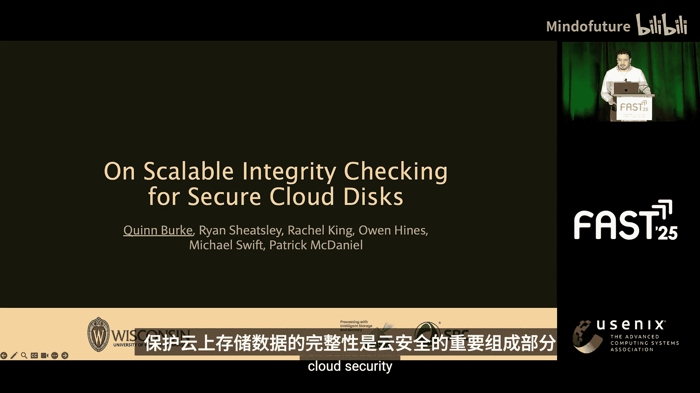
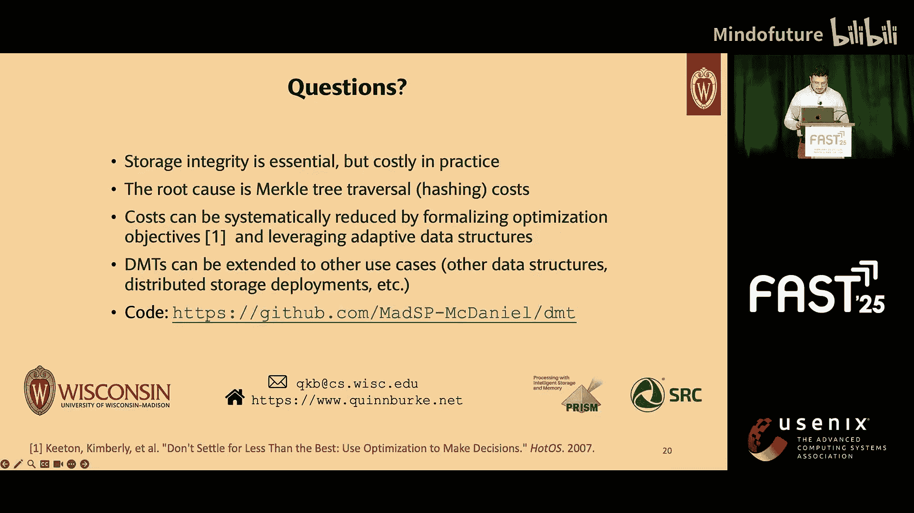
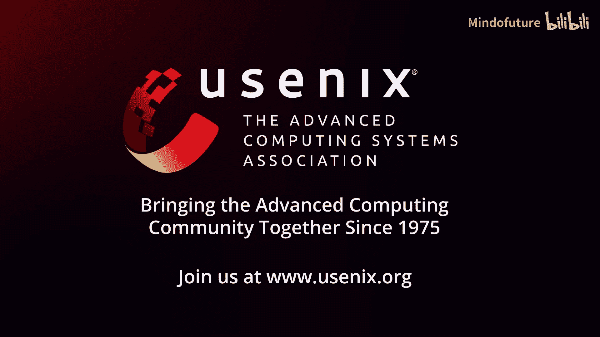

# 025：面向安全云盘的可扩展完整性检查优化 🛡️

在本教程中，我们将学习如何优化云存储中的数据完整性检查协议。数据完整性是云安全的关键，但传统的保护方法会带来显著的性能开销。我们将探讨这些开销的根源，并介绍一种创新的、自适应的数据结构——动态默克尔树，它能根据工作负载模式动态调整，从而大幅降低完整性检查的成本。

## 背景：云存储与完整性挑战 💾

上一节我们提到了完整性检查的重要性，本节中我们来看看其背后的具体机制和面临的挑战。

保护存储在云端的数据完整性是云安全的重要组成部分。然而，完整性保护会带来性能成本。下图展示了实践中的完整性成本，它比较了Vembarity（Linux内核中实现最先进完整性保护的设备映射器或目标）与两个基线：一个是没有加密、没有完整性保护的磁盘，另一个是只有加密但没有完整性保护的磁盘。

Y轴是吞吐量，X轴是容量。我们看到的总体趋势是，吞吐量随着容量的增加而下降。一个4TB的磁盘吞吐量损失约75%，即使是一个小的16MB磁盘，吞吐量损失也约为50%。结论是，提供完整性保护的成本可能变得令人望而却步。

我们的工作通过开发优化的、能适应工作负载模式的完整性数据结构来解决这个性能问题，利用工作负载模式来降低完整性成本。

## 核心问题与解决方案概览 🔍

我们通过回答三个研究问题来解决这个问题。

以下是三个核心研究问题：
1.  完整性开销的根本原因是什么？
2.  在理想情况下，我们能否为最优的完整性数据结构建模？
3.  如果可以，我们能否在真实系统中实现或近似这个最优结构？

提前透露一下，答案是：根本原因是哈希计算成本；如果我们有一些先验知识，我们可以构建一个最优结构；我们可以通过学习工作负载模式来近似最优结构。

## 完整性保护的工作原理 🛠️

上一节我们概述了问题，本节我们来深入了解完整性检查在系统中的具体工作流程。

假设你有一个典型的基础设施即服务部署，你配置了一台虚拟机，在其中运行一个应用程序，该应用程序需要访问一些快速的本地存储。应用程序通过系统调用与文件系统通信，文件系统将这些调用转换为一连串由块层处理的块操作。

在这种情况下，如果攻击者设法控制了存储设备或广义上的存储接口，他们就可以向虚拟机注入错误数据，破坏系统的完整性。在实践中，我们通过添加一个安全层（一个磁盘接口）来防止此类攻击，该接口在沿调用栈返回任何数据或确认之前执行一些完整性检查。

安全层处理两个高级例程：**更新**和**验证**。
*   每当向磁盘写入一个块时，你将数据推送到磁盘，并更新一些相关的安全元数据。
*   每当读取数据时，你检查数据是否与相关的安全元数据一致。

非正式地说，这被称为加密证明系统。

安全元数据本身由两部分组成：消息认证码和默克尔哈希树。
*   **MAC** 提供了真实性保证，确保从磁盘读取的任何数据都是你存放的合法数据。
*   **默克尔树** 提供了新鲜性保证，确保从磁盘读取的数据不仅是合法的，而且是你存放的最新版本数据。

更具体地说，当我们读写块时，会回到安全层。
*   写入块时，首先计算一个新的块MAC，然后使用该MAC更新默克尔树。
*   读取块时，我们像检查其他校验和一样检查MAC与数据的一致性，然后在默克尔树中验证MAC的新鲜性。

## 默克尔树与性能瓶颈 🌳

上一节我们介绍了完整性检查的基本流程，本节我们深入看看默克尔树如何工作，以及它为何成为性能瓶颈。

默克尔树的工作原理如下：数据块的MAC是树中的叶子节点。更新或验证MAC的过程涉及在每个层级递归地获取兄弟节点，将它们连接起来并进行哈希计算，直到得到单个根节点。根节点通常存储在芯片上或密封在TPM中，不受攻击者控制。

因此，对于更新，你经历这个递归过程，生成一个新根并保存它。对于验证，你做同样的事情，但将计算出的根与已知的正确根进行比较。这样得到的保证是，每当你读取一些数据时，如果攻击者试图向虚拟机注入过时或无效的数据，完整性检查就会失败。

在论文中，我们提供的分析表明，在这个递归过程中进行哈希计算所花费的时间，远远超过了在快速磁盘上进行简单数据访问的时间。我们测量到一次更新或验证大约需要200到300微秒，而进行一次数据访问可能只需要几十微秒（取决于使用的磁盘类型）。因此，我们得出结论：**哈希计算是瓶颈**，要降低开销，就需要降低哈希计算成本。

## 关键洞察：利用访问局部性 🔥

我们论文中的关键见解是，有机会通过利用**引用局部性**来降低哈希计算成本。众所周知，存储工作负载通常表现出高度的引用局部性，即一小部分块被频繁访问。我们的想法是，通过打破平衡树结构，允许树变得不平衡，并将与热块相关的MAC保持在更靠近根节点的位置，从而利用这一点。

结果是形成一种树结构，其中与热数据相关的MAC具有更短的更新和验证路径，这意味着更少的哈希计算次数，从而降低哈希计算成本，无论是对于频繁访问的数据还是整体而言。这个直觉很简单，这就引出了一个问题：为什么现在才做？以前我们在做什么？

之前的工作主要集中在离线完整性检查上，性能不是主要关注点，因此使用平衡树足以满足他们的需求。在我们的案例中，我们假设应用程序运行在机密虚拟机内部，需要实时完整性检查。更重要的是，我们才刚刚开始意识到哈希计算是一个瓶颈，因为新兴存储设备的数据访问延迟非常低，因此计算哈希与进行数据访问的时间比率正在大幅增长。

## 构建最优树模型 🏆

我们的工作基于使用不平衡树结构的新想法，分为两部分。首先，我们认识到实现最小哈希计算成本是理想的，因此我们首先开发了最优哈希树结构的定义。然后，我们设计了一种启发式方法，以解决最优定义的一些局限性。

我们在论文中提供了完整的推导和技术细节，但概括来说，我们通过将其与压缩中的一个并行问题联系起来来定义最优性。在压缩中，前缀树用于将一组符号映射到码字。编码过程通过遍历树中的一条路径到达叶子节点，并根据遍历过程中移动的方向，在码字位串后追加一个0位或1位。目标是找到一种编码，能对原始数据产生最小的表示形式。

因此，当我们用像霍夫曼编码这样的算法构建最优前缀树时，得到的保证是：热符号被分配更短的码字。在这个例子中，符号B3出现频率为30%，用2位编码；而B7出现频率为5%，用4位编码。

我们以同样的方式对哈希树中的叶子节点进行建模，因为它给了我们一个非常清晰的保证：访问频率更高的MAC及其关联块将被放置在树中更高的位置，从而带来更短的更新/验证路径和更低的哈希计算成本。

以这种方式构建最优树的一个条件是，你需要事先了解一些工作负载知识。你需要知道概率分布才能构建树。这是一个限制，因为在实践中很少能获得这种知识。然而，最优树仍然是一个有用的评估工具，因为如果你确实有这种知识，你就可以构建树，从而建立性能的上限（最大吞吐量，最小开销）。在论文中，我们称之为**最优树预言机**。

## 动态默克尔树：自适应的解决方案 ⚙️

理想情况下，在真实系统中，我们希望摆脱这个假设。因此，在我们的第二个贡献中，我们通过建立与一种广泛用于垃圾回收和IP路由查找等任务的数据结构——伸展树的联系来解决这个问题。我们设计了一种适用于哈希树用例的伸展树变体，称为**动态默克尔树**。

驱动该树的关键机制是，每当你访问树中的一个叶子节点时，你执行一系列旋转操作，将该节点一直移动到根节点，或者至少移动到部分路径上。随着时间的推移，你最终会得到这样一种树结构：热数据倾向于聚集在树的高层，而冷数据则沉在树的低层。

伸展树有几个理想的特性，使其成为构建DMT的良好候选数据结构。总结来说，伸展树是固有的不平衡树结构。与最优树不同，它们不需要事先了解工作负载。我们可以从任何初始状态开始，树的结构将完全由工作负载模式驱动。这种自适应性特别有用，因为它允许你捕获时间模式，并随着时间动态适应工作负载的变化。

虽然直觉上，我们应该能够以这种方式利用引用局部性，但我们必须解决几个挑战。主要挑战在于执行这些旋转操作可能成本很高。当伸展树用于搜索时，旋转可能很廉价，因为你只需要更新一些指针。但在哈希树的上下文中，每当你进行一次旋转，你就改变了树的结构，我们需要通过从旋转点向上到根节点重新计算所有哈希来提交这个改变。因此，我们需要降低这些成本。

我们通过引入两个启发式参数来实现这一点：
1.  **伸展概率 P**：这意味着我们不会在每次访问时都伸展，而只在一定百分比（例如1%）的访问中进行伸展。
2.  **伸展距离 D**：这意味着在我们决定伸展的那些访问中，我们不会将节点一直伸展到树顶，而只伸展到一半或四分之一的路程，等等。

这两者共同有助于降低成本。

DMT的工作分为三个步骤：
1.  我们为每个节点附加整数热度计数器，以跟踪相对访问频率。
2.  当块层开始接收IO请求时，在我们决定伸展的那些访问上，我们按照标准的伸展规则执行旋转操作（根据节点在访问时的排列，可能是zig、zig-zig或zig-zag情况）。
3.  当我们决定伸展时，我们旋转父节点而不是实际的叶子节点，这有助于避免旋转可能带来的一些风险。

## 实现与评估 📊

我们实现了DMT和最优树，大约5000行C++代码，它是一个使用块层框架的块设备驱动程序。该驱动程序拦截读写IO操作，并在沿调用栈返回任何数据或确认之前，调用更新和验证函数。作为优化，我们还引入了一个小型哈希缓存，允许我们在更新和验证过程中避免一些元数据IO。该驱动程序在标准Linux系统上运行，我们使用带有本地NVMe磁盘的EC2实例进行了评估。

在论文中，我们研究了各种不同的工作负载，包括一些用FIO生成的合成工作负载、阿里巴巴跟踪数据集和Filebench工作负载。今天我将重点关注两个关键的评估问题：第一，DMT能否在容量方面更好地扩展？第二，它们能否快速适应工作负载的变化？

这张图比较了DMT与DM-Verity以及其他几个基线。

图例包括：无加密无完整性的磁盘、有加密无完整性的磁盘、4叉、8叉和64叉树。作为参考，DM-Verity是二叉树。我们观察这些其他树是为了对比，在论文中我们提供了另一项分析，表明仅仅使用更宽的树不足以降低哈希计算成本，因为在存储级哈希树的背景下存在一些独特的挑战：当你使用更宽的树时，哈希函数的实际输入更大，因此每次哈希计算的实际成本更高，所以在权衡上无法达到平衡。

最后，我们还有最优树，我们通过提前记录工作负载跟踪并从中构建树来构造它。

在图中，Y轴是吞吐量，X轴是容量。我们看到的一般趋势是，基线的性能随着容量的增加而下降。与此同时，DMT的性能保持大致恒定。事实上，我们看到DMT始终提供约85%的最优吞吐量。这正是我们寻找的可扩展性保证。

在底部的图中，我们观察尾部延迟，关键结论是DMT将尾部延迟改善了高达40%。因此，尽管通过我们的设计，伸展可能成本高昂，但我们可以随着时间的推移降低这些成本。

在下一个实验中，这张图展示了一个在工作负载在均匀分布和Zipfian分布阶段之间交替时观察到的150秒吞吐量快照。每个Zipfian阶段集中在地址空间的不同区域。Y轴是吞吐量，X轴是时间。关键结论是，在Zipfian阶段开始时，DMT能够快速适应，捕获倾斜的工作负载模式并提供加速，而在均匀分布阶段则提供相当的性能。其意义在于，DMT可以适应工作负载形状的变化以及随时间变化的工作负载关注区域。

## 总结 📝

本节课中我们一起学习了云存储完整性检查的优化方法。总结来说，存储完整性很重要但成本高昂，默克尔树遍历是开销的根本原因，我们可以通过使用优化和设计自适应数据结构来降低这些开销。代码已可供其他研究人员使用。

---
**核心概念公式/代码表示**：
*   **默克尔树验证路径哈希计算**：`根哈希 = H(...H(H(叶子MAC || 兄弟MAC) || 上层兄弟)... )`
*   **动态默克尔树旋转条件**：`if (random() < P) { splay(node, D); }`
*   **哈希缓存优化**：`if (hash_in_cache(block_id)) { use_cached_hash(); } else { compute_and_cache_hash(); }`