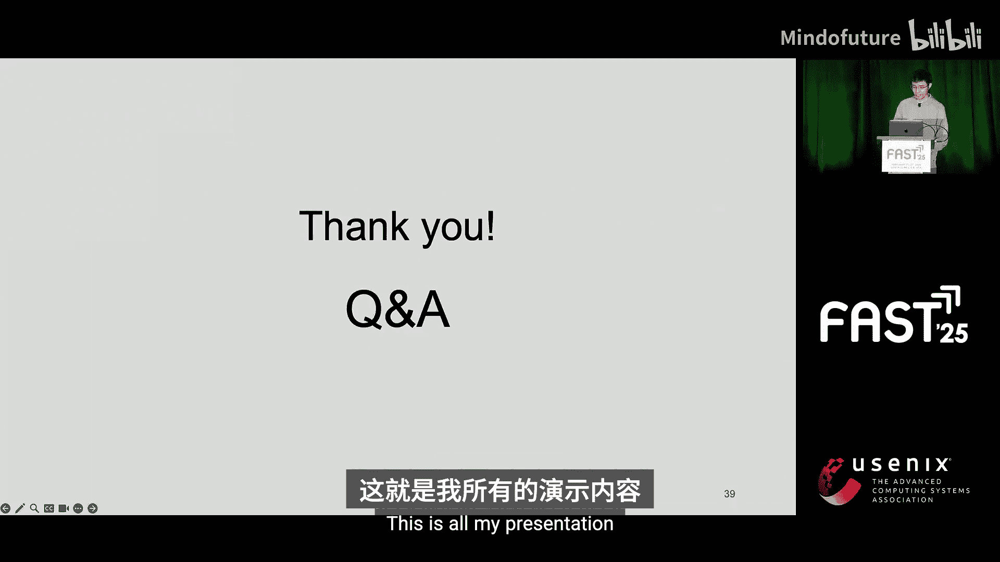

# 026：Silhouette - 利用一致性机制检测持久内存文件系统中的Bug


在本教程中，我们将学习一篇来自FAST‘25存储大会的研究——Silhouette。这项研究提出了一种新颖的方法，用于检测基于持久内存的文件系统中的微妙Bug。我们将从持久内存编程的挑战开始，逐步了解Silhouette的核心思想、工作原理及其显著效果。

## 概述：持久内存文件系统的Bug检测挑战

持久内存系统承诺提供高性能，但由于其乱序持久性特性，它们容易产生微妙的Bug。检测这些Bug面临两大挑战：首先，程序因乱序持久性而易出错；其次，可能的崩溃场景数量随着未持久化存储的数量呈指数级增长，导致搜索空间爆炸，使得穷尽测试变得不可行。

## 乱序持久性详解

上一节我们介绍了检测Bug的宏观挑战，本节中我们来看看导致这些挑战的根本原因——乱序持久性。

下图阐释了乱序持久性的概念。系统中有变量A和B，初始值均为0。

```
初始状态：
CPU缓存: A=0, B=0
持久内存: A=0, B=0

执行序列：
1. store A = 2
2. flush A
3. store B = 3
4. fence
```

首先，指令`store A = 2`将CPU缓存中的A更新为2。但由于CPU缓存与持久内存之间的不一致性，此时持久内存中的A可能是0或2，尚未确定。接着，`flush A`指令试图将A从CPU缓存刷写到持久内存，但刷新指令可能被编译器或CPU重排序，因此不保证立即生效。然后，`store B = 3`更新了缓存中的B，同理，持久内存中的B可能是0或3。

如果在`fence`指令执行前发生崩溃，持久内存中变量A和B的状态组合将产生最多 **2^2 = 4** 种崩溃场景。`fence`指令可以防止指令重排序，并保证所有已刷新的变量被持久化。然而，未被刷新的变量（称为“inflight stores”）状态仍不确定。

假设在某个栅栏点有N个inflight stores，则可能产生最多 **2^N** 种崩溃场景。在真实的持久内存文件系统中，一个栅栏点可能存在多达20或40个inflight stores，这将导致百万甚至万亿级别的崩溃场景，使得穷尽测试无法进行。

## 核心观察：一致性机制与未保护存储

面对巨大的搜索空间，Silhouette提出了一个关键见解：持久内存文件系统使用已知的一致性机制（如日志）来保证操作的原子性和持久性。真正的漏洞往往存在于那些与任何一致性机制无关的存储操作中，我们称之为“未保护存储”。

研究数据显示，在测试的系统中，超过95%的栅栏点包含少于5个未保护存储，这消除了长尾分布的影响。通过将测试焦点从未知的大量inflight stores转移到数量较少的未保护存储上，可以大幅缩减需要测试的崩溃场景数量。

## Silhouette的核心方法

基于以上观察，Silhouette的核心方法分为两步：

1.  **检测并验证一致性机制**：首先检查文件系统是否正确实现了其一致性机制（如日志）。如果正确，那么所有与该机制相关的存储操作在测试中都不会被重排序，从而可以将它们排除在重排序测试范围之外。
2.  **启发式测试未保护存储**：对于剩余的未保护存储，采用一种启发式方法进行测试。该启发式基于一个观察：持久内存程序常使用一个“关键存储”（如标志位、原子变量）来指示一组inflight stores的一致性状态。

以下是该启发式方法的具体描述：

对于N个未保护存储，传统的组合方法需要测试 **2^N** 种崩溃场景。Silhouette的启发式方法假设每个未保护存储都可能是“关键存储”，并仅为每个存储测试两种场景：
*   **场景一**：仅持久化当前这个“关键存储”，其他存储不持久化。
*   **场景二**：持久化其他所有存储，但当前这个“关键存储”不持久化。

因此，对于N个未保护存储，Silhouette只需生成 **2N** 种崩溃场景，极大地减少了搜索空间。

## Silhouette的工作流程与实现

本节我们深入了解一下Silhouette如何具体实现其核心方法。

Silhouette的工作流程包含以下几个步骤：

1.  **动态指令追踪**：使用LLVM Pass对文件系统源代码进行插桩，以便在运行时动态追踪指令执行，支持细粒度的指令级追踪。
2.  **存储操作收集与标注**：从动态追踪记录中提取存储操作及其数据类型信息（如所属结构体、字段名）。然后，使用一个轻量级的注解文件来识别哪些存储操作与已知的一致性机制相关联。
3.  **一致性机制不变式检查**：对与一致性机制关联的存储操作进行不变式检查，以确保机制被正确实现。例如，对于一个日志机制，需要检查：
    *   **顺序不变式**：日志写入阶段必须按顺序持久化。
    *   **位置不变式**：日志必须写入有效的日志区域（如头尾指针之间）。
    *   **数据不变式**：日志中写入的数据必须与最终提交的数据匹配。
4.  **分类与测试**：通过不变式检查的存储被标记为“受保护存储”。其余存储则被归类为“未保护存储”，并应用上述的启发式方法生成有限的崩溃场景进行测试。

注解文件非常轻量，它不需要修改源代码，仅作为一个配置文件，通过结构体名和字段名来关联一致性机制的元数据，通常每个结构体只需不到10行配置。

## 评估结果

Silhouette在C++和LLVM Pass中实现，并测试了PMFS、NOVA和WinFS三个持久内存文件系统。与现有工具（Winter、CHIPM）相比，Silhouette展现出显著优势：

*   **有效性**：发现了15个新的Bug，例如NOVA中的指针持久化错误导致段错误，以及PMFS和WinFS中因重用inode导致的数据丢失。
*   **高效性**：在更短的时间内发现了更多的Bug。这归功于其一致性机制检测和启发式方法。
*   **可扩展性**：生成的崩溃场景数量比Winter和CHIPM少了几个数量级，极大地降低了测试开销。

Silhouette项目已在GitHub上开源。

## 总结

本节课中我们一起学习了Silhouette，一种用于检测持久内存文件系统中Bug的创新工具。它通过以下方式解决了搜索空间爆炸的难题：
1.  利用并验证文件系统内置的一致性机制，将大量存储操作排除在重排序测试之外。
2.  对剩余的未保护存储，采用一种高效的启发式方法，将测试场景从指数级（**2^N**）减少到线性级（**2N**）。




Silhouette高效、可扩展，性能超越现有方法，并以10倍的速度加速了Bug发现过程，成功检测出15个新Bug。这项研究为持久内存系统的可靠性测试提供了强有力的新思路。