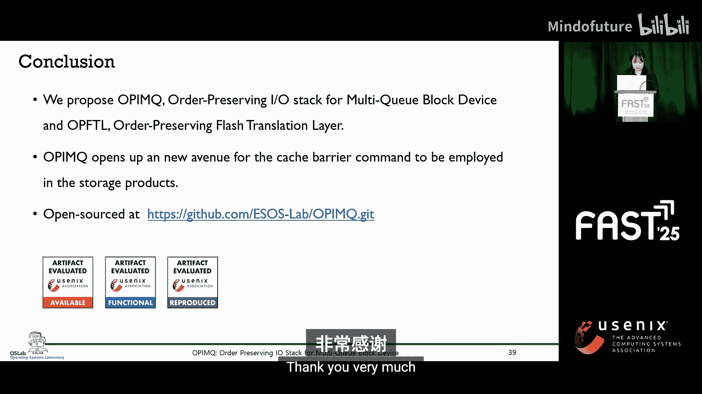

# 027：OPIMQ - 多队列块设备的顺序保持IO栈 📚

在本教程中，我们将学习OPIMQ（Order-Preserving IO stack for Multi-Queue Block Device）的核心概念。这是一种旨在多队列存储架构中高效保持存储顺序（Storage Order）的技术。我们将从问题背景出发，逐步解析现有方案的不足，并详细介绍OPIMQ的设计原理与实现机制。

## 为什么存储顺序很重要？🤔

现代存储系统采用多队列架构，以在操作系统层面高效处理并行的IO请求。多个请求队列允许每个CPU核心单独提交IO，避免了设备级的争用。像NVMe和UFS中的多个命令队列有助于充分利用存储带宽。

当一个应用程序发出写请求时，该请求在到达存储设备之前，会经过主机端的请求队列。在单队列系统中，所有请求被顺序处理，自然地保持了顺序。但在多队列系统中，请求被分发到多个请求队列，每个请求队列将其请求分派到对应的命令队列。

命令队列中的分布式IO可能会被存储控制器或FTL（闪存转换层）重新排序。因此，发出的IO请求本质上可能是无序的，因为请求完成的顺序可能与它们发出的顺序不同。

应用程序需要负责强制执行写顺序，这被称为**存储顺序**，即数据在存储中变得持久化的序列。在数据库日志记录和文件系统日志中，强制执行存储顺序对于确保崩溃时的持久性和一致性是必需的。

## 现有方案的局限性 🚧

应用程序必须使用代价高昂的机制来强制执行存储顺序。为了确保写操作以正确的顺序持久化，应用程序必须等待前一个写操作完全持久化后，才能分派下一个。这种严格的强制执行限制了并行性并增加了延迟。

缓存屏障命令提供了一种更有效的方式来强制执行存储顺序。它保证写操作按顺序持久化。使用缓存屏障时，如果写操作被顺序分派，后续的写操作在前一个写操作完全持久化之前不能被持久化。这防止了无序持久化，减少了应用程序手动强制执行存储顺序的需要。

为了减少强制排序的开销，已经探索了几种方法，可以大致分为两类：
*   **顺序写**：使用缓存屏障顺序执行写操作。
*   **乱序写**：最初无序写入数据，然后在发生崩溃或系统故障时，使用全局写标识符或PMR和VME等技术来恢复正确顺序。

然而，这些方法存在显著限制。例如，`barrier IO stack`仅适用于单队列设备，与多队列存储架构不兼容。`La barrier`仅限于UFS，而`OPTR`仅支持单个写流。其他方案如`CCMVmi`和`RIU`需要专门的硬件资源，或依赖于低效的排序机制。

这些限制凸显了需要一种能在多队列存储系统中高效强制执行存储顺序的解决方案。

## 多队列系统中的核心问题 🎯

上一节我们介绍了存储顺序的重要性，本节中我们来看看多队列架构带来的具体挑战。

在单队列IO栈中，缓存屏障自然地保持了存储顺序。然而，在多队列IO栈中，具有依赖关系的写请求可能被分发到不同的队列，允许存储控制器对它们重新排序。这可能导致后面的写请求比前面的更早到达存储介质，从而破坏了预期的顺序。即使使用了缓存屏障，在多队列系统中，存储顺序仍可能被破坏。

为了理解多队列系统中的问题，我们定义两个关键概念：**流**和**纪元**。
*   **流**：由单个线程发出的一组IO请求。
*   **纪元**：流内的一组写请求，它们内部可以重新排序，但必须按创建顺序持久化。每个纪元由缓存屏障界定。

核心问题是，存储顺序在不同队列的写请求之间无法自然强制执行。当具有依赖关系的请求被分配到不同的队列时，强制执行顺序变得具有挑战性，我们称之为**队列间存储顺序**问题。这在两种情况下发生：当依赖请求来自同一线程或不同线程时。

以下是具体挑战：

**挑战一：保证线程迁移导致的流内存储顺序**
由于工作窃取，来自一个流的写请求可能被分发到多个队列，导致**纪元分裂**——即来自同一纪元的请求最终进入不同的队列。结果，缓存屏障可能在同一纪元的其他请求之前到达存储控制器，过早地界定了纪元并错误地放置请求，从而破坏了存储顺序。

**挑战二：保证流间存储顺序**
当具有排序约束的写请求来自不同线程（尤其是在不同的CPU核心上）时，每个线程在其分配的队列中注册其写请求，要求系统跨队列强制执行顺序，这可能会损害存储顺序。

## OPIMQ的设计与解决方案 💡

为了解决上述问题，我们引入**OPIMQ**——多队列块设备的顺序保持IO栈。

OPIMQ通过主机和存储端的协作来确保存储顺序。每个IO请求被分配一对**流ID**和**纪元ID**，定义了其排序约束并将其传递给存储端。在存储端，这些ID使得即使在多个队列中也能确保正确的持久化顺序。

这是OPIMQ的设计概览：
*   **主机端**：顺序保持文件系统根据排序约束决定缓存屏障的放置。OPIMQ将IO请求组织成流和纪元，为其请求分配相应的ID。
*   **存储端**：OP-FTL确保基于纪元的持久化顺序，而双流写和兄弟感知延迟映射保证了流间存储顺序。

在OPIMQ中，来自同一线程的写请求属于单个流。流ID源自线程的进程ID。在每个流内，纪元由缓存屏障界定并分配唯一标识符。块设备层为每个IO请求分配一对流ID和纪元ID。

### 解决方案一：防止纪元分裂

为了解决第一个挑战（保证流内存储顺序），OPIMQ引入了**纪元固定**。这确保了同一纪元中的所有写操作被放置在同一个队列中。如果线程在纪元界定前迁移，它会将写请求分派到其原始队列。只有在缓存屏障界定了纪元之后，新请求才会被放置到迁移后核心的队列中。这防止了在存储端过早地进行纪元界定。

### 解决方案二：确保流间顺序

第二个挑战是确保跨流的存储顺序，这需要保持来自不同流的纪元之间的顺序。OPIMQ引入了**双流写**——一个同时属于两个流的写请求。

当强制执行流间顺序时，OPIMQ将来自前序纪元的写操作指定为双流写。例如，线程A的纪元E12必须在线程B的纪元E6之前持久化。为了强制执行这一点，OPIMQ将W1和W2标记为双流写，意味着它们属于流A的E12，同时也是流B的E5的一部分。

一个双流写携带两对流ID和纪元ID。除了其原始的流ID和纪元ID，它还分配一个次要的流ID和纪元ID。

OP-FTL通过引用请求中的流ID和纪元ID，确保写操作在每个流内按纪元顺序持久化。关键思想是，数据可以以任何顺序刷新到闪存介质以最大化并行性，而映射表的更新则严格按纪元顺序进行。

为了强制执行流间存储顺序，双流写携带的两对流ID和纪元ID代表了两个排序约束。OP-FTL解释这些约束，并且仅在两个条件都满足时才持久化该写操作。如果只满足一个条件，OP-FTL会延迟映射更新，直到两个条件都满足。这被称为**兄弟感知延迟映射**。

## 性能评估 📊

现在让我们看看OPIMQ的实际表现。我们在一个多核服务器上测试了所有工作负载，使用三星980 Pro作为存储设备。OPIMQ在Linux内核中实现以进行评估。我们选择EXT4作为代表性文件系统，并在实验中将其称为OP-EXT4。

我们将OPIMQ与三种配置进行比较：带有传统IO栈的EXT4、带有单命令队列的`barrier IO stack`，以及MQF in CCM Realmi。

首先，我们比较了OP-EXT4和传统EXT4的`fsync`延迟。在EXT4日志记录中调用`fsync`时，文件数据和日志块必须在日志提交块之前写入以保持一致性。为了强制执行此顺序，传统EXT4在分派提交块之前，必须等待文件数据和日志完全写入存储设备。OPIMQ消除了强制执行顺序所涉及的DMA传输延迟和`v flag`开销。因此，OP-EXT4中的`fsync`延迟减少到EXT4的三分之一。

对于宏观基准测试，我们使用Filebench的`per mail`、`dbench`和`si bench OLTP insert`在云环境中评估OPIMQ。我们通过增加运行容器的数量来测量IOPS以评估可扩展性。OPIMQ在`per mail`中性能是原生Linux IO栈的2.9倍，在`dbench`中是2.8倍，在`si bench`中是2.9倍。

我们还测量了纪元固定的开销。同时运行40个并发的Docker容器（排除工作负载）。结果表明，纪元固定对性能影响最小，展示了其在管理排序方面的效率。

最后，OP-FTL的开销如下：我们使用Comos Open SSD板并生成4KB随机写后接`fsync`。OP-FTL中确保存储顺序的开销可以忽略不计，因为它可以以任何顺序通过缓存刷新写操作，同时保持映射更新按顺序进行。通过这种设计，O-FTL可以在充分利用SSD内部硬件并行性的同时，确保纪元之间的存储顺序。

## 总结 🎓

本节课中我们一起学习了OPIMQ如何通过协调主机和存储端，在多队列块设备中强制执行存储顺序。它使用纪元固定和双流写来保持流内和流间的顺序。OPIMQ为缓存屏障命令在通用存储产品中的应用开辟了新途径。OPIMQ是开源的，欢迎大家测试和探索。