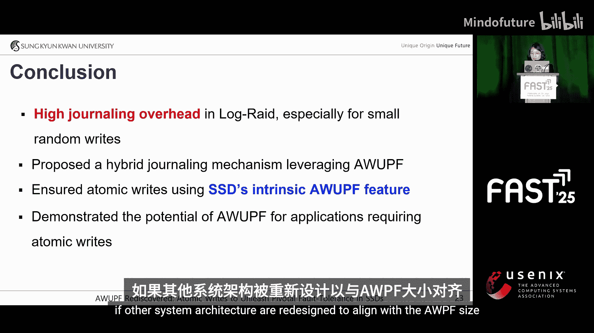

# 028：重新发现AWUPF - 利用SSD中的原子写入释放关键容错能力

在本教程中，我们将学习一篇来自FAST25存储大会的研究论文。该研究探讨了如何利用固态硬盘（SSD）中名为“原子写入单元”（AWUPF）的固有特性，来优化文件系统和数据库的日志机制，从而显著提升性能。我们将从SSD的基本工作原理开始，逐步深入到如何利用AWUPF来减少日志开销，并通过一个名为Poseidon的日志结构存储系统进行案例分析。

## 概述：SSD与原子写入

首先，我们来简要回顾一下SSD如何处理写入操作。你可能知道，SSD中的闪存不支持直接覆盖写入。相反，SSD内部有一个闪存转换层（FTL），它负责管理数据从逻辑地址到物理地址的映射。

当一个写入操作从主机端发起时，数据会被写入闪存中的一个新物理位置。如果是对现有数据的覆写操作，新数据也会被存储在其他地方。为了确保数据可访问，FTL的映射表必须更新为新的映射信息。

由于映射表对于访问新数据至关重要，其更新必须在映射单元级别保持**原子性**，以维护数据一致性。正是由于这种机制，SSD天生就提供了一定程度的原子性保证。为了规范这种行为，NVMe标准引入了一个名为“原子写入保证单位”（AWUP）的特性，它定义了SSD保证原子性的最小写入单元。通过分析，我们发现大多数SSD提供4KB的AWUP。

这引出了一个重要问题：既然SSD本身已经通过AWUP提供了原子性保证，我们是否还需要为日志机制进行优化？

## 传统日志机制的挑战

上一节我们介绍了SSD的原子性，本节我们来看看传统系统如何确保数据一致性。如你所知，文件系统和数据库依赖**日志**或**预写日志**来防止部分更新。它们不是将更改直接写入存储位置，而是先将更新记录在一个日志区域，稍后通过检查点操作应用到主存储。

然而，这种方法由于涉及双重写入过程（先写日志，再写实际数据）而引入了显著的性能开销。那么，如果我们能利用AWUP而不是传统的日志记录呢？既然AWUP已经保证了原子性，我们就有可能消除双重写入的需求，从而显著减少开销并提升性能。

## 现有研究与我们的方法

现在，让我们看看以往的研究是如何处理这个问题的。一些方法修改了SSD固件以启用事务性写入，而另一些则探索了在主机端重载SSD命令。尽管这些研究利用了SSD的原子性特征，但它们都需要在SSD层面进行修改。

但正如前面提到的，SSD已经通过AWUPF提供了原生的原子性支持。如果我们将事务限制在单个页面内，就可以利用SSD的原子性能力来保证原子操作。因此，我们的方法不是修改SSD本身，而是旨在通过利用SSD现有的AWUPF特性来减少日志开销。

但这又引出了另一个关键问题：哪种系统能够通过单个原子写入命令高效地更新元数据？

## 案例研究：日志结构存储系统

基于上述标准，我们选择了**日志结构存储系统**作为案例研究。在传统的日志结构系统中，数据采用追加写入策略。由于其异地更新方式，记录数据位置的**元数据**必须随每次写入操作而更新。

例如，假设数据A、B、C和D已经存储，它们的位置被记录在映射表中。如果B被更新为B‘，日志系统会将B’写入SSD上下一个可用位置，而不是覆盖现有的B。由于B的位置发生了变化，映射表也必须更新。

但如果在此更新过程中发生崩溃，就可能导致映射表损坏，进而引发数据不一致。如果元数据更新只完成了一部分，系统可能会引用过时或错误的位置。为了防止这种情况，元数据更新必须是原子的。

为了确保原子性，日志系统通常为元数据使用日志记录，以便在崩溃后能正确恢复。然而，日志记录带来了显著的性能开销。当禁用日志时，元数据更新在内存中处理，并仅定期刷新到存储。在这种情况下，由于追加写入方案，顺序写入和随机写入之间的性能差异很小。

但是，当启用日志时，写入性能会急剧下降，降幅高达25倍。这种影响对于小型随机写入尤为严重。原因在于，在检查点期间，随机写入可能会更新多个元数据页面，从而显著增加元数据页面的写入次数，导致更高的性能成本，使日志记录成为日志系统的主要瓶颈。

## Poseidon系统与AWUPF的应用

在我们的研究中，我们选择**Poseidon**作为目标日志系统。这是一个由三星开发的开源存储系统。当在启动器上设置一个或多个块设备时，它们会连接到存储池中的多个SSD。在此设置中，用户数据作为日志段（Log Segment）管理，而元数据则作为RAID 10管理。

让我简要介绍一下Poseidon的元数据结构。在Poseidon中，数据以追加写入的方式顺序写入。

以下是一个理解其工作原理的例子：
1.  当写入数据时，它首先存储在内存中分配的条带中。
2.  然后，它被写入逻辑条带，逻辑条带代表实际使用的存储空间。
3.  此时，为了将内存条带映射到逻辑条带，系统使用一个名为“条带映射表”的元数据来管理映射关系。
4.  接下来，条带映射表的更新被提交到日志区域。
5.  之后，内存中的映射表相应更新。

这里，映射表指的是基于主机地址对用户数据和元数据的映射。映射表中的每个条目包含一个条带ID、虚拟设备ID、逻辑条带ID和偏移量。由于每个虚拟条带直接映射到逻辑条带，知道条带ID和条带内的偏移量，就能确定数据在SSD上的确切物理位置。

数据B和C也遵循相同的过程。最后，当日志区域变满时，会触发检查点。此时，由于我们更新了三个元数据页面（称为M页面），这些M页面被检查点化并写回到元数据区域，以确保一致性和持久性。

在Poseidon中，一个M页面的大小等于AWUP（例如4KB），这允许我们利用AWUP来确保原子性，同时减少双重写入。

让我们看一个例子：
*   如果写入操作A只更新一个M页面，它可以通过原子写入直接写入存储。
*   相比之下，如果写入操作B更新两个M页面，它必须先提交到日志，稍后再通过检查点写入，以保持一致性。
*   然而，如果写入操作C也只更新一个M页面，它也可以直接写入。

因此，以前由于日志记录，所有三个M页面都需要覆写，但采用我们的方法后，只有一个M页面需要覆写。这显著减少了日志开销，并通过最小化不必要的覆写提高了写入性能。

## 实现挑战与解决方案

虽然AWUPF支持直接写入元数据，但对同一M页面同时应用直接写入和日志记录可能导致一致性问题。

下图展示了写入操作期间内存和存储中的映射表是如何更新的。

当写入A修改内存中的M页面0和M页面1时，为了保持一致性，它必须在任何进一步操作发生之前完全提交。然而，如果写入B在写入A提交之前修改了内存中的映射表，并直接写入了M页面1（包含A1），那么写入A的部分元数据就会过早地存储在SSD中。此时如果发生崩溃，M页面1是完整的，但M页面0是旧的，因为写入A从未完全提交。这导致不一致状态，因为写入A的数据只被部分更新。

为确保一致性，内存中的映射表应在提交完成后再更新。
1.  首先，写入A成功提交。
2.  只有在此之后，内存中的映射表才被更新。
3.  现在，当写入B到达时，它可以安全地将M页面1写入存储，因为A1已经被提交。

如果在此场景下发生崩溃，恢复过程很简单。M页面1已经包含A1和B，确保了它们的持久性。A0可以从提交日志中恢复，保持了原子性并防止了数据损坏。

第二个问题出现在以下场景中：在写入A和写入B完成后，写入C将写入与写入A相同的位置。结果，内存中的映射表用写入C的最新信息更新，然后直接写回存储。然而，如果此时发生崩溃，一个关键问题就会出现，因为系统会从提交日志中恢复写入A的数据，有效地覆盖了写入C的最新信息，导致最新写入操作在恢复过程中丢失。

这导致了数据不一致，因为最新的写入操作被过时的提交日志数据覆盖。

为了解决这个问题，我们为每个M页面引入了一个**版本号**，并在每次直接写入或提交时递增它。这确保了更高的版本号总是代表最新的数据页面，防止在恢复过程中恢复过时的数据。

当需要提交的写入操作到达时，M页面版本号递增1，并且提交日志会记录更新后的版本信息。在写入A提交且映射表更新后，写入B到达，版本号再次递增，并执行直接写入。之后，当写入C修改内存中的映射表时，版本号进一步递增，接着执行另一次直接写入。

如果发生崩溃，恢复过程如下：系统比较提交日志中的版本号与每个对应M页面的当前版本号。如果提交日志版本号不大于当前版本号，则不需要恢复，因为M页面已经包含更新的版本。在这种情况下，由于A0的提交日志版本号不大于M页面0的当前版本号，A1的提交日志版本号也不大于M页面1的当前版本号，因此不需要任何恢复，确保了数据一致性并防止了数据丢失。

## 性能评估

我们在Poseidon中实现了我们的方法，并配置了如下实验环境。我们测试了三种配置：
1.  **Journal**：使用日志选项的原始Poseidon。
2.  **Our Approach**：根据更新的M页面数量选择性应用日志记录或直接写入。
3.  **Direct**：始终将修改的M页面直接写入，不确保数据一致性（仅作对比）。

首先，我们使用相同数量的工作线程比较了我们的方法与传统日志技术的性能。Poseidon利用存储性能开发工具包（SPDK），这是一个用户态存储I/O框架，用于高效管理对SSD的I/O操作。工作线程分为处理元数据日志和检查点的**元数据工作线程**，以及处理用户数据I/O的**用户数据工作线程**。

在随机写入工作负载下，即使增加元数据工作线程的数量，日志方法的性能也保持恒定。这是因为检查点开销成为主导瓶颈，限制了额外工作线程带来的性能提升。相比之下，我们的方法将性能提高了**3.3倍**。增加元数据工作线程数量会带来更好的性能扩展，这与日志方法不同。

由于只有1个M页面被4KB写入更新，直接写入方法的结果与我们的方法相同。然而，在顺序写入中，当工作线程数量超过一定阈值时，直接写入和我们的方法都经历了性能下降。这种下降是由对M页面访问的争用引起的，多个工作线程竞争相同的元数据页面，导致延迟增加和效率降低。

基于1MB请求大小的测试显示，由于标准基准测试（如`fio`）的顺序写入，其在随机工作负载下的性能与顺序写入性能相似。然而，我们的方法仍然平均快了**20%**。此外，所有三种方法从6个元数据工作线程开始性能达到饱和，此时增加元数据工作线程数量不再提高性能，因为系统受到元数据访问争用的瓶颈限制。

为了评估写入大小的影响，我们使用`fio`测试了不同大小下的性能。顺序写入性能在三种配置下相似。在随机写入工作负载中，我们的方法实现了高达**3.6倍**的性能提升。随着写入变得更顺序，检查点开销减少，使得我们的方法在2MB写入大小时性能接近直接写入方法。

我们评估了各种基准测试，我们的方法在以下场景中具有优势：
*   由小型随机写入主导的工作负载（如`fileserver`）显示高达**14%** 的改进。
*   涉及小型异步随机写入的工作负载（如`varmail`）显示高达**73%** 的改进。
*   在随机数据库工作负载（如`TPC-DS`）中观察到显著的性能改进。

## 总结

本节课我们一起学习了如何重新发现并利用SSD中的原子写入保证单位（AWUPF）。AWUPF传统上被视为一个有趣的SSD特性，但本研究展示了其在辅助主机端数据一致性管理方面的潜力。

通过利用AWUPF进行日志系统元数据更新，我们通过减少日志开销和最小化冗余写入，实现了显著的性能提升。我们相信，如果其他系统架构重新设计以与AWUP大小对齐，这种方法可以进一步扩展到其他系统。

感谢阅读。

