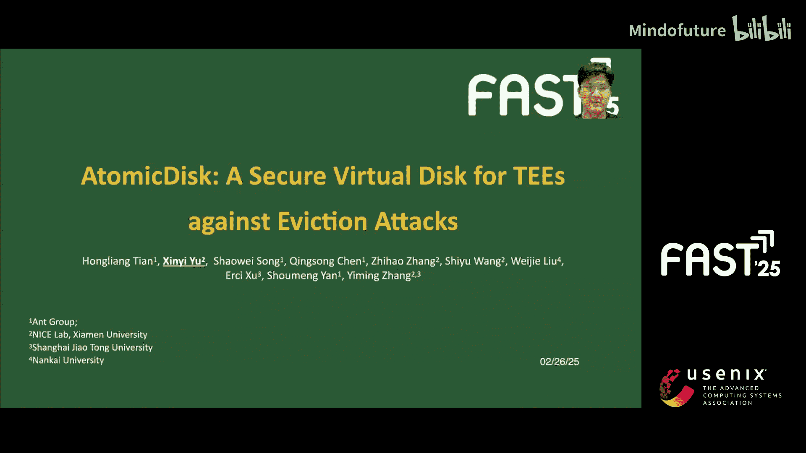
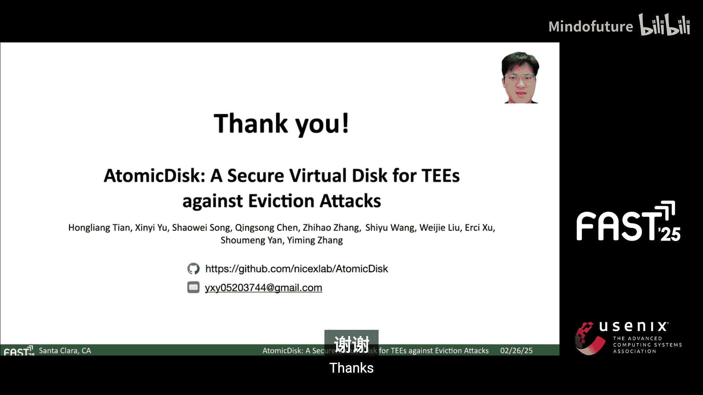
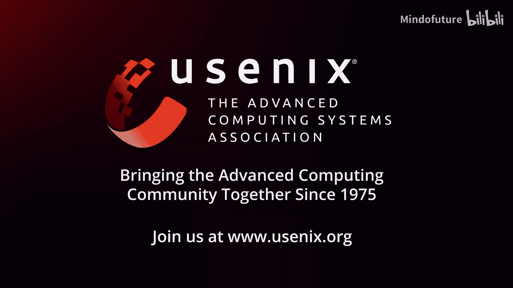

# 029：AtomicDisk - 防御驱逐攻击的安全虚拟磁盘 🔒

在本教程中，我们将学习一项名为 **AtomicDisk** 的研究工作。这是一个为可信执行环境设计的、能够防御“驱逐攻击”的安全虚拟磁盘。我们将从背景知识开始，逐步理解攻击原理、AtomicDisk的核心设计，并最终了解其性能表现。

## 背景与威胁模型

如今，**可信执行环境** 在云环境中被广泛使用。它们可以保护其内部的敏感代码和数据，免受外部特权攻击者（如主机操作系统、虚拟机监控程序和其他应用程序）的侵害。

首先，我们信任TEE硬件和软件（如Intel SGX）能够保护内存和CPU的**机密性**与**完整性**。因此，我们信任所有在TEE边界内执行的软件。

然而，我们也必须考虑云环境中的强大攻击者。他们是**特权**的、**在线**的且**主动**的。这意味着他们拥有多项关键能力：完全控制TEE之外的所有主机资源；可以在TEE执行的任何时刻发起攻击；可以操纵TEE与主机块设备之间的任何I/O请求和响应。

这引出了一个关键点：**TEE缺乏I/O保护**。这就是为什么需要一个**安全虚拟磁盘**。它通过提供特定的安全属性来填补关键的I/O保护空白，保护TEE的磁盘I/O，使文件系统无需担忧TEE的安全风险，并且由于只提供简单的读写同步接口，也简化了安全分析和推理。

## 安全属性与现有方案

为了对抗如此强大的对手，安全虚拟磁盘应提供**机密性**、**完整性**、**新鲜性**和**一致性**这四项基本安全保证。
*   **机密性**：保护写入的数据不被未授权访问。
*   **完整性**：保证数据不被篡改或损坏。
*   **新鲜性**：防止重放攻击，确保总是提供最新的数据。
*   **一致性**：即使在系统崩溃后也能维持数据一致性。

在Linux上，最先进的解决方案是Device Mapper，它结合了DM-crypt和DM-integrity。然而，这种设置只解决了机密性和完整性。

在Intel SGX上，**SGX Protected File System** 提供了全部四项属性（简称CIFC）。SGX PFS围绕三个核心组件构建：**修改的默克尔树**、**FS缓存**和**日志**，以实现机密性和完整性。Intel通过采用认证加密增强了经典的MHT。具体来说，每个内部MHT节点存储其子节点的加密密钥和消息认证码。新鲜性通过版本号验证来保证。位于安全内存中的缓存存储元数据节点和MHT节点，以提升I/O性能。最后，日志在驱逐前维护MHT节点的先前版本，从而确保一致性。这三个组件协同工作，使SGX PFS实现了所有四项CIFC安全属性。

## 驱逐攻击详解

在深入探讨驱逐攻击之前，我们先明确**快照**的概念。我们将快照定义为特定时间点的持久化系统状态，例如Docker容器快照。同样，飞地也有快照，即保护文件状态的受保护文件。**非预期快照**是指应用程序逻辑未预期的快照。

以SGX PFS为例。想象一个在飞地内的应用程序向SGX PFS保护的文件写入一系列数据块。从应用程序的视角看，这些块应该作为一个整体被写入并持久化。然而，问题在于当SGX PFS内的缓存达到其容量时，会启动一个**驱逐**过程。驱逐导致了**部分持久化状态**的创建，例如块B1到B4。这就是我们定义的**非预期快照**。随后，当执行单个`sync`命令时，应用程序预期的完整且一致的快照（块B1到B8）才被创建。

在正常环境中，这些驱逐生成的快照是无害的。但在TEE中，这些快照是脆弱的。以下是它们在TEE中易受攻击的三个主要原因：
1.  **TEE可以生成它们**：因为后扩展器对顺序和原子性保证施加的约束很少，允许TEE的缓存层在任何时间执行驱逐。
2.  **攻击者可以捕获它们**：因为攻击者控制飞地外的一切，包括监控I/O。
3.  **攻击者可以重放它们**：由SGX PFS生成的快照共享相同的根密钥，因此飞地无法区分它们。

为了说明这些漏洞的实际影响，我们来看一个使用**Redis**的具体攻击示例。部署Redis服务通常需要两个基本步骤：首先，创建并初始化Redis配置文件（如果不存在）；其次，启动Redis服务器以处理用户请求。

驱逐攻击在第一步期间分四个关键阶段展开：
1.  SGX PFS由于MHT缓存驱逐，生成了一个非预期快照。关键的是，此快照可能缺少必要的密码要求。
2.  控制飞地外部环境的攻击者捕获了这些脆弱的快照。
3.  攻击者可以使用这些快照重启或初始化一个新的飞地。
4.  因此，攻击者绕过了任何身份验证机制，获得了对Redis的完全未授权访问。

实际上，可以利用深度快照来攻击更多应用程序。像MongoDB和Cassandra这样的流行数据库使用类似基于配置的身份验证。更有趣的是，非预期快照可能涉及多个文件，我们将此留作未来工作。

## AtomicDisk 的设计与实现

为了防止驱逐攻击，我们提出了一个新的安全属性，称为**同步原子性**。该属性保证在`sync`之前所有被驱逐的写入都以“全有或全无”的方式提交。如下图所示，AtomicDisk是唯一实现所有安全属性的安全解决方案。

为了达成同步原子性，我们通过以下关键修改扩展了SGX PFS，开发了AtomicDisk：
1.  我们为数据块引入了**双状态系统**：`committed`和`uncommitted`。这允许我们跟踪磁盘镜像的提交状态。
2.  我们引入了一个称为`commit`的操作，用于将块从`uncommitted`状态转换到`committed`状态。
3.  我们修改了重启时的恢复过程。AtomicDisk现在可以识别并拒绝任何未提交的写入。

`commit`操作将磁盘镜像的数据块转换为`committed`状态。为了支持这一点，我们使用一个`committed`标志扩展了PFS元数据节点。默认情况下，该标志设置为`false`。`commit`操作由用户发起的`sync`触发，并按以下步骤进行：
1.  它执行标准的PFS刷新过程，包括将脏节点写入日志并将其刷新到持久存储。
2.  它将`committed`标志更新为`true`，并将修改后的元数据节点刷新到磁盘。这标志着整个磁盘镜像现在已被提交。
3.  由于日志不再需要用于恢复，可以安全地删除它。

相反，内部刷新操作可能由写命令触发，会将`committed`标志设置回`false`。这表明磁盘镜像代表了一个由于缓存驱逐而产生的非预期快照。

如果标志为`false`，表示处于未提交状态，磁盘镜像不能直接打开。相反，我们依赖日志将磁盘镜像恢复到最新的同步状态。在日志中，每个块被分配两种状态之一：`committed`或`uncommitted`。块在日志中的首次出现被标记为`committed`，因为日志存储的是块的先前版本，这表示要么是对空块的新写入，要么是对已提交块的首次覆盖写入。日志中同一块的后续覆盖写入则被标记为`uncommitted`。

在恢复过程中，AtomicDisk从头到尾读取日志。对于每个首次遇到的逻辑块（如前所述，标记为`committed`），AtomicDisk将这些块恢复到磁盘镜像。使用内存位图来记录已恢复的块，并识别后续的`uncommitted`块。在日志重放完成后，AtomicDisk将`committed`块标志更新为`true`，此时，磁盘镜像内的所有数据块都已成功提交。

## 性能评估与总结

我们比较了AtomicDisk与两个基线方案：PFS-disk和Crypto-disk。PFS-disk是一个将I/O重定向到SGX保护文件的安全块设备。Crypto-disk是Linux DM-crypt在SGX中的镜像版本。

首先展示安全结果。我们使用跟踪驱动的基准测试，其中每个跟踪以一个单独的`sync`请求结束。如图所示，AtomicDisk只生成一个由`sync`引起的预期快照，而PFS-disk每`sync`生成数十万个快照，因此容易受到驱逐攻击。

接下来是性能评估。FIO配置如下所列。在FIO基准测试中，AtomicDisk和PFS-disk具有相似的写入性能，因为AtomicDisk将已提交和未提交的块都保存到日志中，因此具有与PFS-disk相同的写入放大。AtomicDisk和PFS-disk也具有相似的读取性能，因为它们处理读取请求的方式完全相同。Crypto-disk表现更优，因为它只执行数据加密，没有MHT结构，避免了写入放大，但缺乏新鲜性和一致性。

在Stream基准测试中，结果与FIO相似，但由于这些工作负载由小型I/O操作主导，性能差距缩小。在YCSB基准测试中，我们选择了两个应用：Redis和BadgerDB（一个基于LSM的键值存储）。对于Redis，由于Redis的I/O模式，所有三种磁盘都实现了相似的性能。对于BadgerDB，AtomicDisk和PFS仍然实现了相似的性能。AtomicDisk和Crypto-disk之间的差距由于均匀的写入分布而缩小，这导致频繁的小型随机写入，成为Crypto-disk的性能瓶颈。

**总结**：
1.  我们识别了**驱逐攻击**，这是一种针对Intel SGX的新型攻击。
2.  我们引入了**同步原子性**，作为防御驱逐攻击的基本安全属性。
3.  我们开发了**AtomicDisk**，一个在保持与SGX PFS相当性能的同时，实现了同步原子性的安全虚拟磁盘。

AtomicDisk已在GitHub上开源，您可以通过此链接查看更多细节。