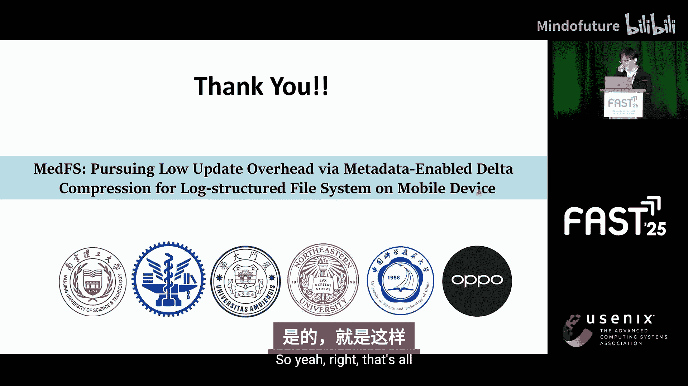

# 030：MedFS - 通过元数据启用的增量压缩追求低更新开销

## 概述
在本节课中，我们将学习一篇关于移动文件系统增量压缩的研究工作。这项名为MedFS的技术旨在通过利用文件系统元数据区的空闲空间来存储微小的数据更新（增量），从而显著减少对闪存存储的写入压力，延长设备寿命，并提升I/O性能。我们将从问题背景、现有方法、MedFS的设计原理、实现细节以及实验结果等方面进行系统性的讲解。

---

## 移动存储面临的挑战 🚨
随着移动应用变得越来越密集，它们向移动存储生成了大量的写入I/O请求。移动存储基于闪存，而闪存具有有限的寿命，只能承受有限次数的编程/擦除周期。这引发了对其使用寿命的严重担忧。

问题正在恶化。制造商正试图迁移到高密度闪存，例如QLC（四层单元）。QLC的P/E周期限制仅为1000次。结合应用密集写入和高密度闪存寿命短这两个因素，闪存寿命成为一个严峻的问题。

因此，本工作的动机是实现透明的写入压力减少。如果能做到这一点，将是一个双赢的局面：移动应用可以继续保持高密集度，而制造商则可以更有信心地转向更高密度、更廉价、容量更大的闪存，如QLC。

---

## F2FS文件系统与现有方法回顾 📁
基于上述动机，让我们审视移动文件系统F2FS。它基本上是一个日志结构文件系统。我们特别关注其索引节点结构。如图所示，索引节点内有一个内联区域，这个区域占据了索引节点空间的很大一部分。但根据我们的分析，这个区域经常未被充分利用，存在大量空闲空间。

我们的方法是进行增量压缩。基本思路是利用这个未使用的区域来存储微小的增量，以减少写入压力。

在介绍我们的方法之前，先回顾一下F2FS现有的写入压力减少方法。
1.  **内联文件**：如果文件足够小，可以直接将数据存储到索引节点的内联区域。这样可以将索引节点和数据块合并到单个索引节点写入，减少写入次数。但问题是，只有少量文件符合此优化条件。
2.  **常规数据压缩**：如图所示，将多个数据块压缩后打包到单个块中写入，可以减少写入I/O次数。但问题在于，常规数据压缩的压缩率取决于数据模式，通常压缩效果不佳，这限制了压缩的实用性。此外，压缩也增加了系统设计复杂性，并增加了读/写操作的I/O开销。

---

## 移动I/O负载分析与关键观察 🔍
上一节我们回顾了现有方法，本节我们来看看对移动I/O负载的分析结果，这为我们提供了关键洞察。

我们分析了移动I/O工作负载，得到以下几点观察：
*   **内联区域空闲**：约90%的文件没有使用其索引节点内联区域中的所有指针。这意味着这些文件的内联区域有一些空闲空间。
*   **写入以更新为主**：约80%的写入操作是更新操作。
*   **更新变化微小**：一个非常重要的观察是，这些更新只对现有内容进行很小的更改。增量非常微小。
*   **特定文件类型是主要来源**：进一步分析I/O写入的文件类型，我们发现SQLite和临时文件贡献了大部分I/O写入，并且它们是微小更新的主要来源。
*   **内联区域利用率极低**：更令人惊讶的是，超过80%到90%的内联区域是未使用的。这意味着文件通常只有一两个指向数据块的指针。
*   **索引节点缓存良好**：我们还发现索引节点在页面缓存中缓存效果很好。这意味着我们可以在索引节点实际刷新到存储之前，将多个小增量追加到其内联区域中。

基于这些观察，我们认为增量压缩可能是一个很好的方向。

---

## MedFS系统架构 🏗️
基于上述分析，我们提出了MedFS。下图展示了我们提案的架构。它基于F2FS，但包含了两个主要组件：**DCI** 和 **DCM**。

*   **DCI**：增量内联。当产生一个块写入时，DCI首先检查它是否为更新操作。如果是更新，DCI再检查增量的大小。如果增量很小，DCI就将增量插入到索引节点的内联区域中。
*   **DCM**：增量压缩管理器。因为索引节点的大小仍然有限，内联区域可能会溢出。在这种情况下，选定的增量将从内联区域中被逐出，而被逐出的增量将由DCM处理。DCM将使用常规的数据块来存储这些被逐出的增量。

这就是我们方法的整体架构。

---

## DCI：增量内联的工作原理 ⚙️
上一节我们介绍了整体架构，本节我们来详细看看DCI是如何工作的。

在更新时，DCI首先将原始基础数据与传入的新数据进行比较，以产生增量。比较基于**异或**操作。

如示例所示，因为变化很小，异或结果包含大量0。我们可以使用轻量级编码（如游程编码或LZO）将增量转换为一个非常小的单元，然后将其嵌入到索引节点的内联区域中。这就是DCI的基本工作原理。

需要强调的是，因为这是增量压缩，对于常规的增量压缩，可能会产生“增量的增量”，层层叠加，这会增加读取开销。但在这项工作中，我们将一个基础块所能拥有的最大增量数量限制为**1**。这意味着每次更新时，我们都会创建一个新的增量来替换旧的增量。

---

## 处理内联区域溢出 🔄
如前所述，内联区域的大小是有限的。那么当内联区域溢出时该怎么办？基本上，我们会执行增量替换。

这里需要考虑几种情况：
*   如果文件正在增长（即添加新指针），但内联区域已满，我们以**先进先出**的方式替换现有的增量。
*   其他情况是在执行更新时。实际上这里有一些细节，您可以查阅我们的论文。但核心概念是：如果我们替换一个现有的增量，并且这种替换能带来更好的长期I/O效率，那么我们就会这样做。这是基本的原则。

在替换时，被选中的增量将从内联区域中逐出，而被逐出的增量将由DCM处理。

---

## DCM：增量压缩管理器 ❄️
现在，让我简要解释一下DCM是如何工作的。

DCM接收被逐出的增量。基本上，DCM像存储数据块一样，在常规块中存储增量。它使用元页面、映射块和压缩块来存储被逐出的增量。

但有一点需要强调：**DCM只处理冷的、写入密集的文件**。为什么？因为增量压缩在读取数据时，必须读取基础块和增量块，这意味着读取开销增加了。所以DCM只接受来自那些确实是冷的且写入密集的文件的被逐出增量。这是基于一个聚类算法来识别冷且写入密集的文件。

再次说明，您可以查阅论文以获取更多细节。

---

## 一致性与恢复机制 🛡️
我们的方法引入了基础块和增量块，因此必须强制执行新的写入顺序。这里有两条规则：

1.  **基础块必须在增量块之前写入**（“写入”意味着持久化到存储）。然后增量块必须在索引节点之前写入。这是为了避免出现悬空增量。即，在恢复时，如果我们发现一个增量，却找不到对应的基础块，就会出错。通过强制执行此写入顺序，我们可以避免这种错误。
2.  还有另一条排序规则。

总之，基于这些规则以及F2FS原有的恢复逻辑，我们可以保证数据的一致性。

---

## 实验结果与性能评估 📊
我们在智能手机上进行了实验，将原始F2FS、支持常规数据压缩的F2FS以及我们的MedFS进行了比较。

以下是主要结果：
*   **写入流量减少**：平均而言，我们将写入流量减少了超过一半（**>50%**）。这非常可观。这可以转化为寿命延长超过100%。
*   **性能优异的原因**：增量压缩效果如此之好，是因为我们专注于变化，而移动I/O的变化是微小的。相比之下，常规压缩的压缩率取决于数据模式，通常效果不佳。
*   **用户感知延迟**：在写入密集型场景下，它略微改善了执行时间。
*   **I/O延迟**：我们将写入I/O延迟降低了约**30%**。有趣的是，我们也改善了读取延迟。这是因为我们显著减少了写入I/O次数，从而进一步缓解了调度I/O队列的争用，这就是读取I/O延迟也得到改善的原因。

---

## 总结
本节课我们一起学习了MedFS，一个针对移动文件系统的增量压缩方案。

*   **问题**：移动应用产生大量微小更改，高密度闪存寿命有限，构成矛盾。
*   **洞察**：移动文件系统（如F2FS）的索引节点内联区域存在大量未利用空间，且更新产生的增量通常很小。
*   **方案**：提出MedFS，包含两个核心组件：
    *   **DCI**：将微小增量直接嵌入索引节点的内联区域。
    *   **DCM**：当内联区域溢出时，将增量存储到常规数据块中（仅针对冷且写入密集的文件）。
*   **优势**：与常规压缩相比，增量压缩专注于变化本身，对移动I/O中常见的微小更新压缩效率极高。
*   **效果**：实验表明，MedFS能显著减少写入流量（>50%），延长闪存寿命（>100%），并降低I/O延迟。

总之，通过巧妙地利用文件系统元数据中的空闲空间来压缩存储微小的数据更新，MedFS为移动设备存储的寿命和性能优化提供了一种有效的透明解决方案。