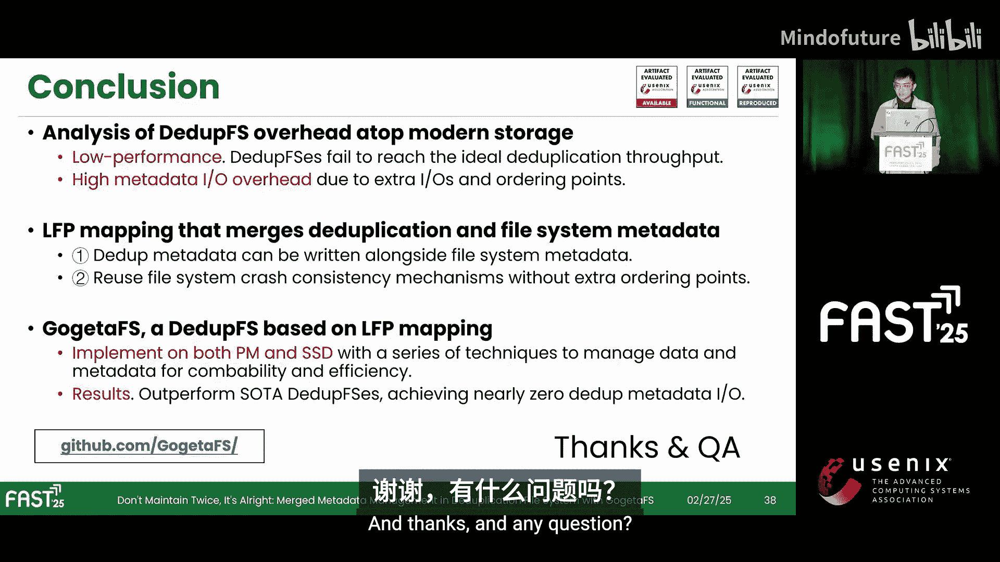
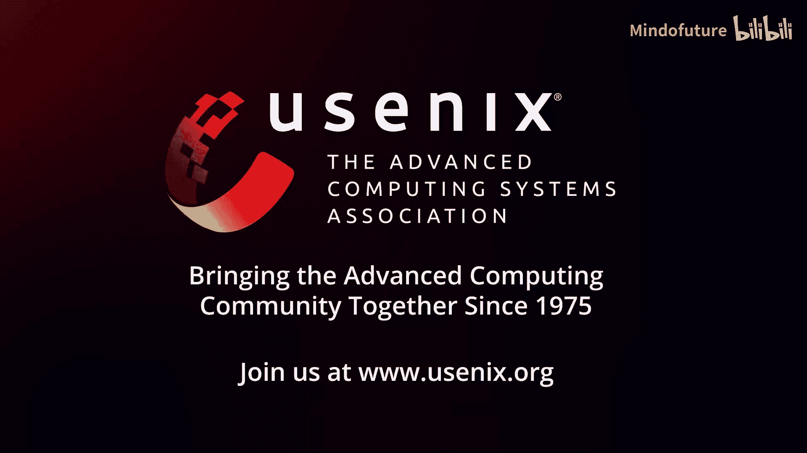

# 031：无需维护两次——去重中的元数据合并管理

在本教程中，我们将学习一篇来自FAST‘25存储大会的研究。该研究揭示了当前去重文件系统性能开销高的原因，并提出了一种创新的元数据合并管理方案，旨在实现近乎零开销的高性能去重。

## 概述：去重文件系统的性能瓶颈

去重技术已被广泛应用于归档存储、存储控制器和云存储等场景，以降低存储成本。随着持久内存等加速存储设备的出现以及去重算法的改进，去重过程变得更快，这使得去重文件系统日益流行。

然而，一个关键问题随之产生：这些去重文件系统的性能表现如何？为了研究这个问题，研究团队使用FIO工具，在5%去重率的场景下，对多个去重文件系统进行了压力测试，块大小从4KB到2MB不等。

实验结果显示，当前先进的去重文件系统可能遭受超过13%的性能损失。这表明去重文件系统仍然存在较高的开销。

## 深入分析：开销从何而来？

为了探究性能损失背后的原因，研究团队进一步分析了在2MB块大小下的去重I/O路径。

他们发现，**去重元数据的维护**在I/O路径中导致了19%到33%的开销。这个开销甚至可能高于重复数据识别过程本身。这个结果表明，看似无害的去重元数据维护，可能带来相当大的性能损失。

那么，为什么元数据维护会产生如此高的开销呢？要回答这个问题，我们首先需要理解去重文件系统的元数据是什么。

## 核心概念：去重文件系统的关键数据结构

去重文件系统利用两个关键数据结构来移除重复数据：

1.  **逻辑到物理映射表**：这个表维护了从逻辑块到物理块的映射。因此，多个逻辑块可以共享同一个物理块以实现去重。此表由文件系统维护。
2.  **指纹到物理映射表**：这个表维护了从数据块的指纹到其对应物理块的映射，同时包含一个引用计数，用于指示有多少个逻辑块共享这个物理块。此表由去重模块维护。

接下来，让我们仔细看看去重文件系统如何利用这些数据结构工作。

### 写入唯一数据块

假设我们在逻辑块1的位置写入一个唯一的数据块。
1.  去重文件系统首先通过计算输入数据的指纹，并在F2P表中搜索该指纹来识别重复。
2.  此时没有找到匹配的指纹，表明输入数据块是唯一的。
3.  因此，去重文件系统直接分配并写入这个数据块。
4.  之后，去重文件系统需要持久化一个新的F2P条目。该条目记录了其指纹到实际块位置的映射，并将引用计数设为1，表明此块是唯一的。
5.  最后，去重文件系统持久化一个新的L2P条目，将逻辑块1映射到已写入的物理块1。

此后，对该写入块的访问都可以根据这个L2P条目中的映射进行。

### 写入重复数据块

现在，假设我们在逻辑块2的位置写入一个重复的数据块。
1.  同样地，计算指纹并搜索F2P表。
2.  此时恰好找到一个匹配的记录，表明输入数据块是重复的。
3.  在这种情况下，去重文件系统增加这个已找到的F2P条目的引用计数。
4.  最后，去重文件系统持久化一个新的L2P条目，将逻辑块2映射到同一个物理块。

此后，对逻辑块1或逻辑块2的访问都会被重定向到同一个物理块，从而实现了去重。

## 问题总结：去重文件系统效率低下的根源

通过前面的分析我们可以总结，**无论写入的是唯一数据块还是重复数据块，我们都必须维护F2P表**。维护这个表引入了额外的I/O操作和顺序保证点。

*   额外的I/O导致了**写入放大**。
*   顺序保证点降低了**I/O并发性**。

这两点共同严重损害了性能。

## 核心洞察：合并元数据管理

然而，研究团队发现，独立维护F2P表甚至是不必要的。

他们的核心洞察是：既然文件系统的L2P条目和去重的F2P条目都映射到同一个物理块号，那么它们**自然可以合并到一个I/O操作中**。

请看右侧的示意图。我们简单地将指纹信息整合到现有的文件系统L2P条目中。我们将这种合并后的元数据称为**逻辑-指纹-物理映射**。

这种合并的元数据带来了三个好处：
1.  去重元数据可以嵌入到文件系统元数据中，因此**不需要额外的元数据I/O**。
2.  合并后元数据的崩溃一致性由文件系统天然保证，因此**不需要额外的顺序保证点**。
3.  合并后的元数据可以复用文件系统现有的I/O路径，因此**降低了开发复杂度**。

基于LFP映射设计，研究团队提出了 **GotaFS** 文件系统，旨在实现高性能去重。

## GotaFS的设计目标

GotaFS有四个主要设计目标：
1.  **通用性**：兼容传统文件系统的I/O路径。
2.  **高效性**：提供细粒度的块级重复识别和快速的重复查找。
3.  **内存高效**：能适应不同内存需求的多种场景。
4.  **可配置性**：去重功能可以启用或禁用，而不影响原始文件系统的功能或效率。

在本教程中，我们重点探讨GotaFS如何实现通用性和高效性。

### 实现通用性：溢出指纹表

实现通用性面临的挑战源于LFP映射带来的数据管理不兼容性。具体来说，文件系统的L2P条目可以将一段连续的逻辑块范围映射到物理块。而F2P条目为了实现细粒度的块级去重，只将单个指纹映射到单个物理块号。这导致了L2P条目的大小可变，从而影响了文件系统布局，使文件系统分配路径复杂化，既不通用也不实用。

为了解决这个挑战，GotaFS采用了一个简单的解决方案：将这类连续块的指纹存储到一个额外的空间中，这个空间称为**溢出指纹表**。对于这些块，在其对应的LFP条目中存储一个空指纹。该表驻留在存储设备上，近乎直接地将物理块号映射到指纹。因此，如果发现一个LFP条目的指纹为空，GotaFS可以根据其物理块号快速访问这个表来定位其真实的指纹。

### 实现高效性：全局LFP表

实现高效性面临的挑战同样源于LFP映射带来的方法管理不兼容性。具体来说，文件系统按逻辑块号组织其L2P条目以实现快速文件索引。然而，F2P条目应该按指纹组织以实现快速查找，否则去重模块必须执行昂贵的线性扫描来查找一个指纹。

为了解决这个挑战，GotaFS引入了一个内存中的表来按指纹组织LFP条目，称之为**全局LFP表**。该表首先将LFP条目转换为F2P条目，然后将它们插入一个动态哈希表中。GotaFS使用RCU锁和每桶锁来确保安全的并发访问。借助这个表，GotaFS可以快速识别指纹是否存在，从而实现快速的重复数据识别。

综上所述，通过**溢出指纹表**和**全局LFP表**，GotaFS可以在LFP映射设计的基础上实现通用且高效的去重。

## 性能评估

研究团队在英特尔持久内存上评估了GotaFS，并将其与Mdedup、LightDedup和NOVA（基础文件系统）进行了比较。

### 基础性能评估

首先使用4KB I/O大小进行性能评估。在0%、15%和75%去重率下，GotaFS比LightDedup快9%到32%，并且大幅优于MDedup。值得注意的是，在0%去重率下，GotaFS甚至与基础文件系统NOVA性能相近，这得益于其降低的元数据开销。

接着评估在连续2MB I/O下的性能。在此设置下，GotaFS同样表现出色，比LightDedup快8%到35%，并大幅优于MDedup。一个有趣的发现是，在0%去重率下，GotaFS甚至能略微超过NOVA的性能。研究发现，这主要是因为指纹计算可以与内部持久内存I/O重叠，并且这种轻微的计算延迟通过降低I/O发出频率，减少了持久内存缓冲区的争用。

### I/O路径分解

进一步分解2MB块I/O的路径。分解结果显示，性能提升确实来自于减少的元数据开销。具体来说，得益于LFP映射，GotaFS能将去重元数据维护的开销降低75%到92%。当然，GotaFS仍然有一些元数据开销，这主要是由维护其提出的表（如溢出指纹表）引起的。但幸运的是，这部分开销很小，可以忽略不计。

### 可扩展性评估

研究团队还将GotaFS移植到F2FS文件系统上，并在NVMe SSD平台上进行了FIO实验。比较GotaFS与F2FS以及其他先进的SSD去重文件系统的结果显示，GotaFS同样能显著优于其他去重文件系统，并与F2FS性能相近。这主要得益于降低的去重元数据开销，表明GotaFS在不同的文件系统和存储设备上具有良好的可扩展性。

## 总结

本节课我们一起学习了去重文件系统优化的重要研究。该研究揭示了去重元数据I/O开销可能很高，原因在于其额外的I/O操作和顺序保证点。

研究提出的**LFP映射**创新性地将去重元数据与文件系统元数据合并，从而消除了这些实际开销。LFP条目复用了文件系统成熟的I/O路径和崩溃一致性机制，无需引入额外的I/O和顺序保证点。

最后，基于LFP的去重文件系统**GotaFS**被证明能够超越当前先进的去重文件系统，实现近乎零的去重元数据开销，从而获得最佳性能。

