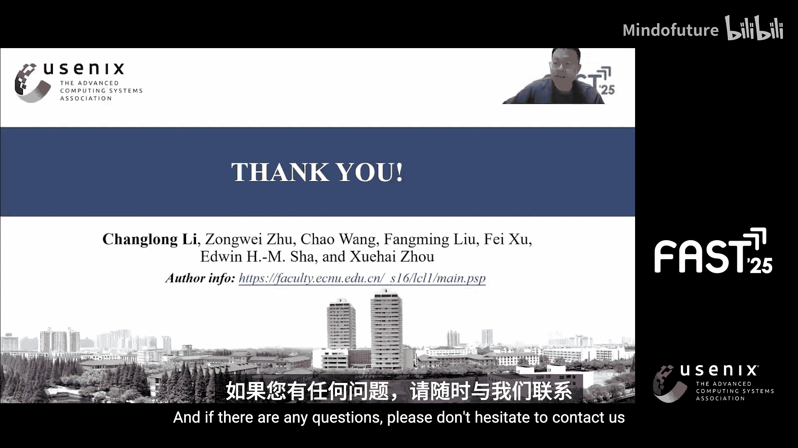

# 032：Archer - 面向移动设备高速响应的、具备页面关联规则感知的自适应内存压缩

在本教程中，我们将学习一篇来自FAST‘25存储大会的研究论文。该论文提出了一种名为“Archer”的新技术，旨在通过感知页面间的关联规则，实现自适应内存压缩，从而显著提升移动设备的响应速度。我们将从背景动机、核心问题、设计原理到评估结果，系统地了解这项工作的全貌。

## 背景与动机 🧐

如今，人们花费在移动设备上的时间越来越多。这些设备包括智能手机、自动驾驶汽车、无人机、机器人等多种形态。在这些设备上，运行着大量新兴应用，例如基于Transformer的AI模型、AR/VR服务、车载摄像头服务、手机游戏和短视频等。

这些应用通常是内存密集型的，但不幸的是，移动设备上的内存资源却非常稀缺。为了解决这个问题，内存压缩技术被广泛应用于移动设备中。

然而，我们发现现有的页面压缩效率低下。这个问题对用户体验产生了负面影响。具体来说，我们测量了Google应用商店中热门应用的启动速度、连续拍照的响应时间以及短视频的帧率。

即使内存空间成功被节省，从图中我们可以看到，启用内存压缩后，应用启动延迟增加了约68.7%。同时，从子图B可以看到，在内存压力下，连续拍照的响应时间延长了1.6倍。此外，从子图C可以看到，短视频播放和滑动的平均帧率从约50 FPS下降到了约27 FPS。

如右图所示，内存压缩的软件栈位于Linux内核中，它会阻塞主线程的执行。这也是导致用户体验下降的根本原因。

## 问题根源分析 🔍

我们进一步的分析表明，导致这种性能下降的关键原因之一是一个名为“直接回收”的内存回收机制。直接回收是Linux内核中的一项基本内存回收功能，它会损害性能，因为任何页面分配都必须等待压缩过程完成。结果，前台应用的主任务会被挂起，直到其内存需求得到满足。

即使内核线程`kswapd`可以压缩单个页面，但系统在释放足够空间之前仍可能陷入循环。我们需要知道，单独压缩页面是合理的，但这样做会消除读取放大。例如，如果我们一起压缩10个页面，但未来只访问其中的一个，操作系统也需要解压全部10个页面。这显然是不合理的。

## 核心研究问题与洞察 💡

因此，本文提出了一个根本性问题：**我们能否进行大粒度压缩（例如批量压缩10个页面），同时不增加读取放大？** 答案是肯定的。

这基于一个有趣的观察：**26.3%的匿名页面与其他页面存在强关联性**。页面间的这种内部关联性在早期的研究中未被察觉。就像“啤酒和尿布”的关系一样，许多页面总是被一起访问。这种关联是隐式的，但可以被挖掘出来。如果系统能感知到这些高度关联的页面并对它们进行大粒度压缩，性能就有可能得到显著提升，从而解决上述的用户体验问题。

## Archer系统设计 🏗️

在本文中，我们提出了**Archer**系统。通过对匿名页面进行关联规则挖掘，内存压缩效率可以得到显著提高。然而，在系统层挖掘页面关联规则并不容易，存在许多基本挑战。为了应对这些挑战，Archer设计了三个核心组件：**足迹流生成器**、**频繁模式列表**和**自适应压缩区域**。

### 组件一：足迹流生成器

我们知道，传统的关联规则挖掘算法（如Apriori和FP-Growth）适用于挖掘静态事务数据集。然而，在移动系统中，页面访问在运行时持续发生。Archer需要能够在页面被访问时更新页面关联信息。

为此，Archer在运行时收集页面访问模式，并生成一个“足迹流”。具体来说，足迹流生成器维护一个滑动窗口来动态生成足迹流并挖掘关联规则。

### 组件二：频繁模式列表

我们知道，Linux内核中传统的LRU列表不适合支持页面关联规则挖掘。因此，在这项工作中，我们将LRU与FP-Tree协同设计，提出了一种名为**FP-List**的新结构。通过协同设计，FP-List可以在线高效地管理和挖掘内存匿名页面。

### 组件三：自适应压缩区域

我们也应该知道，页面级压缩不应被完全抛弃。这是因为也有很多页面没有关联性，因此不应该进行批量压缩。即使是有关联的页面，其关联规模也不是一个固定值。例如，页面A可能与3个页面相关，而页面B可能与10个页面相关。

因此，Archer在实践中需要自适应地压缩页面。为了支持这一特性，本文进一步提出了**自适应压缩区域**。ACR基于Linux内核中原有的ZRAM区域实现。在ACR中，被一起压缩的页面用一个虚拟句柄进行索引。

## 系统评估与结果 📊

我们在真实的移动设备上进行了评估。具体来说，我们在三个平台上进行了评估：Google Pixel 6、Google Pixel 3和华为P20。在这些平台上，评估了三种典型场景：应用启动速度、拍照性能和帧率。

从图中可以看出，冷启动和热启动速度都得到了提升。这里，热启动意味着启动一个已在后台驻留的应用，而冷启动意味着启动一个未在后台缓存的应用。这两种应用启动方式的启动过程是不同的。

我们可以看到，与Android中原有的压缩机制（即ZRAM）相比，在Pixel 3上，冷启动的平均速度提升了约37.2%，在P20上提升了30.6%，在Pixel 6上提升了32.9%。此外，三个平台上的平均热启动速度分别提升了55.3%、47%和29%。平均拍照速度和帧率分别提升了1.2倍和1.3倍。

除了平均性能提升，更重要的是，我们还评估了尾部延迟。从图中可以看出，各种场景的尾部延迟显著降低，这意味着最坏情况可以被有效避免。

除了上述场景，Archer还评估了Transformer模型。这是一种新兴的内存密集型应用，由于自注意力的二次缩放和高维嵌入，其在推理时需要大量内存。正如我们所评估的，Transformer的平均延迟比CNN高7.3倍。然而，当启用Archer时，在Pixel 6上，其延迟降低了39.2%。

## 总结 📝

本节课中，我们一起学习了Archer系统。本文表明，页面压缩并不适合移动场景下的内存密集型应用。我们工作的核心见解是，通过挖掘页面关联规则，我们证明了在移动系统中进行大粒度压缩是可行的。这个问题在早期的工作中未被重视。

受我们观察的启发，并为了应对技术挑战，本文提出了Archer。Archer是一个面向移动设备高速响应的、具备页面关联规则感知的自适应内存压缩系统。评估结果表明，它能显著提升应用启动、拍照、视频播放及AI模型推理等多种场景的性能和响应速度。