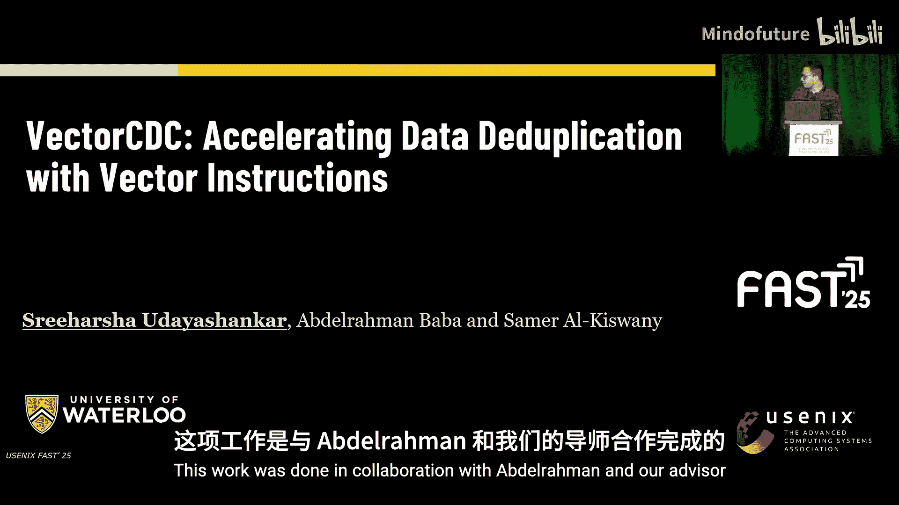
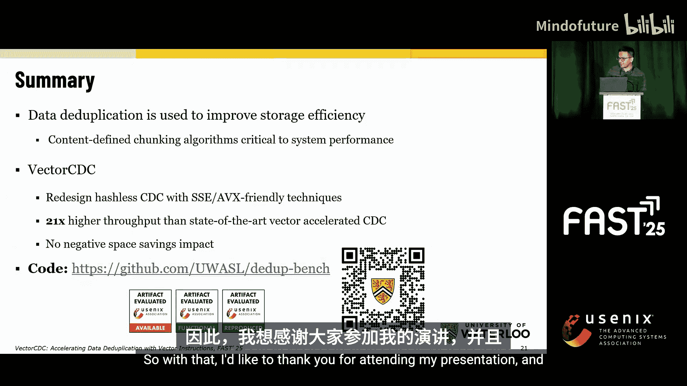
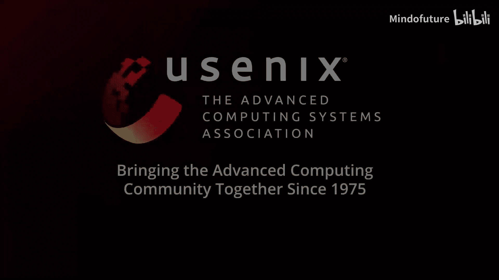

# 033：VectorCDC - 利用向量指令加速数据去重




## 概述

在本教程中，我们将学习一篇来自FAST‘25存储大会（USENIX文件与存储技术会议）的论文《VectorCDC: Accelerating Data Deduplication with Vector Instructions》。我们将探讨数据去重的基本概念，了解传统算法的瓶颈，并重点学习如何利用现代CPU的向量指令（如AVX、SSE）来高效加速一种名为“无哈希CDC”的算法家族，从而实现高达21倍的性能提升。

---

## 背景：数据去重与CDC算法

上一节我们提到了数据去重的重要性。本节中，我们来看看实现去重的一个关键步骤：内容定义分块。

数据去重是一种用于识别和消除重复数据以节省网络和存储成本的机制。它包含多个阶段，其中一个关键阶段是将文件分割成块。

以下是分块算法的两种主要类型：

*   **基于哈希的算法**：例如Rabin分块。它通过滑动窗口计算哈希值来确定分块边界。这类算法存在数据依赖性，难以并行化。
*   **无哈希算法**：例如RAM（快速最大值分块）。它通过寻找数据区域中的极值（如最大值）来确定边界，逻辑更简单，并行潜力更大。

传统的加速尝试（如SSCDC）专注于加速基于哈希的算法，但由于需要处理数据依赖和使用昂贵的`scatter/gather`指令，加速效果有限（通常只有1.2-1.8倍）。

---

## VectorCDC的核心设计思想

既然加速基于哈希的算法遇到瓶颈，VectorCDC选择了一条不同的道路：加速无哈希CDC算法。

VectorCDC的设计基于一个关键发现：大多数无哈希CDC算法都可以归结为两个通用阶段：
1.  **极值字节搜索阶段**：在一个数据区域内寻找最大值或最小值。
2.  **范围扫描阶段**：将数据区域的字节与一个目标值进行顺序比较。

通过利用SIMD向量指令优化这两个阶段，就能高效加速整个算法家族。

---

## 关键技术：向量指令与两阶段优化

上一节我们介绍了VectorCDC的两阶段模型。本节中，我们来看看如何利用向量指令具体实现这两个阶段。

### 阶段一：极值字节搜索加速

目标是找到一块数据中的最大值。传统方法是顺序比较。使用向量指令可以并行比较。

**操作步骤如下：**
1.  **数据打包**：将字节数据加载到向量寄存器中。例如，一个128位寄存器可以打包16个字节。
2.  **并行比较**：使用一条向量最大值指令（如`_mm_max_epu8`），对两个寄存器中的字节进行并行比较，结果存入新寄存器。
3.  **归约树**：重复步骤2，将结果寄存器再次两两比较，形成一棵归约树，直到得到一个包含全局最大值的寄存器。

**代码概念描述：**
```cpp
// 假设 v1, v2 是包含打包字节的向量寄存器
__m128i result = _mm_max_epu8(v1, v2); // 并行计算16对字节的最大值
// 重复此过程，形成归约树，最终找到全局最大值
```

### 阶段二：范围扫描加速

目标是将数据区域的每个字节与一个目标值进行比较，直到找到满足条件的字节（例如，大于等于目标值）。

**操作步骤如下：**
1.  **加载目标值**：将目标字节重复填充到一个向量寄存器中。
2.  **打包加载数据**：将待扫描的数据字节打包加载到另一个向量寄存器。
3.  **并行比较**：使用一条向量比较指令（如`_mm_cmpge_epu8`），一次性判断所有加载的字节是否满足条件。
4.  **滑动窗口**：如果没有找到匹配，则滑动窗口，加载下一组字节，重复步骤3。

**代码概念描述：**
```cpp
// target_v 是重复填充了目标值的向量寄存器
// data_v 是包含打包数据字节的向量寄存器
__m128i cmp_result = _mm_cmpge_epu8(data_v, target_v); // 并行比较
// 检查cmp_result中是否有非零位（表示找到匹配）
// 若无，则移动指针，加载下一组数据
```

---

## 算法重构与性能优势

我们已经掌握了两个核心的向量化阶段。现在，让我们看看如何用它们重构具体的算法，并了解其带来的性能优势。

以RAM算法为例：
1.  **第一步**：在固定大小窗口内寻找最大值。这正好对应 **极值字节搜索阶段**。
2.  **第二步**：从窗口后开始，顺序扫描字节，与找到的最大值比较。这正好对应 **范围扫描阶段**。

因此，在VectorCDC框架下，RAM算法被重构为一个极值字节搜索加上一个范围扫描。其他无哈希算法（如FastCDC、AE）也可以类似地用这两个阶段重新设计。

这种重构的优势在于：
*   **高效并行**：充分利用CPU的SIMD单元，单条指令处理多个数据。
*   **避免依赖**：无哈希算法本身数据依赖性低，易于向量化。
*   **通用性强**：一套优化方法适用于多种算法。

---

## 性能评估与总结

最后，我们来审视VectorCDC的实际效果。论文使用了多种数据集进行评估。

**速度对比结果：**
*   在VM备份数据集上，使用8KB块大小时，向量化加速后的VRAM算法吞吐量达到约2.5 GB/s。
*   VRAM比所有其他对比算法快12到15倍。
*   与同样使用向量加速的SSCDC相比，VRAM的**加速比高达21倍**（SSCDC仅获得1.2-1.7倍加速比）。

**关键结论：**
1.  **高性能**：VectorCDC通过加速无哈希CDC算法，实现了数量级的吞吐量提升。
2.  **无损压缩率**：加速过程不会对数据去重的最终空间节省率产生负面影响。
3.  **向后兼容**：该方法与现有的去重系统兼容。

---

## 总结

本节课中我们一起学习了VectorCDC的核心思想。我们首先回顾了数据去重及CDC分块算法的背景，指出了传统哈希算法加速的瓶颈。接着，我们深入探讨了VectorCDC如何另辟蹊径，通过识别并向量化“极值字节搜索”和“范围扫描”这两个通用阶段，来高效加速整个无哈希CDC算法家族。最后，我们看到了该方法带来的显著性能提升，在保持去重效率的同时，获得了高达21倍的吞吐量增长。






VectorCDC的代码已在GitHub上开源，为存储系统优化提供了有力的新工具。