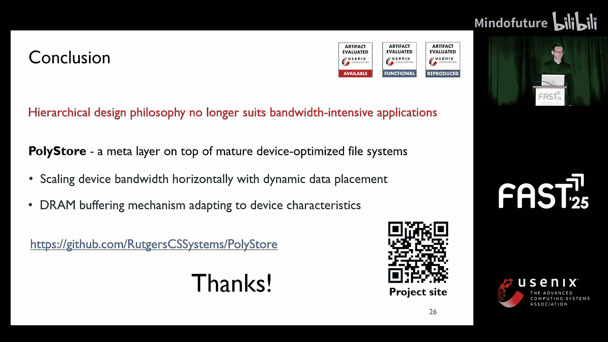

# 035：PolyStore - 利用异构存储设备的组合能力

## 概述

在本节课中，我们将学习PolyStore，这是一个旨在为带宽密集型应用充分利用异构存储设备组合能力的新型系统。我们将探讨传统分层存储设计的局限性，并详细解析PolyStore如何通过其创新的元数据层、动态数据放置机制和灵活的缓冲区缓存策略来解决这些问题。

---

## 存储需求与硬件演进

过去几十年，需要持久化存储的数据规模迅速增长，即使在单机上，众多应用的需求也是如此。更重要的是，这些应用对存储带宽的要求越来越高，从每秒约100兆字节增长到如今的每秒数十吉字节。

随着应用对存储带宽需求的增长，存储硬件在过去两年也快速发展，从NVMe SSD到字节可寻址的低延迟持久内存，再到具有更高带宽的超快NVMe SSD。

为了充分利用这些硬件的特性，开发者们致力于开发新的文件系统，以适配其硬件特性，同时也通过增加新功能来改造现有的文件系统。

---

## 传统分层存储设计及其局限

由于存储设备之间存在性能、成本和容量差距，很自然地会以分层方式组织它们，将较慢的设备置于较高延迟的层级。这种设计理念催生了两种经典方式：缓存和分层。

**缓存**：新的写入请求被导向低延迟设备（我们称之为**更快设备**），存储系统异步地将数据从更快设备驱逐到更慢设备（我们称之为**更慢设备**）。对于读取操作，如果数据命中更快存储，则直接读取；否则，系统会及时将数据从更慢存储迁移到更快设备。

**分层**：与缓存类似，分层也在低延迟（更快）设备中缓冲数据。然而，它以成本感知的方式在快慢设备间移动数据。

在这两种设计中，都使用更快的存储设备来吸收新数据的写入请求。然而，现有的异构存储系统存在几个缺陷，未能充分利用硬件和软件的潜力。

以下是现有系统面临的主要问题：

1.  **无法利用异构存储的组合带宽**：因为它们将设备按分层布局排列。当多个线程同时向快速设备写入时，底层设备的带宽完全未被利用。以使用持久内存和NVMe SSD为例，在多线程基准测试中，无论是缓存还是分层方法，在随机写入和读取工作负载下，都无法接近带宽极限。这种分层设计规避了累积存储带宽的利用。

2.  **缺乏针对存储异构性的灵活DRAM缓冲区缓存机制**：存储系统使用DRAM缓冲区来暂存写入请求，并将频繁访问的数据保留在DRAM中以应对高延迟。然而，现有系统严重依赖Linux页面缓存，它无法有效处理设备异构性。首先，操作系统页面缓存默认会绕过某些设备（如持久内存），并且无法区分读写操作的不对称性能。此外，它无法在考虑设备异构性的情况下，在设备之间提供灵活的准入和驱逐控制，因为它们缺乏在异构存储设备之上进行全局视图管理的机制。

3.  **系统设计未考虑重用成熟的设备优化文件系统**：例如，一些方法为特定类型设备提出了分层文件系统，将数据放置决策编码在文件系统中。而另一些方法则在块层管理设备，但只使用一个文件系统。这两种设计都导致成熟的、针对硬件优化的文件系统未被充分利用。

其系统设计中的关键洞察是，它们将数据放置决策与软件栈耦合在一起。

---

## PolyStore的设计理念

有人可能会认为，使用RAID 0（在设备间条带化数据）来利用设备带宽，同时考虑它们之间的性能差异，不是一个更直接的解决方案吗？然而，如前所述，这种方法仍然将数据放置决策编码在块层，并向上层隐藏了设备异构性。结果就是，它无法利用针对设备优化的文件系统，也无法为准入和驱逐控制提供设备特定的DRAM缓冲区策略。

因此，我们认为，用于管理存储异构性的理想系统应首先利用多个存储设备的组合带宽。最重要的是，它应该将数据放置决策解耦，并将其置于存储软件栈之上。这样，它可以自然地重用过去几年为每个独立存储设备量身定制的成熟文件系统，并提供灵活的DRAM缓冲区缓存驱逐和准入策略。

---

## PolyStore架构与核心组件

为了避免上述缺陷，我们提出并设计了PolyStore，这是一个位于设备优化内核级文件系统之上的元层。PolyStore包含两个组件：一个具有数据放置决策的用户级运行时，用于利用设备带宽；以及一个处理进程间共享、资源公平性和安全性的操作系统组件。

现在，让我分解PolyStore的组件和设计理念，从数据索引结构开始。

### 数据索引结构

为了获得异构存储设备的组合带宽，第一步是在这些设备间分布数据。同时，我们知道超过吉字节的大型文件（如数据流文件和数据库文件）对带宽敏感。因此，PolyStore尝试将一个PolyStore逻辑文件的数据块分布到底层每个独立文件系统上的物理文件中。

这是通过一个**范围树**数据结构实现的，该结构中的每个节点代表放置在对应存储设备上的一系列数据块。更重要的是，这个数据结构还编码了跨异构存储设备的数据放置和访问模式信息，这是带宽利用和灵活DRAM缓冲区缓存策略的关键结构。

### 动态数据放置机制

最大化异构存储设备的组合带宽并非易事，因为将来自应用程序线程的I/O请求正确映射到存储设备至关重要。挑战在于以下两个方面：首先，如前所述，存储介质在为应用提供吞吐量方面具有不同的特性。其次，以静态方式确定从多个线程到存储设备的最佳I/O请求映射，无法适应工作负载的变化。这表明我们需要一个动态数据放置机制来最大化存储带宽利用率。

为了克服上述挑战，我们提出了一种基于**周期**的吞吐量监控和动态数据放置机制。让我用一个例子来说明。最初，PolyStore将应用程序I/O线程分为两组，分别向持久内存和NVMe写入数据。我们可以根据从供应商处获得的设备规格启发式信息进行划分，或者平均分配。

PolyStore开始将一个线程从NVMe组移动到持久内存组，因为我们希望首先饱和具有更高带宽的设备。如果这种重新分配提高了组合带宽，我们就将另一个线程从NVMe组移动到持久内存组，看看是否继续提高带宽利用率。然而，如果不是这种情况，则意味着持久内存带宽过饱和，然后我们恢复到先前的配置。最终，PolyStore收敛到一个能够有效利用组合存储带宽的局部最优配置。

### DRAM缓冲区缓存设计

如前所述，存储系统使用DRAM缓冲区来隐藏异构存储设备的延迟。考虑到它们之间的性能不对称性，更有效地使用DRAM缓冲区缓存在这些设备之间进行协调至关重要。因为如前所述，PolyStore已经提供了一个索引结构，该结构编码了哪些数据范围放置在哪个设备上的数据放置信息。

在此索引结构之上，PolyStore可以自适应地分配DRAM缓冲区缓存，并采用设备特定的策略进行准入和驱逐控制。以使用持久内存和NVMe SSD为例。如前所述，持久内存的读取速度非常快，虽然低于DRAM，但仍处于同一数量级。因此，PolyStore允许直接访问持久内存上的只读数据，而无需分配额外的DRAM缓冲区。

然而，持久内存的写入性能比读取慢得多。因此，当应用程序修改数据块时，PolyStore仅在数据被修改时才为持久内存分配DRAM缓冲区。除了编码的数据放置信息外，PolyStore中的索引结构还可以促进跨设备的数据迁移。因为这种索引结构还可以跟踪数据的“热度”和“冷度”，因为它位于每个数据平面操作（如读写操作）的关键路径上。

举例来说，假设由于内存压力，需要从DRAM缓冲区驱逐一系列频繁访问的数据。与传统缓冲区缓存不同，在传统设计中，数据需要被驱逐到其在较慢设备中的原始位置。而在PolyStore中，由于我们在不同存储设备之上拥有全局视图，因此，如果空间允许，PolyStore可以将较慢设备上的热数据刷新到更快的设备上。这样，下次访问这些数据块时，速度会更快。最后，PolyStore会对较慢设备上的原始数据块进行垃圾回收。

---

## 评估与性能分析

作为设计在操作系统内核中设备优化文件系统之上的元层，PolyStore在提供跨不同文件系统的崩溃一致性方面带来了一些挑战，因为它们都提供不同且多样的原子性和持久性保证，同时在进程间提供共享、安全性和公平性方面也存在挑战。更多技术细节请参阅我们的论文。

我们现在通过回答以下两个问题来评估PolyStore的设计：首先，PolyStore能否利用组合带宽？其次，PolyStore能否为实际应用带来好处？

在我们的实验设置中，我们使用持久内存加NVMe SSD作为异构存储配置，并使用Nova和Ext4分别作为PolyStore中持久内存和NVMe的文件系统。我们还将PolyStore与采用分层设计理念的最先进系统进行比较，这些系统包括采用缓存的Atlas和采用分层的SPFS。我们还评估了更多异构存储系统配置、更多不同文件系统的组合以及更多最先进系统的比较。详情请参阅我们的论文。

### 组合带宽利用能力

我们首先通过多个多线程基准测试访问私有文件来评估利用组合设备带宽的能力，并试图观察它是否能饱和存储带宽。我们从顺序追加工作负载开始，研究数据放置对带宽利用率的影响。

如图所示，由于其分层设计，缓存和分层方法都无法接近带宽极限。然而，PolyStore可以实现高达这些方法**6.1倍**的性能，并有效饱和可用组合带宽的90%。对于读取工作负载，PolyStore也可以实现高达这些系统**3.3倍**的带宽，因为PolyStore提供了可扩展的索引机制和动态数据放置机制，可以同时将数据分布在两个设备上。

现在，让我进一步分解和分析在32个基准测试线程上的顺序追加工作负载。首先，仅使用静态的、成本感知的数据放置，而不使用我们基于周期的动态方法。最初，基准测试线程被分为两组，分别向持久内存和NVMe写入数据。然而，一旦使用持久内存的线程组完成工作，由于缺乏动态数据机制，持久内存带宽变得空闲，PolyStore无法动态地重新映射I/O请求来使用持久内存，导致其带宽未被利用。如图所示，虽然静态方法在一定程度上可以实现组合带宽，但它无法适应工作负载的变化。

现在，让我们看看当启用动态数据放置的PolyStore时的情况。在初始阶段，没有太大差异。后来，当持久内存带宽变得空闲，并且使用持久内存的线程组已经完成时，PolyStore开始将线程从NVMe组移动到持久内存组，旨在优化组合带宽利用率。结果，通过这种动态数据放置机制，PolyStore可以以动态方式将数据从逻辑文件分布到物理文件，从而饱和更多的存储带宽。

### 实际应用收益

我们最终研究了PolyStore是否能惠及实际应用，我们使用了RocksDB和YCSB工作负载。为了评估交付给应用的端到端性能，我们为所有系统启用了DRAM缓冲区缓存。如前所述，操作系统页面缓存无法处理设备特性及其异构性。

以具有50%读取-修改-写入工作负载的YCSB工作负载F为例，让我们看看PolyStore是否能带来好处。首先，如果我们只为PolyStore使用操作系统页面缓存，它只显示出边际效益，因为RocksDB并非一直执行I/O请求，并且操作系统页面缓存无法有效地为DRAM缓冲区处理设备异构性以进行数据准入和驱逐控制。然而，如果启用PolyStore的DRAM缓冲区缓存机制进行这种灵活控制，它可以有效缓解持久内存的写入性能，并如前所述自适应地将数据从NVMe迁移到持久内存。

因此，与最先进的分层设计系统相比，PolyStore可以实现高达**1.7倍**的加速。

---

## 总结

本节课中，我们一起学习了PolyStore系统。随着存储带宽持续增长，分层设计理念不再适合带宽密集型应用。现有的异构存储系统受限于分层理念的设计缺陷，以及其固有的无法利用设备优化文件系统和异构性感知的DRAM缓冲区策略的问题。为此，我们提出了PolyStore，这是一个位于成熟的设备专用文件系统之上的元层，具有动态数据放置功能，可在多个设备间水平扩展数据，以及处理设备异构性的差异化缓冲区机制。