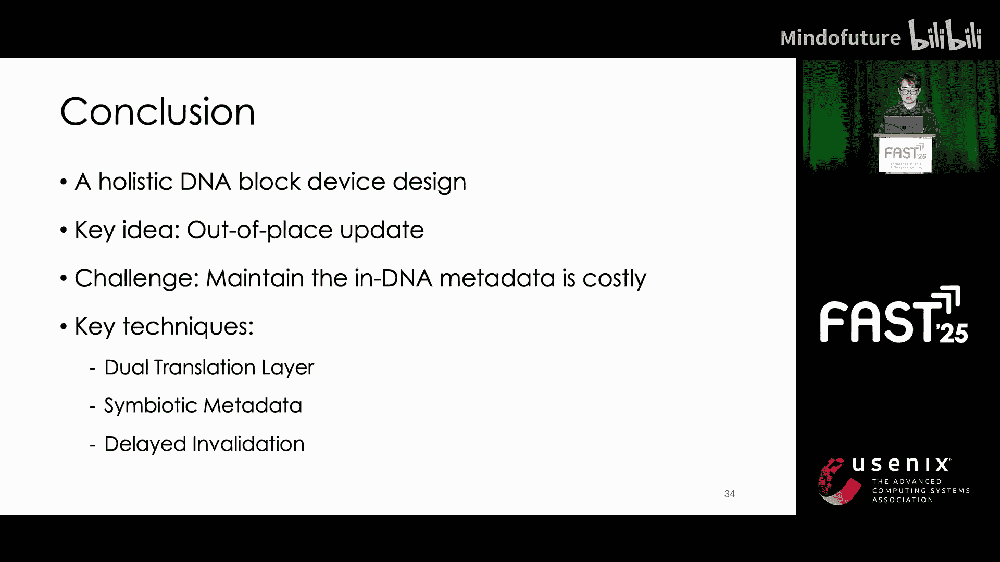

# 036：液态硬盘——面向海量数据的DNA块设备设计

在本教程中，我们将学习DNA作为存储介质的基础知识，探讨如何将其集成到现有存储系统中，并重点介绍一种名为“液态硬盘”的创新DNA块设备设计，以解决海量数据存储的挑战。

## DNA存储基础 🧬

上一节我们介绍了教程的主题，本节中我们来看看DNA存储的基本原理。DNA由四种不同的核苷酸（A、T、C、G）组成，是众所周知的遗传信息载体。如今，随着生物技术的进步，DNA也可以承载通用信息。具体来说，每条DNA链都有其对应的核苷酸序列，我们可以用这个序列来表示信息。

此外，DNA合成技术使我们能够合成具有指定序列的DNA，而DNA测序技术使我们能够读取DNA链的核苷酸序列。借助这两种技术，我们可以在DNA中存储和检索信息。

作为存储介质，DNA有两个显著优势：**高密度**和**长寿命**。

以下是DNA存储的具体优势：
*   **高密度**：DNA存储密度可达每立方毫米10^18个碱基，这比硬盘高出约8个数量级，比闪存高出约5个数量级。
*   **长寿命**：DNA可以保存数个世纪，而固态硬盘和硬盘的寿命大约只有五年。
*   **发展速度**：DNA存储技术的发展速度相对较慢。

DNA存储硬件由多个芯片组成，每个芯片是一个“点阵”。一个“点”相当于一个试管，其中存储着大量DNA链。

DNA链分为四个部分：起始引物、末端引物、索引区和有效载荷区。我们使用有效载荷区存储数据，并使用引物和索引来定位DNA链。

具体来说：
*   我们使用引物来索引DNA链集合。一个“测序集合”是具有相同引物的DNA链集合，位于同一个“点”内，集合中的所有链会被同时测序。
*   为了区分在同一测序集合内同时测序的DNA链，我们在索引区为每条链编码一个唯一的标识符。

DNA存储硬件支持三种操作：写入、读取和擦除。

*   **写入操作**：首先将二进制数据编码为核苷酸序列，然后合成具有相应序列的DNA链，最后将链存储到“点”中。
*   **读取操作**：首先对一个测序集合中的所有DNA链进行测序以获得核苷酸序列，然后将核苷酸序列解码为二进制数据。
*   **擦除操作**：由于DNA修改技术尚不成熟，我们需要在写入前进行擦除，这与闪存固态硬盘类似。擦除操作会清除“点”中的所有普通DNA链。

## 构建DNA块设备 💾

了解了DNA存储基础后，一个问题随之产生：如何将DNA存储集成到当前的存储系统中？我们的工作重点是构建一个DNA块设备。

块接口是存储系统中最关键的接口之一。它简单，允许我们以固定大小的块粒度随机访问数据。此外，块接口通用性强，广泛应用于各种场景，包括人工智能、云存储和归档存储。因此，我们提议构建DNA块设备，以将DNA存储集成到现有存储系统中。

我们首先审视一个简单的DNA块设备设计及其存在的问题。

对于一个简单的设计，我们首先将存储空间划分为块。我们将连续的DNA链映射到一个块中，然后为每个块分配物理块地址。

支持块操作看似直接：
*   **读取**：DNA存储硬件的读取粒度是一个包含约100万条链的测序集合。要读取一个块，我们必须读取该测序集合内的所有块。
*   **写入**：硬件的写入粒度是一条链。要写入一个块，我们只需写入该块的链。
*   **更新**：由于需要“先擦后写”，要更新一个块，我们需要执行擦除操作。擦除粒度是一个包含约2000个测序集合的“点”。因此，要更新一个块，我们首先需要读取该“点”内的所有测序集合，然后擦除整个“点”，最后再写入新的块以及其他块。更新一个块需要读取和写入1200万个块，成本极高。

为了降低更新成本，一个直接的方法是采用异地更新，就像固态硬盘所做的那样。

我们向用户提供逻辑块地址，并使用一个转换表将LBA转换为PBA，从而实现异地更新。

异地更新带来了垃圾，需要定期进行垃圾回收。为了便于垃圾回收，我们通常记录一些垃圾回收元数据，包括将PBA转换回LBA的逆向转换表，以及记录物理块有效性的有效位图。

然而，由于DNA块设备存储的是EB级别的数据，包括转换表、逆向转换表和有效位图在内的元数据也达到了PB级别。因此，元数据难以存储在传统存储设备中，需要存储在DNA里。

但是，将元数据存储在DNA中带来了挑战：维护这些元数据会重新引入昂贵的DNA更新操作。具体来说，对于每次写入，我们需要更新转换表条目、更新逆向转换表条目并使旧块失效。这三个过程使得昂贵的DNA更新操作卷土重来。

## 液态硬盘设计 🚀

为了解决这些挑战，我们提出了液态硬盘。

液态硬盘采用了三项关键技术：
1.  **双层转换表**：避免更新转换表。
2.  **共生元数据**：避免更新垃圾回收元数据。
3.  **延迟失效**：降低维护有效位图的成本。

接下来，我们进一步审视液态硬盘的设计细节。

### 双层转换表

我们提出双层转换表来降低更新转换表条目的成本。具体来说，我们对转换表本身也进行异地更新。因此，我们引入了另一层来支持转换表层的异地更新。现在我们有了两层：L0和L1 DNA转换层。

*   L0条目用于索引L1条目在DNA中的地址。
*   L1条目用于将LBA转换为PBA。

此外，L0条目在GB级别，这意味着它可以存储在快速的固态硬盘中。因此，更新L0条目的成本可以忽略不计。

### 共生元数据

我们提出共生元数据来降低维护垃圾回收元数据的成本。

首先，我们观察到垃圾回收元数据总是与块数据一起被访问。其次，我们观察到物理块是异地更新的，因此物理块本身没有DNA更新操作。

基于这些观察，我们将垃圾回收元数据与物理块共生存储，以消除DNA更新。具体来说：
*   对于一个物理块，我们利用最后一条DNA链的未使用区域来存储逆向转换表的条目，即将该物理块的LBA存储在其自身的未使用区域。
*   此外，我们添加一条额外的链来表示该块的有效性，称之为“失效链”。如果失效链已被写入，则该物理块失效；如果失效链未被写入，则该块有效。

通过共生元数据，垃圾回收元数据随着物理块数据以异地更新的方式一同更新。因此，我们在维护垃圾回收元数据时消除了DNA更新操作。

### 延迟失效

我们引入延迟失效来进一步减少更新块的开销。

在块更新操作中，我们需要使旧块失效。因此，我们需要先读取转换表以获取旧的PBA，然后向旧的PBA写入失效链以使旧物理块失效。这个读取操作位于更新块的关键路径上。如前所述，读取粒度远大于写入粒度，因此读取操作大大增加了更新成本。

为了解决这个问题，我们将失效操作延迟到读取块时进行，从而将这次DNA读取操作从更新块的关键路径上移除。

更多细节请参阅我们的论文。

## 性能评估 📊

接下来，让我们进入性能评估部分。在评估中，我们基于模拟器实现了系统。主要有三个对比系统：
*   **LiqSD**：我们的系统。
*   **CrossDetail**：一个块大小为24MB的块设备，其元数据小到可以存储在固态硬盘中。
*   **NoDetail**：前面提到的简单设计。

我们使用三个指标来衡量系统性能：
*   **读取放大**：请求的读取数据量与实际的读取数据量之比。
*   **写入放大**：请求的写入数据量与实际的写入数据量之比。
*   **额外读取比率**：由写入操作引起的请求读取数据量与实际写入数据量之比。

在微基准测试中：
*   与NoDetail设计相比，LiqSD将读取放大幅度降低了高达7个数量级。
*   LiqSD的额外读取比率几乎为0。
*   与NoDetail设计相比，LiqSD将写入放大幅度降低了高达6000倍。

在真实世界工作负载跟踪测试中：
*   与CrossDetail设计相比，LiqSD将写入放大幅度降低了高达3000倍。
*   与CrossDetail设计相比，LiqSD将读取放大幅度降低了高达7倍。

我们还评估了不同块大小（从4KB到24MB）的性能。总体而言，在真实世界工作负载中，4KB的块大小实现了最佳的读写性能。

## 总结 ✨

本节课中我们一起学习了DNA存储的基础和集成挑战。

我们提出了一种全面的DNA块设备设计。其核心思想是**异地更新**。面临的挑战是**维护元数据的成本高昂**。而关键技术是**双层转换表、共生元数据和延迟失效**。

通过本教程，我们了解了如何利用DNA的特性构建高效的海量数据存储设备，并掌握了解决相关设计挑战的创新方法。