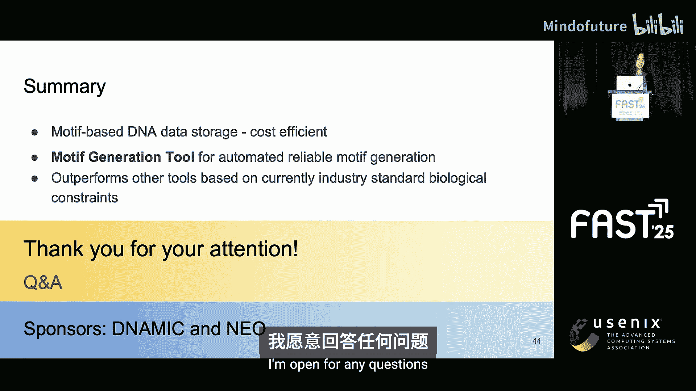

# 037：基于基序的DNA存储生成工具

在本节课中，我们将要学习一种创新的DNA数据存储方法——基于基序的存储，并了解一个能够自动生成符合生物约束条件的DNA基序序列的生成工具。这种方法旨在以更低的成本和更高的可靠性存储海量数据。

## 概述：为什么需要DNA数据存储？

近年来，对数字数据存储的需求呈指数级增长，存储介质也在不断演进以满足这一需求。然而，当前如存储卡和芯片等存储设备寿命有限，需要每隔几年更换。此外，全球数据中心每年的能耗已超过英国的总能耗。因此，迫切需要一种新的数据存储方法。

DNA已被证明是解决这些问题的潜在方案。它允许在微观体积内存储海量数据，密度高达每立方毫米10^18字节。此外，DNA的半衰期可达500年，在适当条件下，信息可保存长达2000年。尽管DNA数据存储是一项相对较新的技术，但当前DNA技术的进步已使得将整个英文维基百科存储在单个试管中成为可能。

## 如何将数据存储在DNA中？

DNA是一种由四种化学碱基（也称为碱基）序列组成的分子。这些碱基可表示为A、T、C和G。DNA数据存储的工作原理类似于DNA存储我们身体的遗传信息，它可以通过使用这四种碱基（A、T、C、G）构建序列来存储合成信息，就像计算机排列字节一样。

上一节我们介绍了数据编码的原理，本节中我们来看看将数据存入DNA的实际操作流程。

数据存储到DNA的过程主要分为以下步骤：
1.  **编码**：将数字信息（如二进制数据）转换为由A、T、C、G组成的DNA序列。
2.  **合成**：实际构建DNA链。
3.  **存储**：保存合成好的DNA。
4.  **测序**：读取DNA链中的信息。
5.  **解码**：将读取的DNA序列转换回原始信息。

然而，在这些步骤中存在一些限制。特别是在合成步骤，由于当前技术限制，我们无法稳定合成长度超过200个碱基的DNA链。但最重要的是，合成成本非常高，目前约为每TB 4亿美元。因此，存储新数据非常昂贵，商业上不可行。

## 解决方案：基于基序的DNA数据存储

为了解决成本问题，人们提出了一种称为“基于基序的DNA数据存储”的方法。

在这种方法中，合成成本不再与要存储的数据量成正比，而是固定的。其工作原理是：在基于基序的存储中，你拥有一组固定数量的短DNA序列，称为“基序”。这些基序只需要在开始时合成一次。

随后，这些基序可以以低成本的方式复制，并可以组装形成新的序列。组装它们的方法是使用一种称为“Gibson组装”的技术。

为了说明这一点，这里简化展示两个基序（基序1和基序2）的组装过程。它们会有一个重叠区域，这个重叠区域允许它们彼此结合。然后，所有缺失的碱基会被填补，最终形成一个由两个原始基序组成的新序列。这个重叠区域被称为“键”。

## 基序的结构与生物约束

这引出了基序的结构。我们刚刚看到需要“键”来组装基序，因此我们希望基序结构在链的两端都有键，中间则是“有效载荷”区域，用于存放实际信息。

由于键用于组装，这意味着它们不能出现在序列的其他任何地方。并且由于它们是唯一的，它们也可以用于实际访问数据。

我们刚刚看到了基序的理想结构，但并非每个基序都是“好”基序。有些基序集合可以比其他集合更可靠地存储数据。这是因为DNA容易出错。

以下是DNA存储中常见的三种错误类型及其相关的生物约束：
*   **同聚物**：指单个碱基的连续重复。我们尽量避免同聚物，因为它们会增加序列出错的概率。
*   **发夹结构**：在某些条件下，由于DNA链具有柔性，它可以自身折叠并与自身结合，这使得数据访问更加困难。因此我们也尽量避免发夹结构。
*   **GC含量**：指序列中G和C碱基的百分比。我们通常将其保持在20%到60%之间，以确保DNA链的稳定性。

## 基序生成工具的引入

那么，我们实际想要的是什么？我们试图以经济高效的方式存储数据（使用基于基序的DNA数据存储），但同时也要确保数据存储的可靠性，这意味着我们需要符合上述生物约束条件。

这正是我们引入工具的地方。这个工具使我们能够做到这一点，我们称之为“基序生成工具”。

这个工具将以下信息作为输入：
*   关于基序的信息，例如有效载荷长度和您希望拥有的基序数量。
*   关于同聚物、发夹结构和GC含量的约束条件。

允许用户输入这些约束条件非常重要，因为随着DNA技术的进步，这些约束条件会随时间变化。用户将能够重新使用该工具，更新约束条件，然后获得一组新的基序。同样，允许用户指定基序数量等信息也很重要，以便他们可以根据自己的用例定制基序。

我们的工具将输出一组符合这些约束条件的基序。换句话说，您可以用经济高效且可靠的方式存储数据。

## 工具的工作原理：马尔可夫链

但是，我们如何实际生成这样一组基序呢？我们想到，生成序列在某种程度上类似于生成文本，但这次我们只有四个字母：A、T、C、G。

在文本生成的背景下，马尔可夫链已被证明非常有效。因此，我们也在我们的上下文中使用马尔可夫链，逐个碱基地构建我们的基序。

在这个例子中，我们从一个碱基（例如碱基A）开始，然后我们想添加下一个碱基（A、T、C或G）。那么，如何从当前只有一个碱基的状态转移到下一个有两个碱基的状态呢？这需要使用概率。

这些概率被称为“转移概率”。这些概率直接与“将某个碱基添加到我们的序列中是否违反约束条件”相关。例如，如果添加碱基A到我们的序列中违反了约束条件，我们就会尽量避免添加该碱基，转移到该状态的概率将远低于转移到任何其他状态的概率。

这一部分稍微技术性一些。但你可以理解的是，底部的**转移概率公式**考虑了一个“分数”，而你在顶部看到的这个“分数”综合考虑了我们之前提到的所有约束：同聚物、发夹结构、GC含量，以及我们不希望在有效载荷中出现用于组装的“键”这一事实。

此外，我们使用**对数分数**而不是原始分数，这是因为用计算机处理相乘的小数可能很困难，所以我们改用对数分数。

为了让你更好地理解这些分数的样子，我将以同聚物的对数分数为例进行说明。

对于同聚物对数分数，我们已经有了当前的序列（此处用蓝色表示），现在我们试图为添加一个碱基（本例中为碱基A）给出一个对数分数。分数应该是多少？我们试图避免出现同聚物，因为同聚物越长，序列中出现错误的几率就越高。

因此，思路是：如果添加该碱基增加了你的同聚物长度，那么对数分数应该降低。这是我们希望在这条曲线中看到的形状：在X轴上，是同聚物长度，你可以看到当长度为0时，同聚物对数分数远高于长度为5时的情况。

我们找到的、具有我们想要形状的方程如下：
`同聚物对数分数 = - (当前同聚物长度 / 用户允许的最大同聚物长度)^超参数`
这个方程考虑了当前同聚物长度（在我们的例子中是长度5），以及用户给出的约束条件（即确保较少错误的最大允许同聚物长度），还有一个控制曲线形状的**超参数**。因为我们并不完全确定我们的对数分数应该是什么样子，所以这是一个可以根据每个用例优化输出的可调参数。

## 工具性能评估

现在我们有了工具，如何评估它是否是一个好工具呢？为此，我们决定将我们的工具与其他现有的序列生成工具进行比较。

以下是用于对比的工具：
1.  DNA Fountain (由Erlich等人提出)
2.  有限状态机编码 (由Cao等人提出)
3.  短聚体组合编码方案 (由Press等人提出)
4.  随机生成的DNA序列

前三种工具已有自己的方法来克服之前提到的生物约束，而随机生成的DNA序列只是随机生成，并未实际考虑这些约束。

对于实际评估，我们决定在两种不同场景下进行评估：首先针对每个约束单独评估，然后在一个结合了所有约束的案例研究中，比较每个工具实际返回一组基序所需的时间。

针对每个约束单独评估，我们得到了三个图表。左上角是GC含量，右边是同聚物，底部是发夹结构。我们在Y轴上比较了计算不同长度（X轴显示）的基序集所需的时间。

你可能会注意到，并非我之前提到的所有工具都出现在这些图表上。Cao等人和Press等人的工具没有出现在任何约束图表上，因为它们生成序列所需的时间远高于其他工具，长达数分钟，而这些工具只需毫秒级。

从这些图表中已经可以看出，以蓝色显示的**基序生成工具**在性能上超过了以黄色显示的DNA Fountain工具，以及Cao等人和Press等人的工具。在所有这三种不同的约束条件下，随着序列长度增加和问题复杂性增加，它在同聚物和发夹结构约束方面也优于随机生成的序列。

你可能会注意到，对于GC含量，随机生成序列的时间是恒定且接近零的，这是因为随机生成序列的预期GC含量已经是50%，这已经在我们约束条件范围内了。

## 案例研究：综合约束下的表现

既然我们看到了这些工具在每个单独约束下的表现，我们可以继续看看当我们将所有这些约束结合起来时它们的表现如何，这实际上更有趣，因为当前从事DNA数据存储的公司都有针对所有这些约束的规范，以确保DNA链的稳定和可靠。

这正是我们在案例研究中所做的。在案例研究中，我们参考了当前DNA合成公司（如IDT）对同聚物、发夹结构和GC含量使用的约束条件。例如，他们不允许长度大于5的同聚物，GC含量需要在25%到65%之间。

针对这些真实世界的数值，我们得到了评估结果：**基序生成工具**能够在不到三秒的时间内返回一组符合所有这些约束条件的基序序列。而对于所有其他工具，在五分钟的评估阈值内，我们无法获得任何符合这些约束条件的基序集。

因此，在这个真实案例研究中，我们再次看到基序生成工具优于所有其他工具。

## 总结

本节课中我们一起学习了基于基序的DNA数据存储及其生成工具。

我们决定专注于基于基序的DNA数据存储，因为它允许以经济高效的方式存储数据。我们创建了一个基序生成工具，它实现了基序生成的自动化，并确保您可以以可靠的方式存储数据。

我们的工具基于当前适用的生物约束条件，性能优于其他工具。

借助这个工具，我们希望为未来DNA数据存储更易于访问和负担得起做出贡献。