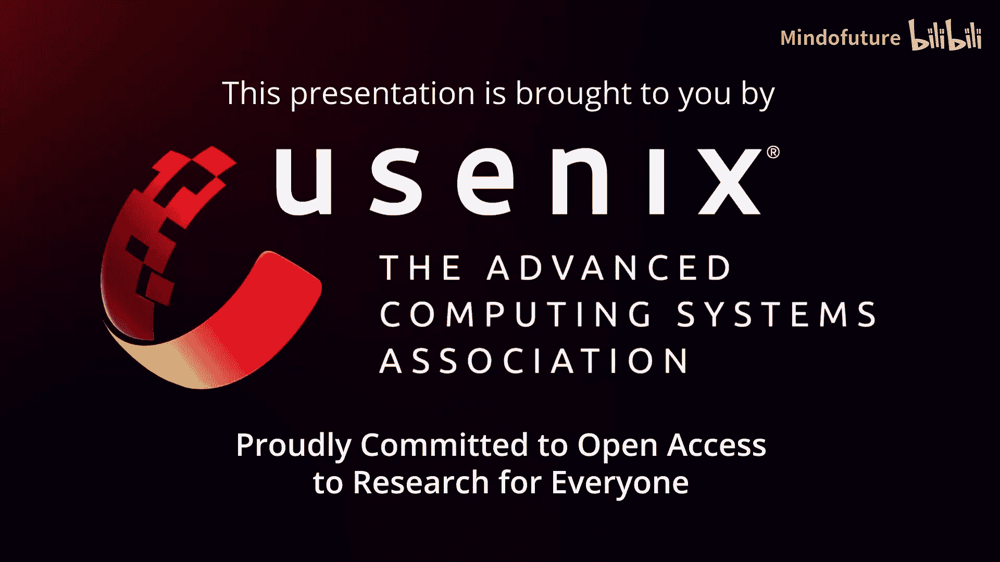
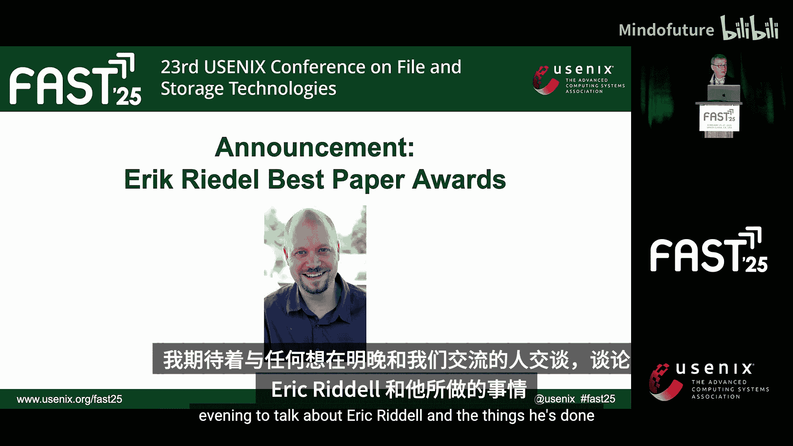
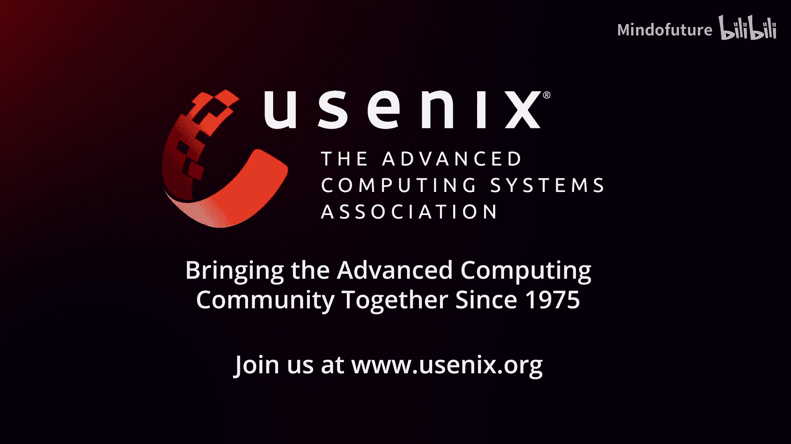

# 038：纪念Erik Riedel与计算存储演进 🕯️💾

## 概述
在本节中，我们将回顾FAST 25存储大会上对已故社区重要成员Erik Riedel的纪念致辞。内容将涵盖他的学术贡献、行业服务，以及其早期关于计算存储的开创性工作如何持续影响当今技术发展。我们还将了解以其名字命名的最佳论文奖。

---

我是Garth Gibson，在此悼念我们社区失去的一位重要成员。
Erik Riedel于今年大约七个月前离开了我们。

明天晚上6:30，欢迎所有希望花些时间追忆、分享故事并与他的家人共处的人们，前往Ellameda六号房间。
您既可以看到这张15年前的家庭合影，也可以看看如今他们在台下的样子。这将是一个让在不同环境中认识Erik的人们相聚的活动。

对于不了解Erik的人，我想指出他的服务记录，并鼓励大家效仿：他在学术界服务30年，在工业界服务25年，曾担任项目委员会联合主席并参与众多活动，例如2008年的本次活动。他在SNIA（存储网络工业协会）的技术委员会和各种标准委员会任职15年，其中一些工作最终形成了标准。他在所有这些事务中都付出了大量努力。

对我而言，记忆要回溯到他还是研究生的时候。我曾与他合作完成他的博士论文。
其标题“Active Disks”（主动磁盘）今天听起来可能无关紧要，但其核心趋势您一定会认同：电子技术持续以更低的成本提供更多的晶体管和计算性能，因此可以用处理器和运行其上的程序来替代硬件逻辑。那么，如何在设备内部实现这一点？又可以用它来做什么？

大约30年前，他研究了这个问题，并且采用了一种我非常欣赏的方法：他选择了一个重要的应用——数据库，一个重要的真实生产级开源数据库**Postgres**，然后找到了足够的信息来决定将哪些任务卸载到设备中执行，并评估了能获得何种收益。

由于当时的成本限制和有限的计算能力，无法在其上消耗大量计算周期，不能占用大量状态存储空间，并且必须在计算后大幅减少所需带宽。如今情况已大为改善。

所以，今天在闪存设备上，可以放置一个**FPGA**，同时查看多个闪存存储体并进行大量数据缩减。这个由少数人在网络和其他大学领域也进行过探索的想法，确立了一种我们至今仍在追寻的架构模型。

例如，三星的设备正在这样做，并且有开源接口和**NVMe CSD**（计算存储设备）标准。

近年来，Erik一直在关注碳足迹问题。他在绿色存储工作组任职了相当长的时间，我认为他协助创办了该小组。我看了他在存储开发者大会上的演讲（您可以在YouTube或SNIA网站上找到），他谈到了当专注于改善特性时，可以采取的一系列工程化思考方式。

据我理解，他讨论的关键一点是降低IT设备的碳足迹影响。尤其是在当今使用GPU的背景下，这方面的压力很大。但其核心思想是：我们所使用的设备，其大部分碳足迹是在设备制造过程中产生的，远早于您的使用阶段。

如果您是设备所有者并希望对其进行操作，那么在购买之后能做的改进有限。对于前置成本该怎么办？是的，您可以协助改善采矿或冶炼过程。但您也可以说，这些设备的使用寿命通常比我们实际使用的时间长得多。

该系统的大多数组件至少能使用10年，并且其中许多组件的合同保证可更换期长达10年。因此，他们开始研究回收利用设备，并将其与可用的替换部件结合，以提供成本更低的完整系统（因为他们重复使用了仍可工作的设备），从而分摊原始制造过程中的环境代价。这是非常出色的工作，鼓励您去观看那个视频，内容也很有趣。

在Erik去世后，FAST指导委员会意识到社区的巨大损失，决定将最佳论文奖更名为**Erik Riedel最佳论文奖**，我们即将颁发此奖。我认为这非常棒。

我期待明天晚上与任何想来和我们聊聊Erik Riedel及其成就的人们交谈。
谢谢。

---

## 总结
本节课中，我们一起学习了Erik Riedel对存储社区的贡献。从他的博士论文“Active Disks”开始，我们看到了**计算存储**这一核心概念的早期探索：即利用设备内部不断增强的计算能力来优化特定应用（如数据库查询）。其核心思想是通过**FPGA**等处理器在存储设备端进行数据预处理和缩减，以减少带宽需求。这项开创性工作为今天的**NVMe CSD**等标准奠定了基础。此外，我们还了解了他晚年对IT设备全生命周期**碳足迹**的关注，以及社区通过命名最佳论文奖来纪念他的方式。他的工作体现了将前沿学术研究与实际工程问题相结合的持久影响力。