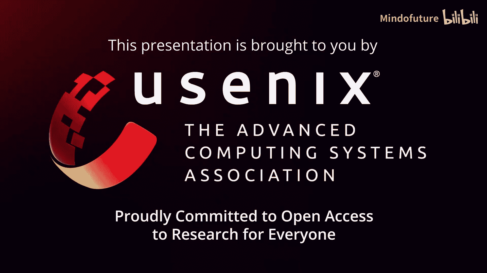
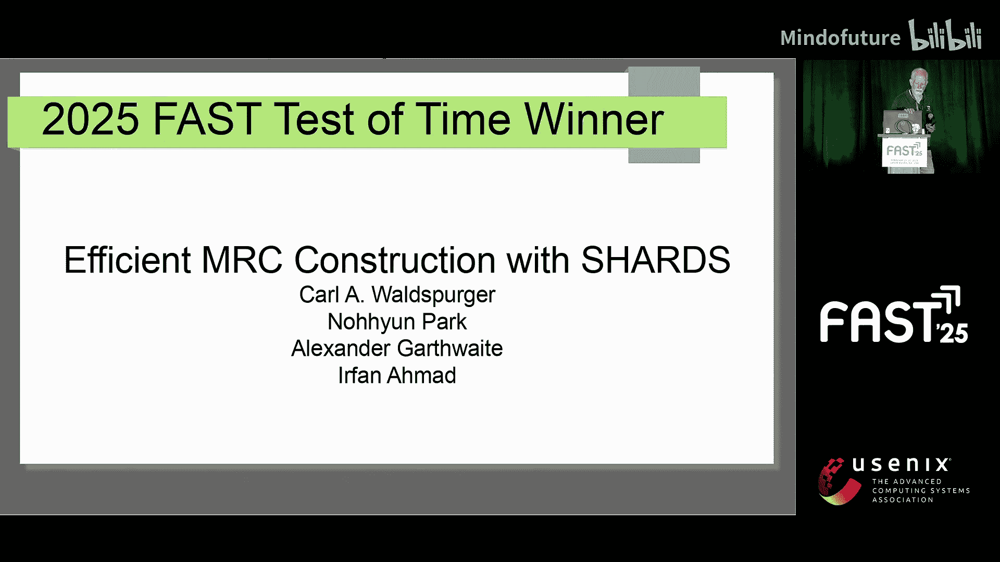
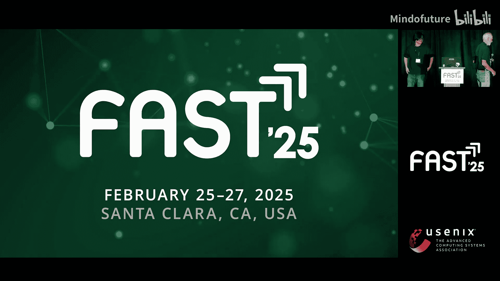
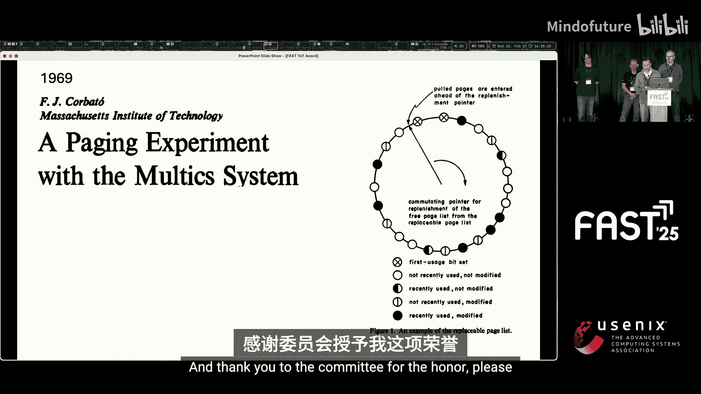
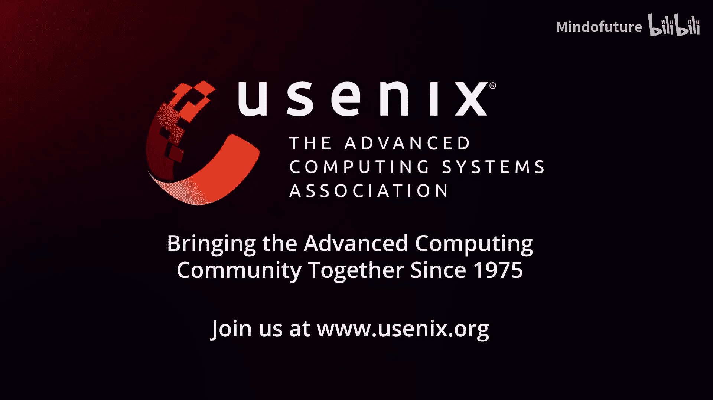
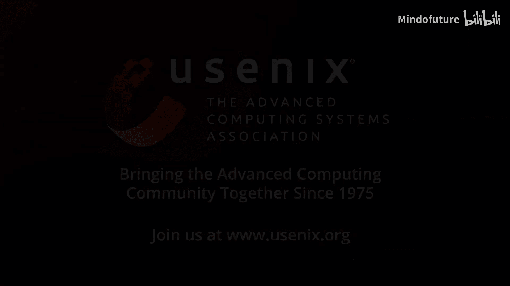

# 039：Test of Time Award 获奖演讲与缓存算法演进 🏆

在本节课中，我们将学习FAST 2025存储大会上颁发的“Test of Time Award”（经得起时间考验奖）的详情，并深入了解获奖论文背后的核心思想——一种高效构建缓存未命中率曲线（MRC）的算法。我们将从奖项背景开始，逐步解析获奖研究的技术突破、历史渊源及其深远影响。

---

## 奖项介绍与评选过程 🏅

“Test of Time Award”设立至今已有13年。该奖项旨在表彰那些对存储社区产生重大影响的论文。

参评论文必须至少发表10年。其理念在于，获奖成果不应仅是发表时引人注目或获得最佳论文奖的工作，而应是真正产生了深远影响的研究。因此，需要给予足够的时间来验证其影响力。

评选工作由FAST指导委员会和往届程序委员会主席负责，具体流程由Raju和我管理。

以下是历届获奖者名单，我们在此不逐一回顾。你可以回顾这些论文，或许会想起其中一些真正出色的研究。

今年的评选过程如下：我们共有四篇提名论文，17位评审提交了总计63份评审意见。随后，Raji和我审阅了这些意见，并于一月份开会做出了最终选择。我们选出的论文，相信大家会一致认为是真正杰出的工作。

评审委员会对这篇论文给出了一些评价。一位评审提到：“我见过一些商业系统，包括存储系统和数据库系统，都从这项工作中汲取灵感，为客户和现场服务工程师提供了关于为其缓存分配更多或更少内存的预期效果的洞察。”

另一位评审说：“这篇论文真正革新了在线环境中的MRC使用。据我所知，它在已知的MRC曲线算法中性能最佳，或者至少是难以被超越的，并且非常精确。”

还有评审表示：“这篇论文使MRC变得实用并推广了其使用。事实上，我们公司经常使用所提出的算法或其变体，研究缓存策略的人员将这篇论文视为一个里程碑。”

基于这些评价，有些人可能已经猜到了获奖论文。

获奖论文是：**《Efficient MRC Construction with SHARDS》**，作者是Carl Waldspurger、Noham Park、Alexander Garthwaite和Irfan Ahmad。我们很幸运，他们今天都在现场领奖。现在，我将把讲台交给他们。

恭喜你们所有人。

---

## 获奖感言与研究起源 🎤

感谢Jeff，也感谢奖项委员会，我们很荣幸获得这个奖项。

我想花点时间回顾一下这项工作的起源和背景。当时，我们四人都在一家名为Cloud Physics的初创公司工作，该公司专注于虚拟化系统中的资源管理。

这项研究源于一个真实的客户挑战，一个现实世界的问题：**为闪存缓存确定合适的大小**。当时，闪存缓存与传统存储一起变得越来越流行。这提醒我们，尽管初创公司节奏紧迫，但优秀的研究仍然可以诞生，而且需求往往是激发最佳创意的动力。

我们首先从客户站点收集IO轨迹并测试缓存大小启发式方法，但结果不如预期。

我们意识到的一个更有原则的方法是生成**未命中率曲线**。这个概念可以追溯到1970年的Mattson。然而，即使是最好的现有方法也过于耗费资源，尤其是对于大型轨迹。

由于在之前的项目中使用过采样方法和技术，我们探索了采样是否能使MRC构建更高效。但这具有挑战性，因为在一个大型稀疏地址空间中进行采样，同时跟踪重用情况，是前所未有的事情。

**关键洞察在于，使用确定性空间哈希可以驱动随机采样，这构成了SHARDS算法的基础。**

我们的一些同事最初相当怀疑，但早期实验超出了预期。有一段时间，结果好得令人难以置信，我甚至担心可能有一个错误人为地夸大了我们的准确性。

但一切顺利。随后，我们继续开发了SHARDS的**恒定空间变体**，该变体能够用不到1MB的内存为任意长度的轨迹构建精确的MRC，这使得即使在资源最受限的系统中也变得可行。

在我们向FAST提交初稿和最终定稿之间，我们增加了将空间哈希应用于非堆栈替换算法（如ARC或LRS）的初步结果，为我们后续的微型模拟研究铺平了道路。

多年来，看到人们在这些想法基础上进行构建，真的非常令人兴奋。我们对此认可深表感激，谢谢。

---

## 缓存管理的历史脉络 📜

我是Irfan Ahmad。感谢Carl，他是这篇论文的领导者、第一作者，也是许多后续工作的主要贡献者。

正如Carl所说，回顾内存资源管理领域的工作，追溯到计算技术的黎明时期，那是一段非常有趣的时光。

Carl向大家介绍了导致这项特定研究的背景，而我想从更早的时候开始分享。让我们回到起点，分享一些我们学到的东西，其中许多你们可能知道，但有些人可能不了解。

当我们回顾并试图理解内存资源管理、置换算法（通常我们只称之为“缓存”）时，我们追溯并寻找它的起源。

这张图片是Atlas系统的控制台。描述其虚拟内存的论文发表于1962年，这意味着这项工作可能大约在1961年完成。据我所知，该系统在这篇论文于1962年4月发表时就已经在交付使用了。

实际上，这是一篇非常出色的论文。当我阅读它时，感觉就像在读一篇两天前发表的论文。它写得非常好，我们只需要将“磁鼓”替换为“SSD”，将“磁芯”替换为“DRAM”，它就能讲得通，甚至可能今天还能发表在FAST上。

这台机器使用了位，并试图以此来管理内存。但这是我所知的第一个虚拟内存系统。我们早些时候讨论过，我们都不记得有比这更早的了。

有趣的是，为什么这具有相关性？因为这台机器尽管具有创新性，但在生产部署中却遇到了灾难性的**系统颠簸**。系统运行良好，但突然会发生颠簸，整个系统就会卡住，控制台会变得无响应，你无法提交新任务。情况非常糟糕。

不仅如此，这在20世纪60年代实际上是一个相当普遍的问题。问题如此严重，以至于IBM在认为自己解决这个问题之前，不愿意交付基于虚拟内存的系统。当时市场上已经有多款其他系统了。

因此，在20世纪60年代中期，IBM启动了一个大型项目，研究其虚拟内存系统的置换算法。这是因为现场的程序员提出了需求，他们除了虚拟内存外不想用任何其他方式编程——既然有了虚拟内存，一切都变得简单得多，因为你可以获得零基址和连续的内存分配范围。

因此，出于无奈或必要性，他们启动了这个项目，这实际上引发了一系列事件，最终促成了我们的工作。

1966年，作为该项目的一部分，Belady在尝试研究LRU时发表了一篇论文，这篇论文被引用了极高的次数，因为我们几乎所有人在某个时间点都在处理内存管理或缓存替换策略，并且不得不与那个令人敬畏的**MIN**算法进行比较。

这个离线最优算法可以追溯到1966年。现在你可以看到，从1962年到1966年，我们已经经历了这个理解周期：嘿，你必须做更好的内存管理，你必须从根本和形式上研究这个问题。

这篇半经典的论文发表了。有趣的是，这同样可能像是今年FAST的论文：“希望通过基于先前引用来预测未来引用，以改进替换决策”。我们确实是站在巨人的肩膀上。

一些有趣的事情：左侧是Belady论文中的图表，X轴是缓存大小，Y轴是访问频率。这真的很有趣，类似的图表在今天发表的论文中仍然出现。这是我发现的第一个实际绘制了未命中率曲线的图表。可能之前就存在，我只是不知道。

他们构建这个曲线的方法是通过运行多个实验并在它们之间画线。这样你就可以看出工作负载在缓存效率方面的形状。这是非常重要的事情。

从1966年到1970年，人们已经厌倦了运行大量实验来绘制这些曲线。

因此，在1970年，IBM的Dick Mattson再次发表了他的开创性工作：一个**单遍算法**，可以为特定类型（即堆栈距离算法）的算法绘制整个曲线。正如Carl提到的，这在当时是革命性的，因为现在你只需要运行一遍就能得到完整的曲线，只要算法是堆栈距离型的（当时许多算法都是，只是最近其他算法才变得越来越流行）。

现在到了1971年。这篇论文发表了，但在工业环境中的采用率很低，因为对于长轨迹来说，运行起来非常困难，因为它是一个昂贵的算法。在随后的几十年里，数据结构得到了改进，但算法的复杂性没有改变。

这就是Carl、Alex、Noham和我在2011年、2012年所处的位置，我们试图解决这个问题，从那里开始，并意识到这个算法对于你想做的事情来说太昂贵了，这导致了Carl之前提到的近似算法。

---

## 研究轶事与算法精进 💡

一些有趣的故事：当我们写这篇论文时，你应该引用你想引用的东西的最早实例。在这个案例中，这是一个时钟算法。我们几个人讨论说：“嘿，你上次读原始的时钟算法论文是什么时候？”我没有读过，我想去找找看。

我们在Google和你能想到的每个搜索引擎上搜索，试图找到这篇论文的PDF。我们找不到。这怎么可能？在2014年（也许是2015年），互联网上怎么会没有这篇论文？

于是我们联系了一些朋友，去麻省理工学院图书馆的书架上找，看看能否找到Corbató（Fernando Corbato，图灵奖得主，领导了Multics项目，Unix由此而来，进而衍生出我们今天使用的所有东西，包括这台笔记本电脑上的操作系统）的论文。

Sam（我猜是他）去了，在麻省理工学院图书馆也找不到这篇论文，随后一阵恐慌。这篇被引用了成千上万次的论文怎么会不在互联网上，也不在图书馆里？那我们一直在引用什么？有人读过这篇论文吗？它在哪里？

幸运的是，麻省理工学院的Simon教授联系上了Corbató，他当时已经退休很久，80多岁了，正在度假。Corbató在度假时回复说：“嘿，我很惊讶没有副本，我想我阁楼的一个盒子里有一份。”

恐慌继续，我们希望他有一份，因为其他人都没有。总之，他度假回来，找到了论文。我们得到了PDF。现在，它终于可以在multicians.org上找到了，你可以直接搜索到它。

这只是有趣的故事，我们都经历过一些有趣的冒险和趣事，我们想分享其中的几个。

---

## 算法核心：调整采样与误差分布 🔧

我也想感谢委员会和合著者。这是一个有趣的项目，我仍然记得很清楚，尽管那是大约10年前的事了。

我第一次想到这个想法是在我面试Cloud Physics时，我还没有入职。在一次乘车途中（我不确定是不是出租车），Carl提到了这个想法。我当时想：“这行不通。”因为过程是非平稳的，如果你采样，你不会得到平均行为。我实际上这么说了。

那是我第一次见到Irfan。然后Carl说：“哦，好吧，但我还是想试试。”我回到学校。几周后，Carl给我发来了数据：“嘿，这是初步数据。我们做了这些轨迹。”

我花了整整一天试图证明它为什么行不通。在几个月里，我相当怀疑。直到我深入其中后，我感到困惑，并试图弄清楚它为什么实际上有效。这对我来说是一段有趣的旅程。

我也想感谢大家。这是一次非常美妙的经历。我想接着Carl提到的一点来说，那就是算法的惊人准确性。

特别值得一提的是，我们提出了**调整后的SHARDS算法**的概念。基本观察是，你希望从样本和模拟中得到的是对完整事件集的保真度，就像你根本没有采样一样。

这里的关键观察是：我们如何获取关于整个轨迹运行的、易于测量的某些信息，并将其与我们的特定样本的表现进行比较，然后调整样本以更接近原始情况。

对于MRC来说，基本观察是，你在MRC中测量的基本上是**事件**。尽管我们将其打印为比率，但实际上你得到的是每个距离上的计数。观察发现，距离越远（在某种意义上距离越长），这类事件的数量就越少，因为它们依赖于中间发生了许多其他事件。

一个有趣的性质是，在采样的情况下，因为距离越大，导致该距离发生的事件就越多，所以你的采样捕捉到该信号的可能性就越大，你会在那里得到一些结果。另一方面，如果你过度采样那些具有最大距离的事件，这很难做到，因为这类事件并不多，因为它们依赖于中间发生了太多其他事情。

观察结果是，如果存在误差，误差实际上会出现在**小距离**处。并非全部都在最小距离处，但大部分会集中在那里。这些是你可能少计或多计的地方。当你这样做时，会产生相当显著的影响。

因此，调整后的SHARDS算法本质上是：计算完整运行发生的**事件总数**，将其与我们样本中实际得到的事件数量进行比较。你期望的是，如果样本大小是整个集合的某个百分比，你测量到的事件数量也应该有类似的比例关系。如果不是，那么这实际上是对你误差程度的一个很好的估计。

因此，调整后的SHARDS算法基本上利用了这个差值来进行调整，主要调整最短距离，因为那是大部分误差所在。这实际上对提高准确性产生了深远的影响。

我喜欢这个故事的地方在于，它试图在样本显示的内容与你易于测量的整体真实情况之间建立联系，然后结合识别误差分布中的某些偏差，使你的模拟实际上变得更好。我真心认为这是一个更通用的技术，我一直在思考如何将其用于其他地方。

---

## 研究后续与未来展望 🚀

我想给大家快速更新一下研究进展。记得和我的合著者们坐下来讨论时，我们对这篇论文感到非常兴奋，那种兴奋感是巨大的，因为你感觉你真的发现了一些有趣的东西。

我们当时想，好吧，其他研究人员会跟进这项工作吗？这实际上是一个有趣的问题。其他人会尝试改进它或以我们未曾想到的方式应用它吗？我非常高兴在论文发表后很长一段时间里，我们之间不断来回发送基于这项工作并改进它或修复某些特定边界情况的论文。

我们中的许多人也在该领域发表了额外的著作，正如Carl所提到的。

我们现在已经有了一个证明，证明采样算法有效，并且有其准确性的界限，这真的令人兴奋。

此外，作为这项工作一部分形成的想法和模式，现在已经衍生出一家新公司，名为**Magnian**。它是一家商业公司，帮助设计存储设备、云块存储或内容分发网络的公司使用这些技术来优化其内存层次结构。

最后，我相信我们可以代表这里的每个人说，这项工作**尚未完成**。如果你来和我们交谈，我们会告诉你其他一些尚未探索的有趣领域。所以，如果你是对高影响力工作感兴趣的学生，在缓存和内存层次结构的预测性能建模领域存在着巨大的机会，并且在减少全球闲置内存所浪费的总能耗（千兆瓦级别）方面，有着实际的世界性影响机会。真正高影响力的工作等待着大家。

---

## 总结 📝

在本节课中，我们一起学习了FAST 2025“Test of Time Award”的获奖研究。我们回顾了该奖项的意义与评选标准，深入探讨了获奖论文《Efficient MRC Construction with SHARDS》的核心贡献：一种利用**确定性空间哈希驱动随机采样**，从而高效、精确构建缓存未命中率曲线（MRC）的算法。我们追溯了缓存管理算法从20世纪60年代虚拟内存系统到现代研究的历史脉络，理解了像**MIN（Belady算法）** 和 **Mattson算法** 这样的奠基性工作。最后，我们看到了这项研究如何从解决实际工业问题出发，通过创新的**调整采样**技术精进算法，并最终衍生出新的商业应用和未来的研究方向。这项工作是连接理论算法与工业实践、并持续产生影响的典范。