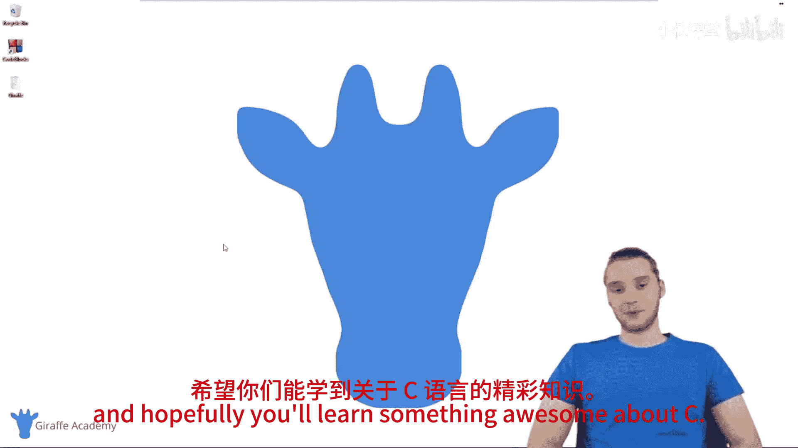
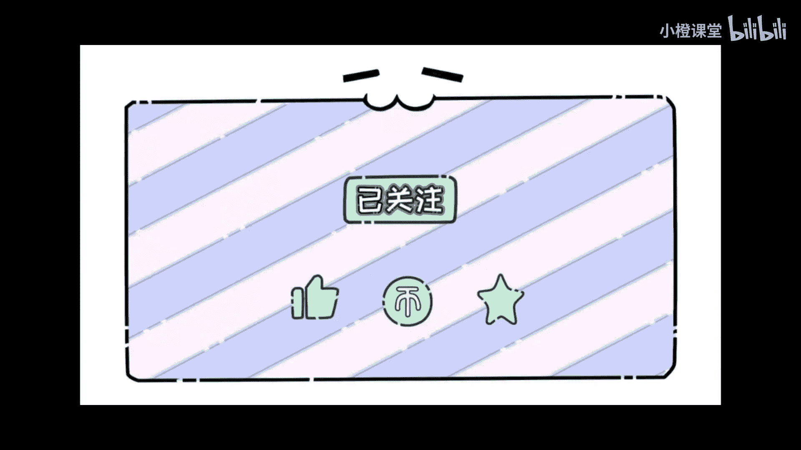

# 001：C语言入门介绍 🚀

在本课程中，我们将学习C语言编程所需的一切基础知识。C语言是一门非常出色的编程语言，也是现存最古老的编程语言之一。实际上，许多现代编程语言都基于C语言。因此，无论你是想学习C语言，还是想为学习C++等语言打下基础，掌握C语言的基础都是一个非常好的选择。

## 课程内容概述 📚

在本课程中，我们将涵盖所有你需要了解的核心内容。首先，我会介绍如何安装文本编辑器以及如何使用C语言编译器。接着，我们将编写一些基础代码。

上一节我们介绍了课程的整体目标，本节中我们来看看我们将要学习的具体主题。

以下是本课程将涵盖的主要知识点列表：
*   安装文本编辑器与使用C编译器。
*   程序是什么以及程序如何工作。
*   C语言如何读取你给出的指令。
*   更深入的知识，例如条件语句和循环。
*   创建不同的变量。
*   C语言中可用的不同数据类型。
*   更高级的主题，例如结构体和函数。
*   指针的概念。

基本上，我将为你提供一个所有核心概念的完整概述。因此，在本课程结束时，你将拥有一个非常扎实的理解和坚实的基础，可以在此基础上继续深入学习和构建。

我非常高兴能为你们带来这门C语言基础课程，也非常期待你们能深入其中并开始使用这些教程。欢迎随意点击观看所有视频，希望你能学到关于C语言的一些很棒的知识。