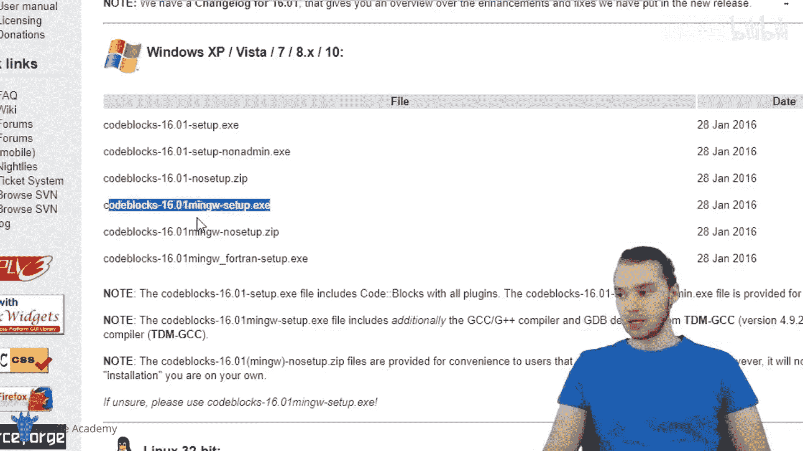
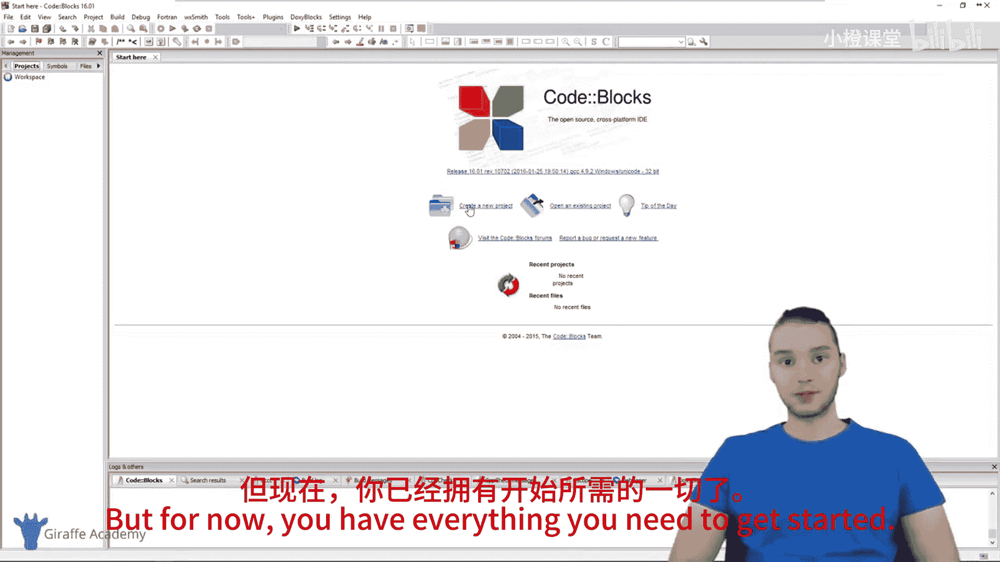

# 002：Windows环境安装指南 🖥️

在本节课中，我们将学习如何在Windows系统上安装C语言编程所需的环境。我们将安装一个集成开发环境（IDE）和一个C编译器，以便开始编写和运行C程序。

## 概述

为了编写C程序，我们需要两个核心工具：一个用于编写代码的文本编辑器或集成开发环境（IDE），以及一个将C代码转换为计算机可执行指令的编译器。本节教程将指导您完成这两个工具的安装过程。

## 安装集成开发环境（IDE）

首先，我们需要一个编写C程序的环境。虽然任何文本编辑器都可以，但使用专门的集成开发环境（IDE）会更加方便。IDE是集成了代码编辑、调试和编译等功能的特殊文本编辑器。我们将安装一个名为Code::Blocks的IDE。

以下是安装Code::Blocks的步骤：

1.  打开您的网页浏览器，访问Google搜索。
2.  在搜索栏中输入“code blocks”，并找到官方网站 `codeblocks.org`。
3.  进入网站后，点击导航栏中的“Downloads”（下载）选项。
4.  在下载页面，选择“Download the binary release”（下载二进制发行版）。这是最简单的安装方式。
5.  根据您的操作系统（Windows、Linux或Mac）选择相应的版本。本教程以Windows为例。
6.  在Windows选项下，找到并点击名为“codeblocks-[版本号]-mingw-setup.exe”的链接进行下载。这个安装包同时包含了Code::Blocks IDE和MinGW GCC编译器。

## 安装C编译器

C语言是一种编程语言，我们编写的代码（指令）需要被“编译”成计算机能够理解的机器语言。编译器就是完成这个转换工作的程序。幸运的是，我们刚才下载的Code::Blocks安装包已经包含了所需的GCC编译器。

以下是完成安装的步骤：

1.  下载完成后，打开您的“下载”文件夹。
2.  双击运行下载好的 `codeblocks-[版本号]-mingw-setup.exe` 安装程序。
3.  按照安装向导的提示进行操作。建议接受许可协议，并保持所有安装选项为默认设置。
4.  安装完成后，程序会询问是否运行Code::Blocks，选择运行。
5.  首次启动时，会弹出“Compiler auto-detection”（编译器自动检测）窗口。选中列表中高亮的“GNU GCC Compiler”选项。
6.  点击“Set as default”（设为默认），然后点击“OK”（确定）。

至此，Code::Blocks及其内置的C编译器已成功安装。您已经拥有了开始C语言编程所需的一切工具。

## 总结

本节课我们一起完成了C语言编程环境的搭建。我们首先了解了编写C程序需要IDE和编译器这两个核心工具。接着，我们逐步操作，下载并安装了集成了MinGW GCC编译器的Code::Blocks IDE。在接下来的课程中，我们将学习如何使用这个环境创建并运行您的第一个C程序。