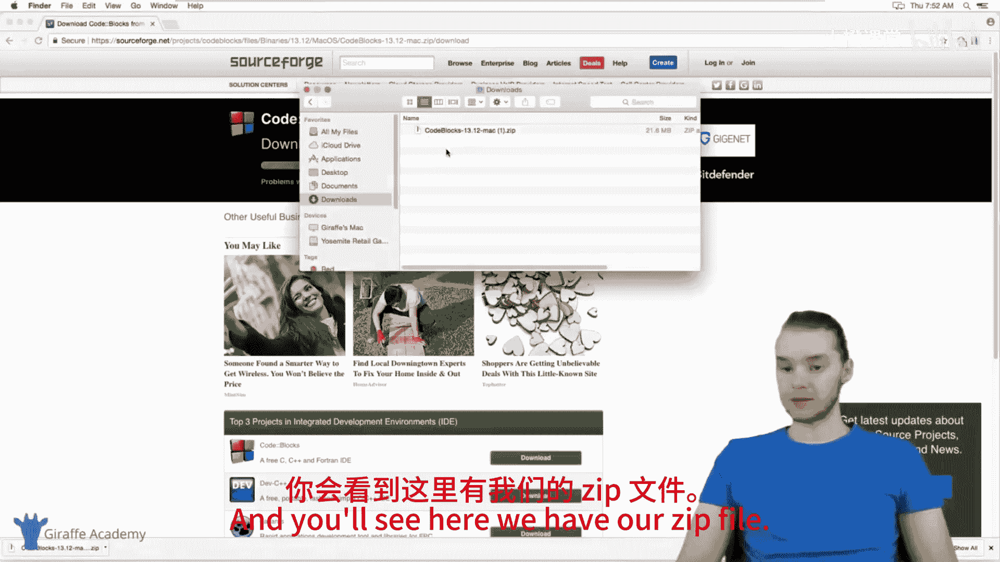
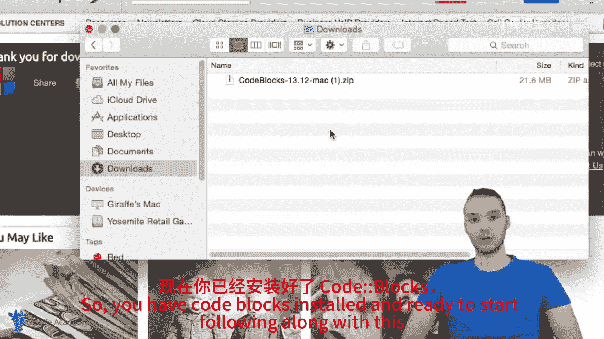

# 003：Mac系统环境配置 🍎

在本节课程中，我们将学习如何在Mac系统上配置C语言编程环境。主要内容包括安装C编译器与集成开发环境（IDE），为后续编写和运行C程序做好准备。

## 概述

要在Mac上开始C语言编程，我们需要准备两个核心工具：一个用于编写代码的文本编辑器（特别是集成开发环境IDE），以及一个将C代码转换为计算机可执行指令的C编译器。本节将逐步指导你完成这两项工具的安装与配置。

## 安装C编译器

首先，我们需要安装C编译器。编译器的作用是将我们编写的、人类可读的C语言代码，翻译成计算机能够理解和执行的机器语言。

在Mac上，我们可以通过终端（Terminal）来检查和安装编译器。终端是一个允许我们使用文本命令与计算机交互的程序。

以下是检查与安装C编译器的步骤：

1.  打开终端。你可以通过屏幕右上角的搜索栏，输入“terminal”并回车来打开它。
2.  在终端窗口中，输入命令 `cc -v` 并回车，以检查是否已安装C编译器。
3.  如果终端返回了编译器的版本信息（例如包含“clang”字样），说明编译器已安装，你可以跳过安装步骤。
4.  如果未安装，请输入命令 `xcode-select --install` 并回车。此命令将安装Xcode的命令行工具，其中包含了C编译器。
5.  安装完成后，再次输入 `cc -v` 命令进行验证，此时应能成功看到版本信息。

现在，我们已经成功安装了C编译器。

## 安装集成开发环境（IDE）

上一节我们介绍了C编译器，本节中我们来看看如何安装一个便于编写和管理C程序的集成开发环境（IDE）。我们将使用一款名为Code::Blocks的免费且流行的IDE。

以下是下载与安装Code::Blocks的步骤：

1.  打开网页浏览器，访问Code::Blocks官方网站：`codeblocks.org`。
2.  点击页面上的“Downloads”链接。
3.  在下载页面中，找到“Binary release”部分，点击“Download the binary release”。
4.  在操作系统选择区域，点击“Mac OS X”选项。
5.  页面会显示适用于Mac的安装文件信息。在右侧找到指向Sourceforge的下载链接，点击它。下载将自动开始。
6.  下载完成后，前往“下载”文件夹，找到下载的ZIP压缩文件（通常名为`CodeBlocks-*.zip`）。
7.  双击该ZIP文件进行解压。
8.  解压后，你会看到一个名为“CodeBlocks”的应用程序图标。将其拖拽到“应用程序”（Applications）文件夹中，即完成安装。

至此，Code::Blocks IDE已安装完毕，你可以随时打开它，开始跟随本课程编写精彩的C程序了。

## 总结

本节课中我们一起学习了在Mac系统上配置C语言开发环境。我们首先通过终端安装或验证了C编译器，然后下载并安装了Code::Blocks集成开发环境。现在，你的Mac已经具备了编写、编译和运行C程序所需的所有基础工具。在接下来的课程中，我们将开始使用这些工具来探索C语言编程。