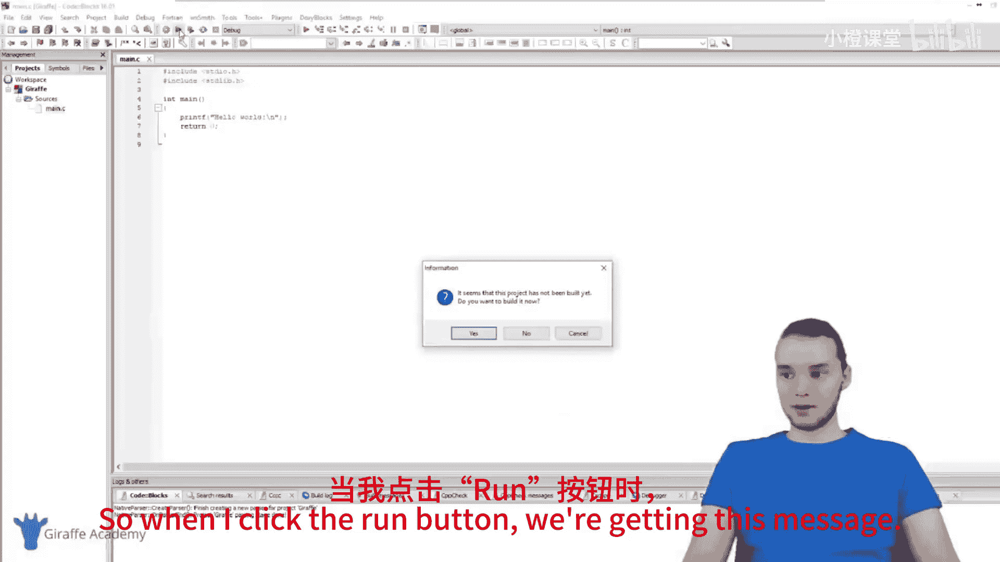
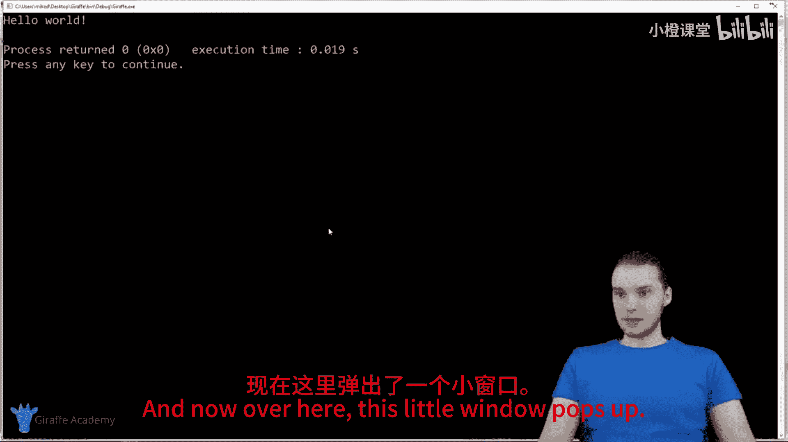
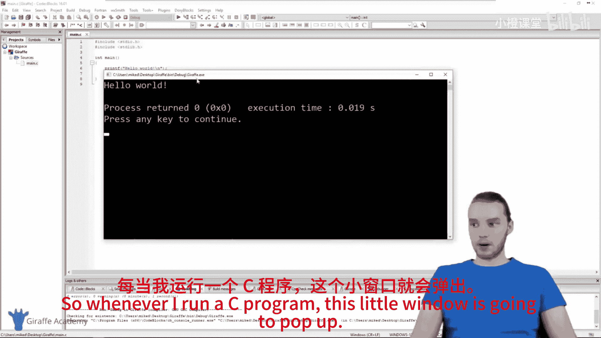
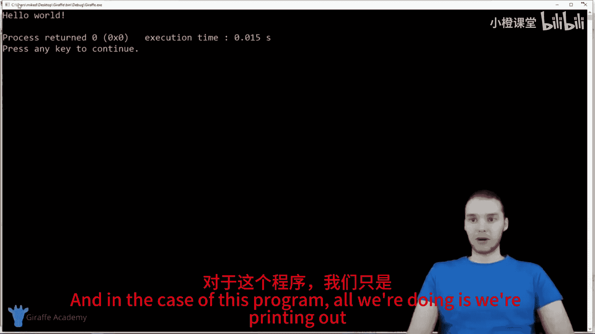
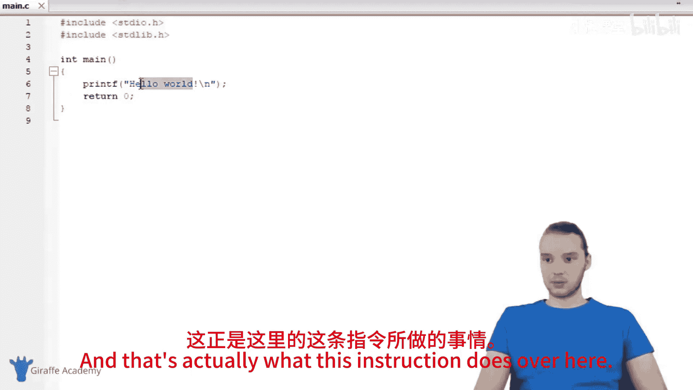
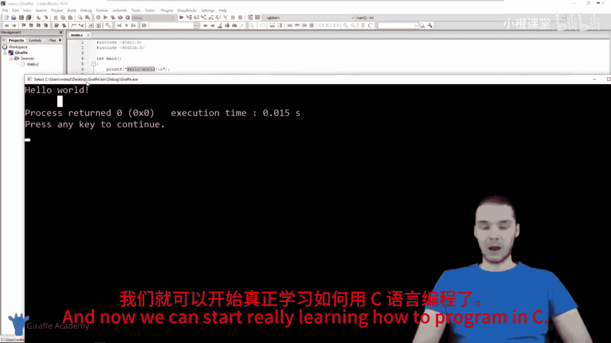

# 004：Hello World 👋

在本节课中，我们将学习如何设置第一个C语言项目，并运行一个简单的“Hello World”程序。通过这个过程，你将熟悉集成开发环境（IDE）的基本操作，并验证你的开发环境是否配置正确。

## 创建新项目

上一节我们介绍了C语言的基本概念，本节中我们来看看如何在Code::Blocks中创建第一个项目。

首先，打开Code::Blocks程序。这是本课程将一直使用的集成开发环境。双击图标启动程序。

程序打开后，你会看到主界面上有多个选项，例如“创建新项目”或“打开现有项目”。当我们开始编写C语言文件时，需要创建一个新项目。

以下是创建新项目的步骤：
1.  你可以点击主界面上的“Create a new project”按钮，或者点击顶部菜单栏的 **File** -> **New** -> **Project**。
2.  随后会弹出一个新窗口，其中列出了多种项目类型。我们需要选择 **Console application**（控制台应用程序）。这是一个可以在你电脑上运行的基础C语言项目，完全符合我们的需求。
3.  点击 **Go** 继续，并按照向导的提示进行操作。
4.  在向导中，你会看到选择编程语言的选项（C或C++）。本课程使用C语言，因此请选中 **C**，然后点击 **Next**。
5.  接下来，为项目命名（例如“draft”），并选择一个文件夹来存放项目文件。你可以将其放在桌面上以便查找。
6.  点击 **Finish** 完成创建。其他设置可以保持默认。

## 探索项目文件

现在，我们已经在Code::Blocks中创建了第一个C语言项目。

在左侧的“Management”面板中，你可以看到以项目名（如“draft”）命名的项目。展开项目，你会找到一个名为 **Sources** 的文件夹。

以下是项目文件的结构：
*   点开 **Sources** 文件夹，你会看到一个名为 `main.c` 的文件。这个文件是Code::Blocks在创建项目时自动为我们生成的。
*   右键点击 `main.c` 文件并选择“Open”，即可在编辑器中查看其内容。

打开后，你会看到一些默认的代码。代码顶部有 `#include` 指令，下方是 `int main()` 函数。这就是创建C项目时获得的基础程序，也是你能编写的最简单的C程序之一。这个程序的功能是在屏幕上打印出“Hello World”。

## 编译与运行程序

为了测试程序并确保一切工作正常，我们需要编译并运行它。

在Code::Blocks顶部的工具栏中，找到一个绿色的播放按钮，其提示信息为“Build and run”。点击这个按钮，Code::Blocks就会编译并运行当前打开的 `main.c` 文件。

首次运行时，可能会弹出一个提示框，显示“The project hasn‘t been built yet. Do you want to build it?”，请点击 **Yes**。

随后，会弹出一个命令行窗口。这是程序运行时的控制台输出窗口。在这个窗口中，你会看到程序执行的结果：屏幕上打印出了 **Hello world!**。

打印信息到屏幕是一个简单的操作，也是我们能给计算机的基本指令之一。随着课程的深入，我们将学习更多复杂的指令。本节课的主要目的是搭建C语言项目并测试 `main.c` 文件。只要程序能成功运行并打印出“Hello World”，就说明你的开发环境已经准备就绪，可以正式开始学习C语言编程了。

## 总结

本节课中我们一起学习了如何在Code::Blocks集成开发环境中创建第一个C语言控制台项目，探索了自动生成的项目文件结构，并成功编译运行了经典的“Hello World”程序，验证了开发环境的有效性。这是你C语言编程之旅的第一步。