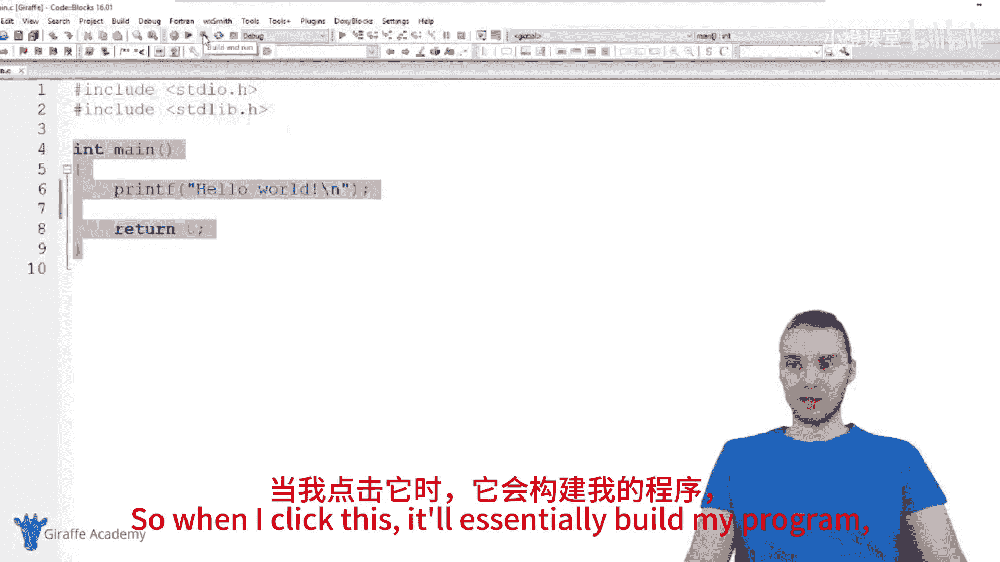
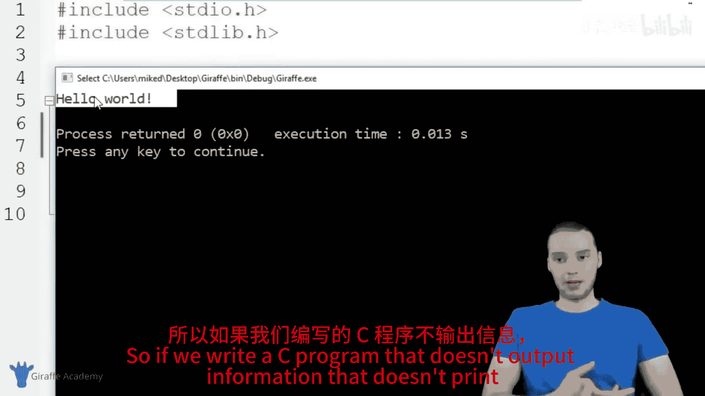
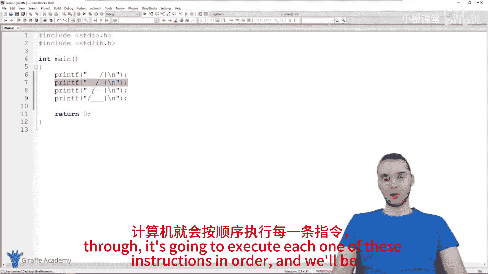
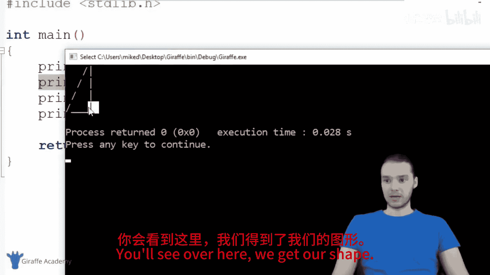
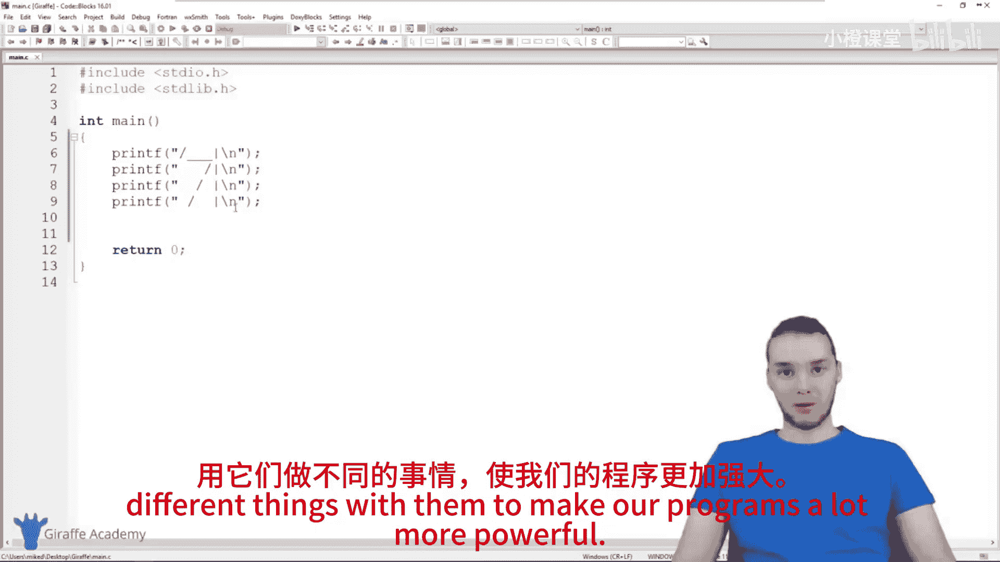

# 005：绘制形状 🖼️

在本节课中，我们将学习C语言编程的基础知识，包括如何编写一个简单的程序，理解程序的基本结构，以及如何使用`printf`函数在屏幕上绘制形状。

## 概述

上一节我们完成了开发环境的搭建。本节中，我们将深入理解C程序的基本结构，并学习如何通过编写一系列指令来让计算机执行任务，最终我们将使用这些知识在屏幕上绘制一个简单的三角形。

## C程序的基本结构

首先，我们来看一个基础的C程序文件。它通常包含以下几个部分：

以下是代码中的关键组成部分：
1.  **`#include` 指令**：这些指令位于文件顶部。目前，你只需知道为了使用某些功能（如打印文本），我们需要包含它们。我们将在后续课程中详细讲解其作用。
2.  **`main` 函数**：这是一个名为 `main` 的特殊函数。你可以将其理解为一个**容器**，用于存放我们的程序代码。当运行C程序时，计算机会自动寻找并执行 `main` 函数中的所有指令。
3.  **函数体**：`main` 函数的内容被包裹在一对花括号 `{}` 中。所有我们希望计算机执行的指令都写在这里面。

一个典型的 `main` 函数结构如下：
```c
int main() {
    // 你的代码写在这里
    return 0;
}
```

## 程序的编译与运行

在C语言中，从编写代码到程序运行需要两个步骤：



以下是这两个关键步骤：
1.  **编译 (Build/Compile)**：将我们编写的C语言代码（人类可读）**翻译**成计算机能够直接理解和执行的机器代码。
2.  **运行 (Run)**：执行上一步生成的机器代码文件，让计算机开始工作。

在Code::Blocks等集成开发环境中，你可以使用 **“构建并运行”** 按钮一次性完成这两个步骤，这非常适合在编写代码时快速测试效果。

程序运行后，通常会弹出一个**控制台窗口**。我们的程序输出的所有信息（比如文字、形状）都会显示在这个窗口中。



## 编写你的第一条指令：`printf`

目前，我们掌握的核心指令是 `printf`。它的作用是在控制台窗口**打印**文本。

`printf` 指令的基本格式是：
```c
printf("你想打印的文本");
```
**注意**：在C语言中，几乎每一条指令的末尾都必须加上一个**分号 `;`**。这告诉编译器：“这条指令结束了，请开始处理下一条。”

例如，下面的代码会打印两行“Hello World”：
```c
printf("Hello World\n");
printf("Hello World\n");
```
其中，`\n` 是一个特殊字符，代表**换行**。它的作用是让后续的输出从新的一行开始。

## 实践：用指令绘制形状 🎨

既然计算机严格按顺序执行指令，我们就可以利用多个 `printf` 语句，通过打印不同的字符（如 `/`, `|`, `_`）来组合出图形。

上一节我们了解了指令的顺序性。本节中我们来看看如何利用这一点来绘制一个三角形。

以下是绘制一个简单三角形的代码示例：
```c
printf("   /\\\n");
printf("  /  \\\n");
printf(" /    \\\n");
printf("/______\\\n");
```
**代码说明**：
*   每一条 `printf` 打印一行图形。
*   通过空格调整字符的位置，形成三角形的斜边和底边。
*   每行末尾的 `\n` 确保图形换行打印。
*   在C语言字符串中，要打印一个反斜杠 `\` 本身，需要输入两个 `\\`。



当你运行这段程序时，计算机将从第一条 `printf` 开始，依次执行，最终在屏幕上显示出一个三角形。尝试改变这些行的顺序，你会发现输出的图形会变得混乱，这再次证明了**指令顺序至关重要**。



## 总结



本节课中我们一起学习了C程序的核心概念。我们了解到，编写C程序就是为计算机定义一系列**有序的指令**。这些指令被放在 `main` 函数中，计算机会依次执行它们。我们掌握了使用 `printf` 指令输出内容的基本方法，并通过一个绘制三角形的有趣例子，实践了如何用多条指令组合完成一个具体任务。记住，**分号 `;`** 是结束指令的标志，而**指令的顺序**直接决定了程序的运行结果。