# 006：变量 📦

在本节课中，我们将要学习C语言中一个非常核心的概念——变量。变量是程序中用于存储和表示数据的容器，它能让数据管理变得简单高效。

## 为什么需要变量？

在编程时，我们经常需要处理各种数据。想象一下，如果每次使用数据时都需要直接写出具体值，当需要修改时，就必须在代码中逐个查找并替换，这将非常繁琐且容易出错。变量通过将数据存储在命名的容器中来解决这个问题，我们只需修改容器中的值，所有引用该变量的地方都会自动更新。

## 创建和使用变量

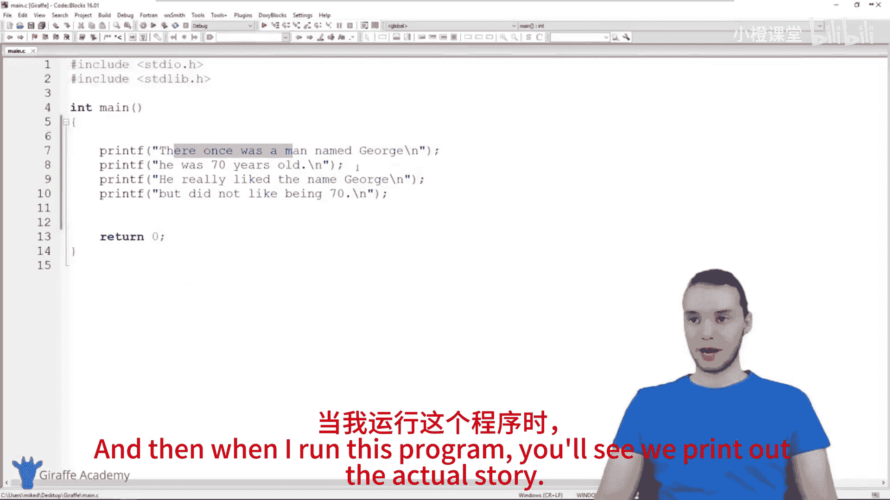

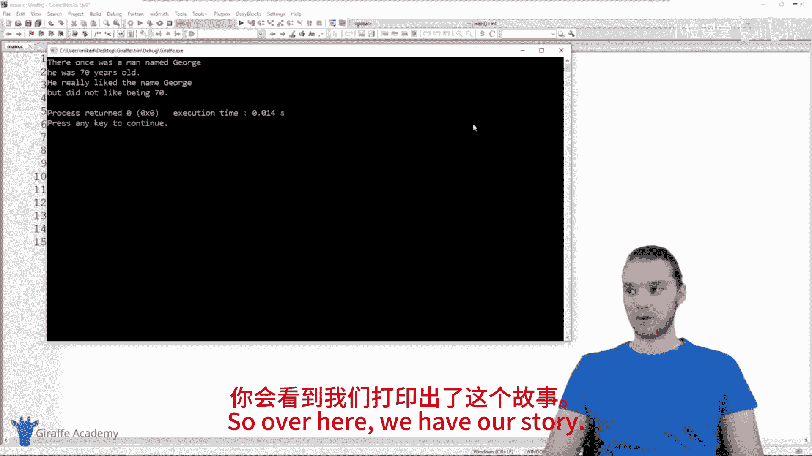

上一节我们介绍了变量的必要性，本节中我们来看看如何在C语言中创建和使用变量。

在C语言中，创建一个变量需要告诉编译器两件事：**变量要存储什么类型的数据**，以及**给这个变量起什么名字**。

以下是创建变量的基本语法格式：

```c
数据类型 变量名 = 初始值;
```

### 创建字符串变量

字符串用于存储文本信息，例如一个人的名字。在C语言中，我们使用字符数组来表示字符串。

```c
char characterName[] = "John";
```
*   `char`： 表示这是一个字符类型。
*   `characterName`： 是我们为变量起的名字。
*   `[]`： 方括号表示这是一个字符数组，可以存储多个字符（即字符串）。
*   `"John"`： 是存储在这个变量中的初始值。

### 创建整数变量

整数用于存储没有小数部分的数字，例如年龄。

```c
int characterAge = 35;
```
*   `int`： 表示这是一个整数类型。
*   `characterAge`： 是变量名。
*   `35`： 是存储在这个变量中的初始值。

## 在程序中使用变量

创建了变量之后，我们如何在程序中使用它们呢？最常见的方式是在`printf`函数中打印变量的值。

我们需要使用**格式说明符**作为占位符，告诉`printf`函数在何处插入变量的值。

以下是使用变量打印信息的示例：

```c
printf("There once was a man named %s.\n", characterName);
printf("He was %d years old.\n", characterAge);
```
*   `%s`： 是字符串的格式说明符，它会被`characterName`变量的值（“John”）替换。
*   `%d`： 是整数的格式说明符，它会被`characterAge`变量的值（35）替换。

通过这种方式，我们打印出的故事会动态地使用变量中存储的值。

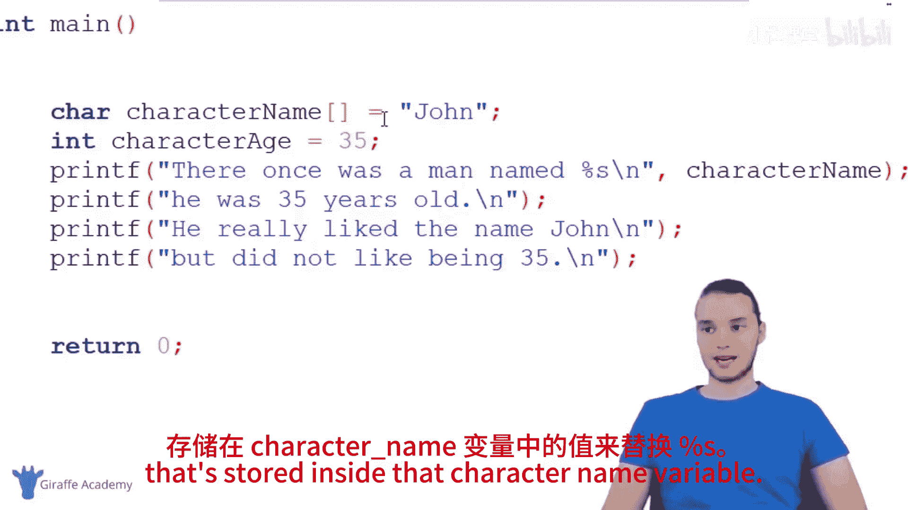

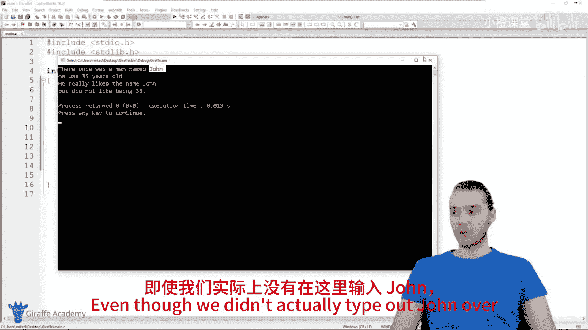

## 变量的优势：修改与更新

变量的最大优势在于其可修改性。我们只需在变量声明的地方修改一次值，所有引用该变量的地方都会随之改变。

例如，如果我们想将角色的名字从“John”改为“Tom”，年龄从35改为67，只需这样做：

```c
char characterName[] = "Tom";
int characterAge = 67;
```
运行程序后，整个故事中所有出现名字和年龄的地方都会自动更新为新的值。这比手动查找并修改每一处要高效得多。

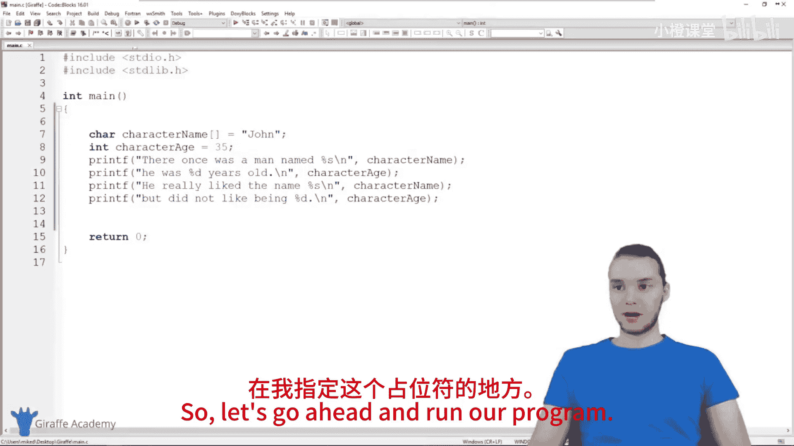

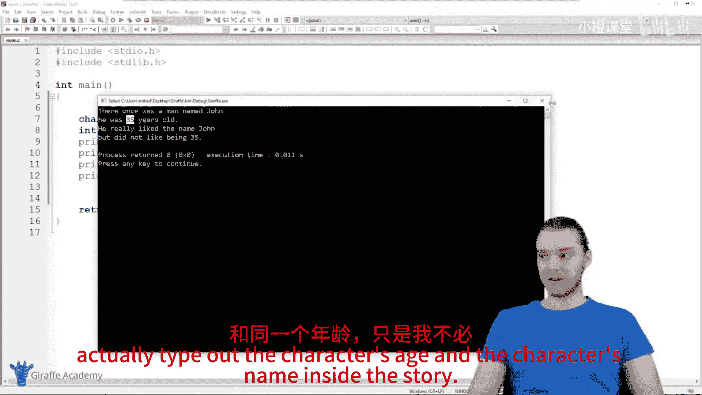

此外，我们还可以在程序运行过程中改变变量的值：

```c
int characterAge = 67; // 初始年龄
printf("He was %d years old.\n", characterAge);

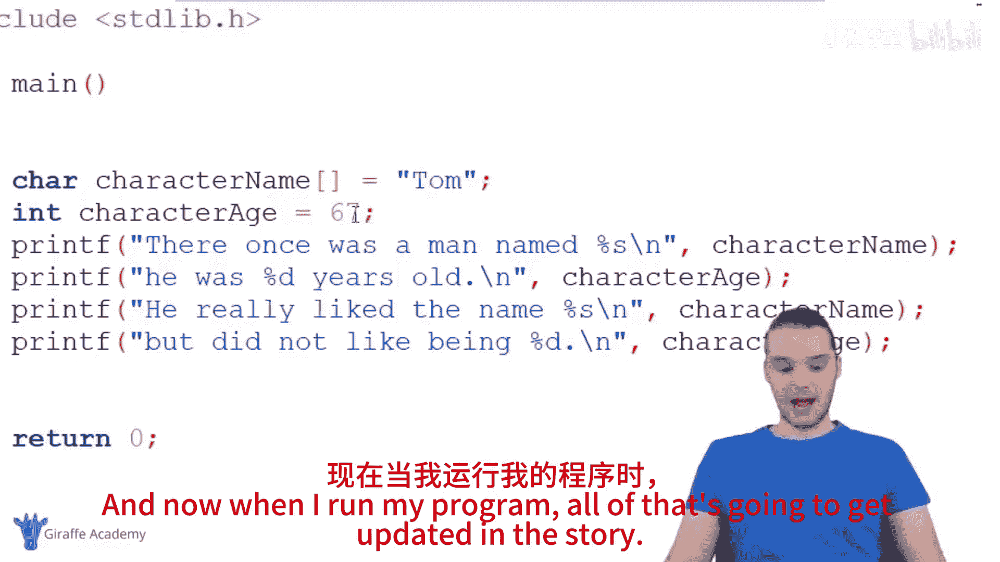

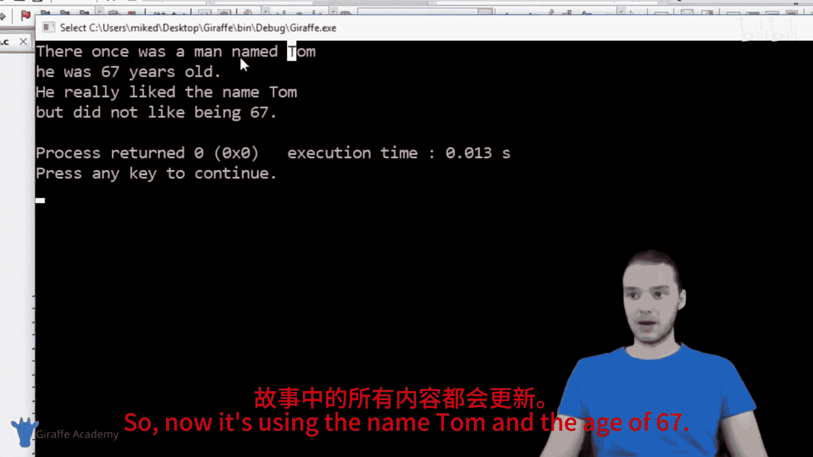

characterAge = 30; // 在故事中途修改年龄
printf("He did not like being %d.\n", characterAge);
```
这段代码会先输出年龄67，然后输出年龄30，展示了变量值在程序生命周期内可以被动态更新。

## 总结

本节课中我们一起学习了C语言中变量的概念和使用方法。我们了解到：
1.  **变量是数据的容器**，用于存储和管理程序中的信息。
2.  创建变量需要指定**数据类型**（如`int`, `char[]`）和**变量名**。
3.  使用`printf`输出变量时，需要搭配对应的**格式说明符**（`%d`用于整数，`%s`用于字符串）。
4.  变量的核心优势在于**便于维护**——只需修改一处定义，即可全局更新数据，并且其值在程序中**可以改变**。

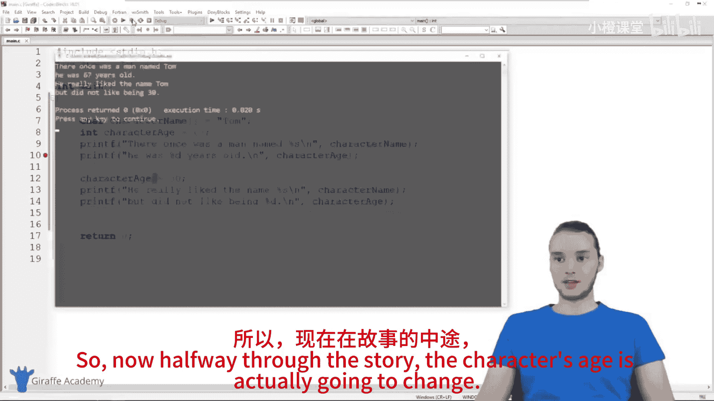

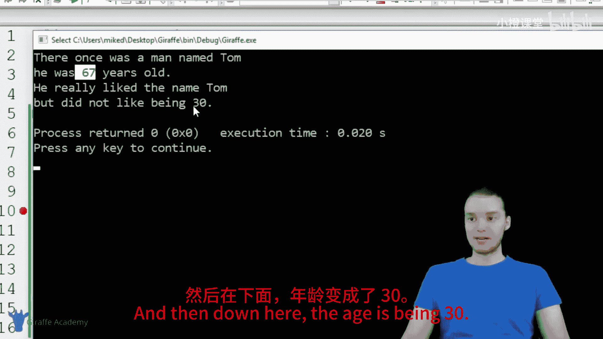

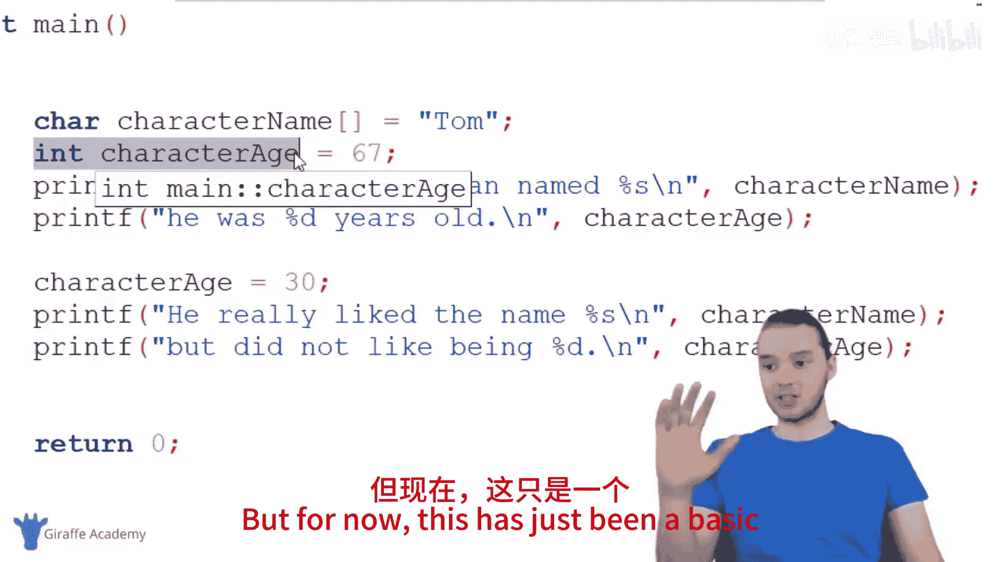


掌握变量是编写任何复杂程序的基础。在接下来的课程中，我们将探索更多其他的数据类型。