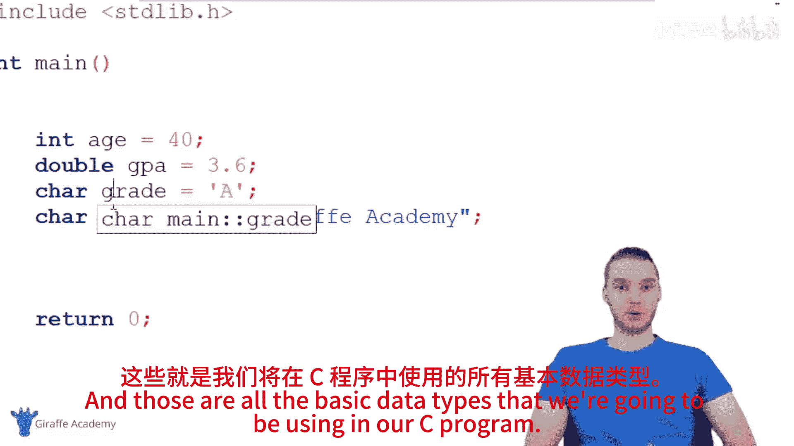

C语言编程初学者教程：第七节：数据类型 📚

在本节课中，我们将要学习C语言中的数据类型。编写程序时，我们会处理各种信息，了解这些信息的类型至关重要。本节将介绍C语言中可以表示和使用的不同信息类型，即数据类型。

上一节我们介绍了变量的概念，本节中我们来看看可以存储在变量中的不同数据类型。在C语言中创建变量时，必须告知C语言两个关键信息：一是变量的数据类型，二是变量的名称。首先，我们来探讨最基本的数据类型——数字。

**数字类型**

C语言中有两种非常重要的数字类型。

*   **整数**
    整数即没有小数部分的完整数字，例如1、2、3、40等。在C语言中，我们使用 `int` 关键字来声明整数变量。
    ```c
    int age = 40;
    ```
    使用整数时，直接写出数字即可，无需添加引号等符号。

*   **浮点数**
    浮点数是包含小数点的数字，例如2.5、3.7、40.0等。C语言中有 `float` 和 `double` 两种浮点类型。对于初学者，通常使用 `double` 即可，它能提供更高的精度。
    ```c
    double gpa = 3.7;
    ```
    请注意，`40` 是整数，而 `40.0` 是浮点数。整数和浮点数是编程中最常用的两种数字类型。

**字符类型**

除了数字，我们还需要存储文本信息。在C语言中，可以使用 `char` 类型来存储单个字符。

以下是创建字符变量的方法：
```c
char grade = 'A';
```
字符值必须用**单引号**括起来，并且只能包含一个字符，例如 ‘A’、‘b’、‘?’ 等。

**字符串简介**

很多时候，我们需要存储多个字符，即一串文本，这被称为“字符串”。虽然C语言没有内置的“字符串”类型，但我们可以通过字符数组来实现。

以下是创建字符串（字符数组）的基本方法：
```c
char phrase[] = "Hello World";
```
这里，我们使用 `char`、变量名、方括号 `[]` 以及**双引号**来创建一个字符串。双引号内可以包含任意长度的文本。需要注意的是，这种字符串（字符数组）在行为上与上面介绍的基本数据类型（`int`, `double`, `char`）有所不同，例如其修改方式更特殊，我们将在后续课程中详细讨论数组时深入讲解。

**总结**

本节课中我们一起学习了C语言的基本数据类型：
1.  **整数**：用于表示没有小数部分的数字，使用 `int` 声明。
2.  **浮点数**：用于表示带小数点的数字，初学者推荐使用 `double` 声明。
3.  **字符**：用于表示单个文本字符，使用 `char` 声明，值用单引号包裹。
4.  **字符串**：用于表示一系列字符，通过字符数组 `char[]` 实现，值用双引号包裹。




掌握这些基本数据类型是构建C语言程序的重要基石。