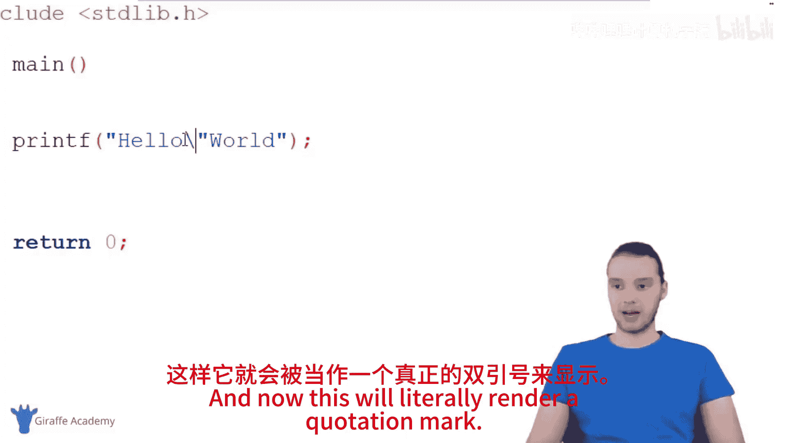
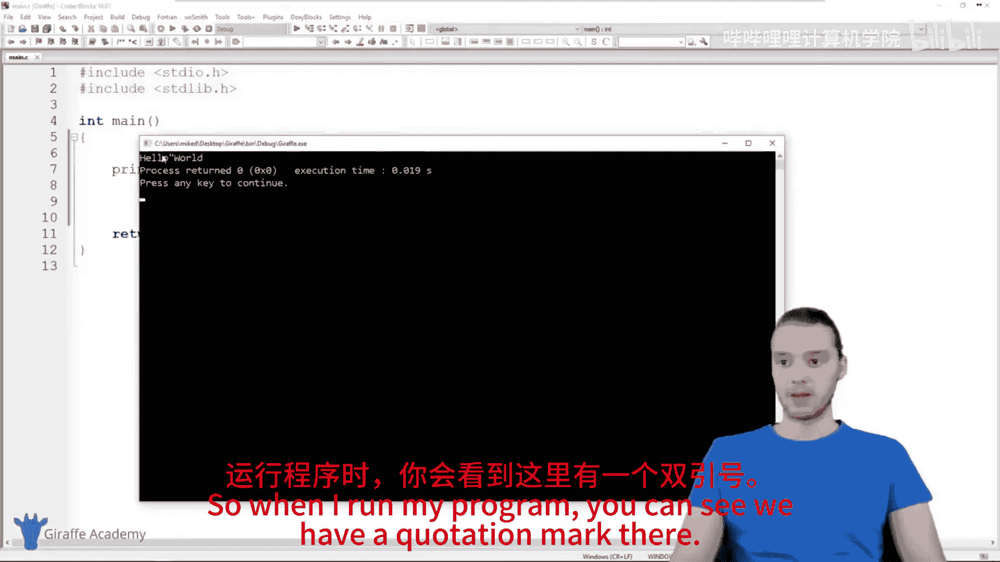
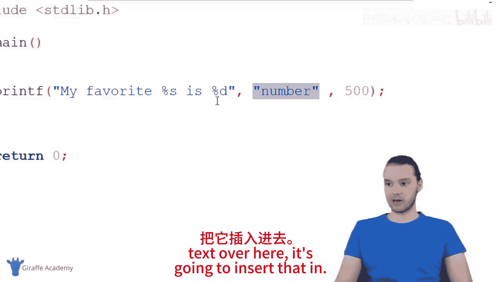
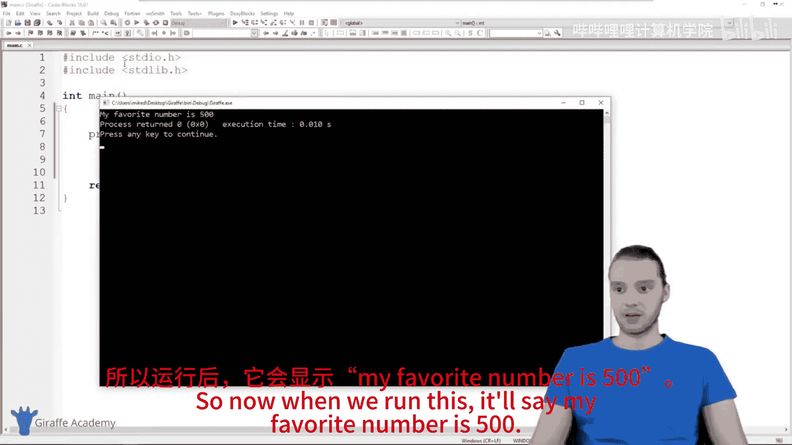
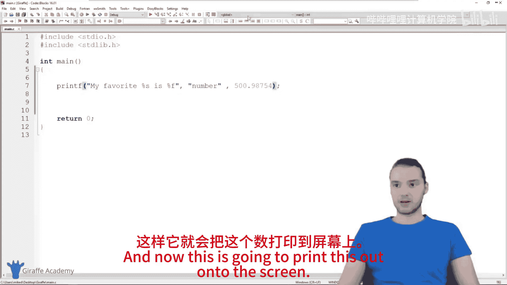
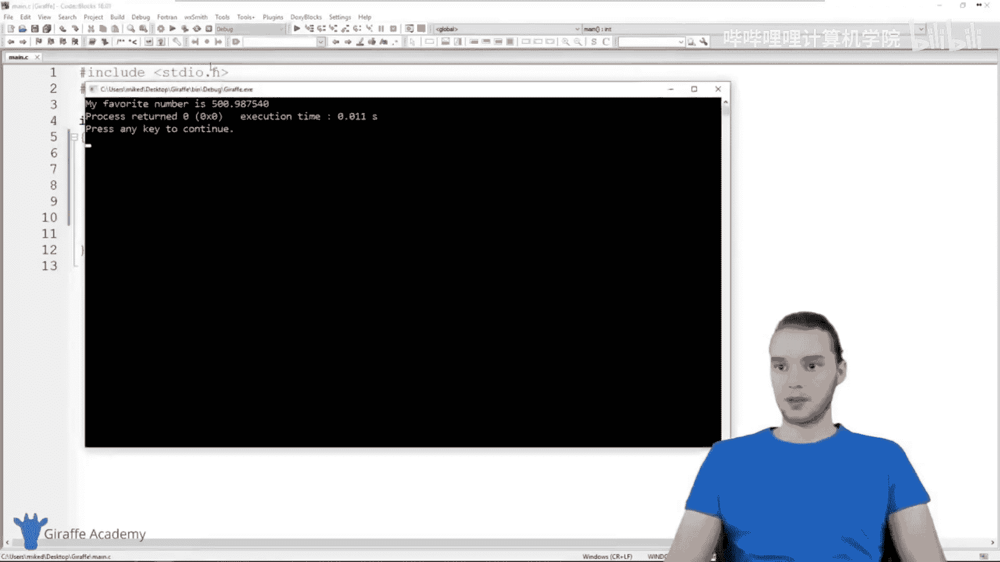
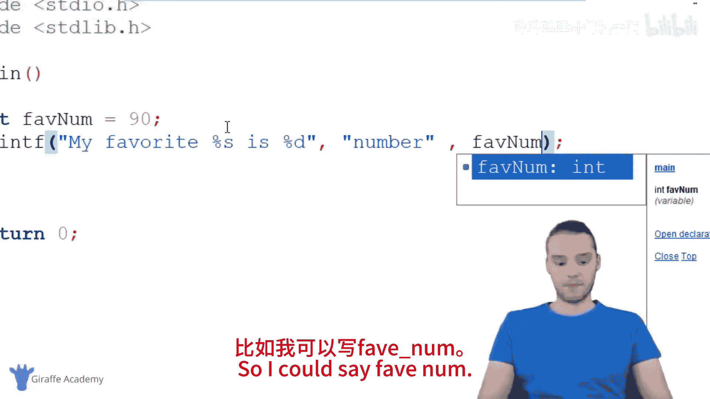
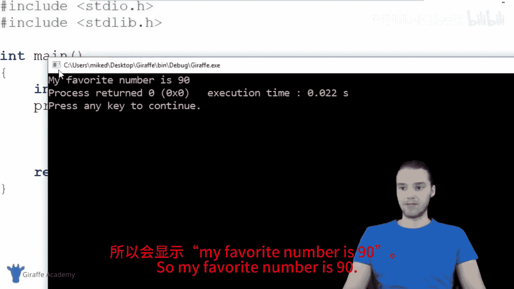
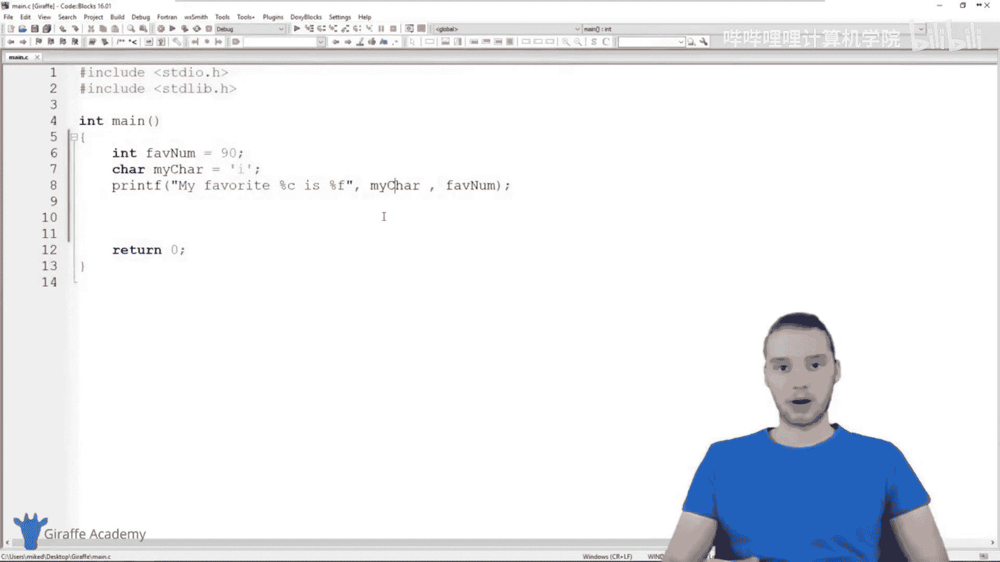

C语言编程初学者教程：第八节：深入理解printf函数 📝

在本节课中，我们将深入学习C语言中的`printf`函数。我们将探讨它的基本用法、如何打印不同类型的数据，以及如何利用格式说明符来格式化输出。掌握`printf`是调试程序和向用户展示信息的关键。

---

### 什么是printf函数？ 🤔

上一节我们介绍了C程序的基本结构，本节中我们来看看一个核心的输出函数：`printf`。

`printf`是一个函数，它的主要任务是将信息打印到屏幕上。其基本语法结构如下：

```c
printf("要打印的文本");
```

例如，执行`printf("Hello");`会在屏幕上显示“Hello”。

---

### 使用特殊字符 ✨

在`printf`的文本中，我们可以使用特殊字符来实现特定效果。





以下是几个常用的特殊字符示例：
*   `\n`：换行符。例如，`printf("Hello\nWorld");`会分两行打印“Hello”和“World”。
*   `\"`：打印一个双引号。由于双引号在C语言中用于标记字符串的开始和结束，要打印它本身需要使用转义字符`\`。例如，`printf("She said, \"Hello.\"");`。

---

### 格式说明符与打印数据 🔢

`printf`的强大之处在于它能打印各种类型的数据，而不仅仅是纯文本。这需要通过**格式说明符**来实现。

格式说明符以百分号`%`开头，后跟一个字母，用于指定要打印的数据类型。基本用法如下：

```c
printf("格式字符串", 数据1, 数据2, ...);
```

在格式字符串中，`%`所在的位置将被后面提供的数据依次替换。

---

### 常用格式说明符列表 📋

以下是几种最常用的格式说明符及其用途：

*   `%d`：打印**整数**。
    *   示例：`printf("My favorite number is %d", 500);` 输出：`My favorite number is 500`
*   `%f`：打印**浮点数**（小数）。
    *   示例：`printf("The value is %f", 500.9875);` 输出：`The value is 500.987500`
*   `%c`：打印**单个字符**。
    *   示例：`printf("Initial: %c", 'J');` 输出：`Initial: J`
*   `%s`：打印**字符串**（一串文本）。
    *   示例：`printf("Hello, %s!", "World");` 输出：`Hello, World!`





---





### 打印变量 🎯

`printf`结合格式说明符，最常见的用途之一是打印变量的值。

你只需要在格式字符串中放置合适的格式说明符，然后在参数列表中传入变量名即可。

```c
int favoriteNum = 90;
char myChar = 'i';

printf("My favorite number is %d\n", favoriteNum);
printf("My character is %c", myChar);
```
运行上述代码将输出：
```
My favorite number is 90
My character is i
```

---



### 总结 🎓



本节课中我们一起学习了`printf`函数。我们了解了它的基本用法，如何通过特殊字符控制输出格式，以及如何利用`%d`、`%f`、`%c`、`%s`等格式说明符来打印整数、浮点数、字符和字符串。最重要的是，我们学会了如何打印变量的值，这是在程序运行时获取反馈和进行调试的必备技能。




请多加练习使用`printf`，它是在编写更复杂程序时极其有用的工具。