# 009：使用数字 📊

在本节课中，我们将要学习如何在C语言中处理数字。我们将探讨如何存储数字、进行数学运算，以及整数和浮点数之间的交互方式。掌握这些基础知识对于编写任何涉及计算的程序都至关重要。

## 打印数字

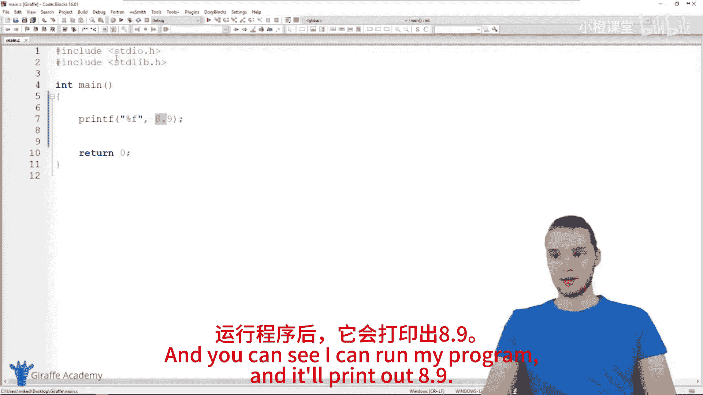

在C语言中，我们可以使用 `printf` 函数来打印数字。对于浮点数（即带小数点的数字），我们使用格式说明符 `%f`。

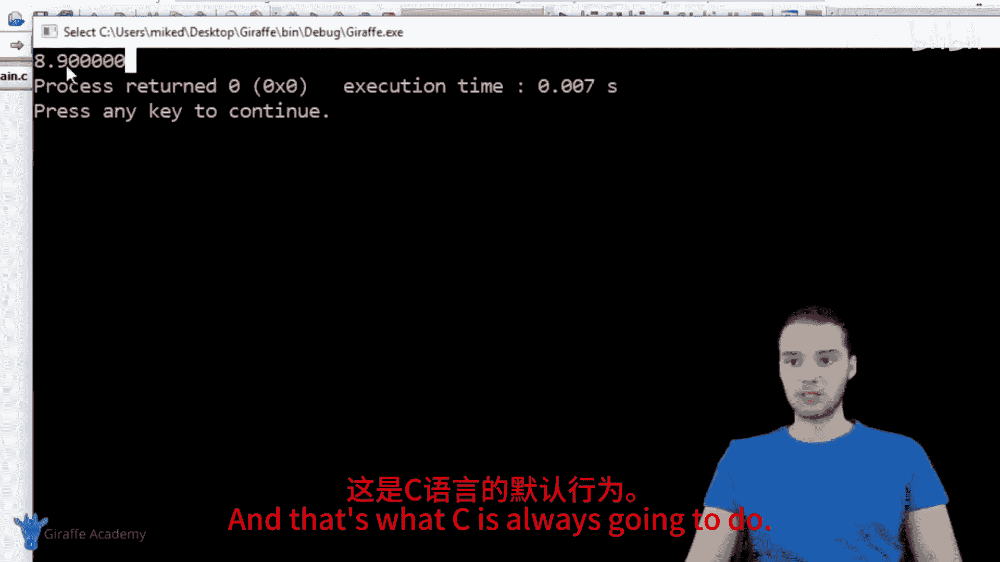

```c
printf("%f", 8.9);
```

执行上述代码会打印出 `8.9`。C语言默认会以非常高的精度打印浮点数。

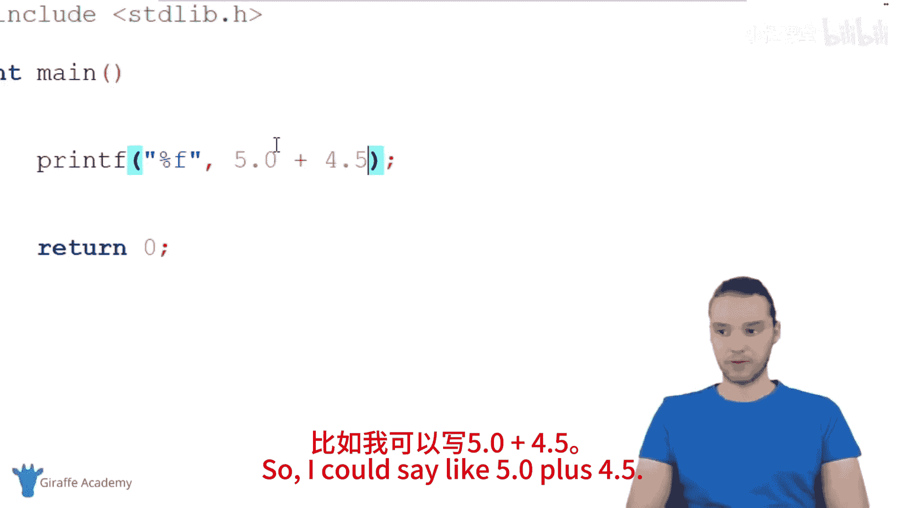

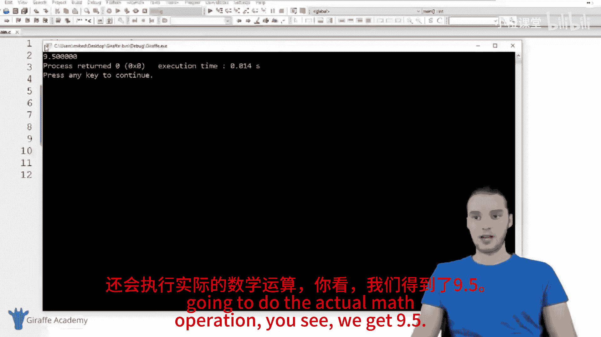

## 基本数学运算

我们可以直接在 `printf` 函数中进行基本的数学运算，包括加法、减法、乘法和除法。

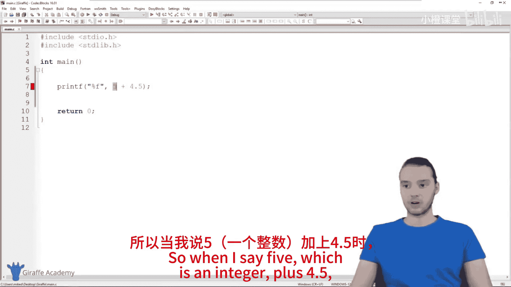

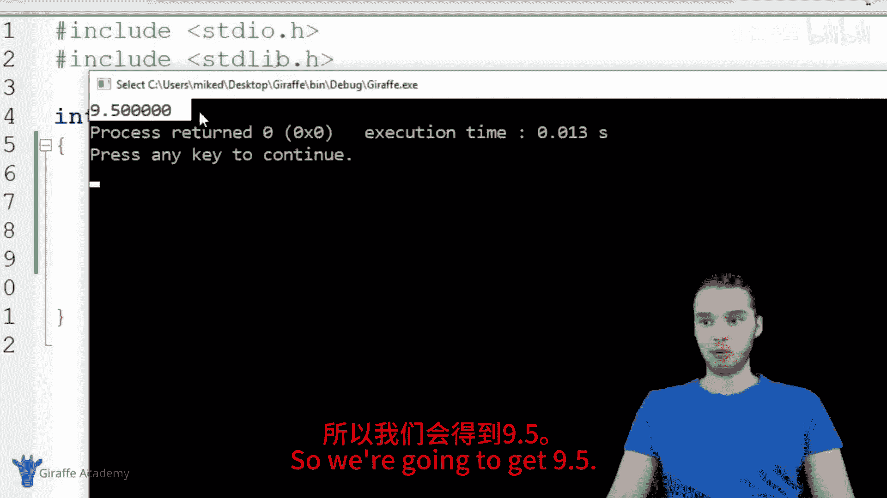

以下是四种基本运算的示例：
*   **加法**：使用加号 `+`。例如，`5.0 + 4.5` 的结果是 `9.5`。
*   **减法**：使用减号 `-`。
*   **乘法**：使用星号 `*`。
*   **除法**：使用斜杠 `/`。

## 整数与浮点数的交互

上一节我们介绍了基本运算，本节中我们来看看当整数和浮点数一起运算时会发生什么。

当一个整数与一个浮点数进行运算时，整个表达式的结果将是一个浮点数。

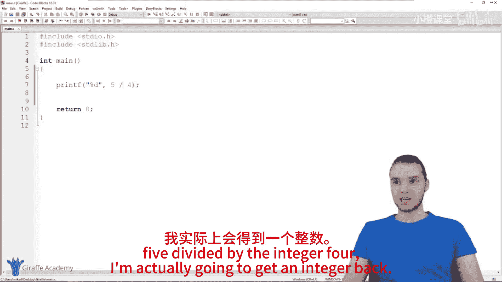

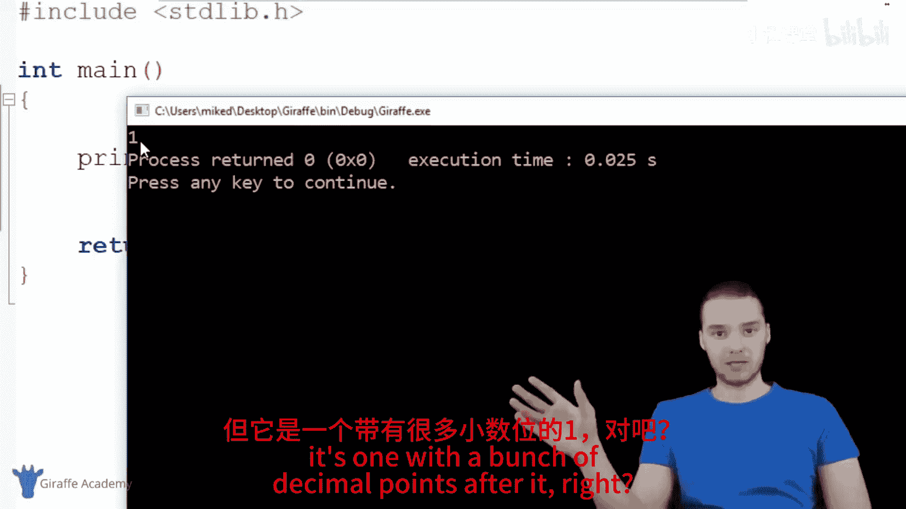

```c
printf("%f", 5 + 4.5); // 输出 9.5
```

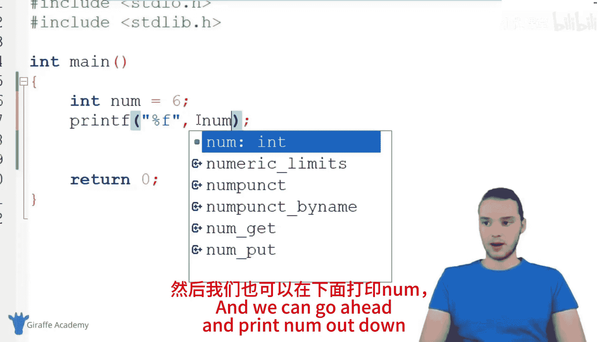

然而，如果两个整数进行除法运算，结果将**只保留整数部分**。

```c
printf("%d", 5 / 4); // 输出 1，而不是 1.25
```

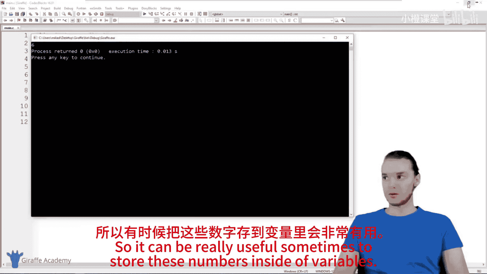

要得到完整的十进制结果，至少需要其中一个操作数是浮点数。

```c
printf("%f", 5 / 4.0); // 输出 1.25
```

## 将数字存储在变量中

除了直接使用数字，我们还可以将它们存储在变量中，这在处理复杂计算时非常有用。

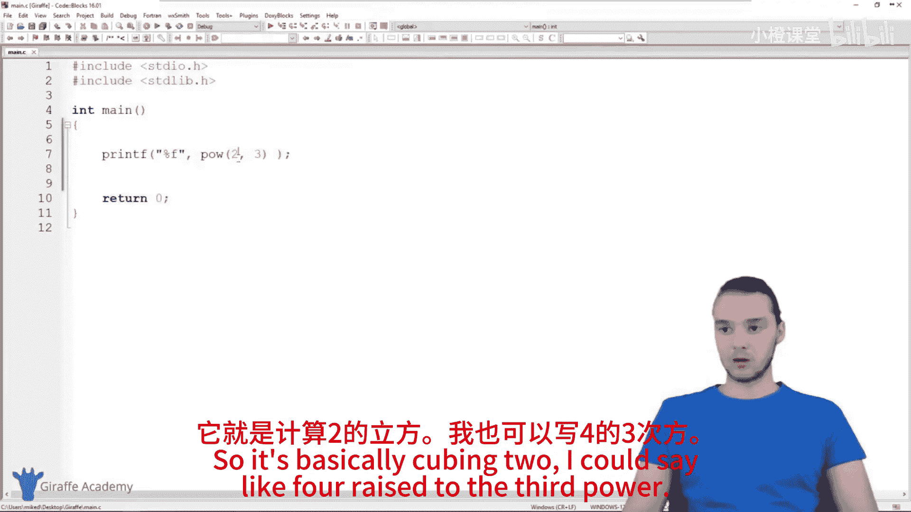

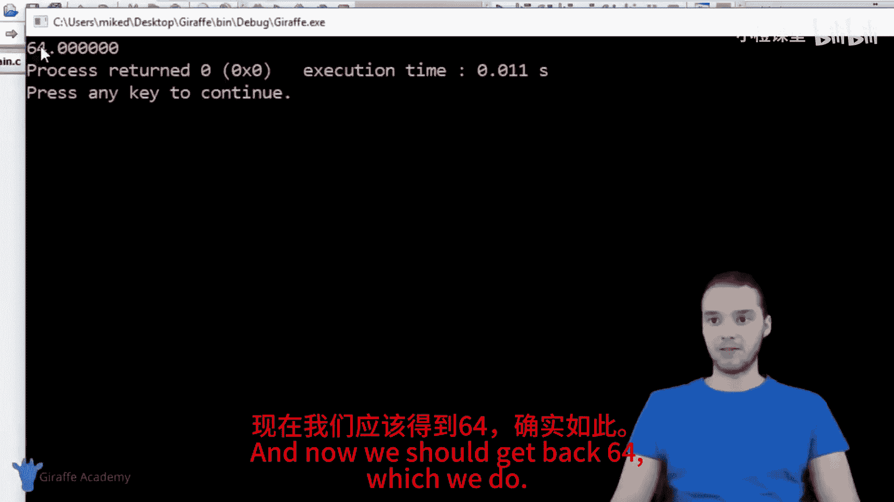

```c
int num = 6;
printf("%d", num);
```

## 使用数学函数

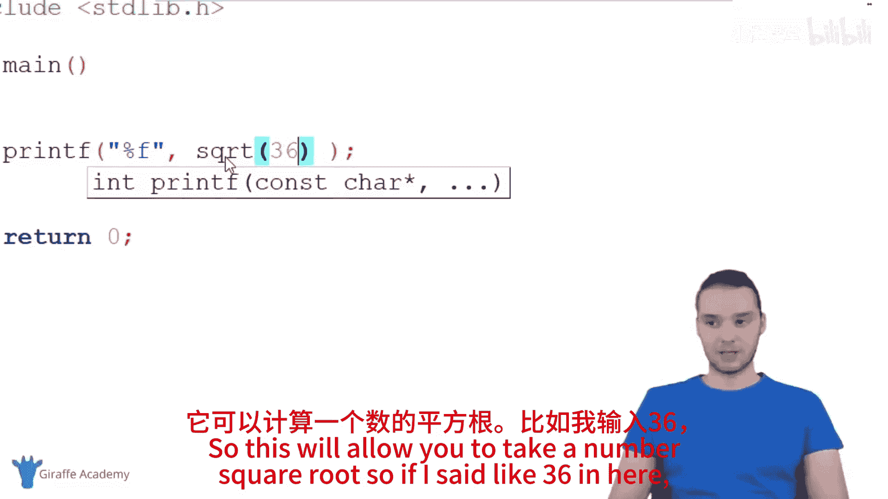

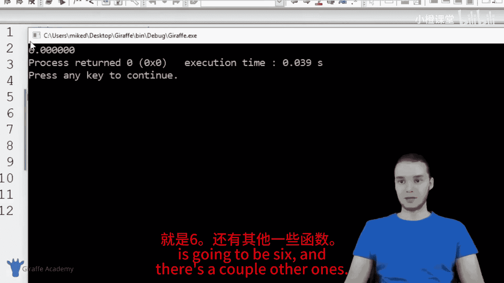

C语言提供了许多内置的数学函数，它们就像可以执行特定任务的小工具。要使用它们，只需调用函数名并传入参数即可。

以下是几个常用的数学函数：
*   **`pow` 函数**：用于计算幂。例如，`pow(2, 3)` 计算2的3次方，结果为 `8`。
*   **`sqrt` 函数**：用于计算平方根。例如，`sqrt(36)` 的结果是 `6`。
*   **`ceil` 函数**：用于向上取整。例如，`ceil(36.356)` 的结果是 `37`。
*   **`floor` 函数**：用于向下取整。例如，`floor(36.656)` 的结果是 `36`。

## 总结

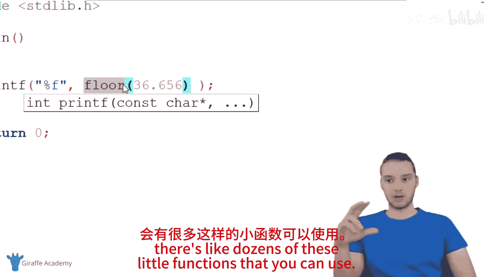

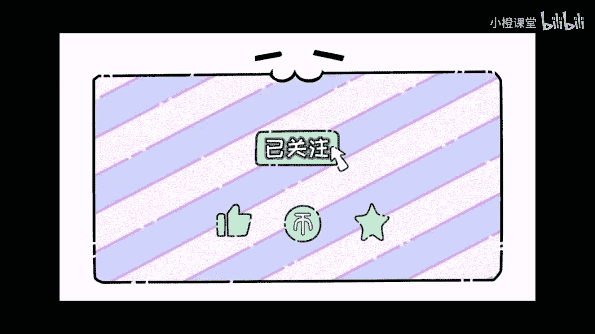

本节课中我们一起学习了C语言中数字的基本操作。我们掌握了如何打印数字、进行加减乘除运算，理解了整数与浮点数运算时的类型转换规则，学会了将数字存入变量，并介绍了几种实用的内置数学函数。你可以尝试组合使用这些概念，并在线搜索“C math functions”来探索更多功能。