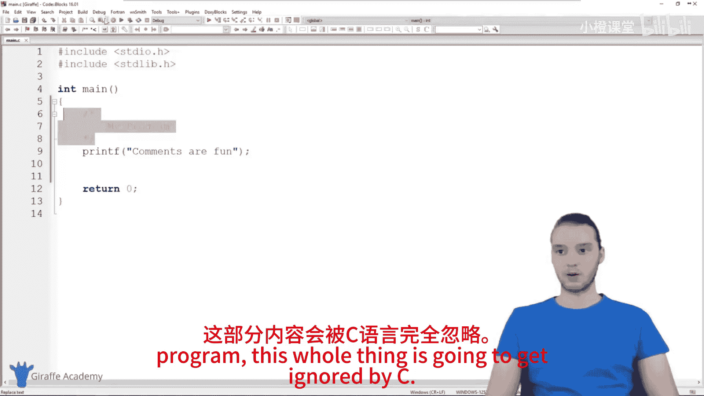
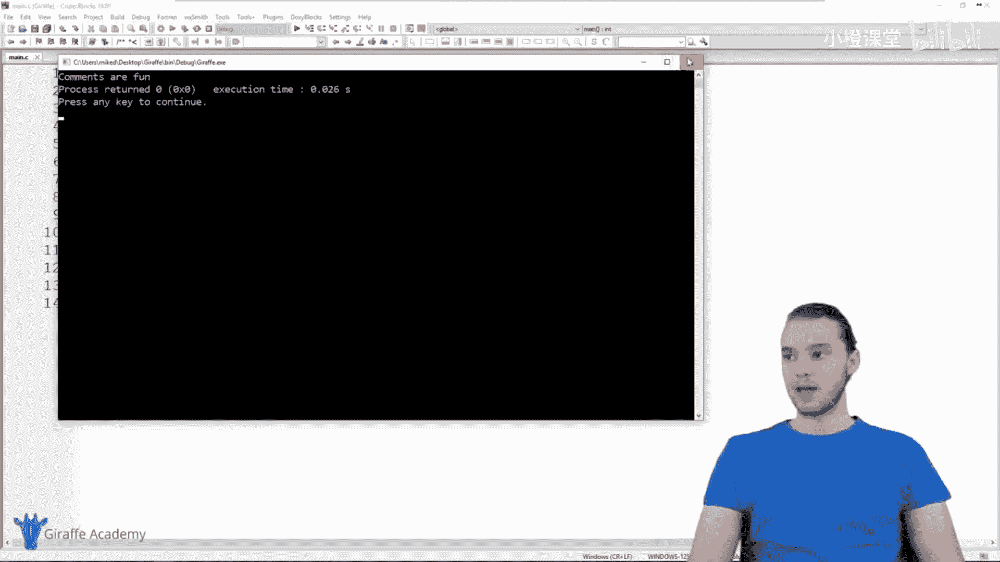
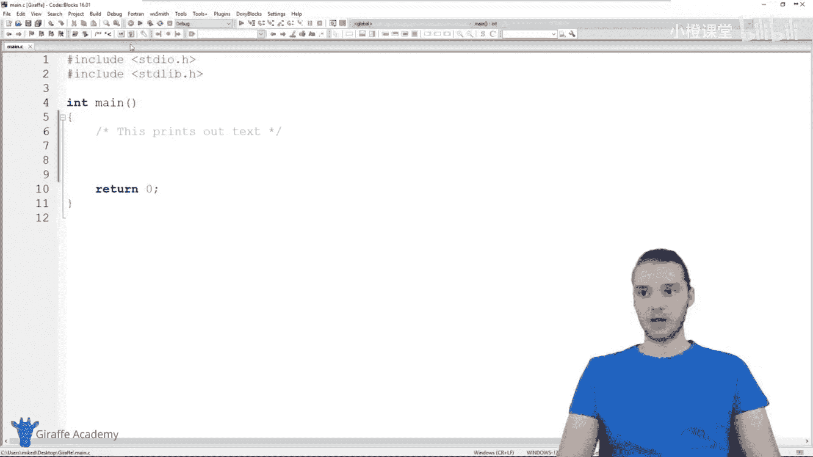
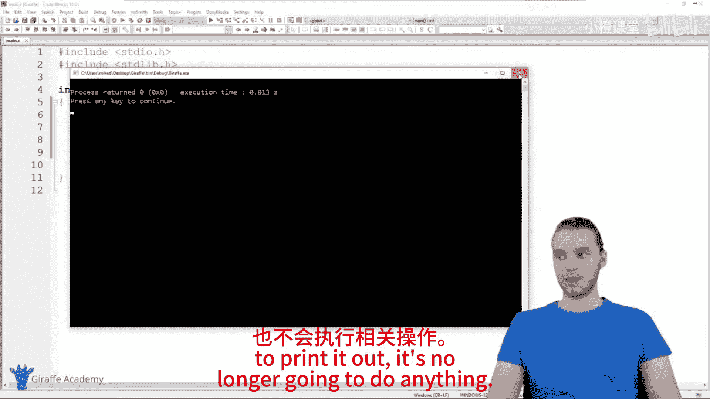
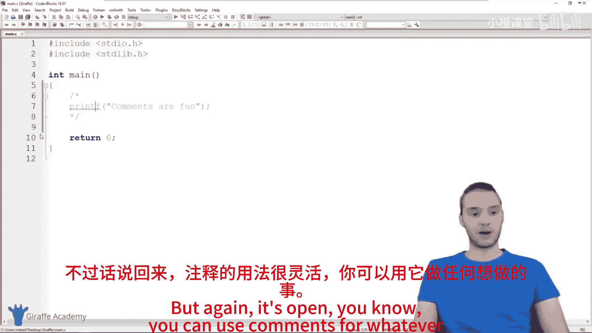

# 010：注释 📝

在本节课中，我们将要学习C语言中一个非常实用的功能——注释。注释是代码中不会被计算机执行的特殊部分，它允许我们在程序中留下笔记、解释代码逻辑，或者临时禁用某些代码行。

## 什么是注释？

上一节我们介绍了代码的基本结构，本节中我们来看看如何为代码添加“说明”。在C语言中，**注释**是一种特殊的代码块。当程序运行时，编译器会完全忽略注释中的所有内容。这意味着你可以在注释中写下任何文字，而不会影响程序的执行。

创建一个注释，需要使用特定的起始和结束标记。在C语言中，多行注释的语法是：

```c
/* 这里是注释内容 */
```

## 注释的用途

以下是注释最常见的两种用途：

1.  **为代码添加说明**：你可以在复杂的代码行旁边添加注释，解释这段代码的功能或设计思路。这对于你自己日后回顾，或者与其他开发者协作时非常有帮助。
2.  **临时禁用代码**：在调试或测试程序时，你可能希望暂时不让某段代码运行。与其直接删除它（之后可能还需要恢复），不如将其“注释掉”。这样，代码依然保留在文件中，但不会被编译执行。

## 如何使用注释？

让我们通过一个简单的例子来演示。假设我们有以下程序：

```c
#include <stdio.h>

int main() {
    printf("Hello, World!\n");
    return 0;
}
```

**为代码添加说明**
我们可以在`printf`语句上方添加一个注释来解释它的作用：





```c
#include <stdio.h>





int main() {
    /* 这行代码用于在屏幕上打印问候语 */
    printf("Hello, World!\n");
    return 0;
}
```

**临时禁用代码**
如果我们不想执行打印`”Hello, World!”`的这行代码，可以将其用注释标记包围起来：

```c
#include <stdio.h>

int main() {
    /* printf("Hello, World!\n"); */
    return 0;
}
```

现在，当我们运行程序时，`printf`语句将被忽略，程序不会输出任何内容。但代码本身并没有被删除，只需移除注释标记即可轻松恢复其功能。

## 关于注释的最佳实践

虽然注释非常有用，但通常建议**谨慎使用**。过多的注释可能会让代码变得杂乱，难以阅读。一般来说，只在以下情况使用注释是良好的实践：
*   解释一段复杂或不直观的算法逻辑。
*   注明某段代码的临时性或待办事项（TODO）。
*   在团队协作中，提供必要的上下文信息。

当然，这只是一个建议。你可以根据项目的实际需要和个人习惯来决定如何使用注释。

## 总结



本节课中我们一起学习了C语言中的注释。我们了解到，注释是以`/*`开始、以`*/`结束的文本块，它不会被编译器执行。注释主要有两个作用：一是为代码添加解释说明，二是临时禁用某些代码行以便调试。合理使用注释可以让你的代码更清晰、更易于维护。