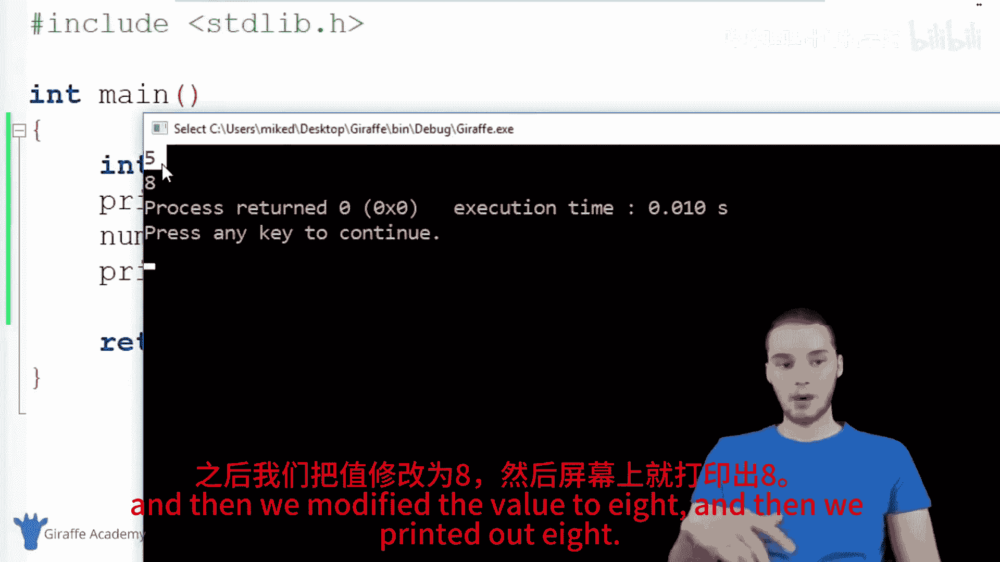
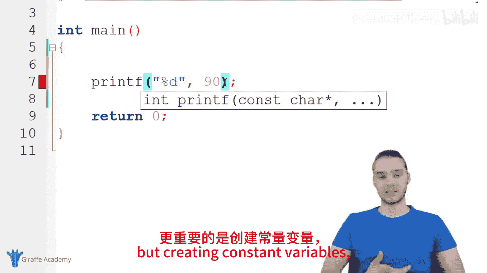

# 011：常量 📘

在本节课中，我们将要学习C语言中的常量。常量是一种特殊类型的变量，其值在程序运行期间不能被修改。理解常量的概念对于编写更安全、更易维护的代码至关重要。

## 概述：什么是常量？

常量是C语言中一种特殊的变量，其核心特性是**一旦被赋值，就不能再被修改**。这意味着，当你创建一个常量并赋予它一个值后，任何试图改变这个值的操作都会导致程序出错。

上一节我们介绍了变量的基本概念，本节中我们来看看如何创建和使用不可变的变量——常量。

## 如何创建常量变量？

在C语言中，我们使用 `const` 关键字来声明一个常量。这个关键字可以放在变量类型之前或之后，但通常放在类型之前是一种更常见的做法。

以下是创建一个常量整数的基本语法：
```c
const int NUM = 5;
```
或者：
```c
int const NUM = 5;
```

### 常量与普通变量的对比

为了更好地理解常量的特性，让我们通过一个例子来对比普通变量和常量。

首先，我们创建一个普通的整数变量并修改它：
```c
#include <stdio.h>

int main() {
    // 创建一个普通变量
    int num = 5;
    printf("%d\n", num); // 输出：5

    // 修改这个变量的值
    num = 8;
    printf("%d\n", num); // 输出：8
    return 0;
}
```
在这个例子中，变量 `num` 的值被成功地从5修改为8。




现在，让我们尝试将 `num` 声明为常量并修改它：
```c
#include <stdio.h>

int main() {
    // 创建一个常量变量
    const int NUM = 5;
    printf("%d\n", NUM); // 输出：5

    // 尝试修改常量（这将导致编译错误）
    NUM = 8; // 错误：不能给常量赋值
    printf("%d\n", NUM);
    return 0;
}
```
当你尝试编译这段代码时，编译器会报错，因为 `NUM` 是一个常量，其值不能被修改。

## 常量的命名规范

虽然C语言本身不强制要求，但开发者社区有一个通用的最佳实践：**使用全大写字母来命名常量**。这样做可以使代码更易读，让人一眼就能看出某个标识符是常量。

例如：
```c
const int FAVORITE_NUMBER = 7;
const float PI = 3.14159;
const char COMPANY_NAME[] = "TechCorp";
```
这种命名约定有助于区分常量和普通变量，提醒你和其他开发者不要试图修改这些值。

## 字面量常量

除了使用 `const` 关键字声明的变量常量外，程序中直接出现的固定值也被称为常量，或更具体地称为“字面量常量”。

以下是几种常见的字面量常量：

*   **整数常量**：例如在代码中直接写出的 `90`、`-42`、`100`。
*   **浮点数常量**：例如 `3.14`、`-0.001`、`2.0`。
*   **字符常量**：用单引号括起来的单个字符，例如 `'A'`、`'1'`、`'$'`。
*   **字符串常量**：用双引号括起来的一系列字符，例如 `"Hello, World!"`、`"Error: File not found."`。

例如，在下面的语句中：
```c
printf("Hello");
printf("%d", 70);
```
`"Hello"` 和 `70` 都是字面量常量。它们直接代表了固定的数据，除非你手动修改源代码，否则它们在程序中的值永远不会改变。

## 为什么要使用常量？

使用常量主要有以下几个好处：

1.  **提高代码安全性**：防止重要的值在程序运行时被意外修改，从而避免难以调试的错误。
2.  **提升代码可读性**：给一个固定的值起一个有意义的名称（如 `PI`、`MAX_USERS`），比直接使用数字（如 `3.14159`、`100`）更容易理解。
3.  **便于维护**：如果某个固定值在程序中多个地方被使用，将其定义为常量后，只需在一个地方修改，所有引用该常量的地方都会自动更新。

## 总结

本节课中我们一起学习了C语言中的常量。我们了解到：

*   常量是一种值不能被修改的变量。
*   使用 `const` 关键字来声明常量，例如 `const int VALUE = 10;`。
*   常量的命名通常采用全大写字母的约定，以提高代码可读性。
*   程序中直接出现的固定值（如数字、字符串）被称为字面量常量。
*   使用常量可以提高程序的安全性、可读性和可维护性。




掌握常量的使用是编写健壮C语言程序的重要一步。在接下来的课程中，我们将继续探索C语言的其他核心概念。