# 012：获取用户输入 👨‍💻

在本教程中，我们将学习如何在C语言程序中获取用户的输入。许多时候，我们的程序需要处理各种信息，而这些信息常常需要从用户那里获取。我们将学习如何提示用户输入信息，如何将这些信息存储在变量中，并最终在程序中使用它们。

## 概述

本节我们将学习使用 `scanf` 和 `fgets` 函数来获取不同类型的用户输入，包括整数、浮点数、字符和字符串。理解这些基本输入操作是构建交互式程序的关键。

## 获取整数输入

首先，我们来看如何从用户那里获取一个整数。这个过程分为两步：提示用户输入，然后使用 `scanf` 函数读取输入。

以下是实现步骤：

1.  使用 `printf` 函数向用户显示提示信息。
2.  声明一个整型变量来存储即将输入的值。
3.  使用 `scanf` 函数读取用户输入，并将其存储到之前声明的变量中。

让我们通过一个获取年龄的例子来演示：

```c
#include <stdio.h>

int main() {
    int age;
    printf("Enter your age: ");
    scanf("%d", &age);
    printf("You are %d years old.\n", age);
    return 0;
}
```

在这段代码中：
*   `int age;` 声明了一个名为 `age` 的整型变量。
*   `scanf("%d", &age);` 中的 `%d` 告诉程序我们期望一个整数输入。`&age` 中的 `&` 符号（称为“取地址符”或“指针”）是必需的，它告诉 `scanf` 将输入的值存储到 `age` 变量的内存地址中。关于指针的详细内容将在后续教程中讲解。

运行程序后，它会等待你输入一个数字（例如 `50`），然后输出 `You are 50 years old.`。

## 获取浮点数（双精度）输入

获取浮点数的过程与获取整数类似，但格式说明符不同。

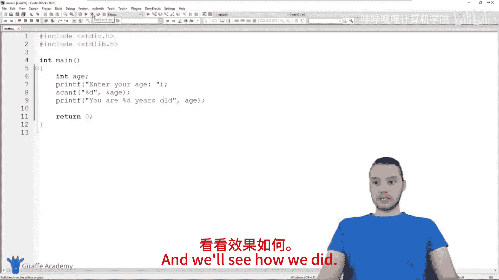

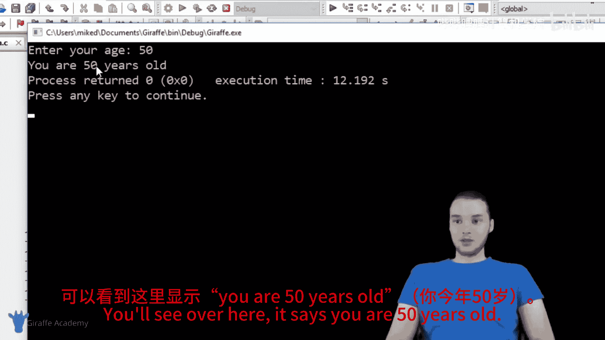

以下是获取GPA（平均绩点）的示例：

```c
#include <stdio.h>

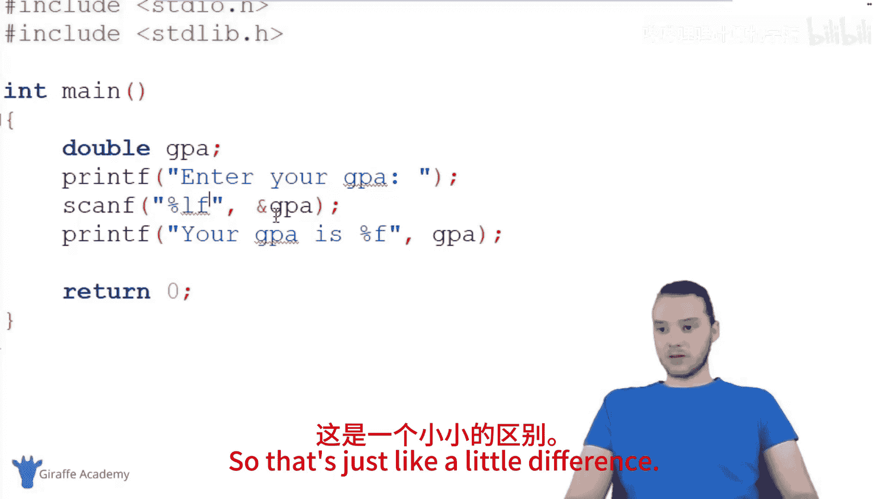

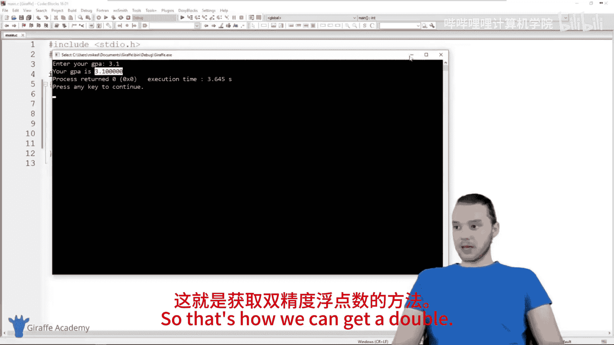

int main() {
    double gpa;
    printf("Enter your GPA: ");
    scanf("%lf", &gpa); // 注意是 %lf
    printf("Your GPA is %f.\n", gpa); // 输出时用 %f
    return 0;
}
```

**关键点**：使用 `scanf` 读取 `double` 类型时，格式说明符是 `%lf`（long float的缩写）。而在使用 `printf` 输出时，格式说明符仍然是 `%f`。这是一个需要注意的小区别。

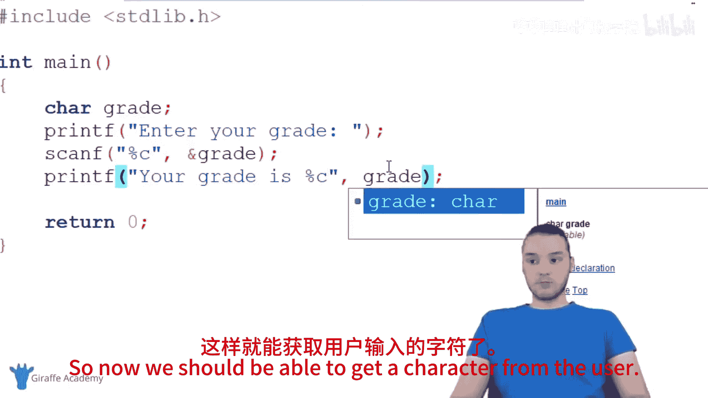

运行程序，输入 `3.1`，程序将输出 `Your GPA is 3.1.`。

## 获取字符输入

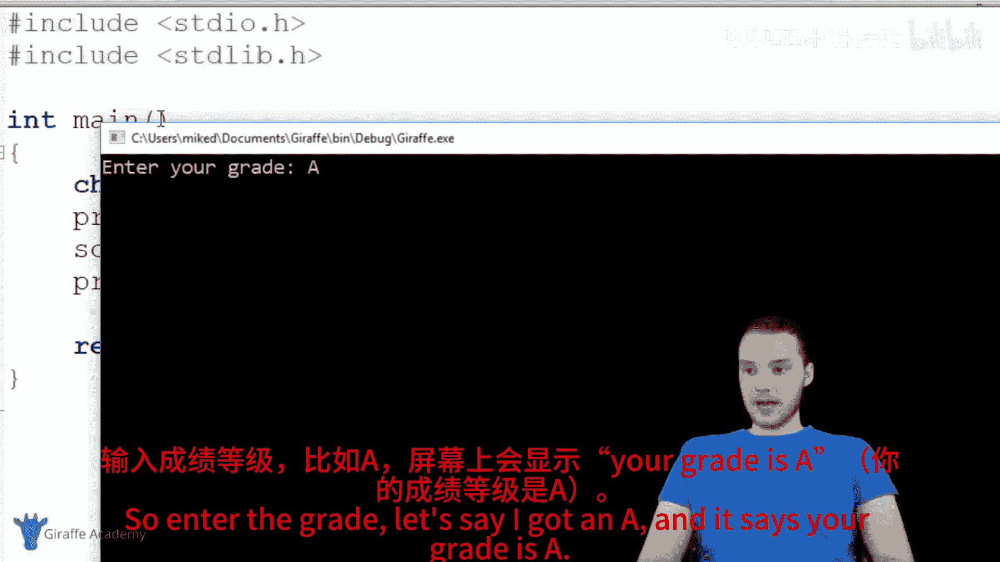

获取单个字符同样简单。

以下是如何获取一个成绩等级的示例：

```c
#include <stdio.h>

int main() {
    char grade;
    printf("Enter your grade: ");
    scanf("%c", &grade);
    printf("Your grade is %c.\n", grade);
    return 0;
}
```

在这段代码中，`%c` 是字符的格式说明符。运行程序，输入 `A`，程序将输出 `Your grade is A.`。

## 获取字符串输入

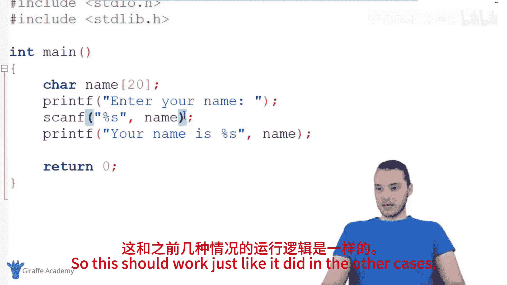

获取字符串（一系列字符）输入略有不同，并且有更优的方法。

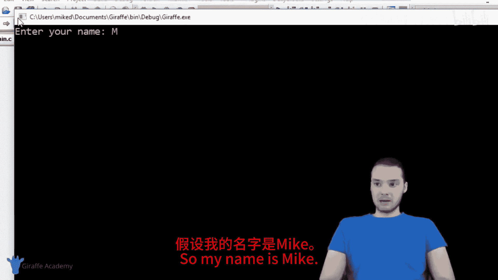

### 使用 `scanf` 获取字符串（及其局限性）

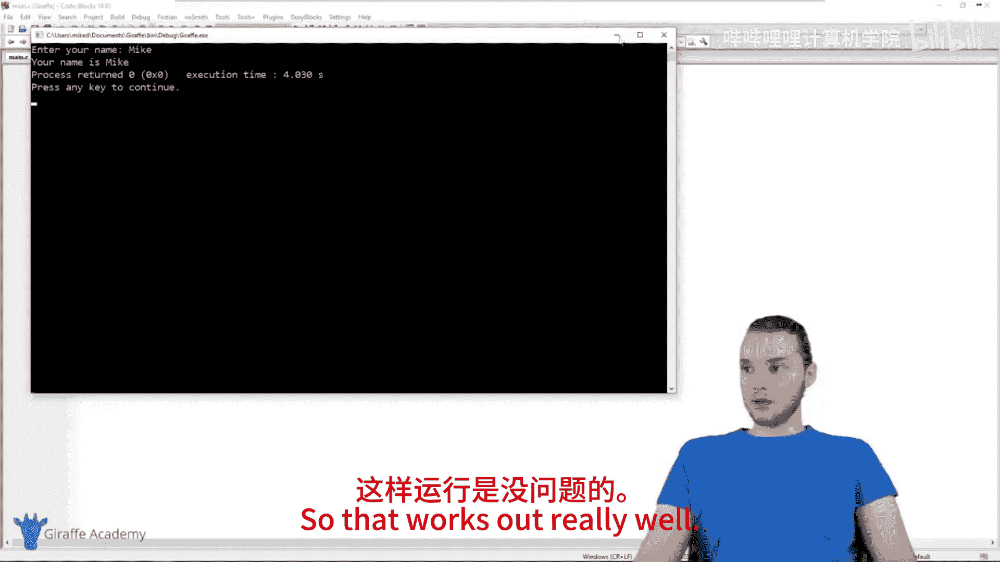

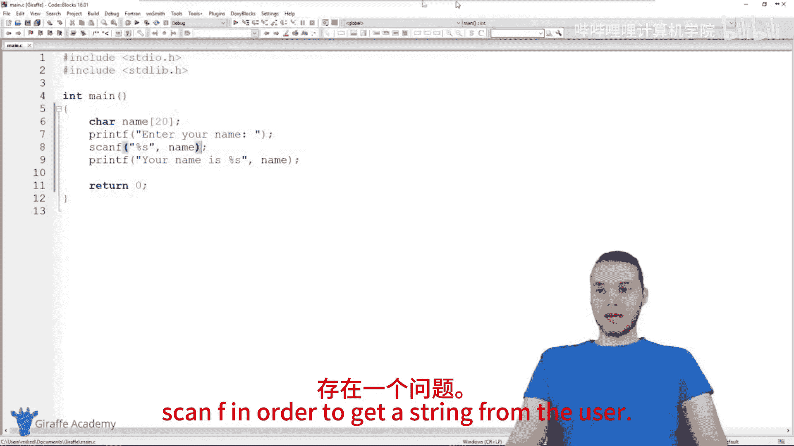

首先，我们看看如何使用 `scanf` 获取字符串。

```c
#include <stdio.h>

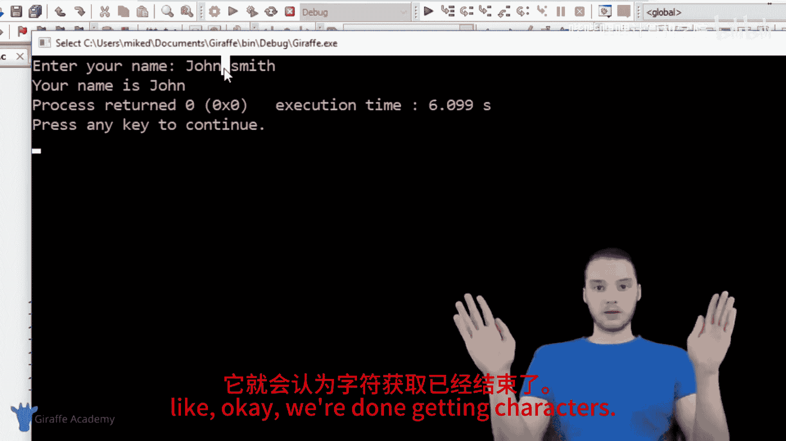

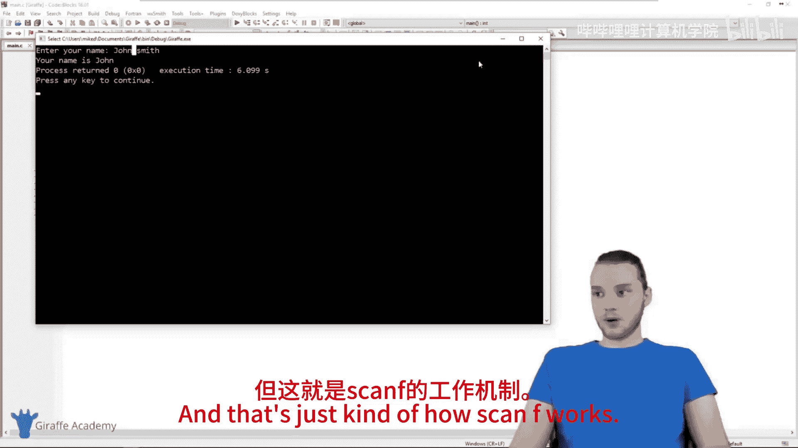

int main() {
    char name[20]; // 声明一个能存储最多20个字符的数组
    printf("Enter your name: ");
    scanf("%s", name); // 注意，字符串变量前不需要 &
    printf("Your name is %s.\n", name);
    return 0;
}
```

*   `char name[20];` 声明了一个字符数组（即字符串），它最多可以存储20个字符（包括字符串结束符 `\0`）。当你不立即给字符串赋值时，需要指定其大小，以便C语言为其分配足够的内存。
*   `scanf("%s", name);` 中，`%s` 用于读取字符串。**重要**：对于字符串变量（数组名），在 `scanf` 中不需要使用 `&` 符号，因为数组名本身在大多数情况下就代表了其内存地址。

**局限性**：`scanf` 的 `%s` 格式说明符在遇到空格、制表符或换行符时会停止读取。如果你输入 `John Smith`，程序只会读取 `John`，因为它在空格处停止了。

### 使用 `fgets` 获取整行文本（推荐）

为了解决 `scanf` 无法读取带空格字符串的问题，我们使用 `fgets` 函数。

```c
#include <stdio.h>

int main() {
    char name[20];
    printf("Enter your name: ");
    fgets(name, 20, stdin); // 使用 fgets
    printf("Your name is %s", name);
    return 0;
}
```

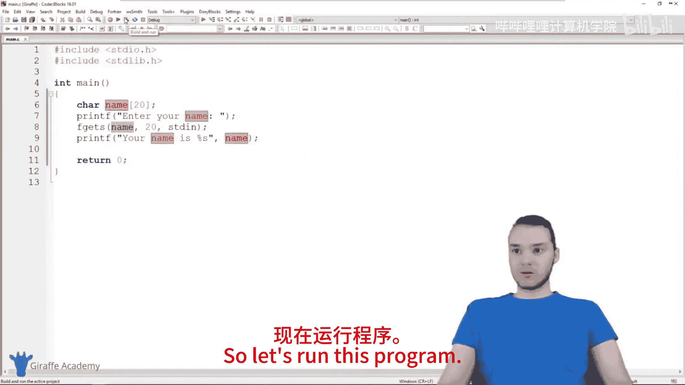

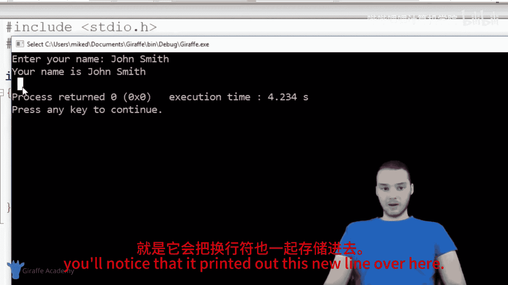

*   `fgets(name, 20, stdin);` 参数解释：
    1.  `name`：用于存储输入字符串的变量。
    2.  `20`：指定最多读取的字符数（包括最后的 `\0`）。这可以防止用户输入过长导致“缓冲区溢出”的安全问题。
    3.  `stdin`：代表“标准输入”，通常指键盘。它告诉 `fgets` 从哪里获取输入。

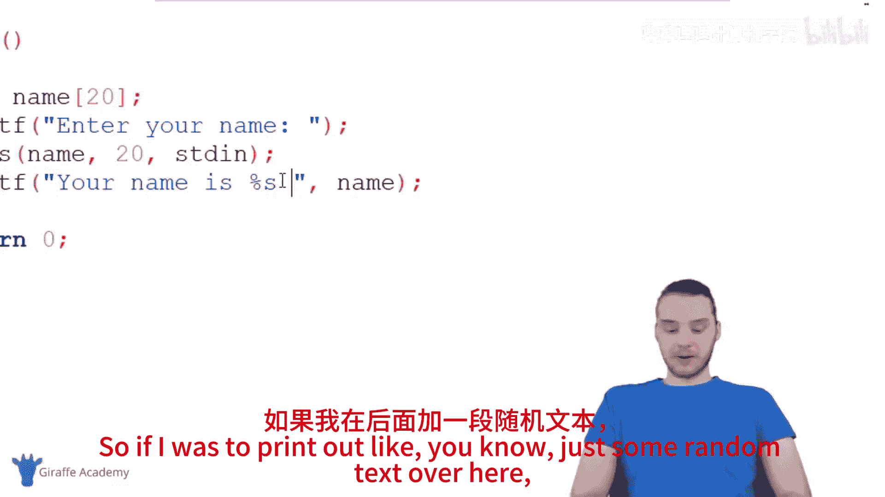

现在，如果你输入 `John Smith`，程序将能完整地读取并输出。

**注意**：`fgets` 会存储你按下回车键（Enter）时产生的换行符 `\n`。所以输出可能会多出一行。在实际应用中，你可能需要手动移除这个多余的换行符。

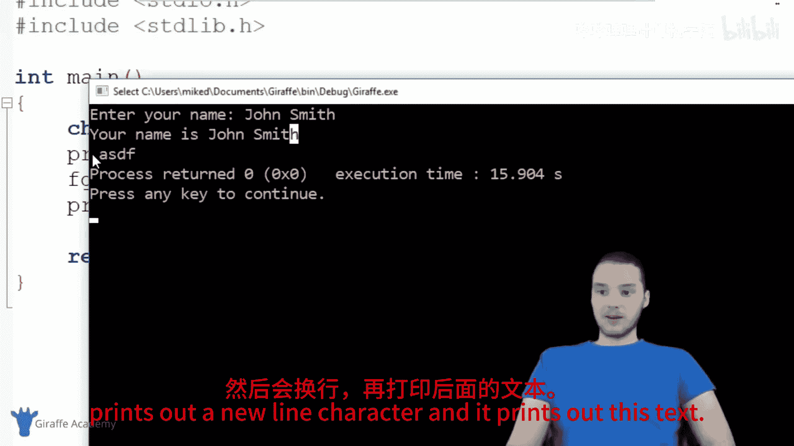

## 总结

本节课我们一起学习了在C语言中获取用户输入的基础知识：
1.  使用 `scanf` 函数可以方便地获取**整数**（`%d`）、**浮点数**（`%lf`）和**单个字符**（`%c`）。对于这些基本类型，需要在变量前使用 `&` 符号。
2.  获取**字符串**时，`scanf` 的 `%s` 无法处理包含空格的输入。
3.  因此，获取字符串输入推荐使用 `fgets` 函数，它可以读取整行文本（包括空格），并且更安全，可以指定最大输入长度以防止缓冲区溢出。

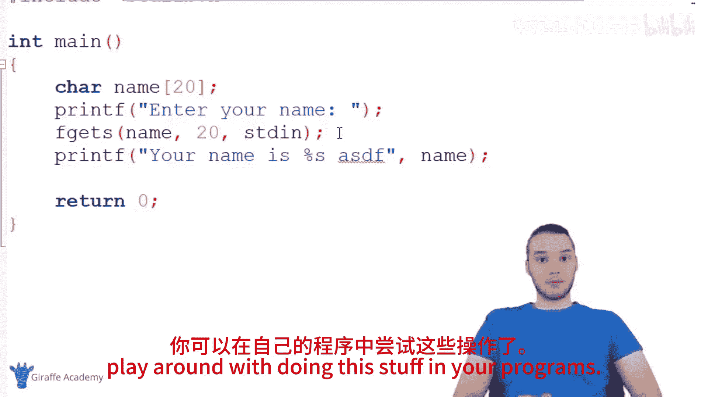


掌握这些输入方法是创建交互式程序的第一步。你可以尝试在自己的程序中组合使用这些方法，例如同时询问用户的姓名、年龄和GPA。在后续教程中，我们还将探讨处理用户输入的更多高级技巧。