# 013：构建基本计算器 🧮

在本节课中，我们将学习如何使用C语言构建一个基础的计算器程序。我们将创建一个程序，允许用户输入两个数字，程序会将这两个数字相加并输出结果。通过这个过程，我们将学习如何从用户那里获取数字输入。

## 概述

我们将编写一个程序，它首先提示用户输入两个数字，然后使用 `scanf` 函数获取这些输入，将它们存储在变量中，最后进行加法运算并打印结果。我们还将探讨如何处理整数和浮点数（小数）的输入。

## 构建计算器步骤

### 1. 提示用户输入

首先，我们需要提示用户输入第一个数字。我们将使用 `printf` 函数来显示提示信息。

以下是实现此步骤的代码：

```c
printf("请输入第一个数字：");
```

### 2. 获取并存储用户输入

接下来，我们需要获取用户输入的数字并将其存储起来。为此，我们将使用 `scanf` 函数。我们需要先声明两个变量来存储这些数字。

以下是声明变量和获取第一个数字输入的代码：

```c
double num1;
scanf("%lf", &num1);
```

**注意**：当使用 `scanf` 读取非字符串类型（如整数 `%d`、浮点数 `%lf`、字符 `%c`）时，必须在变量名前加上 `&` 符号（取地址符）。这涉及到内存地址和指针的概念，我们将在后续课程中详细讲解。目前只需记住，为了将输入的值存储到变量中，这是必需的。

### 3. 获取第二个数字

获取第二个数字的步骤与第一个完全相同。

以下是相应的代码：

```c
printf("请输入第二个数字：");
double num2;
scanf("%lf", &num2);
```

### 4. 进行计算并输出结果

现在我们已经有了两个数字，可以将它们相加并打印出答案了。

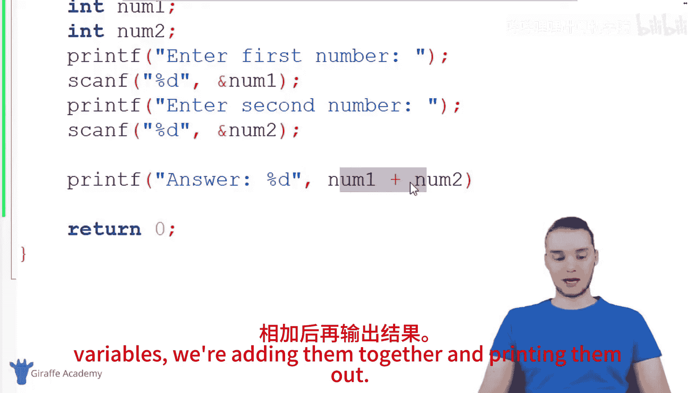

以下是进行计算和输出的代码：

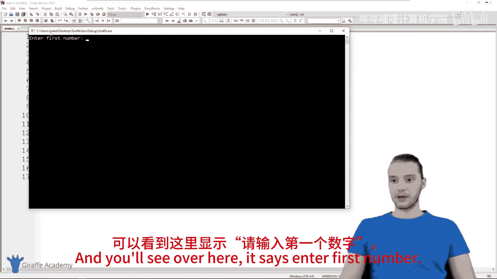

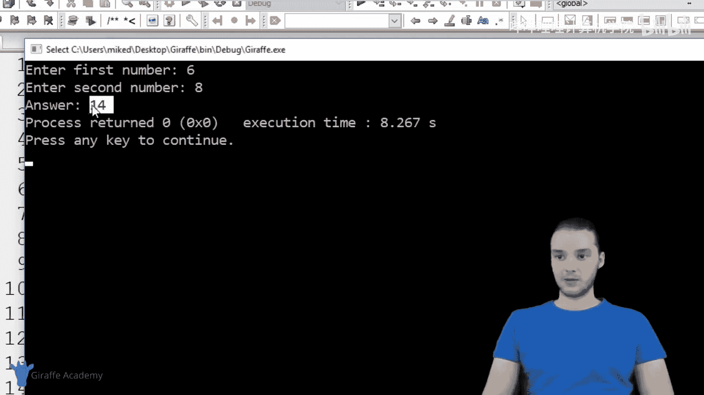

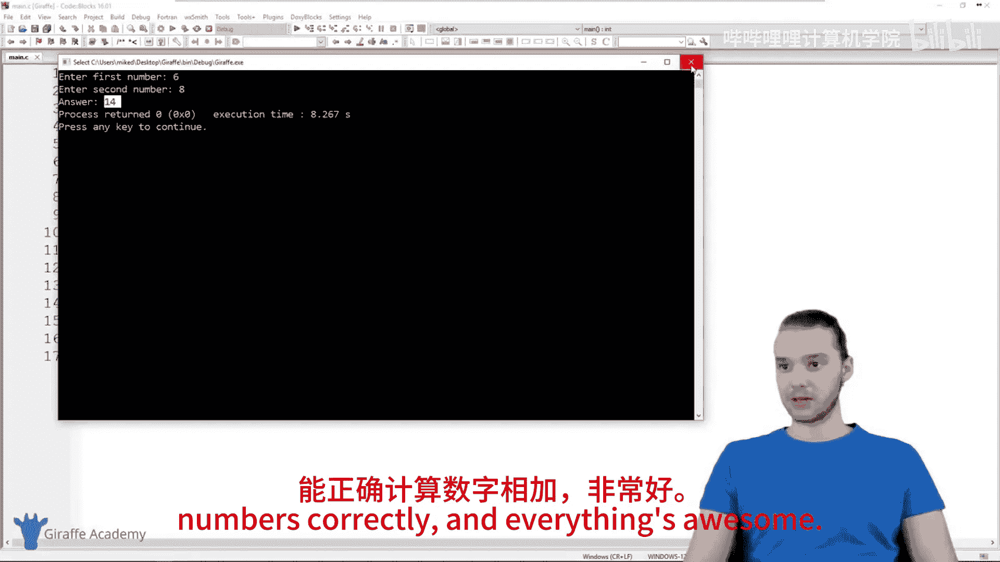

```c
printf("答案是：%f\n", num1 + num2);
```

**注意**：在 `printf` 函数中打印双精度浮点数时，我们使用 `%f` 格式说明符。这与 `scanf` 中使用的 `%lf` 有所不同。

## 完整代码示例

将以上所有步骤组合起来，就得到了我们基础计算器的完整代码：

```c
#include <stdio.h>

int main() {
    double num1;
    double num2;

    printf("请输入第一个数字：");
    scanf("%lf", &num1);

    printf("请输入第二个数字：");
    scanf("%lf", &num2);

    printf("答案是：%f\n", num1 + num2);

    return 0;
}
```

## 程序运行示例

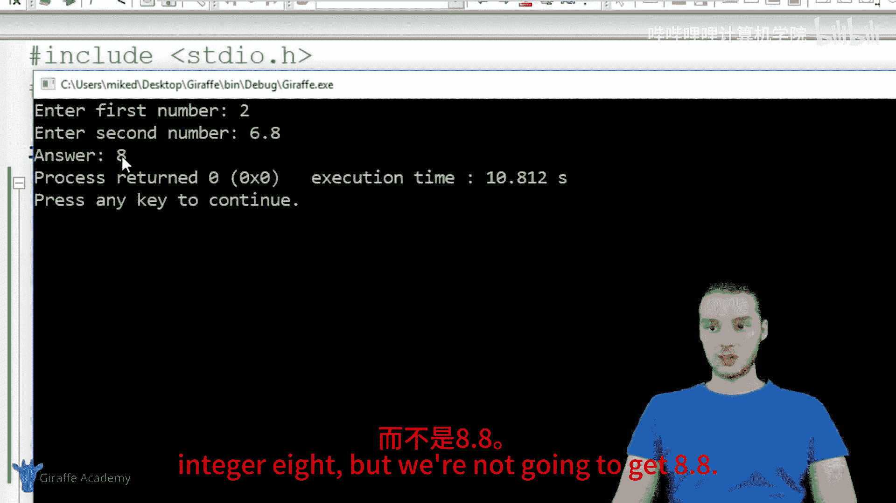

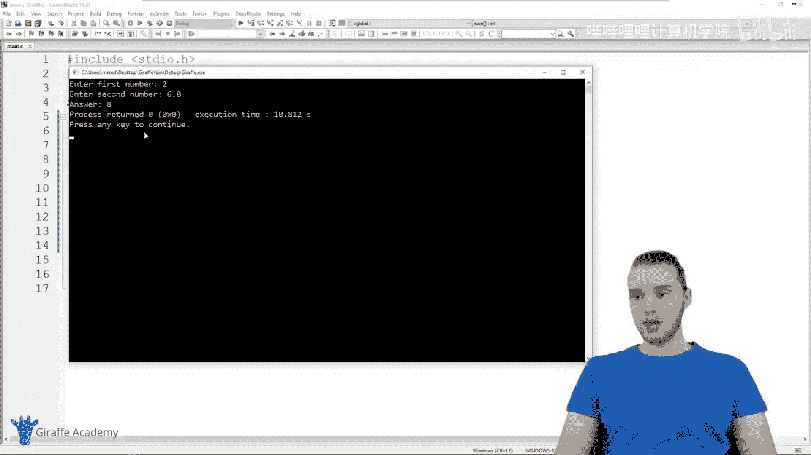

运行上述程序，你可能会看到如下交互过程：

```
请输入第一个数字：4.5
请输入第二个数字：6.7
答案是：11.200000
```

程序正确地将 4.5 和 6.7 相加，得到了 11.2。

## 当前程序的局限性

需要指出的是，我们构建的这个计算器程序还非常基础。例如，如果用户没有输入数字，而是输入了字母或单词，程序将无法正确处理，可能会导致运行错误或输出无意义的结果。

随着课程的深入，我们将学习各种方法来验证用户输入是否正确，并处理各种意外情况，从而使程序更加健壮。

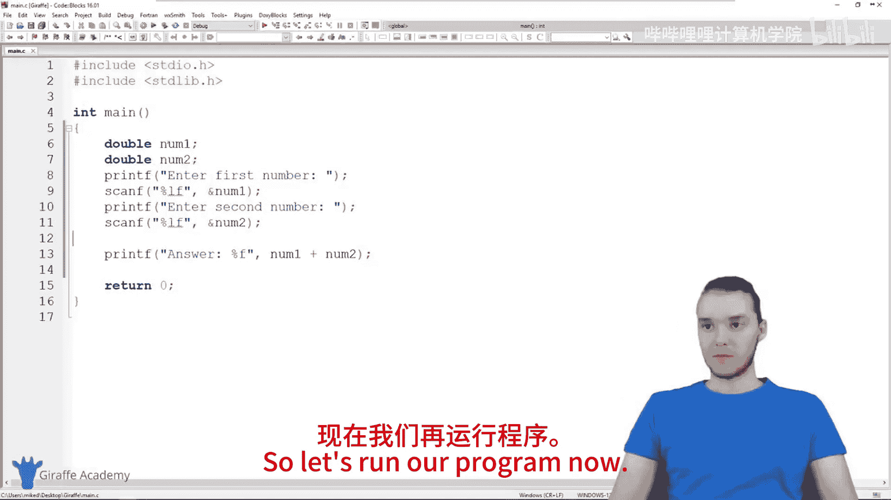

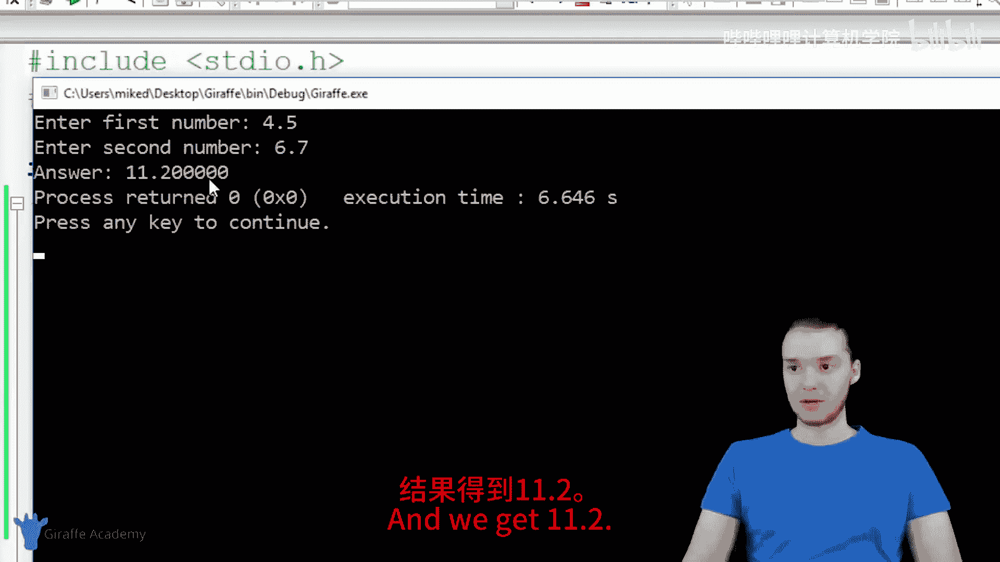

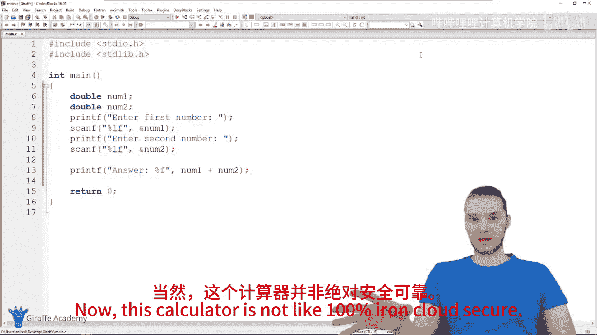

## 总结

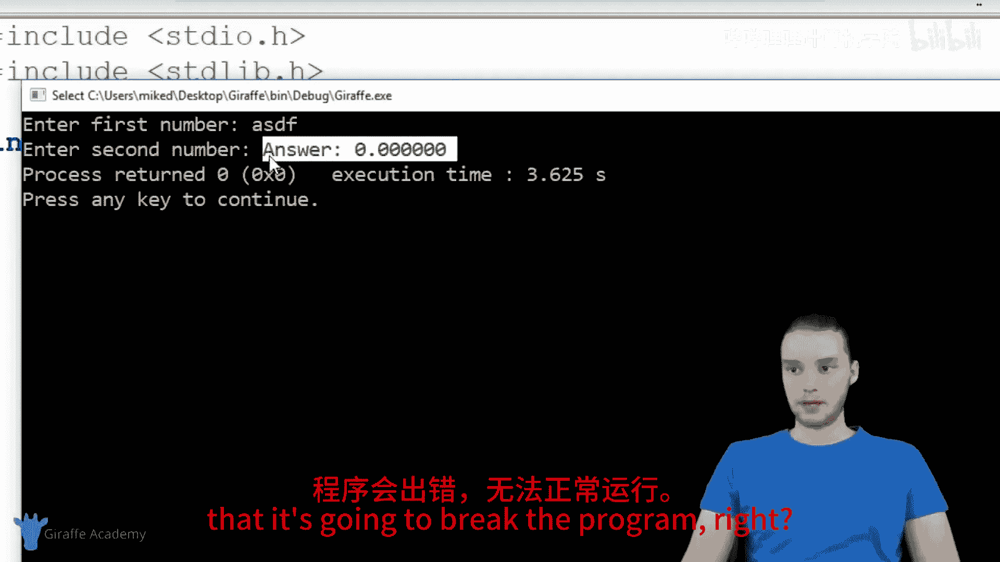

在本节课中，我们一起学习了如何构建一个基础的C语言计算器。我们掌握了以下核心技能：
*   使用 `printf` 输出提示信息。
*   使用 `scanf` 获取用户输入的数字，并理解了对非字符串类型使用 `&` 符号的必要性。
*   区分了在 `scanf` 和 `printf` 中处理双精度浮点数 (`double`) 的不同格式说明符 (`%lf` 与 `%f`)。
*   将输入的值存储在变量中并进行基本的算术运算。

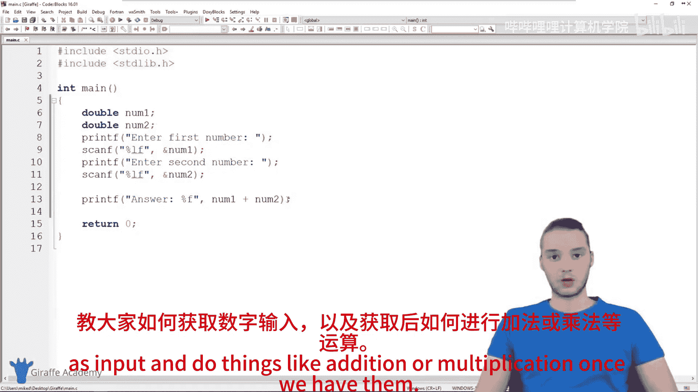


你现在已经拥有了一个可以处理小数加法的基本计算器程序。这是处理用户输入和进行数学运算的重要第一步。