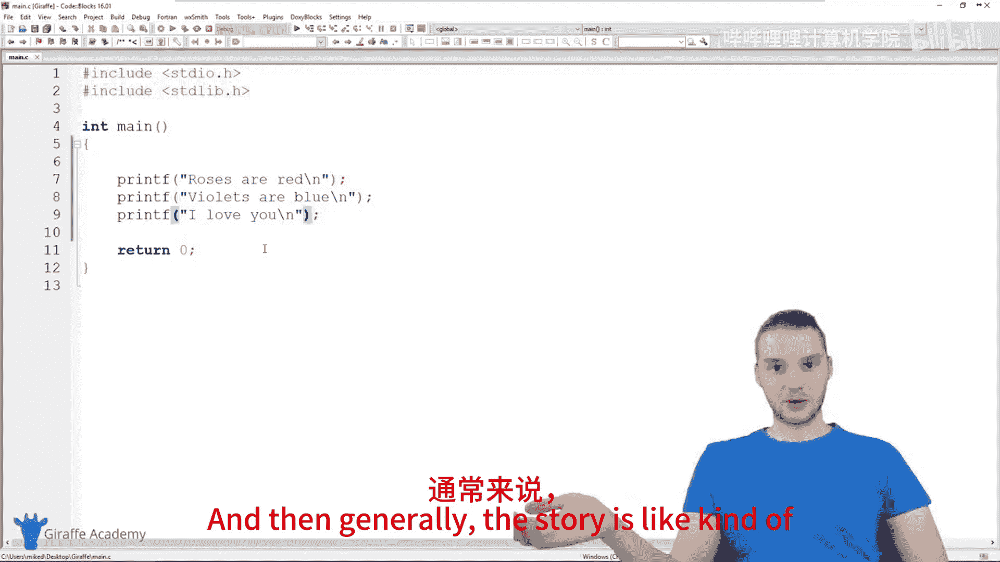
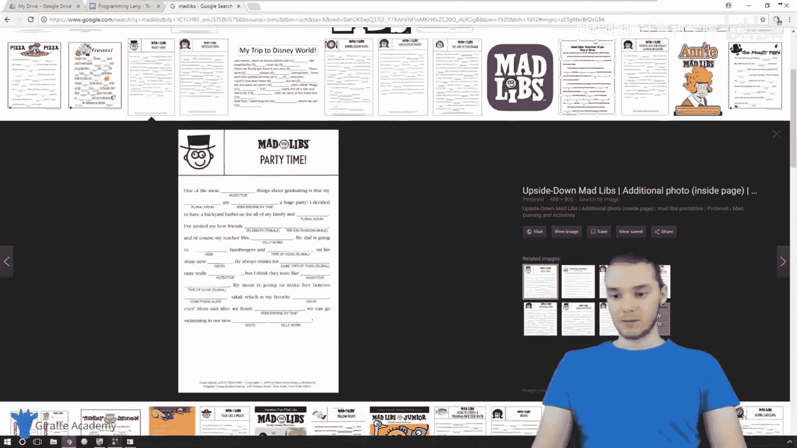
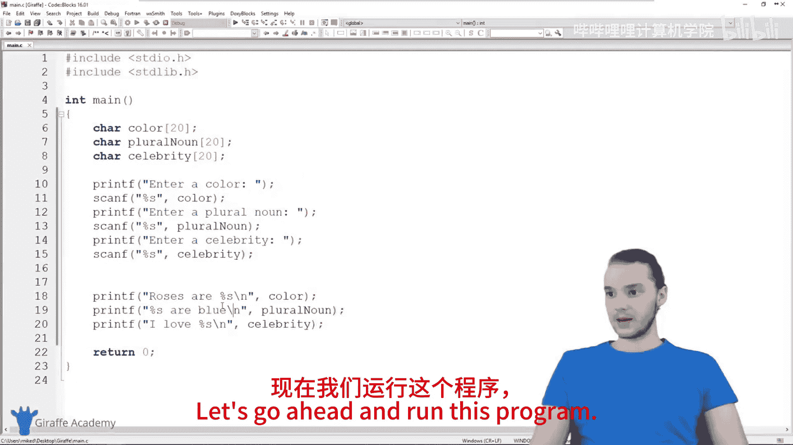
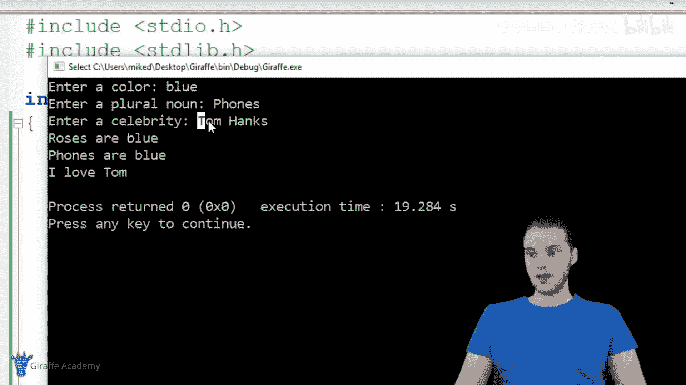
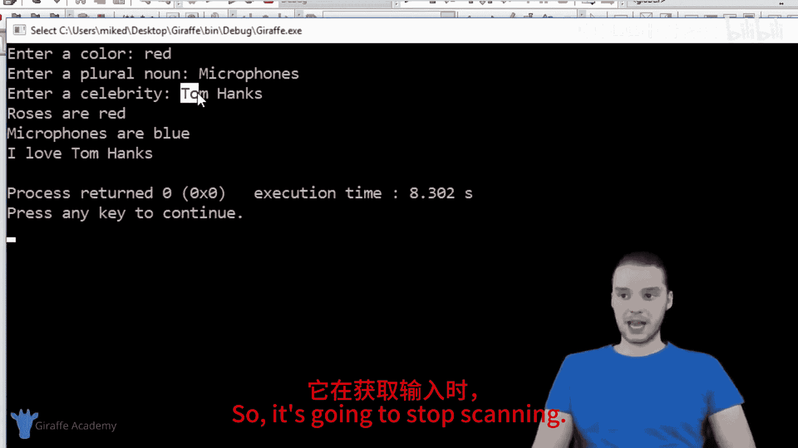
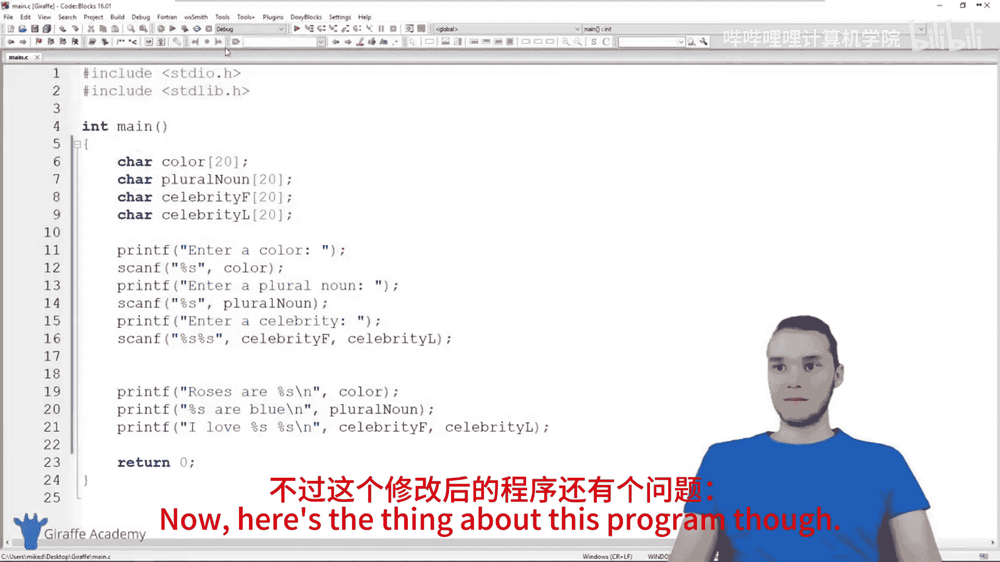
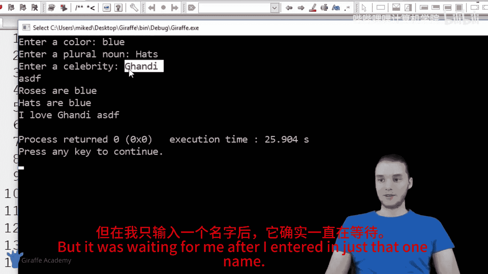
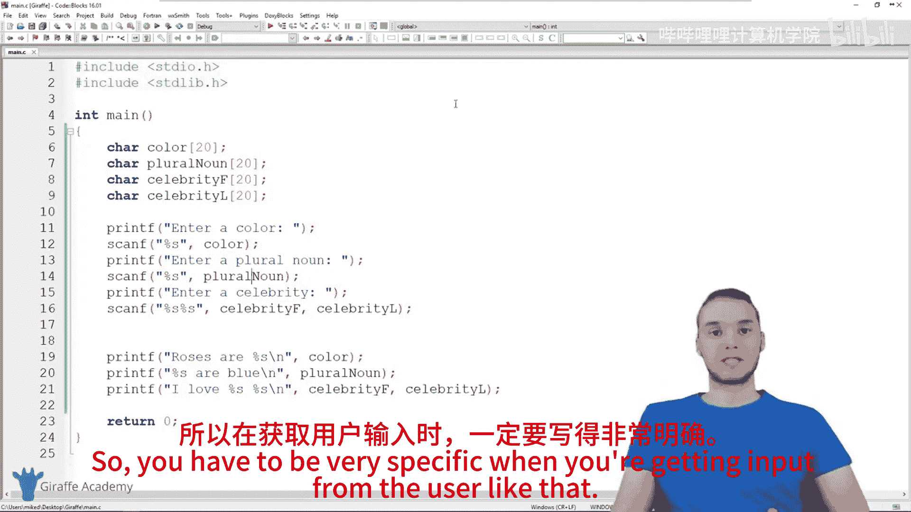

# 014：构建Mad Libs游戏 🎮

在本节课中，我们将学习如何使用C语言构建一个简单的文字游戏——Mad Libs。我们将通过这个项目，进一步练习使用`scanf`函数从用户那里获取输入，并将输入的数据整合到一个故事中。

---

## 概述

Mad Libs是一种填空游戏。玩家需要提供一些特定类型的词语（如名词、动词、颜色、名人等），这些词语随后会被填入一个预设的故事模板中，从而生成一个通常很滑稽的新故事。

我们将创建一个程序，让用户输入一种颜色、一个复数名词和一位名人的名字，然后用这些词填充一首经典的小诗。





---

## 创建变量存储用户输入

首先，我们需要创建变量来存储用户将要输入的信息。由于这些信息是词语（字符串），我们需要使用字符数组来存储它们。同时，我们需要指定数组的大小，以便C语言知道需要分配多少内存。

以下是创建三个字符数组变量的代码，每个数组最多能存储20个字符（包括字符串结尾的空字符`\0`）：

```c
char color[20];
char pluralNoun[20];
char celebrity[20];
```

---

## 获取用户输入

上一节我们介绍了变量的创建，本节中我们来看看如何从用户那里获取输入。我们需要使用`printf`函数提示用户，然后使用`scanf`函数接收输入并将其存储到我们创建的变量中。

以下是提示用户并获取输入的代码：

```c
printf("Enter a color: ");
scanf("%s", color);

printf("Enter a plural noun: ");
scanf("%s", pluralNoun);

printf("Enter a celebrity: ");
scanf("%s", celebrity);
```

**注意**：当使用`scanf`读取字符串时，我们**不需要**在变量名前使用`&`符号。数组名本身就可以作为其首地址使用。

---

## 构建并输出故事

现在我们已经获取了所有用户输入，接下来需要将它们填入我们的故事模板中。我们将使用`printf`函数，并用`%s`占位符来插入字符串变量。

以下是输出最终故事的代码：

```c
printf("Roses are %s\n", color);
printf("%s are blue\n", pluralNoun);
printf("I love %s\n", celebrity);
```

---

## 测试程序

让我们运行程序，看看效果。假设用户输入如下：
*   颜色：`magenta`
*   复数名词：`microwaves`
*   名人：`Prince`

程序将输出：
```
Roses are magenta
microwaves are blue
I love Prince
```



程序运行成功！我们成功获取了用户输入，并将其整合到了故事中。

---

## 处理输入中的空格

然而，我们的程序存在一个限制。`scanf`函数在读取字符串时，会在遇到第一个**空白字符**（如空格、制表符）时停止。这意味着如果用户输入的名人名字包含空格（例如“Tom Hanks”），程序只会读取“Tom”。

为了解决这个问题，我们可以将名人的输入拆分为两个部分：名和姓。

以下是修改后的变量声明和输入获取代码：

```c
char color[20];
char pluralNoun[20];
char celebrityF[20]; // 名
char celebrityL[20]; // 姓

printf("Enter a color: ");
scanf("%s", color);

printf("Enter a plural noun: ");
scanf("%s", pluralNoun);

printf("Enter a celebrity (first and last name): ");
scanf("%s %s", celebrityF, celebrityL); // 读取两个以空格分隔的字符串
```



相应地，输出语句也需要修改：

```c
printf("Roses are %s\n", color);
printf("%s are blue\n", pluralNoun);
printf("I love %s %s\n", celebrityF, celebrityL);
```


现在，当用户输入“Tom Hanks”时，程序就能正确输出全名了。

---

## 关于`scanf`的注意事项





这个修改也带来了新的考量。现在程序**强制要求**用户输入两个词作为名人的名字。如果用户只想输入一个词（例如“Gandhi”），程序会等待用户输入第二个词，这可能导致体验不佳。

这说明了在使用`scanf`时，程序员必须非常明确地规定用户输入的格式。你需要根据程序的实际需求来设计输入逻辑。

---

## 总结

本节课中我们一起学习了如何构建一个简单的Mad Libs游戏。我们回顾了以下核心概念：
1.  使用字符数组（如`char variable[20]`）声明字符串变量。
2.  使用`printf`和`scanf("%s", variableName)`获取用户输入的字符串。
3.  理解`scanf`在读取字符串时遇到空格会停止的特性。
4.  通过使用多个`%s`格式符（如`scanf("%s %s", var1, var2)`）来读取包含空格的输入。






通过这个项目，你不仅练习了基本的输入输出操作，还了解了处理用户输入时需要考虑的细节。