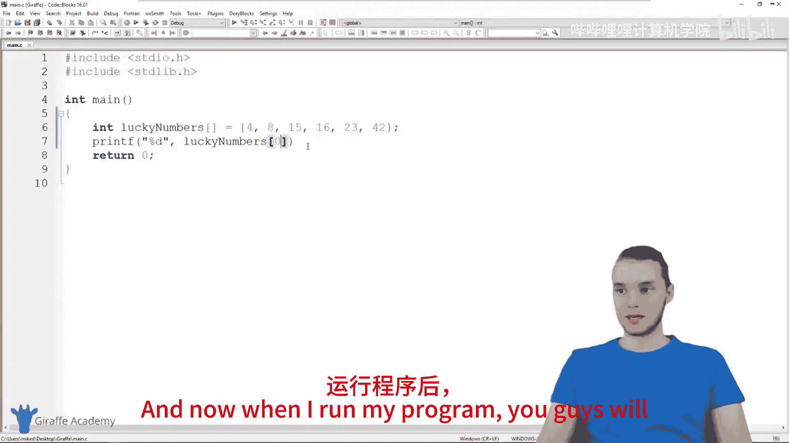
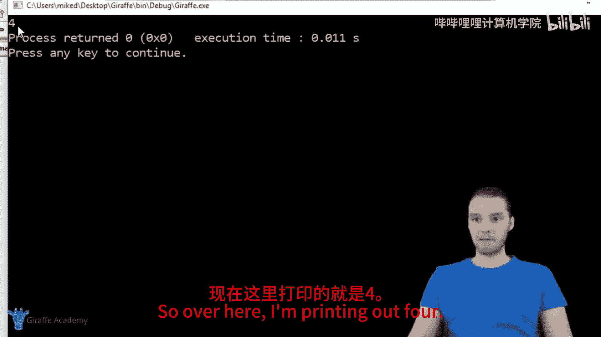
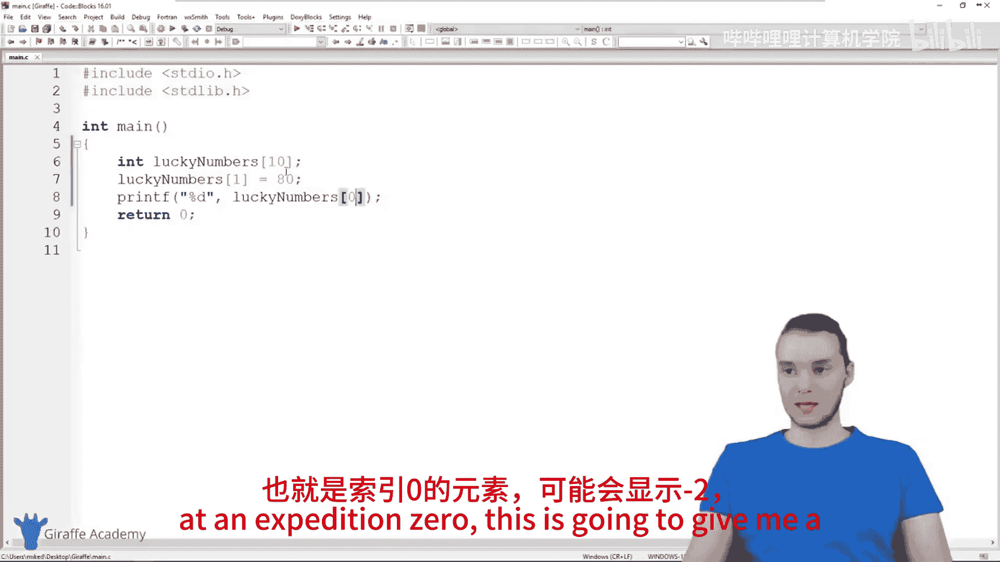
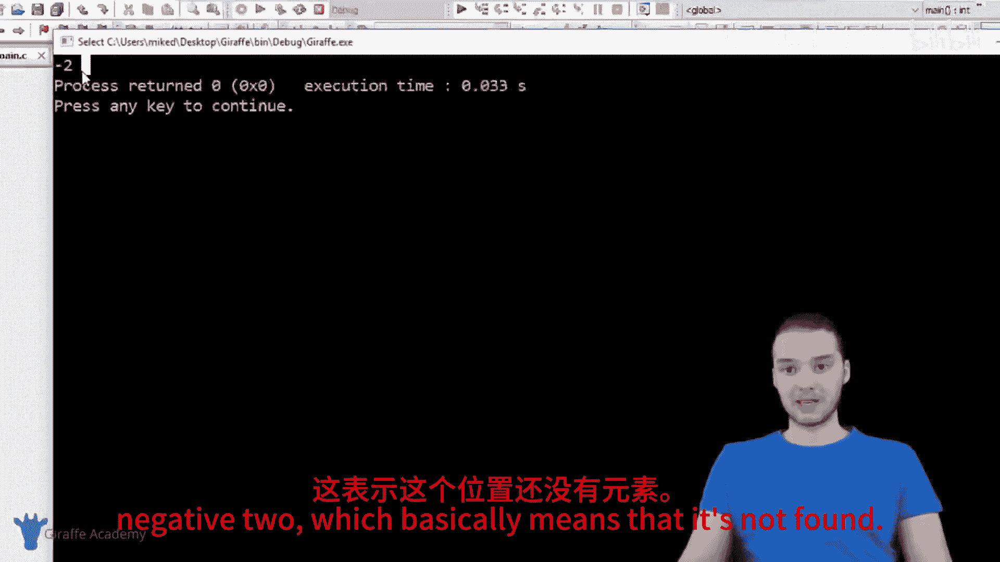
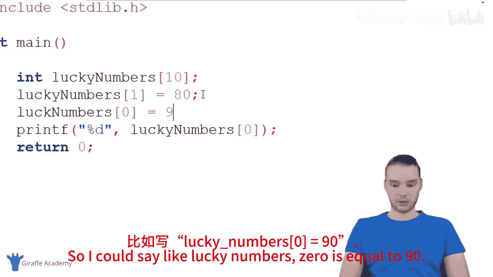
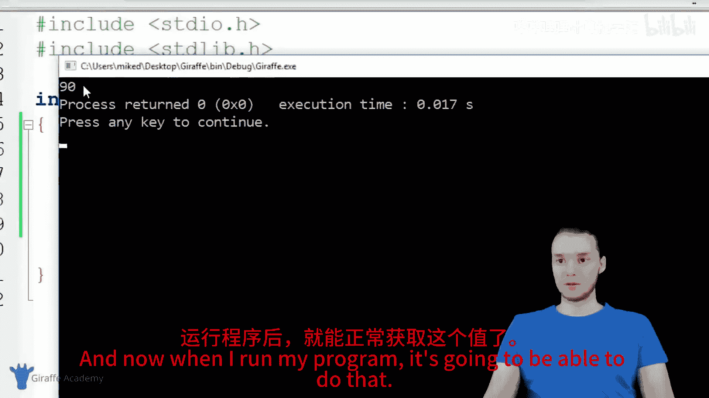
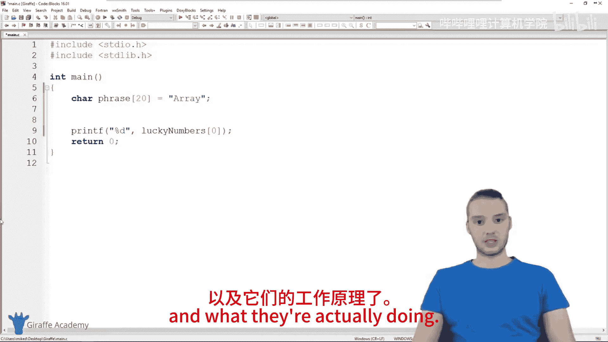

# 015：数组 📚

在本节课中，我们将要学习C语言中一个非常重要的概念——**数组**。很多时候，当我们编写C程序时，需要处理大量相关的数据。为了有效地控制、管理和组织这些数据，我们可以使用数组。数组就像一个容器，可以存储多个数据值，这比创建大量单独的变量要高效得多。

## 什么是数组？🤔

上一节我们介绍了变量的基本概念。本节中我们来看看数组。数组本质上是一种数据结构，它允许我们在一个容器中存储多个数据值。与只能存储一个值的变量不同，一个数组可以存储成百上千甚至数百万个值。例如，你可以在一个数组中存储5个、7个、10个数字或20个字符，从而让程序中的数据变得整洁有序。

## 如何创建数组？🔨

创建数组与创建变量非常相似。变量用于定义一个存储单个值的容器，而数组用于定义一个可以存储任意数量值的容器。

创建数组时，首先需要告诉C语言我们想要在数组中存储什么类型的数据。例如：
*   `int`：创建一个存储整数的数组。
*   `char`：创建一个存储字符的数组。
*   `double`：创建一个存储双精度浮点数的数组。

以下是创建数组的最简单方法，即在声明时直接初始化其值：

```c
int luckyNumbers[] = {4, 8, 15, 16, 23, 42};
```

在这行代码中：
*   `int` 指定了数组存储整数。
*   `luckyNumbers` 是数组的名称。
*   `[]` 方括号告诉C语言这是一个数组。
*   `{4, 8, 15, 16, 23, 42}` 花括号内是用逗号分隔的初始值列表。

## 如何访问和修改数组元素？🔍

所有存储在数组中的数据都被称为**元素**。为了访问特定的元素，我们需要使用元素的**索引**。

在C语言中，数组的索引从 **0** 开始计数。这意味着：
*   第一个元素（4）的索引是 **0**。
*   第二个元素（8）的索引是 **1**。
*   第三个元素（15）的索引是 **2**，依此类推。

我们可以通过数组名后跟方括号和索引来访问元素：





```c
printf("%d", luckyNumbers[0]); // 这将打印出 4
printf("%d", luckyNumbers[2]); // 这将打印出 15
```

我们也可以像修改变量一样修改数组中的元素：

```c
luckyNumbers[1] = 200; // 将索引1的元素（原来的8）修改为200
printf("%d", luckyNumbers[1]); // 现在将打印出 200
```

从概念上讲，数组就像存储了一堆没有独立名称的变量，你可以通过索引来操作它们。

## 如何创建空数组？📦

有时，我们在创建数组时可能还不知道要存储哪些具体值。这时，我们可以先创建一个指定容量的空数组。

以下是创建空数组的方法：

```c
int luckyNumbers[10];
```

在这行代码中：
*   `[10]` 指定了这个整数数组最多可以容纳 **10** 个元素。
*   C语言会根据这个信息为数组分配足够的内存空间。

之后，我们可以再为特定索引位置的元素赋值：

```c
luckyNumbers[1] = 80;
luckyNumbers[0] = 90;
printf("%d", luckyNumbers[1]); // 打印出 80
```

需要注意的是，如果尝试访问一个尚未被赋值的元素（例如初始状态下的 `luckyNumbers[0]`），可能会得到一个不可预知的值（在演示中显示为-2），因为它对应的内存位置还没有被初始化。





## 字符串就是字符数组 🧵

现在，我们可以重新审视一个之前已经使用过但未深入解释的概念：**字符串**。





在C语言中，字符串实际上就是**字符数组**。例如：

```c
char phrase[] = "Draft Academy";
// 或者
char phrase[20];
```

当我们创建一个字符串时，本质上就是在创建一个 `char` 类型的数组。C语言为了方便我们处理文本，对字符数组（字符串）提供了一些特殊的语法支持（比如用双引号初始化），但其底层原理仍然是数组。理解这一点，能让你更清楚地知道字符串是如何工作的。

## 总结 📝



本节课中我们一起学习了C语言中的数组。我们了解到数组是一种用于存储多个相同类型数据的数据结构。我们学习了如何创建和初始化数组，如何通过从0开始的索引来访问和修改数组中的元素，以及如何先声明一个指定大小的空数组。最后，我们还揭示了字符串的本质其实就是字符数组。掌握数组是组织和管理程序数据的关键一步。