# 016：函数 🧩

在本节课中，我们将要学习C语言中一个非常核心的概念——**函数**。函数本质上是一段执行特定任务的代码集合。通过将代码组织成函数，我们可以让程序结构更清晰，代码更易于复用和维护。

## 概述：什么是函数？

函数是执行特定任务的代码块。你可以将多行代码（例如五、六行甚至二十行）放入一个函数中。当你需要执行这些代码时，只需“调用”该函数即可。通常，我们会根据函数要完成的任务来为其命名。

上一节我们介绍了程序的基本结构，本节中我们来看看如何创建和使用函数。

## 创建你的第一个函数

实际上，我们一直在使用一个特殊的函数：`main`函数。`main`函数是程序开始运行时自动执行的函数。但我们可以创建自己的函数。

要创建一个函数，我们需要告诉C语言两件事：
1.  **函数的返回类型**：即函数执行完毕后会返回什么类型的数据。目前我们先使用`void`，表示该函数不返回任何信息。
2.  **函数的名称**：通常根据函数的功能来命名。

以下是创建一个简单函数的步骤：

```c
void sayHi() {
    printf("Hello user\n");
}
```

*   `void` 是返回类型。
*   `sayHi` 是函数名。
*   大括号 `{}` 内的代码是函数体，即函数要执行的操作。

## 调用函数

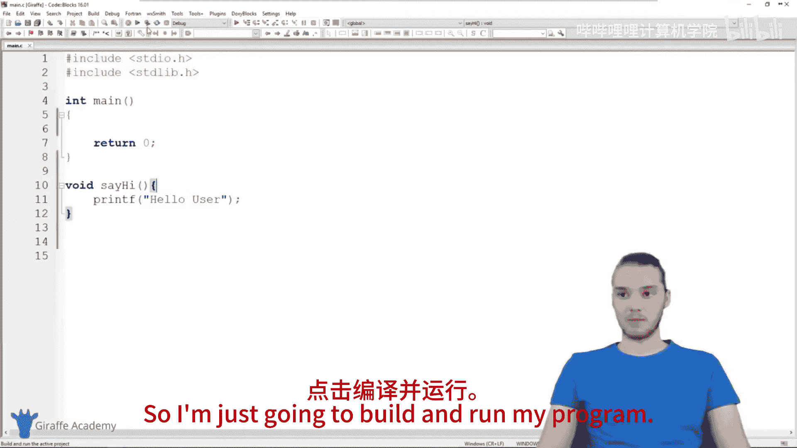

仅仅定义函数，其中的代码并不会自动执行。我们必须“调用”它。调用函数意味着告诉C语言去执行该函数内部的所有代码。

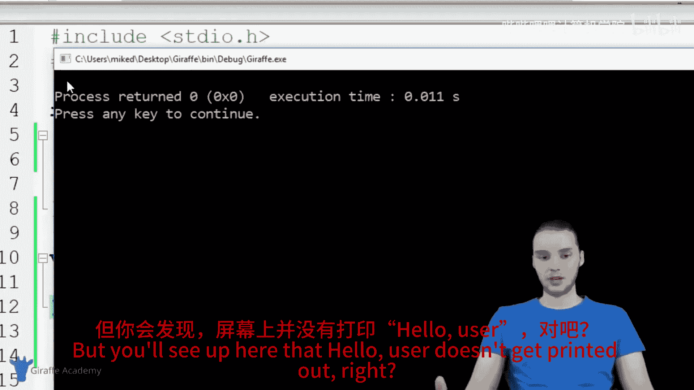

调用函数的方法很简单：写下函数名，后面加上一对圆括号 `()`。

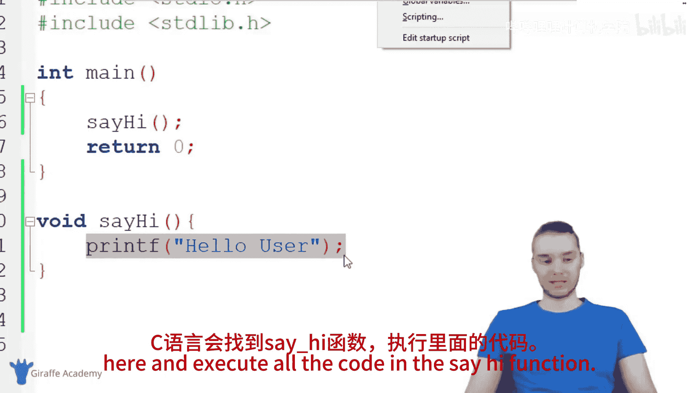

```c
int main() {
    sayHi(); // 调用 sayHi 函数
    return 0;
}
```

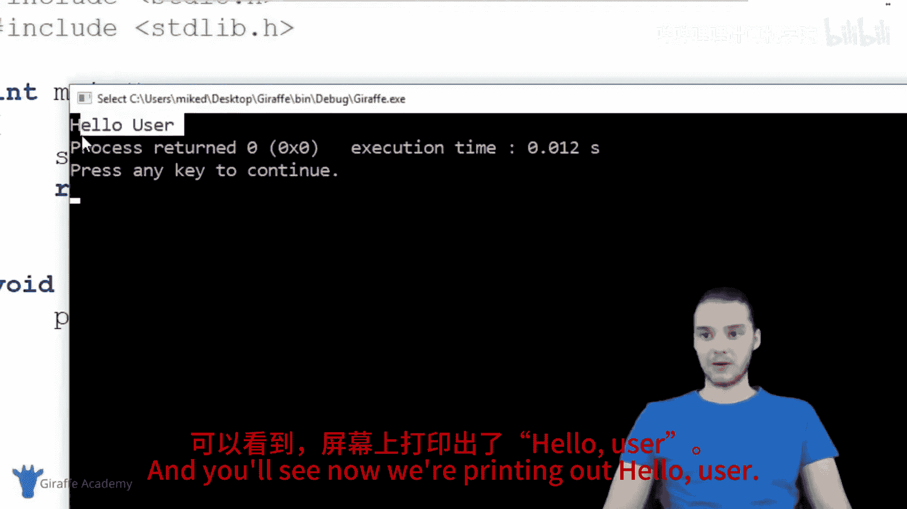

程序执行时，会先运行`main`函数，当遇到`sayHi();`这行代码时，就会跳转到`sayHi`函数的定义处，执行其内部的`printf`语句，然后再返回到`main`函数继续执行后续代码。

## 为函数添加参数

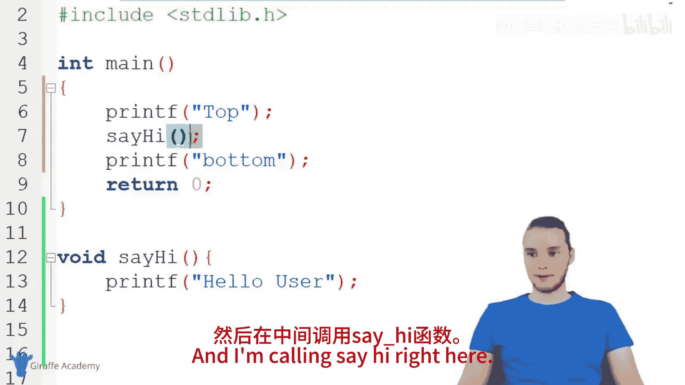

函数可以接收外部传入的信息，这称为**参数**。参数使得函数更加灵活和强大。

例如，我们可以改造`sayHi`函数，让它向特定的人问好：

```c
void sayHi(char name[]) {
    printf("Hello %s\n", name);
}
```

现在，`sayHi`函数需要一个类型为`char[]`（字符串）的参数，我们将其命名为`name`。在函数体内，我们可以使用这个`name`变量。

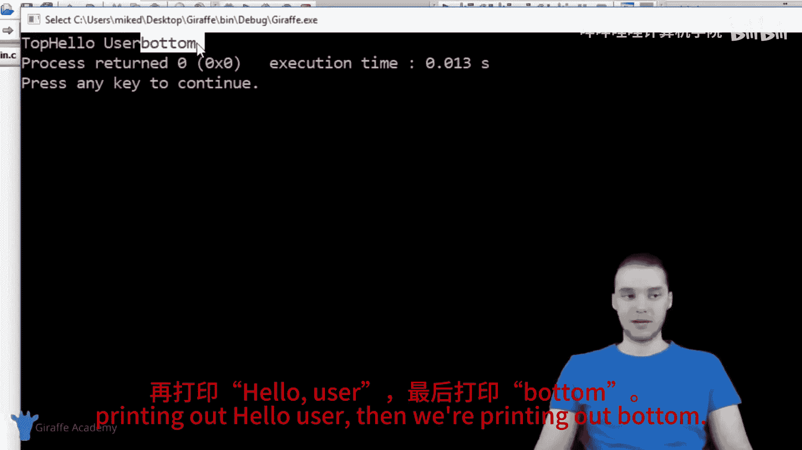

调用带参数的函数时，必须在括号内提供一个对应类型的值：

```c
int main() {
    sayHi("Mike");
    sayHi("Tom");
    sayHi("Oscar");
    return 0;
}
```

这样，同一个函数就能根据我们传入的不同参数，输出不同的问候语。

## 使用多个参数

函数可以接受多个参数。你只需要在定义函数时，在括号内按顺序声明它们，并用逗号分隔。

以下是带两个参数的函数示例：

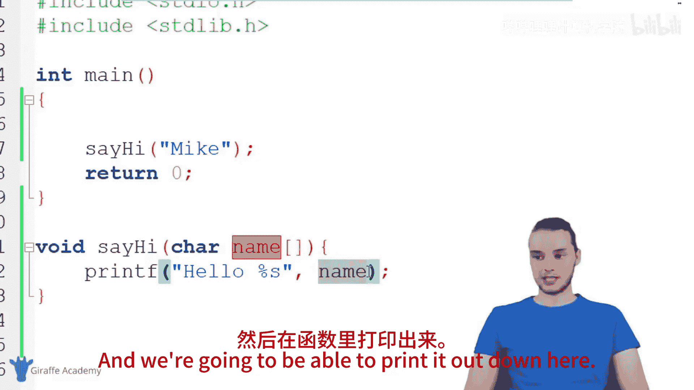

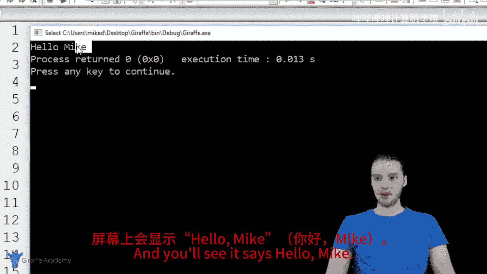

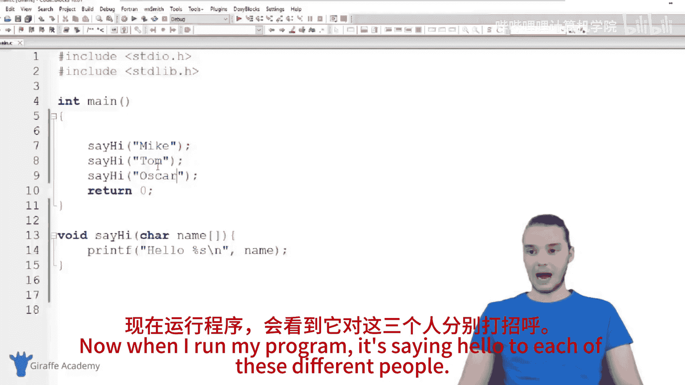

```c
void sayHi(char name[], int age) {
    printf("Hello %s, you are %d\n", name, age);
}
```

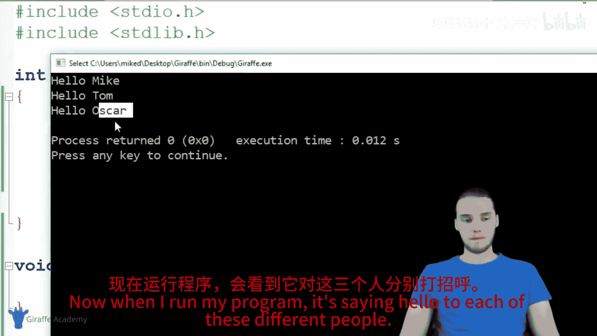

调用时，也需要按顺序提供两个对应的值：

```c
int main() {
    sayHi("Mike", 40);
    sayHi("Tom", 23);
    sayHi("Oscar", 70);
    return 0;
}
```

## 总结

本节课中我们一起学习了C语言函数的基础知识：
*   函数是**执行特定任务的代码块**。
*   使用函数可以使代码**模块化、易于复用**。
*   创建函数需要指定**返回类型**和**函数名**。
*   函数内的代码需要通过**调用函数**来执行。
*   函数可以接收**参数**，这使函数能根据不同的输入执行相应的操作。
*   一个函数可以定义**多个参数**，调用时必须按顺序提供所有参数的值。

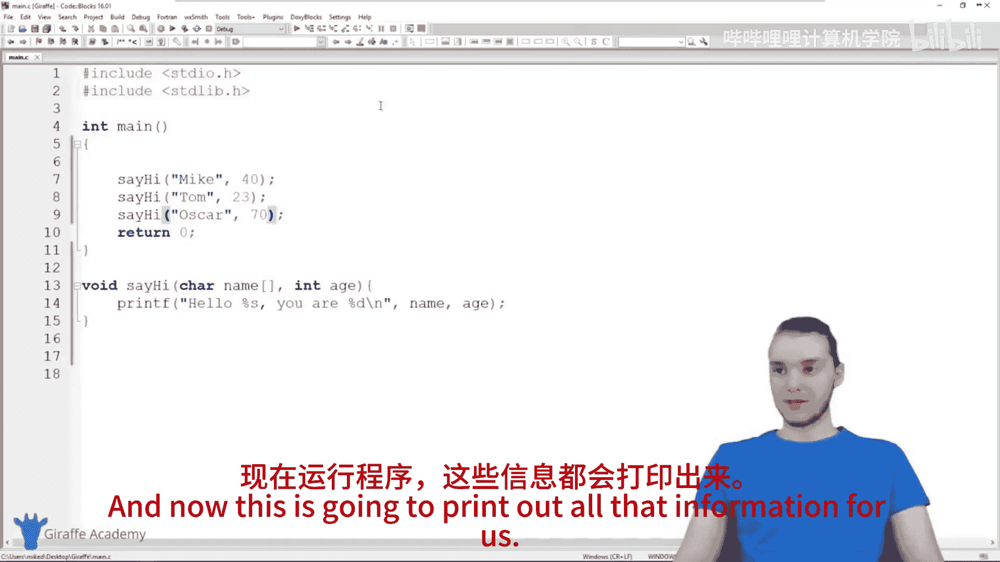

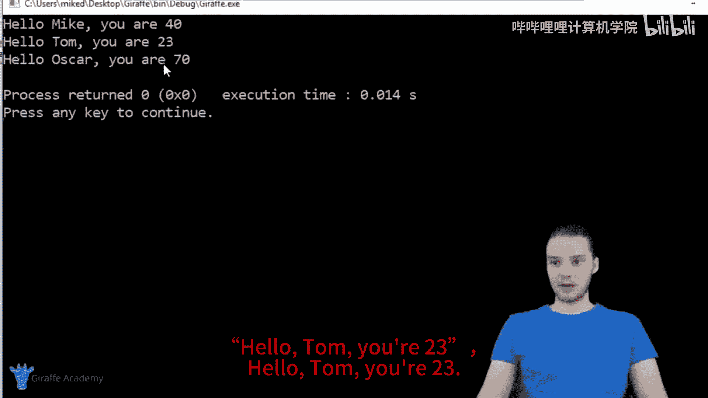

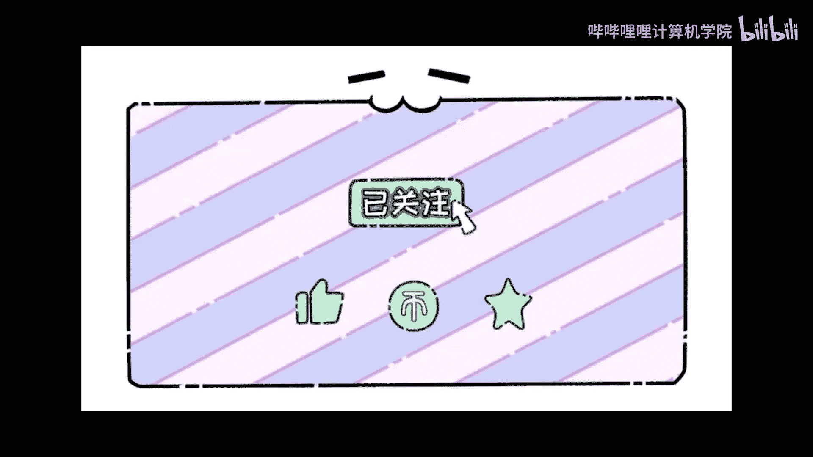

理解函数是掌握结构化编程的关键。在下一节中，我们将深入探讨函数的**返回类型**，学习如何让函数将计算结果等信息返回给调用者。