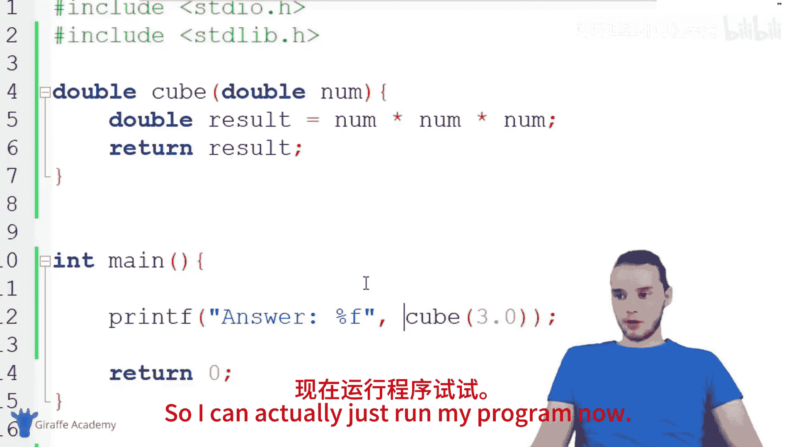
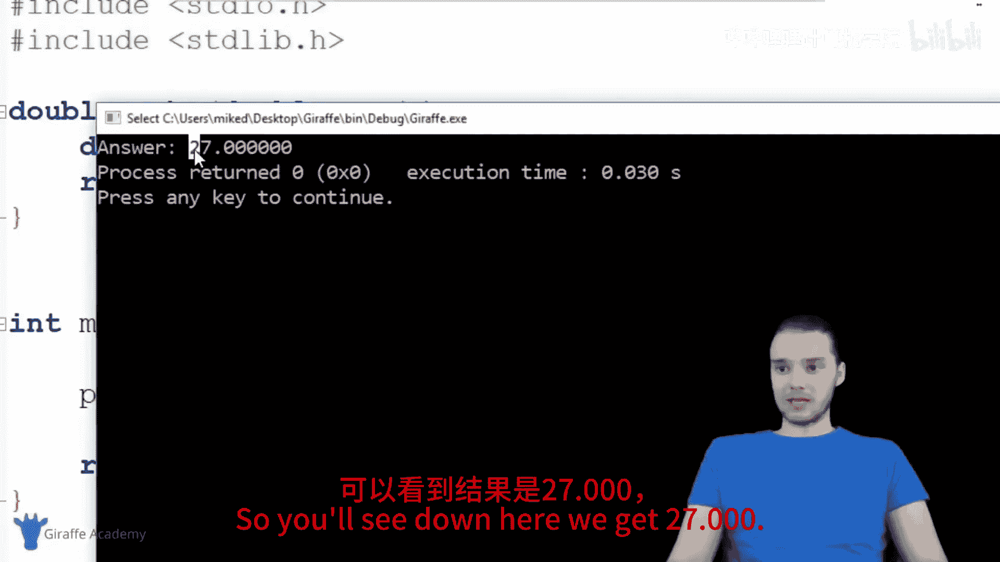
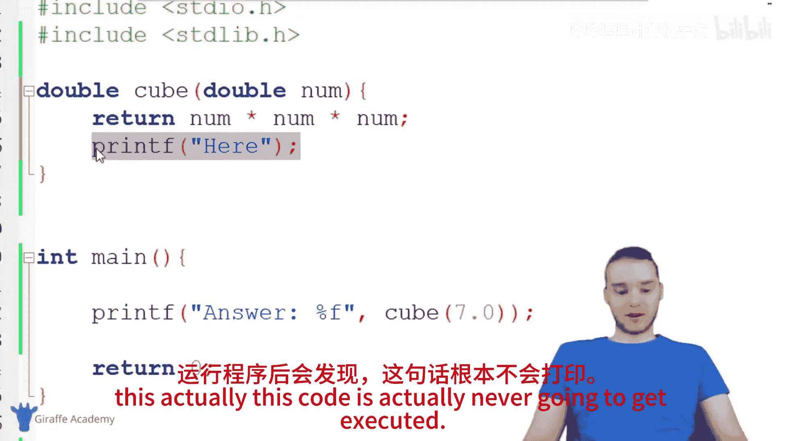
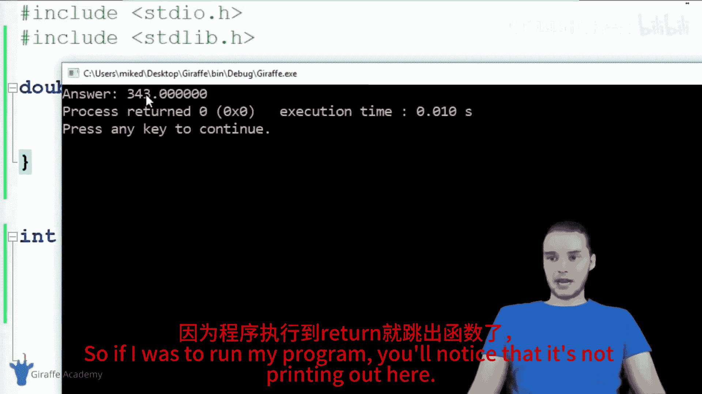
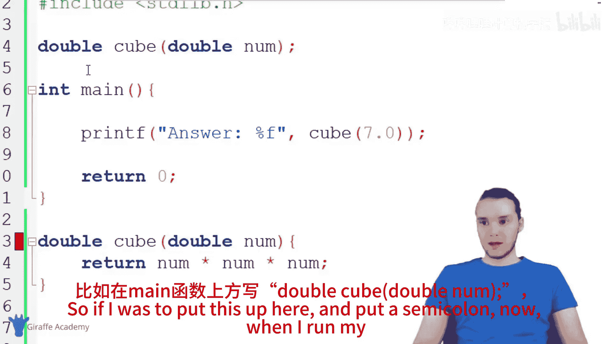
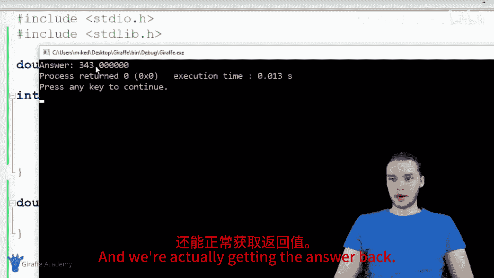
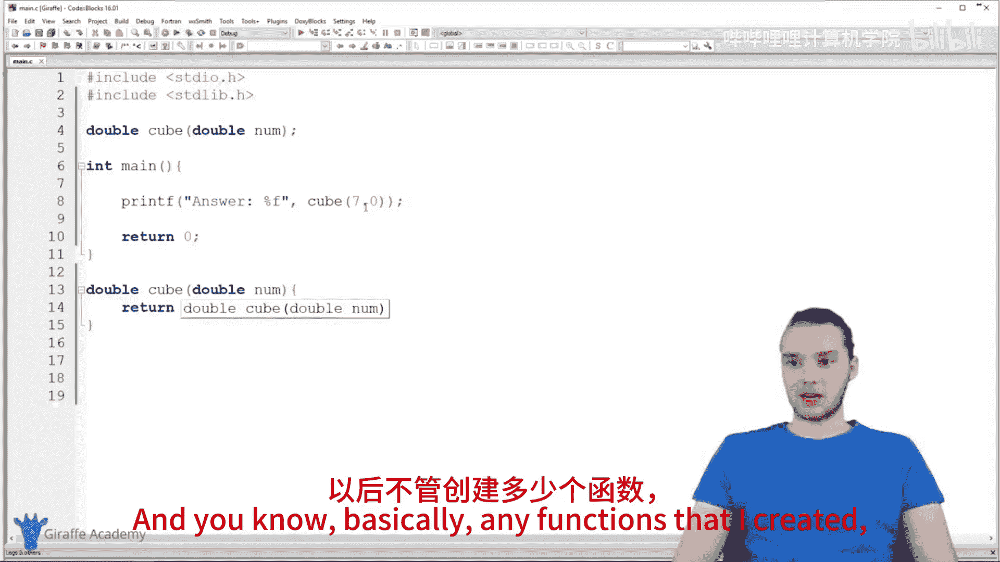
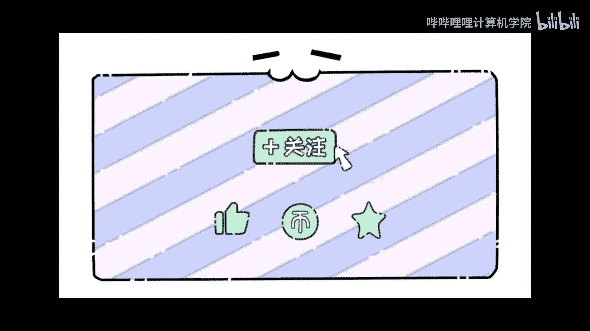

# 017：return语句详解 🧮

在本节课中，我们将要学习C语言中`return`语句的用法。`return`语句是函数中的一行特殊代码，它允许函数将信息返回给调用者。通过`return`语句，函数可以返回操作结果、状态信息或其他任何数据。

## 概述

`return`语句在函数中扮演着重要角色。它不仅能将数据返回给调用者，还会立即终止函数的执行。本节将通过创建一个计算数字立方的函数，详细讲解`return`语句的使用方法、注意事项以及函数原型的概念。

## 创建返回值的函数

上一节我们介绍了无返回值的函数，本节中我们来看看如何创建有返回值的函数。首先需要明确函数的返回类型，这决定了函数将返回什么类型的数据。

以下是创建立方计算函数的步骤：

1.  在`main`函数上方定义函数，确保在调用前函数已被声明。
2.  指定返回类型为`double`，函数名为`cube`。
3.  函数接受一个`double`类型的参数`num`。
4.  在函数体内计算`num`的立方值。
5.  使用`return`语句将计算结果返回。

对应的函数定义如下：
```c
double cube(double num) {
    double result = num * num * num;
    return result;
}
```
或者，可以简化代码，直接返回表达式的结果：
```c
double cube(double num) {
    return num * num * num;
}
```

## 调用带返回值的函数

定义好函数后，我们可以在`main`函数中调用它。由于`cube`函数返回一个`double`类型的值，我们可以直接将函数调用放在`printf`语句中打印结果。

以下是调用函数的示例代码：
```c
#include <stdio.h>

int main() {
    printf("Answer: %f\n", cube(3.0));
    printf("Answer: %f\n", cube(7.0));
    return 0;
}
```
运行程序后，控制台将输出：
```
Answer: 27.000000
Answer: 343.000000
```

## return语句的重要特性

`return`语句有一个关键特性：一旦执行，它会立即结束当前函数的执行，并将控制权交还给调用者。





这意味着，在`return`语句之后的任何代码都不会被执行。例如，在下面的函数中，`printf("Here\n");`这行代码永远不会执行。
```c
double cube(double num) {
    return num * num * num;
    printf("Here\n"); // 这行代码永远不会执行
}
```

## 函数原型

有时，我们希望将函数定义放在`main`函数之后，以提高代码的可读性。但是，如果直接这样做，编译器在`main`函数中遇到函数调用时，会因找不到函数声明而报错。



为了解决这个问题，C语言引入了**函数原型**的概念。函数原型只包含函数的返回类型、名称和参数列表，并以分号结尾，它告诉编译器函数的存在及其格式。

以下是使用函数原型的示例：
```c
#include <stdio.h>

// 函数原型
double cube(double num);



int main() {
    printf("Answer: %f\n", cube(3.0));
    return 0;
}

// 实际的函数定义放在main函数之后
double cube(double num) {
    return num * num * num;
}
```
通过添加函数原型`double cube(double num);`，即使函数定义在`main`函数之后，程序也能正确编译和运行。

## 总结



本节课中我们一起学习了C语言`return`语句的核心用法。我们了解到：
*   `return`语句用于从函数中返回一个值。
*   它会使函数立即终止，其后的代码不会执行。
*   在调用函数之前，必须先让编译器知道函数的存在，可以通过在`main`函数之前定义函数，或者使用函数原型来实现。







掌握`return`语句是编写模块化、可重用代码的基础，它允许函数进行计算并将结果反馈给程序的其他部分。