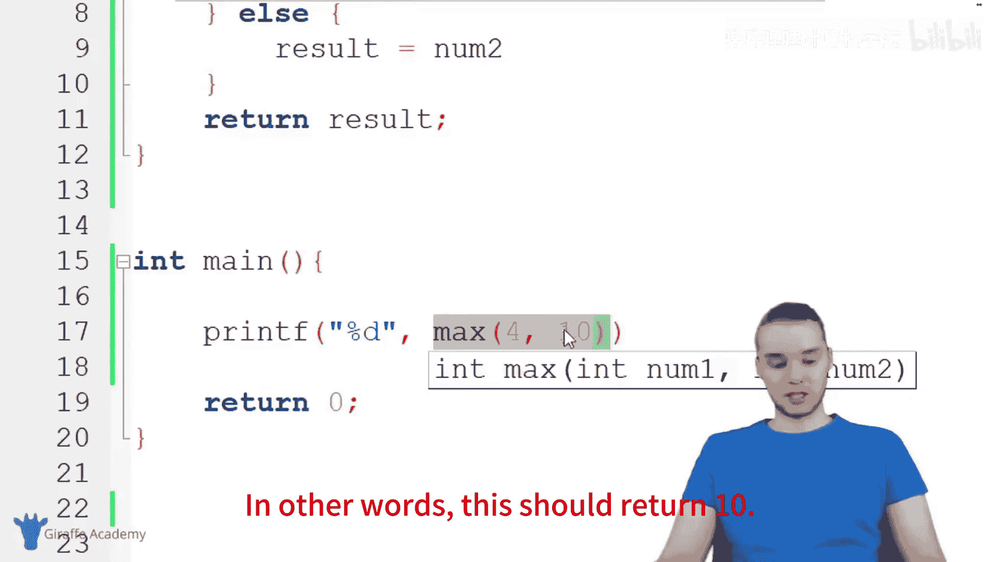
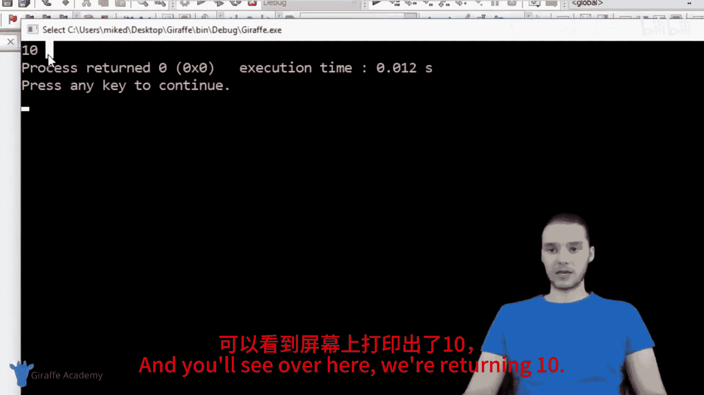
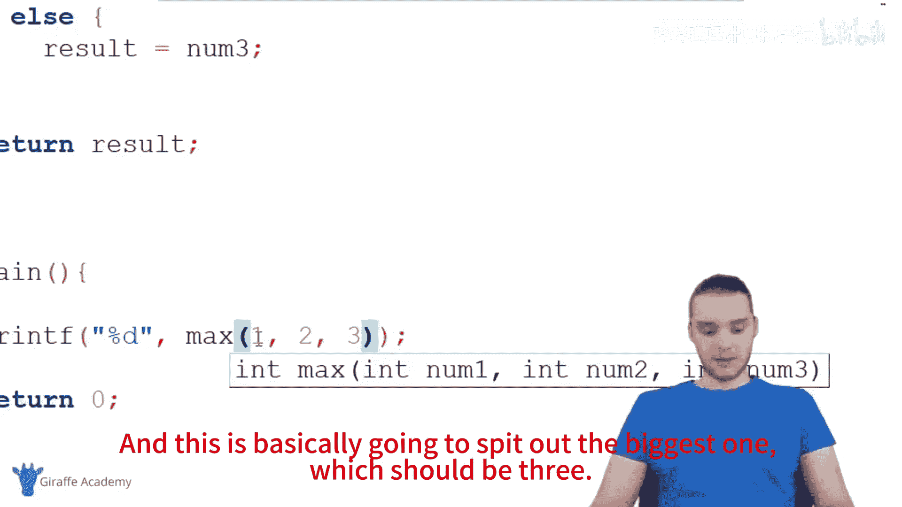
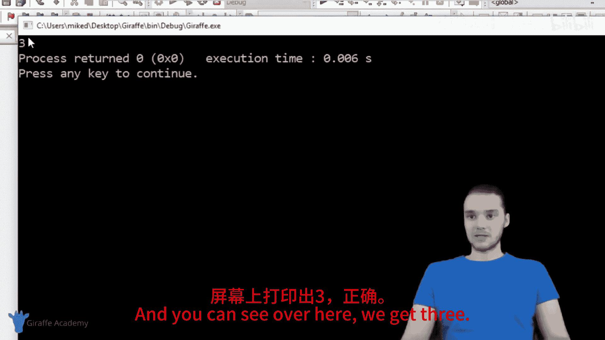
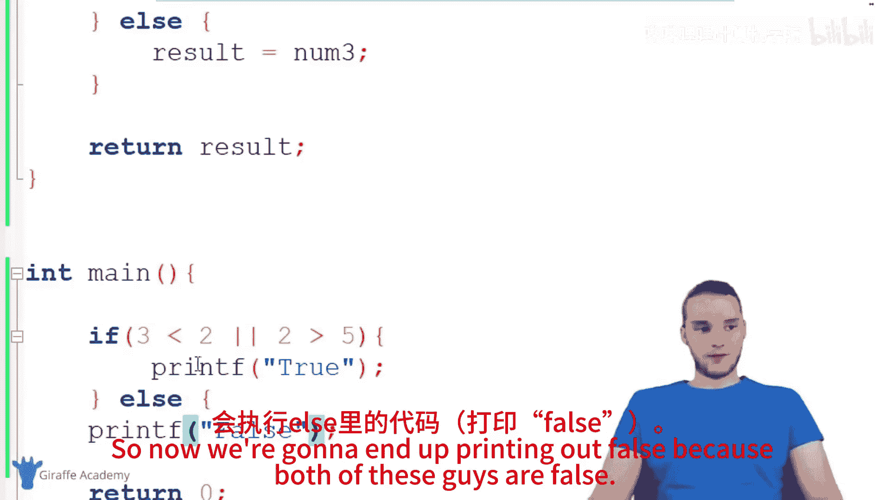
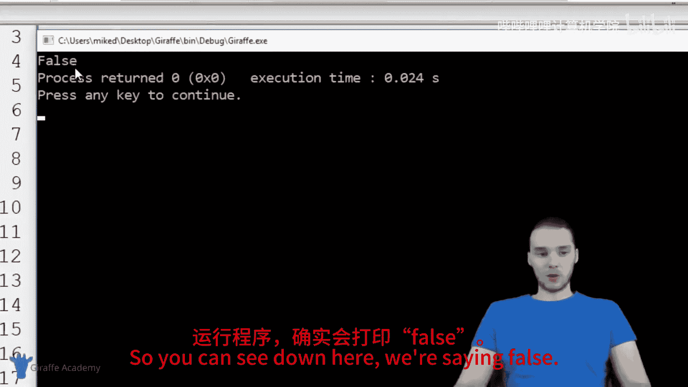
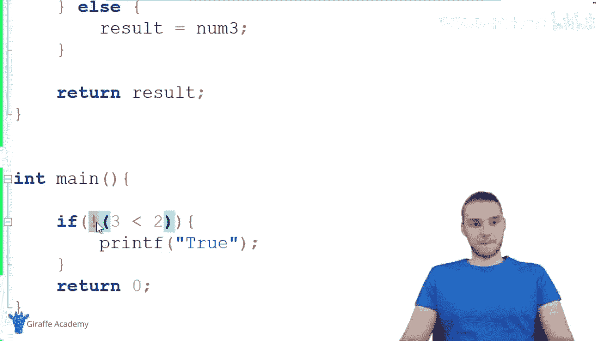

# 018：if语句详解 🧠

在本节课中，我们将要学习C语言中一个非常核心的结构——**if语句**。if语句能让我们的程序根据不同的条件做出决策，从而执行不同的代码块。这是一种为程序增添“智能”的强大工具。

## 概述

我们将通过构建一个名为 `max` 的函数来学习if语句。这个函数最初会比较两个数字的大小并返回较大的那个。之后，我们会扩展它，使其能够比较三个数字，并在这个过程中学习 `else if`、逻辑运算符（`&&` 和 `||`）以及比较运算符等更多概念。

## 构建基础的双参数max函数

首先，我们创建一个函数，它接收两个整数作为参数，并返回其中较大的一个。

```c
int max(int num1, int num2) {
    int result;
    if(num1 > num2) {
        result = num1;
    } else {
        result = num2;
    }
    return result;
}
```

**代码解析：**
1.  函数 `max` 接收两个整型参数 `num1` 和 `num2`。
2.  我们声明一个整型变量 `result` 来存储结果。
3.  `if` 语句检查条件 `num1 > num2`。
    *   如果条件为**真**，则执行花括号 `{}` 内的代码，将 `num1` 赋值给 `result`。
    *   如果条件为**假**，程序会跳过 `if` 块，执行 `else` 块内的代码，将 `num2` 赋值给 `result`。
4.  最后，函数返回 `result`。



在 `main` 函数中调用它：
```c
printf("%d", max(4, 10)); // 输出：10
printf("%d", max(40, 10)); // 输出：40
printf("%d", max(40, 40)); // 输出：40
```
这个简单的 `if-else` 结构已经能有效处理两个数的比较。

## 扩展为三参数max函数

上一节我们介绍了如何比较两个数，本节中我们来看看如何比较三个数。这需要更复杂的条件判断。



我们需要修改 `max` 函数以接收三个参数，并找出其中的最大值。

```c
int max(int num1, int num2, int num3) {
    int result;
    if(num1 >= num2 && num1 >= num3) {
        result = num1;
    } else if(num2 >= num1 && num2 >= num3) {
        result = num2;
    } else {
        result = num3;
    }
    return result;
}
```

**代码解析：**
1.  函数现在接收三个参数：`num1`, `num2`, `num3`。
2.  第一个 `if` 条件使用了逻辑与运算符 **`&&`**。
    *   条件 `num1 >= num2 && num1 >= num3` 意味着：仅当 `num1` 同时大于等于 `num2` **且** 大于等于 `num3` 时，整个表达式才为真。此时 `num1` 最大。
3.  如果第一个 `if` 条件为假，程序会检查 **`else if`** 条件。
    *   `else if` 允许我们在第一个条件不满足时，检查另一个条件。这里检查 `num2` 是否同时是最大的。
4.  如果前两个条件都为假，则执行最后的 **`else`** 块，此时 `num3` 必然是最大的。
5.  以下是调用示例：
    ```c
    printf("%d", max(1, 2, 3)); // 输出：3
    printf("%d", max(10, 5, 2)); // 输出：10
    ```

## 逻辑运算符与比较运算符

在构建三参数函数时，我们使用了 `&&`（逻辑与）。除了它，还有另一个重要的逻辑运算符 `||`（逻辑或）。同时，我们也接触了多种比较运算符。

以下是常用的比较与逻辑运算符：

*   **比较运算符**：
    *   `>` 大于
    *   `<` 小于
    *   `>=` 大于或等于
    *   `<=` 小于或等于
    *   `==` 等于（注意：双等号用于比较，单等号 `=` 用于赋值）
    *   `!=` 不等于
*   **逻辑运算符**：
    *   `&&` (逻辑与)：**两个**条件都为真时，整个表达式为真。
    *   `||` (逻辑或)：**至少一个**条件为真时，整个表达式为真。

让我们通过几个简单的例子来理解它们的区别：

```c
// 使用 &&
if (3 > 2 && 2 > 5) { // 条件1为真，条件2为假 => 整体为假
    printf("True with &&\n");
} else {
    printf("False with &&\n"); // 会执行这行
}

// 使用 ||
if (3 > 2 || 2 > 5) { // 条件1为真，条件2为假 => 整体为真（因为用了||）
    printf("True with ||\n"); // 会执行这行
}
```

## 取反运算符

有时我们需要检查某个条件是否“不成立”。这时可以使用取反运算符 **`!`**。





```c
if (3 > 2) { // 条件为真
    printf("3 > 2 is true.\n");
}



if (!(3 > 2)) { // 对真条件取反，变为假
    printf("This won't print.\n");
}



if (!(3 < 2)) { // 对假条件取反，变为真
    printf("3 is NOT less than 2.\n"); // 会执行这行
}
```
`!` 运算符放在一个条件或表达式之前，会将其布尔值反转（真变假，假变真）。

## 总结

本节课中我们一起学习了C语言中 **if语句** 的核心用法。我们从最简单的 `if-else` 开始，构建了一个比较两个数字的函数。然后，我们将其扩展为比较三个数字，并引入了 `else if` 来进行多重条件判断。

在这个过程中，我们详细讲解了：
*   **逻辑运算符** `&&` (与) 和 `||` (或) 的用法与区别。
*   完整的**比较运算符**集合：`>`, `<`, `>=`, `<=`, `==`, `!=`。
*   **取反运算符** `!` 的用法，它可以将一个条件的结果反转。




掌握if语句和这些运算符，是编写能够做出判断和响应的智能程序的关键一步。