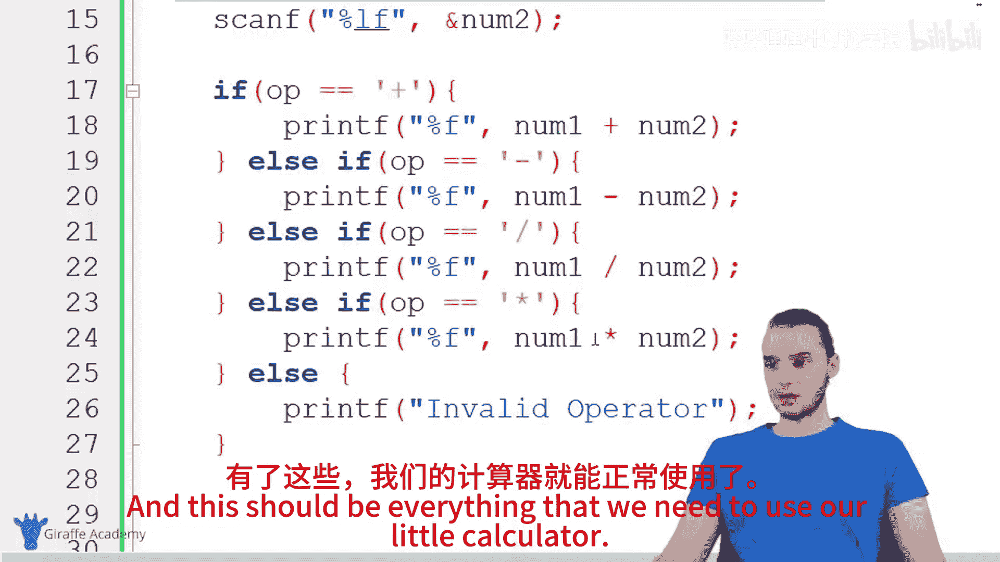
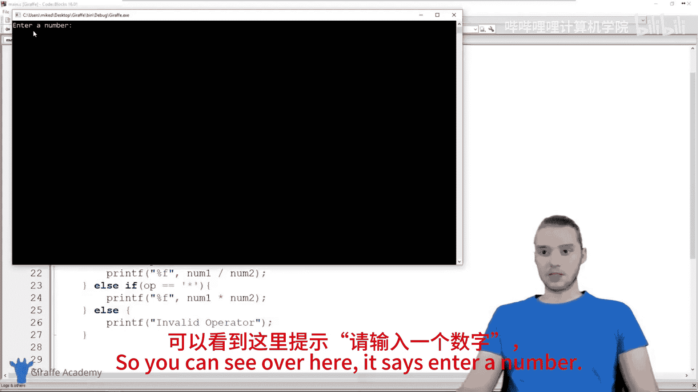
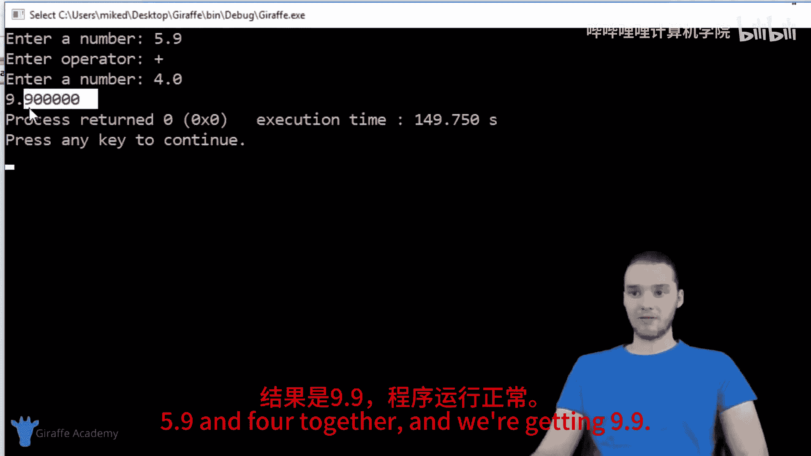
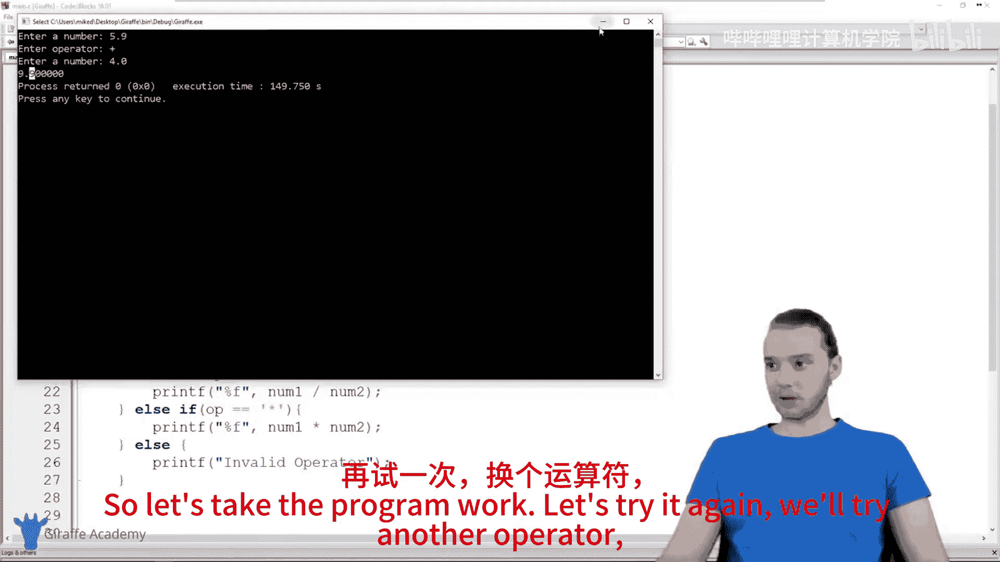
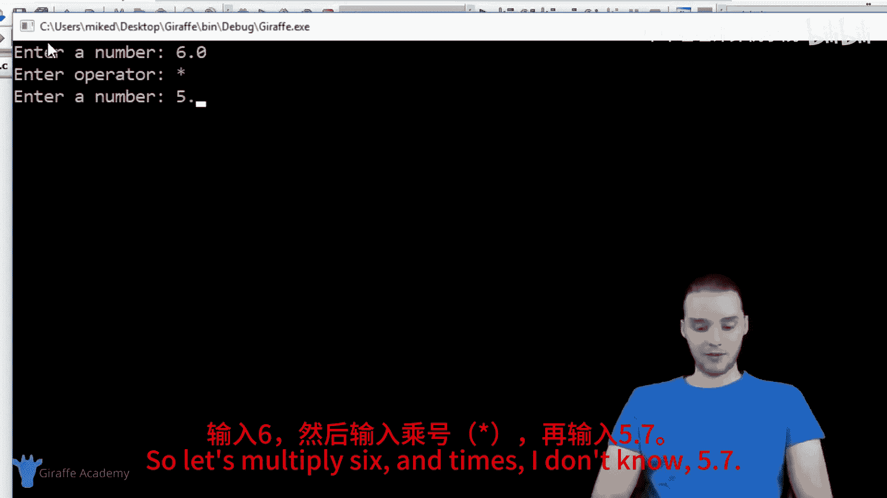
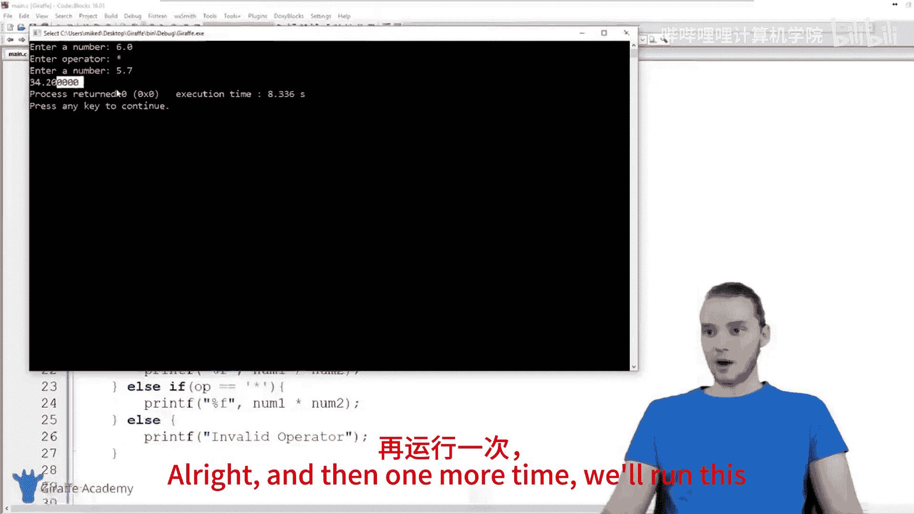
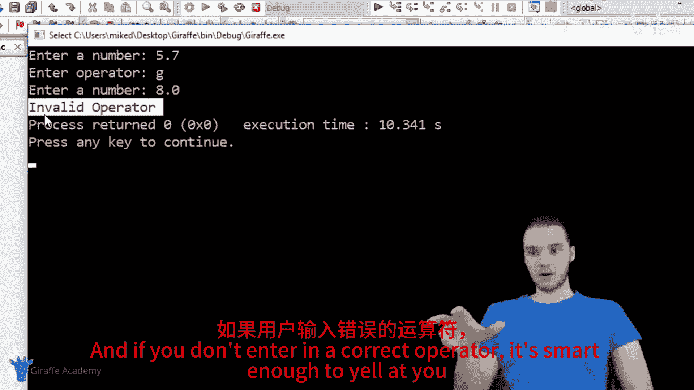
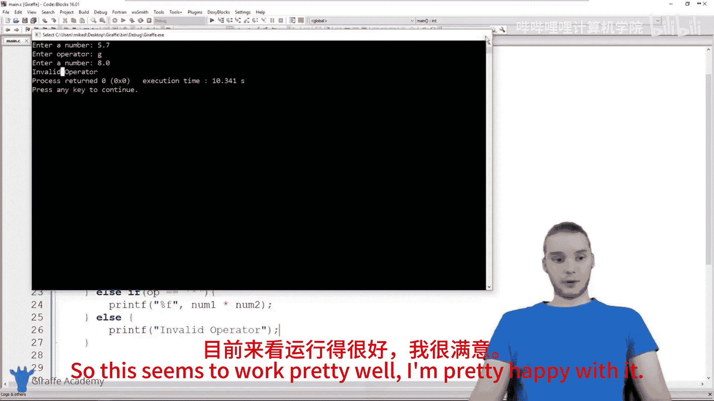
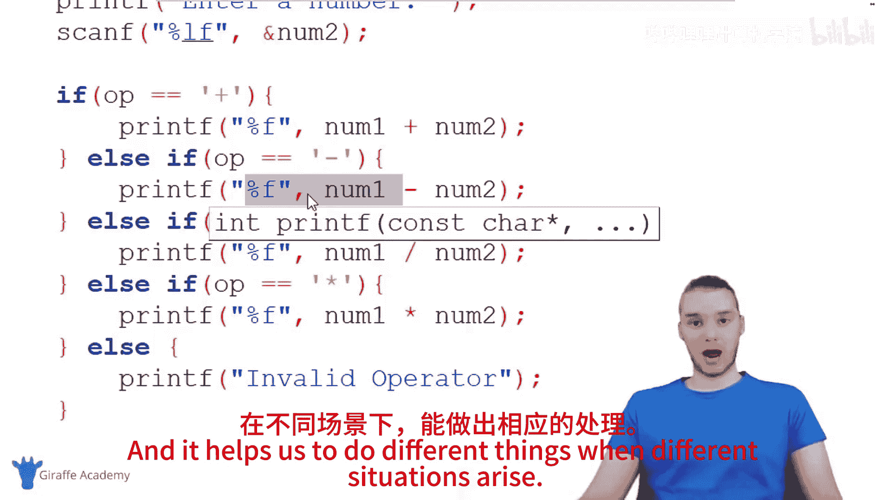

# 019：构建更好的计算器 🧮

在本节课中，我们将学习如何使用C语言构建一个功能更完善的四则运算计算器。我们将利用之前学过的知识，如变量、用户输入和条件判断语句，来实现一个可以让用户选择进行加、减、乘、除运算的程序。

---

## 概述

在本教程中，我们将创建一个交互式计算器。程序会提示用户依次输入两个数字和一个运算符（+、-、*、/），然后根据运算符执行相应的数学运算并输出结果。如果用户输入了无效的运算符，程序会给出错误提示。

---

## 第一步：声明变量

首先，我们需要创建变量来存储用户输入的数字和运算符。我们将使用 `double` 类型来存储数字，以确保可以处理小数。使用 `char` 类型来存储单个字符的运算符。

```c
double num1;
double num2;
char op;
```

## 第二步：获取用户输入

接下来，我们需要从用户那里获取输入。这包括第一个数字、运算符和第二个数字。

以下是获取用户输入的步骤：

1.  **获取第一个数字**：使用 `printf` 函数提示用户，然后使用 `scanf` 函数将输入的值存储到 `num1` 变量中。
2.  **获取运算符**：再次提示用户，并使用 `scanf` 获取一个字符。**注意**：在 `scanf` 中读取字符时，需要在 `%c` 前加一个空格，以避免读取到之前输入留下的换行符。
3.  **获取第二个数字**：与获取第一个数字的方法相同。

```c
printf("Enter a number: ");
scanf("%lf", &num1);

printf("Enter an operator: ");
scanf(" %c", &op); // 注意%c前的空格

printf("Enter another number: ");
scanf("%lf", &num2);
```

## 第三步：使用条件语句执行运算

现在，我们已经拥有了所有必要的数据。我们需要根据用户输入的运算符来决定执行哪种运算。这里非常适合使用 `if` 语句。

我们将检查 `op` 变量中存储的字符，并执行相应的计算：

*   如果运算符是 `+`，则执行加法。
*   如果运算符是 `-`，则执行减法。
*   如果运算符是 `*`，则执行乘法。
*   如果运算符是 `/`，则执行除法。
*   如果运算符是其他任何字符，则输出错误信息。

```c
if(op == '+'){
    printf("%f", num1 + num2);
}
else if(op == '-'){
    printf("%f", num1 - num2);
}
else if(op == '*'){
    printf("%f", num1 * num2);
}
else if(op == '/'){
    printf("%f", num1 / num2);
}
else {
    printf("Invalid Operator");
}
```

---

## 程序运行示例



让我们看看这个程序是如何工作的。



*   **示例 1：加法**
    *   输入：`5.9`, `+`, `4.0`
    *   输出：`9.9`

*   **示例 2：乘法**
    *   输入：`6`, `*`, `5.7`
    *   输出：`34.2`





*   **示例 3：无效运算符**
    *   输入：`5.7`, `g`, `8`
    *   输出：`Invalid Operator`

---



## 总结





在本节课中，我们一起构建了一个功能完整的四则运算计算器。我们回顾并应用了以下几个核心概念：

1.  **变量声明**：使用 `double` 和 `char` 类型存储数据。
2.  **用户输入**：使用 `scanf` 函数获取数字和字符输入，并注意了读取字符时的特殊格式。
3.  **条件逻辑**：使用 `if`、`else if` 和 `else` 语句根据不同的运算符执行不同的代码块，使程序能够智能地响应各种情况。





通过这个练习，你不仅巩固了基础知识，还学会了如何将这些知识组合起来解决一个实际问题。尝试修改这个程序，比如让它能够连续计算，或者增加更多运算功能（如求余数）吧！