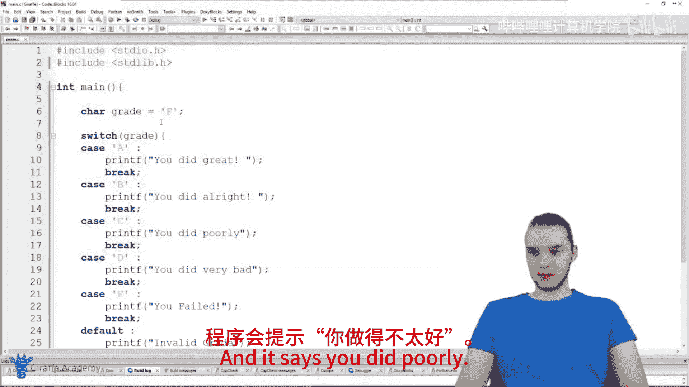
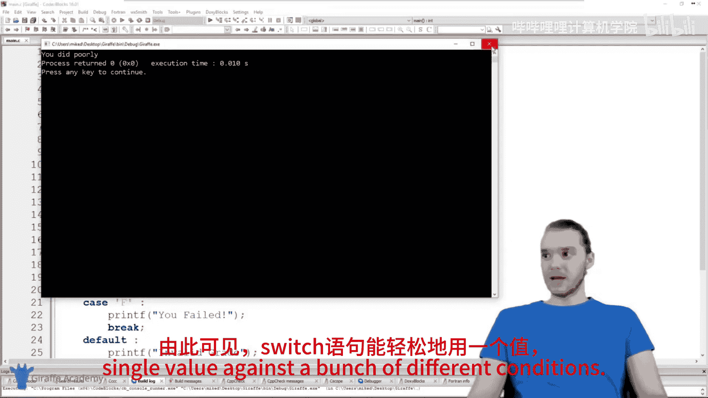
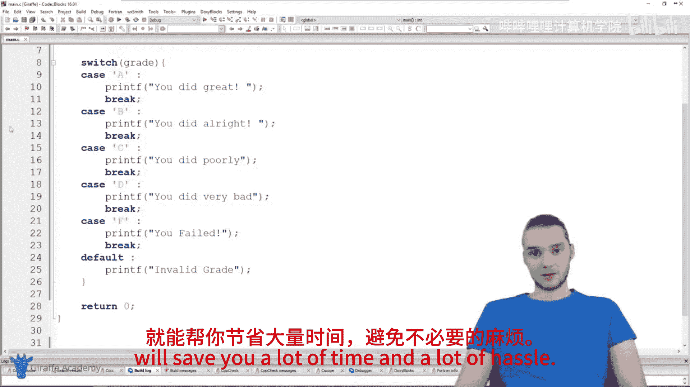

# 020：switch语句 🎯

在本节课中，我们将要学习C语言中的`switch`语句。`switch`语句是一种特殊的条件判断结构，它允许我们将一个值与多个不同的值进行比较，并根据匹配的结果执行相应的代码块。通过学习`switch`语句，我们可以编写更简洁、更易读的条件判断代码。

## 概述

`switch`语句本质上是一种特殊的`if`语句，它专门用于将一个特定值与多个可能的值进行比较。与使用多个`if-else if`语句相比，`switch`语句在结构上更加清晰，特别适合处理多个离散值的匹配情况。本节我们将通过构建一个简单的成绩评级程序来演示`switch`语句的用法。

## switch语句的基本结构

上一节我们介绍了条件判断的基本概念，本节中我们来看看如何使用`switch`语句来简化多条件判断。

`switch`语句的基本语法结构如下：

```c
switch (expression) {
    case constant1:
        // 代码块1
        break;
    case constant2:
        // 代码块2
        break;
    // 更多case...
    default:
        // 默认代码块
}
```

在这个结构中：
*   `expression` 是需要进行判断的变量或表达式。
*   `case` 后面跟着一个常量值，用于与`expression`的结果进行比较。
*   如果某个`case`的值与`expression`匹配，则执行该`case`后面的代码块。
*   `break` 语句用于退出整个`switch`结构，防止继续执行后面的`case`。
*   `default` 是可选的，当没有任何`case`匹配时，会执行`default`后面的代码块，类似于`if-else`结构中的`else`。

## 构建成绩评级程序

现在，让我们使用`switch`语句来构建一个程序。这个程序会根据一个表示成绩等级的字符变量，输出对应的评价信息。

首先，我们创建一个字符变量来存储成绩等级：

```c
char grade = 'A';
```

接下来，我们编写`switch`语句来对这个成绩进行判断。以下是判断逻辑的步骤：

1.  判断成绩是否为'A'，如果是，则输出“你做得很棒！”。
2.  判断成绩是否为'B'，如果是，则输出“你做得不错！”。
3.  判断成绩是否为'C'，如果是，则输出“你做得不太好。”。
4.  判断成绩是否为'D'，如果是，则输出“你做得很差。”。
5.  判断成绩是否为'F'，如果是，则输出“你不及格。”。
6.  如果成绩不是以上任何有效等级，则输出“无效的成绩。”。

以下是实现上述逻辑的代码：

```c
#include <stdio.h>

int main() {
    char grade = 'A'; // 可以修改这个值来测试不同的情况

    switch (grade) {
        case 'A':
            printf("你做得很棒！\n");
            break;
        case 'B':
            printf("你做得不错！\n");
            break;
        case 'C':
            printf("你做得不太好。\n");
            break;
        case 'D':
            printf("你做得很差。\n");
            break;
        case 'F':
            printf("你不及格。\n");
            break;
        default:
            printf("无效的成绩。\n");
    }

    return 0;
}
```

## 程序运行与测试

我们可以通过修改变量`grade`的初始值来测试程序的不同分支。

*   当 `grade = 'A'` 时，程序输出：`你做得很棒！`
*   当 `grade = 'C'` 时，程序输出：`你做得不太好。`
*   当 `grade = 'F'` 时，程序输出：`你不及格。`
*   当 `grade = 'Z'` 时，程序输出：`无效的成绩。`

## switch语句的注意事项

在使用`switch`语句时，有几个关键点需要注意：



*   **`break`语句的重要性**：每个`case`代码块末尾的`break`语句至关重要。如果省略`break`，程序会继续执行下一个`case`的代码块，直到遇到`break`或`switch`结束。这种现象称为“穿透”（fall-through），除非有意为之，否则通常需要避免。
*   **适用场景**：`switch`语句最适合用于将一个变量与一系列**离散的常量值**进行比较。对于范围判断（如 `x > 10`）或复杂的布尔表达式，使用`if-else`语句更为合适。
*   **`default`分支**：使用`default`分支来处理所有未匹配的情况，可以使程序更加健壮。

## 总结






本节课中我们一起学习了C语言中的`switch`语句。我们了解到`switch`是一种用于多路分支选择的高效结构，它通过比较一个表达式与多个`case`常量来决定执行路径。我们通过一个成绩评级程序的实例，掌握了`switch`语句的基本语法、`case`和`break`的用法，以及可选的`default`分支。虽然`switch`并非适用于所有条件判断场景，但在处理多个离散值匹配时，它能显著提升代码的清晰度和可维护性。