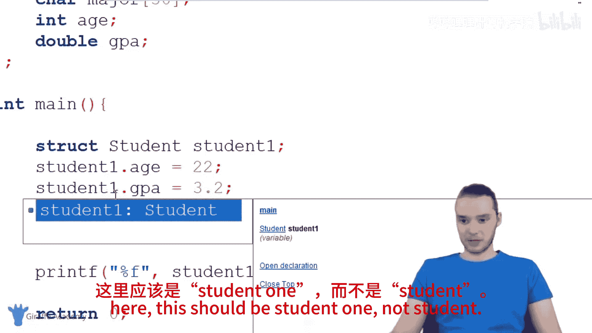
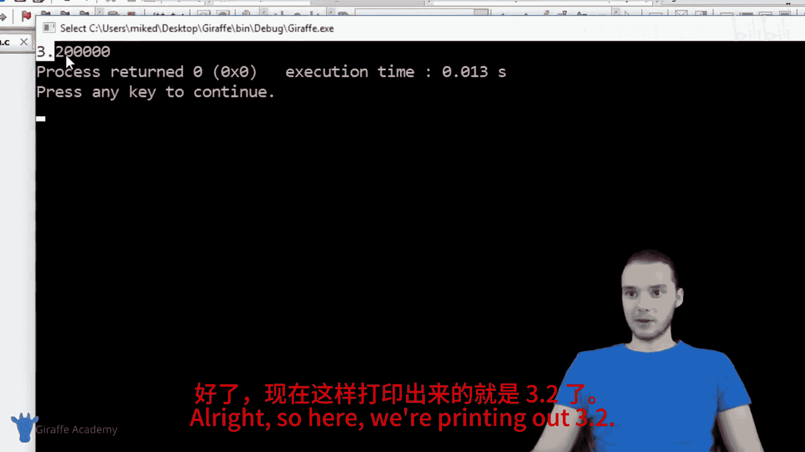
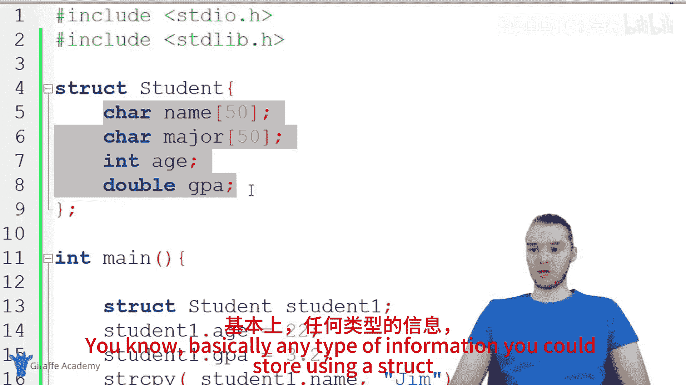
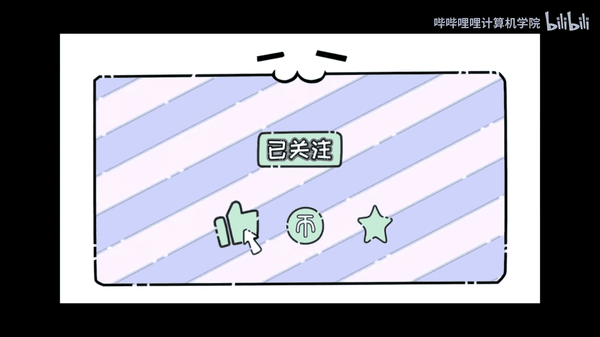

# 021：结构体 🏗️

在本节课中，我们将要学习C语言中的**结构体**。结构体是一种强大的数据结构，它允许我们将不同类型的数据组合在一起，形成一个单一的、有意义的单元。通过学习结构体，你将能够更好地组织和处理程序中的数据。

## 什么是结构体？

上一节我们介绍了数组，它用于存储相同类型的数据集合。本节中我们来看看**结构体**。结构体是一种数据结构，我们可以用它来存储**不同类型**的数据组。例如，在一个结构体内部，我们可以存储一个整数、一个字符串、一个字符和一个双精度浮点数。我们可以将所有不同的数据类型存储在单一的数据结构中。

结构体有非常多的用途，其中一项就是**模拟现实世界的实体**。我们可以在程序中模拟现实世界中的事物。在本教程中，我将向大家展示如何做到这一点。

## 使用结构体表示学生

我们将学习如何使用结构体在程序中表示一个学生。假设我们正在编写一个使用学生信息的软件，例如存储学生记录。我们可以使用结构体在程序中表示一个学生。

在程序中，我将在`main`函数上方创建一个结构体。你会看到它们如何工作以及我们如何使用它们。

以下是定义一个名为`Student`的结构体的方法：

```c
struct Student {
    char name[50];
    char major[50];
    int age;
    double gpa;
};
```

在这个结构体中，我开始指定构成程序中一个学生的数据类型。基本上，我可以定义学生的不同属性并将它们放在这里。这将作为一种模板，稍后你会看到如何使用它。

让我们思考学生的不同属性：
*   **姓名**：使用字符数组`char name[50]`表示，最多可容纳50个字符。
*   **专业**：同样使用`char major[50]`。
*   **年龄**：使用整数`int age`。
*   **GPA**：使用双精度浮点数`double gpa`。

这样，我就创建了一个`Student`数据类型。我基本上允许自己在程序中表示一个学生。

## 创建和使用结构体变量

现在，让我们进入`main`函数，看看如何使用这个结构体。我可以创建这个学生结构体的一个**实例**，即在程序中创建一个实际的学生。

以下是创建结构体变量的方法：

```c
struct Student student1;
```

现在，我创建了一个名为`student1`的容器，它能够存储一个姓名、一个专业、一个年龄和一个GPA。

如果你熟悉C语言中的数组，你会知道数组是一种可以保存多条信息的特殊结构，但数组中的所有信息必须是**相同的数据类型**，并且它们没有名称。而对于结构体，我可以拥有像这样一堆**不同的数据类型**，并且我可以给它们命名，如`name`、`major`、`age`和`gpa`。

现在，让我展示如何为这些属性赋值。

对于这个特定的学生`student1`，我可以给他/她赋值：

```c
student1.age = 22;
student1.gpa = 3.2;
```

在`student1`容器内部，我将这个特定学生的年龄设置为22，GPA设置为3.2。

对于字符串（姓名和专业），情况略有不同。在C语言中，字符串实际上只是一个字符数组，我们不能直接给数组赋值。我们需要使用`strcpy`函数。

```c
strcpy(student1.name, "Jim");
strcpy(student1.major, "Business");
```

现在，`student1.name`的值是“Jim”，`student1.major`的值是“Business”。

本质上，我在这里创建了一个学生，该学生拥有我们在上面定义的所有属性。我为所有这些属性赋予了值。

## 访问和打印结构体数据

现在，我可以打印存储在这个结构体中的所有不同值。

例如，我可以打印GPA：

```c
printf("%f\n", student1.gpa); // 输出 3.2
```



我也可以打印姓名：



```c
printf("%s\n", student1.name); // 输出 Jim
```

结构体是一个非常实用的结构。另一个很酷的事情是，我们可以创建另一个学生，即创建该学生结构体的另一个实例。

以下是创建第二个学生的方法：

```c
struct Student student2;
student2.age = 20;
student2.gpa = 2.5;
strcpy(student2.name, "Pam");
strcpy(student2.major, "Art");
```

现在，我有了一个完全不同的学生。如果我想，我可以打印这个学生的属性：

```c
printf("%s\n", student2.name); // 输出 Pam
```

我可以根据需要创建任意多个这样的学生。这就是结构体的妙处：我可以在程序中定义学生的基本模板，然后在下面创建可以使用的单个学生。

现在，我有了这个学生变量。我可以对它做任何我想做的事情：我可以将它传递给函数，可以将其打印到屏幕上，可以在`if`语句中使用它。基本上，我可以像处理变量或数组一样处理它。记住，变量和数组只是容器，我们可以对它们做几乎任何事情，结构体也是如此。

## 总结





本节课中我们一起学习了C语言中的**结构体**。我们了解到结构体是一种可以组合不同数据类型的强大工具，非常适合用来模拟现实世界中的实体（如学生）。我们学习了如何定义结构体、创建结构体变量、为其成员赋值以及如何访问这些数据。你可以尝试思考其他可以在程序中建模的事物，例如一本书或一部手机，使用结构体可以存储任何类型的信息。