C语言编程初学者教程：22：while循环 🌀

在本节课中，我们将要学习C语言中的`while`循环。循环是一种强大的编程结构，它允许我们重复执行一段代码，直到某个条件不再满足为止。理解循环是掌握编程逻辑的关键一步。

---

### 什么是while循环？

`while`循环是C语言中的一种控制流语句。它的基本思想是：**只要**某个条件为真，就反复执行循环体内的代码块。其核心结构可以用以下伪代码表示：

```c
while (条件为真) {
    // 要重复执行的代码
}
```

上一节我们介绍了条件语句，本节中我们来看看如何使用循环来重复执行任务。

---

### 创建一个基础的while循环

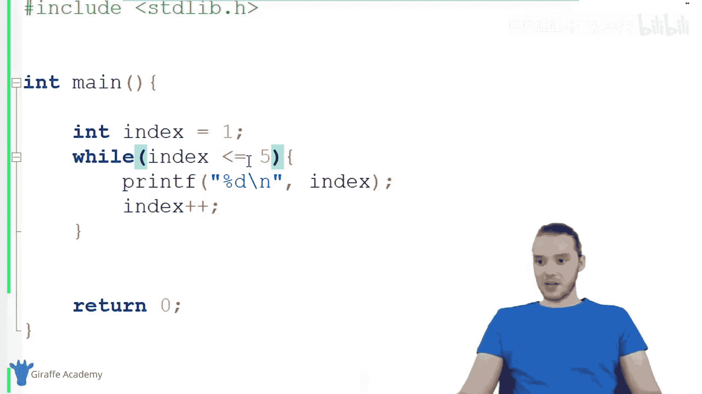

让我们通过一个简单的例子来理解`while`循环的工作原理。首先，我们需要一个变量来控制循环的次数。

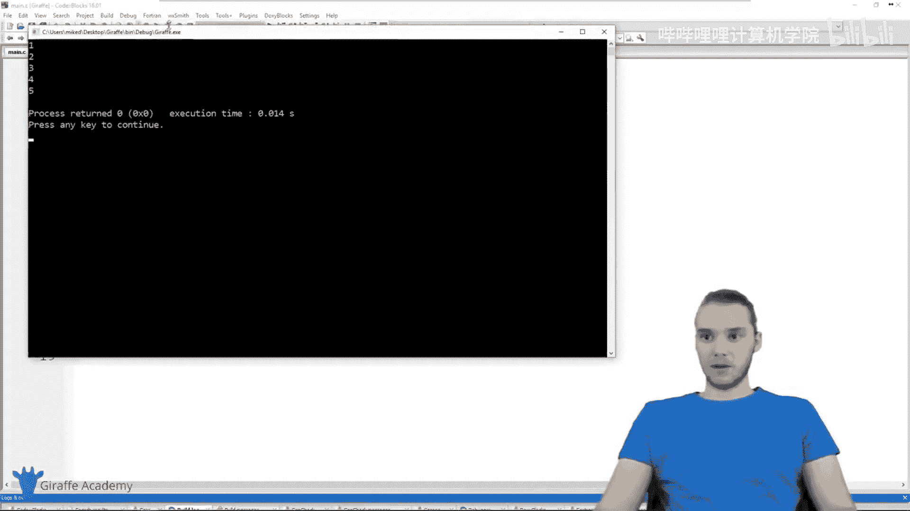

以下是创建并运行一个基础`while`循环的步骤：

1.  **初始化变量**：我们创建一个名为`index`的整数变量，并将其初始值设为1。
    ```c
    int index = 1;
    ```
2.  **构建循环结构**：使用`while`关键字，后面跟上括号`()`和花括号`{}`。
    ```c
    while (index <= 5) {
        // 循环体内的代码将放在这里
    }
    ```
    这里的条件 `index <= 5` 意味着只要`index`的值小于或等于5，循环就会继续。
3.  **编写循环体**：在花括号内，我们编写需要重复执行的代码。在这个例子中，我们打印`index`的当前值，然后将其增加1。
    ```c
    while (index <= 5) {
        printf("%d\n", index); // 打印当前index的值
        index++; // 将index的值增加1。这等价于 index = index + 1;
    }
    ```
4.  **运行程序**：当运行这段代码时，控制台会依次输出数字1、2、3、4、5。

**循环执行流程解析**：
*   程序首先检查条件 `index <= 5`（此时`index`为1，条件为真）。
*   条件为真，进入循环体：打印`1`，然后将`index`增加为`2`。
*   执行完循环体后，程序**跳回循环开头**，再次检查条件 `index <= 5`（此时`index`为2，条件仍为真）。
*   重复此过程，直到`index`被增加为`6`。
*   再次检查条件 `6 <= 5`，结果为假，循环终止，程序继续执行后面的代码。

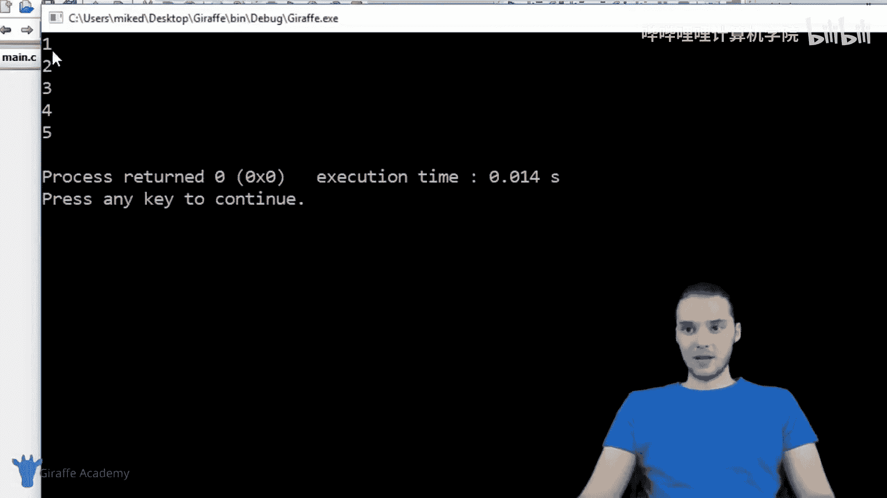

---

### 需要警惕的情况：无限循环 🔁

在编写`while`循环时，一个常见的错误是创建了“无限循环”。即循环的条件永远无法变为假，导致程序无法停止。

例如，如果我们移除上面例子中的 `index++` 这一行：
```c
int index = 1;
while (index <= 5) {
    printf("%d\n", index);
    // 缺少 index++，index 的值永远为1
}
```
程序将不停地打印数字`1`，直到手动终止程序。在更复杂的程序中，无限循环可能导致电脑卡顿或资源耗尽，因此务必确保循环条件有朝一日会变为假。

---

### while循环的变体：do...while循环

除了标准的`while`循环，C语言还提供了`do...while`循环。它与`while`循环的关键区别在于**执行顺序**。

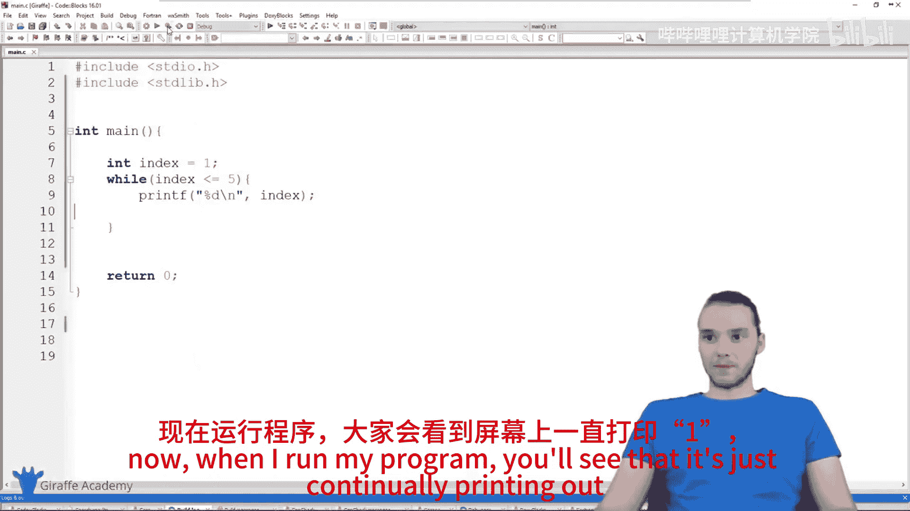

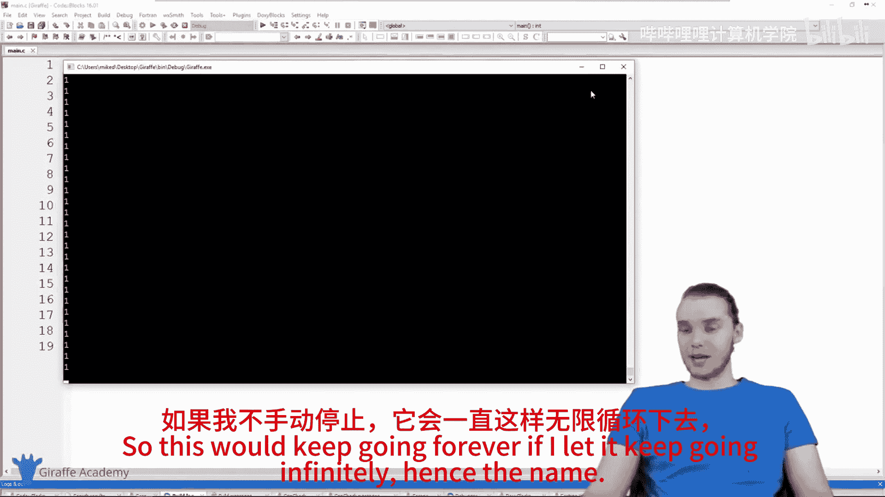

*   **`while`循环**：先检查条件，条件为真才执行循环体。
*   **`do...while`循环**：先执行一次循环体，然后再检查条件。这意味着循环体**至少会执行一次**。

其结构如下：
```c
do {
    // 要执行的代码
} while (条件);
```

让我们通过一个例子来对比。假设我们将`index`初始化为6：

*   使用`while`循环：条件 `6 <= 5` 立即为假，循环体一次也不会执行，没有输出。
*   使用`do...while`循环：
    ```c
    int index = 6;
    do {
        printf("%d\n", index);
        index++;
    } while (index <= 5);
    ```
    程序会先执行一次循环体，打印出`6`，并将`index`增加为`7`，然后检查条件 `7 <= 5` 为假，循环结束。

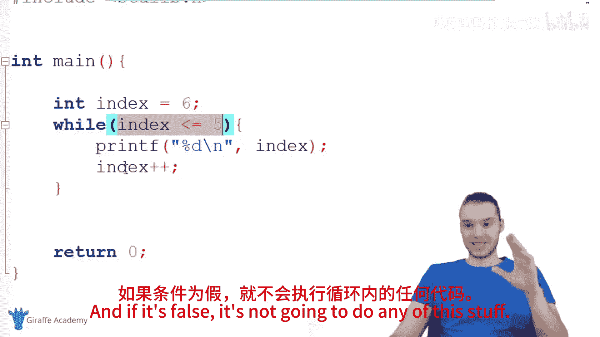

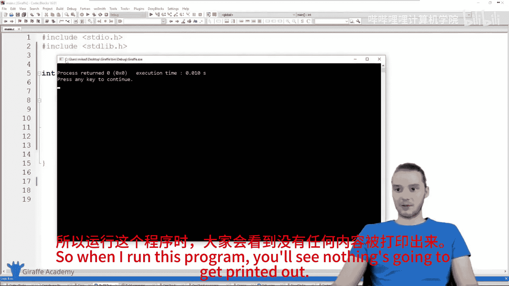

因此，`do...while`循环适用于那些**无论条件如何，都需要至少执行一次**的场景。

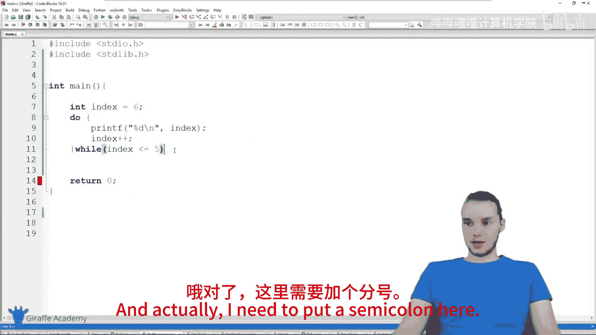

---

### 总结

本节课中我们一起学习了C语言中两种重要的循环结构：
1.  **`while`循环**：在每次迭代前检查条件，可能一次也不执行。
2.  **`do...while`循环**：先执行一次循环体，然后在每次迭代后检查条件，保证至少执行一次。

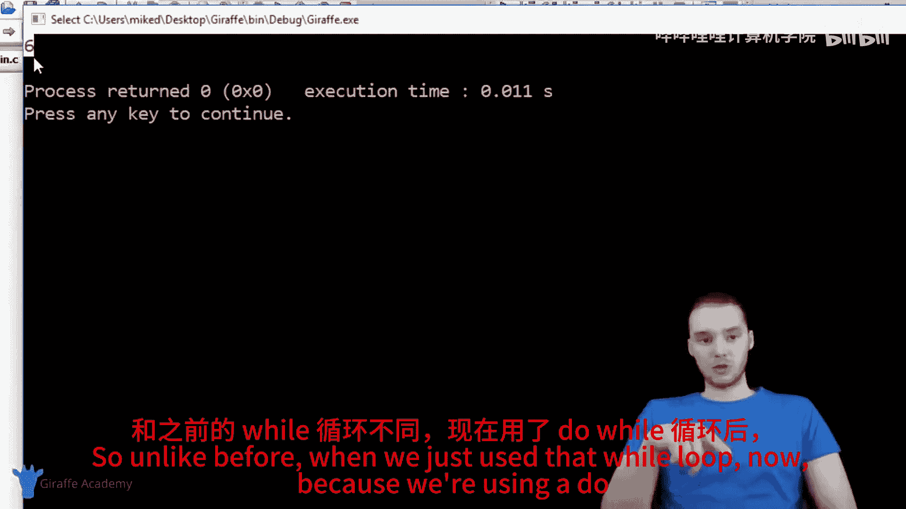

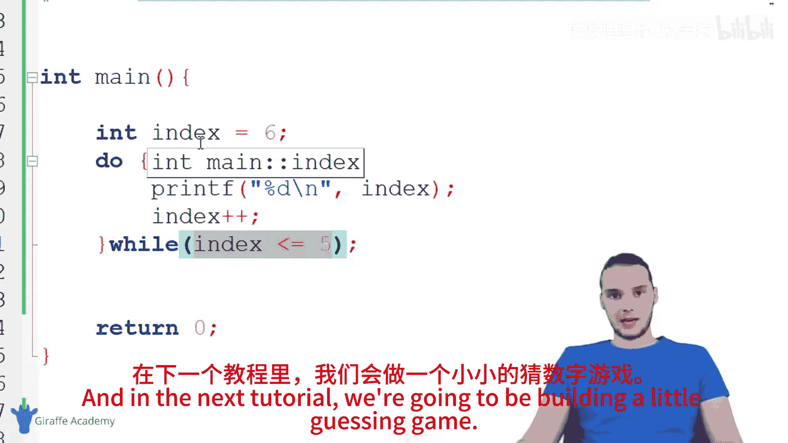

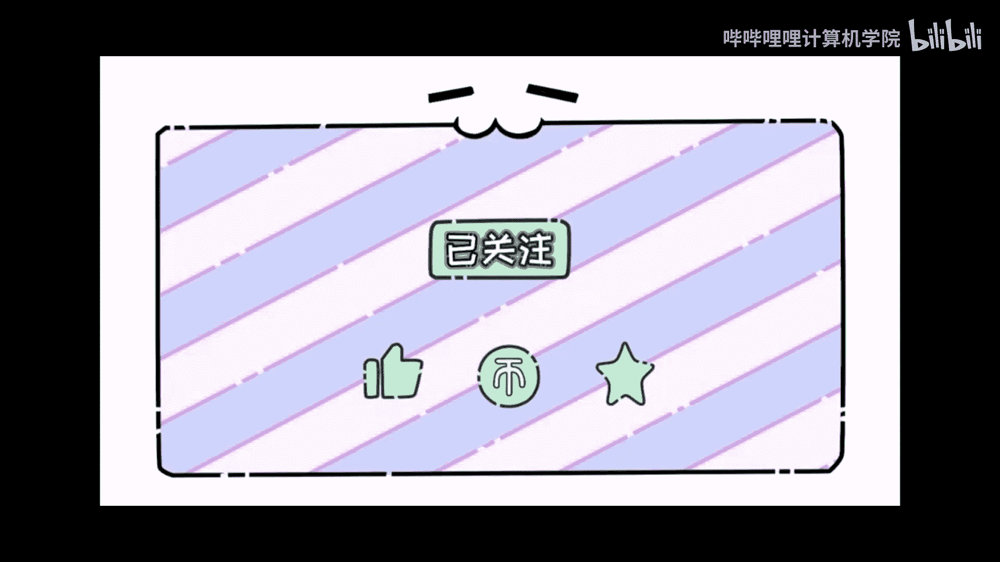

核心在于理解**条件检查**与**代码执行**的顺序。循环是自动化重复任务的基础，在接下来的教程中，我们将运用`while`循环来构建一个有趣的猜数字游戏，以巩固所学知识。