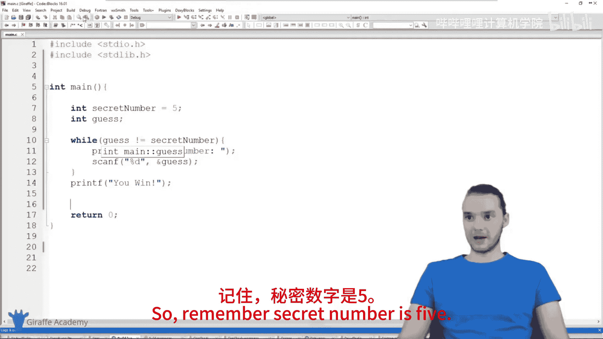
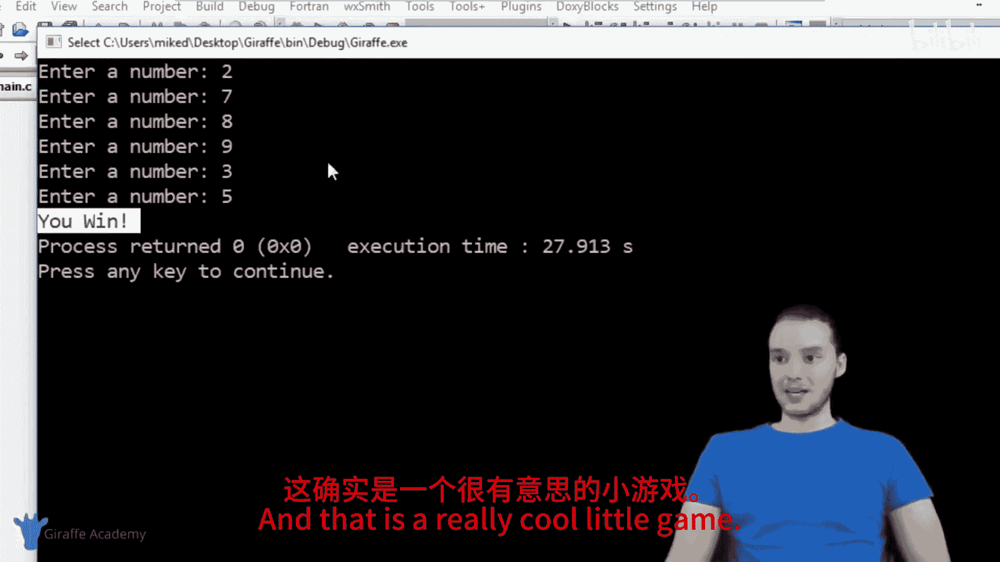
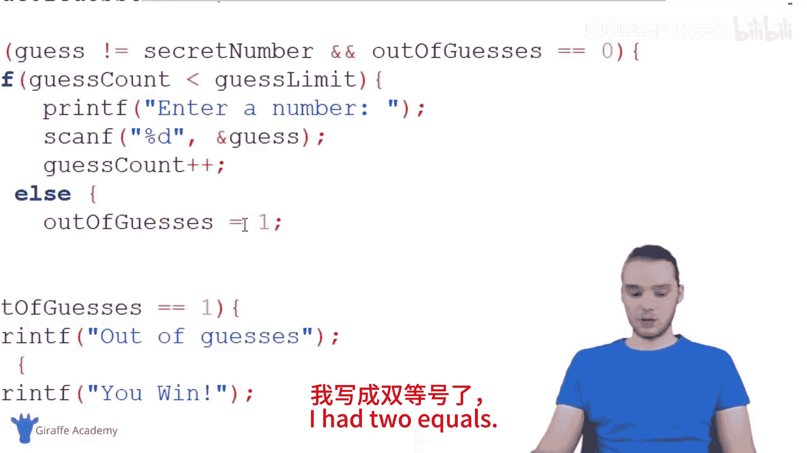
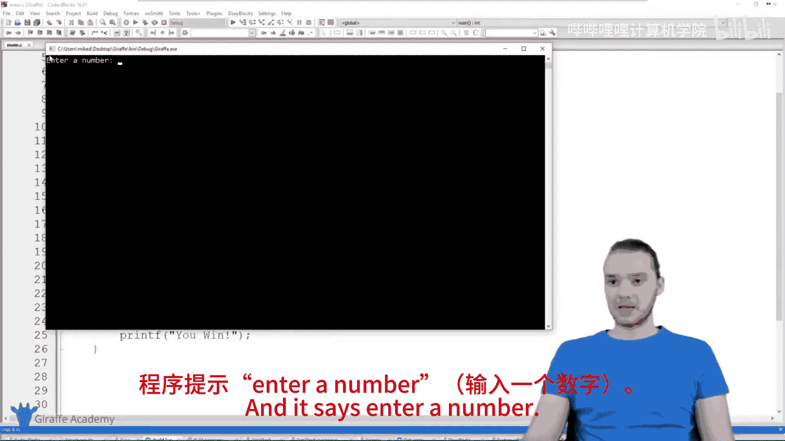
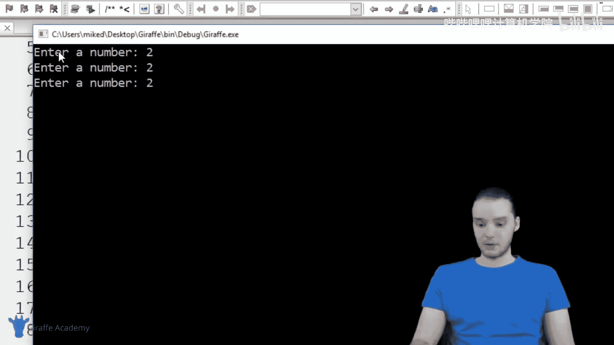
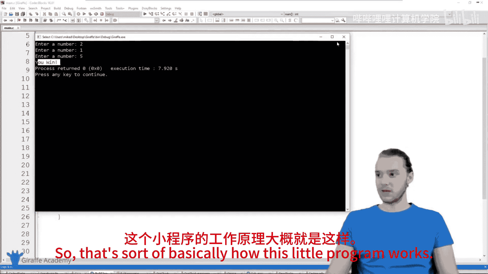
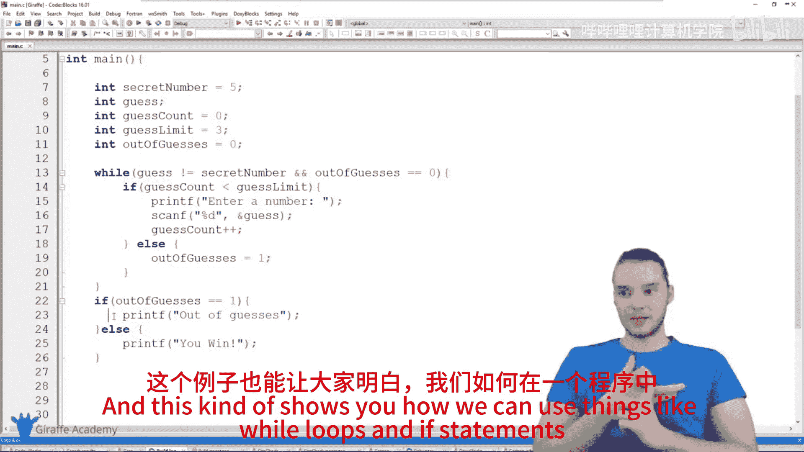

# 023：构建猜谜游戏 🎮

在本节课中，我们将学习如何使用C语言构建一个简单的猜数字游戏。我们将综合运用到目前为止学到的知识，包括变量、循环和条件判断，来创建一个可以交互运行的程序。

---

## 概述

我们将创建一个猜数字游戏。程序会设定一个秘密数字，并允许用户反复猜测，直到猜中为止。之后，我们还会为游戏增加一个功能：限制用户的猜测次数。如果用户在规定的次数内没有猜中，游戏将结束。

---

## 第一步：基础游戏结构

首先，我们创建一个基础版本的游戏，允许用户无限次猜测，直到猜中秘密数字。

我们需要定义两个变量：
1.  **`secretNumber`**：一个整数，存储需要猜测的秘密数字。
2.  **`guess`**：一个整数，用于存储用户每次输入的数字。



以下是初始代码结构：

```c
int secretNumber = 5;
int guess;
```

接下来，我们需要一个循环来持续提示用户输入，直到猜中为止。这里我们使用 **`while`循环**。循环的条件是：只要用户的猜测不等于秘密数字，就继续循环。



```c
while (guess != secretNumber) {
    // 提示用户输入并获取猜测值
}
```

在循环内部，我们需要：
1.  使用 `printf` 提示用户输入。
2.  使用 `scanf` 获取用户输入，并存储到 `guess` 变量中。

循环结束后（即猜中时），打印胜利信息。

完整的代码如下：

```c
#include <stdio.h>

int main() {
    int secretNumber = 5;
    int guess;

    while (guess != secretNumber) {
        printf("Enter a number: ");
        scanf("%d", &guess);
    }

    printf("You win!\n");
    return 0;
}
```

运行这个程序，用户可以一直输入数字，直到输入5，程序会输出“You win!”并结束。

---

## 第二步：增加猜测次数限制

上一节我们创建了一个可以无限猜测的基础游戏。本节中，我们来看看如何改进游戏，为用户设定猜测次数上限。

我们需要新增三个变量来管理猜测次数：
1.  **`guessCount`**：整数，记录用户已经猜测的次数，初始值为 `0`。
2.  **`guessLimit`**：整数，设定用户最多可以猜测的次数，例如 `3`。
3.  **`outOfGuesses`**：整数，作为一个“布尔”标志，表示用户是否用尽了猜测机会。`0` 表示还有机会，`1` 表示机会已用尽。

变量定义如下：

```c
int guessCount = 0;
int guessLimit = 3;
int outOfGuesses = 0;
```

现在，我们需要修改 `while` 循环的逻辑。循环应在两种情况下终止：
1.  用户猜中了数字 (`guess == secretNumber`)。
2.  用户用尽了猜测次数 (`outOfGuesses == 1`)。

因此，循环条件应修改为：

```c
while (guess != secretNumber && outOfGuesses == 0) {
    // 循环内的代码
}
```

在循环内部，我们需要在每次猜测前检查用户是否还有剩余次数。这通过一个 `if` 语句实现：

```c
if (guessCount < guessLimit) {
    // 允许用户猜测：提示输入、获取输入、增加计数
} else {
    outOfGuesses = 1; // 标记为已用尽机会
}
```

在允许猜测的代码块中，我们需要：
1.  提示用户输入。
2.  使用 `scanf` 获取猜测值。
3.  将 `guessCount` 增加 1 (`guessCount++`)。

循环结束后，我们需要判断用户是因为猜中而获胜，还是因为次数用尽而失败。我们通过检查 `outOfGuesses` 的值来判断：

```c
if (outOfGuesses == 1) {
    printf("Out of guesses.\n");
} else {
    printf("You win!\n");
}
```

---







## 完整代码与总结



以下是整合了猜测次数限制功能的完整游戏代码：

```c
#include <stdio.h>

int main() {
    int secretNumber = 5;
    int guess;
    int guessCount = 0;
    int guessLimit = 3;
    int outOfGuesses = 0;

    while (guess != secretNumber && outOfGuesses == 0) {
        if (guessCount < guessLimit) {
            printf("Enter a number: ");
            scanf("%d", &guess);
            guessCount++;
        } else {
            outOfGuesses = 1;
        }
    }

    if (outOfGuesses == 1) {
        printf("Out of guesses.\n");
    } else {
        printf("You win!\n");
    }

    return 0;
}
```




本节课中我们一起学习了如何构建一个猜数字游戏。我们从基础的无限制版本开始，然后引入了变量来跟踪和限制猜测次数，并综合运用了 `while` 循环和 `if` 条件语句来控制游戏流程。这个项目展示了如何将不同的编程概念组合起来，创建一个完整且互动的小程序。