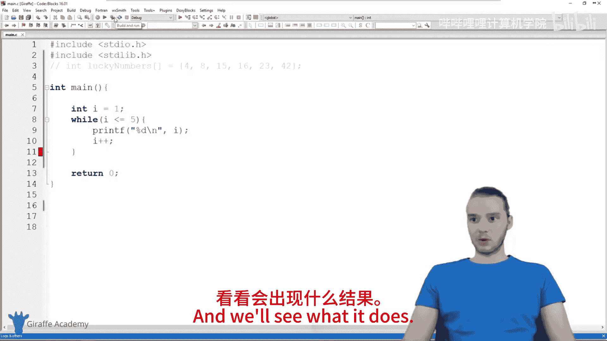
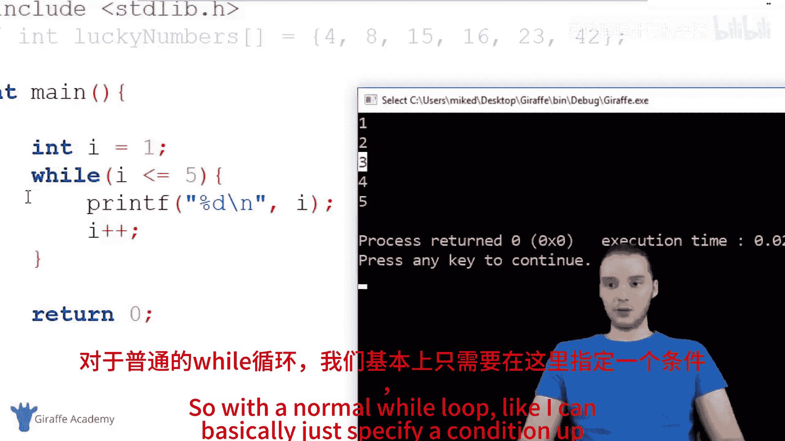
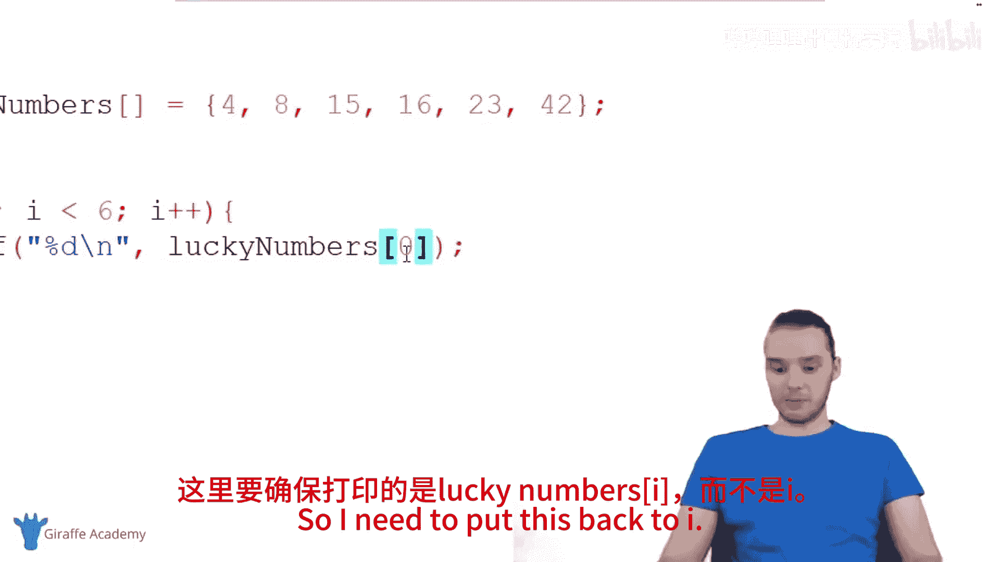
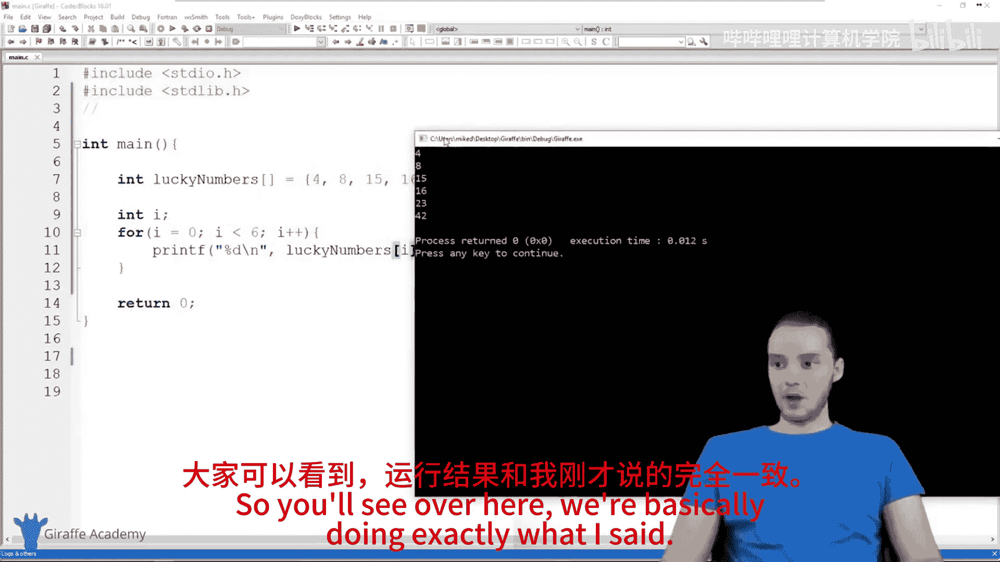
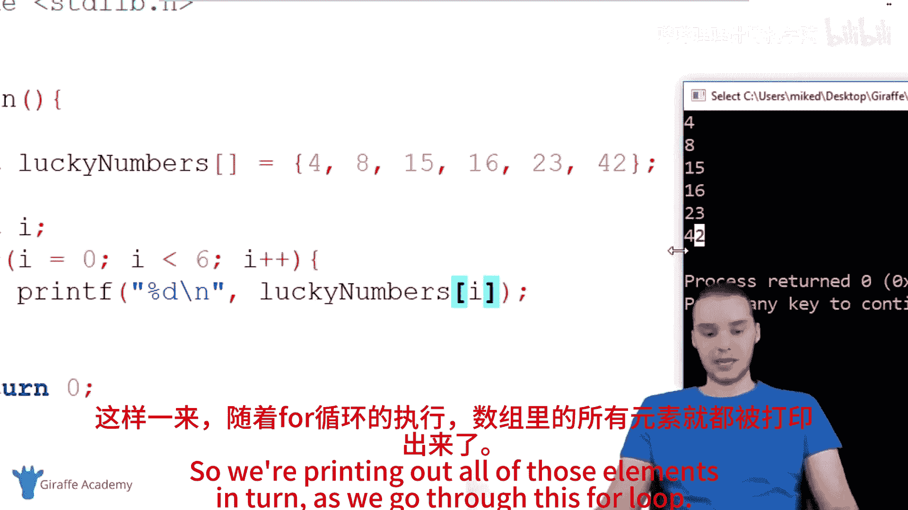
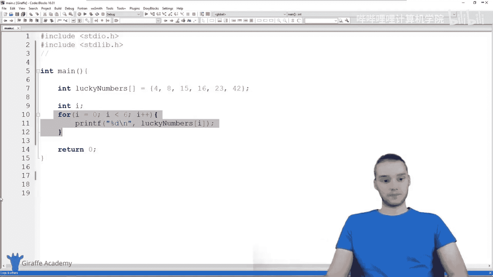

# 024：For循环 🔄

在本节课中，我们将学习C语言中一种特殊的循环结构——**for循环**。for循环允许我们使用一个**索引变量**来追踪当前循环的迭代次数，这在处理数组或需要计数的情况下非常有用。我们将通过对比while循环，详细讲解for循环的结构、用法及其优势。

---

## 从while循环到for循环



上一节我们介绍了while循环的基本用法。本节中，我们来看看如何将while循环转换为更简洁的for循环。

以下是一个简单的while循环示例，它打印数字1到5：

```c
int i = 1;
while (i <= 5) {
    printf("%d\n", i);
    i++;
}
```

在这个循环中，变量 `i` 充当了**索引变量**的角色。它从1开始，每次循环递增1，直到其值大于5为止。`i` 的值告诉我们当前是第几次循环迭代。



## 理解for循环的结构

for循环将初始化索引变量、循环条件和更新索引变量这三个步骤整合到了一行代码中，使得结构更加紧凑。

以下是for循环的基本语法结构：

```c
for (初始化; 循环条件; 更新操作) {
    // 循环体
}
```

现在，让我们将上面的while循环改写为for循环：

```c
for (int i = 1; i <= 5; i++) {
    printf("%d\n", i);
}
```

这两个代码块的功能**完全等价**。for循环的第一部分 `int i = 1` 用于初始化索引变量；第二部分 `i <= 5` 是循环条件；第三部分 `i++` 是每次循环后执行的操作。

## 使用for循环遍历数组

for循环一个非常常见的用途是遍历数组中的所有元素。

假设我们有一个名为 `luckyNumbers` 的数组：

```c
int luckyNumbers[] = {4, 8, 15, 16, 23, 42};
```

在C语言中，数组的索引从0开始。因此，第一个元素 `4` 的索引是0，第二个元素 `8` 的索引是1，依此类推。

以下是使用for循环遍历该数组并打印每个元素的代码：

```c
for (int i = 0; i < 6; i++) {
    printf("%d\n", luckyNumbers[i]);
}
```

代码执行过程如下：
*   第一次循环：`i = 0`，打印 `luckyNumbers[0]`，即 `4`。
*   第二次循环：`i = 1`，打印 `luckyNumbers[1]`，即 `8`。
*   ...
*   第六次循环：`i = 5`，打印 `luckyNumbers[5]`，即 `42`。

通过这种方式，我们可以轻松访问和处理数组中的每一个元素。

## for循环的灵活性

for循环的“更新操作”部分非常灵活，你可以执行各种操作，不仅仅是递增。

例如，你可以让索引变量每次增加2：

```c
for (int i = 0; i < 10; i = i + 2) {
    printf("%d\n", i); // 将打印 0, 2, 4, 6, 8
}
```

或者进行递减操作：

```c
for (int i = 5; i > 0; i--) {
    printf("%d\n", i); // 将打印 5, 4, 3, 2, 1
}
```

## 总结







本节课中我们一起学习了C语言中的**for循环**。

我们首先回顾了使用索引变量的while循环，然后引入了for循环，它通过将**初始化**、**条件判断**和**更新**三个步骤集中声明，使代码更加清晰简洁。我们重点探讨了for循环在**遍历数组**这一常见任务中的强大和便利性。最后，我们看到了for循环更新操作的灵活性。



虽然任何for循环都能用while循环实现，但for循环在需要明确索引和计数的场景下，提供了更优雅、更易读的解决方案。掌握for循环是高效处理重复性任务，尤其是处理数组数据的关键一步。