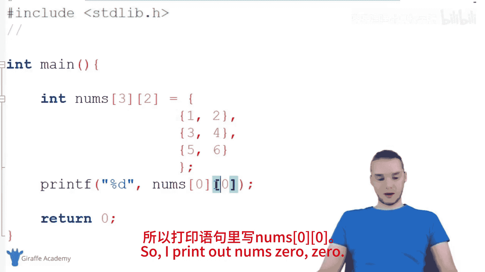
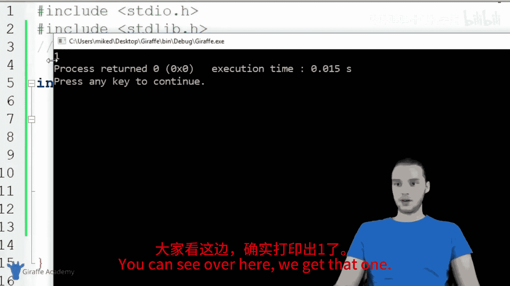
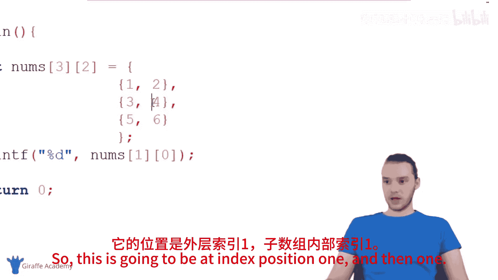
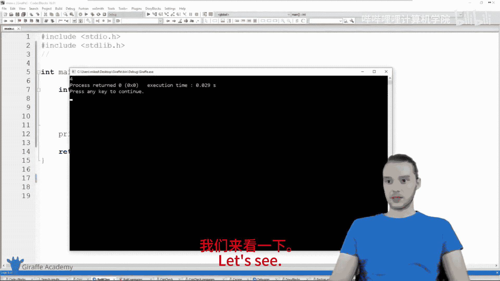
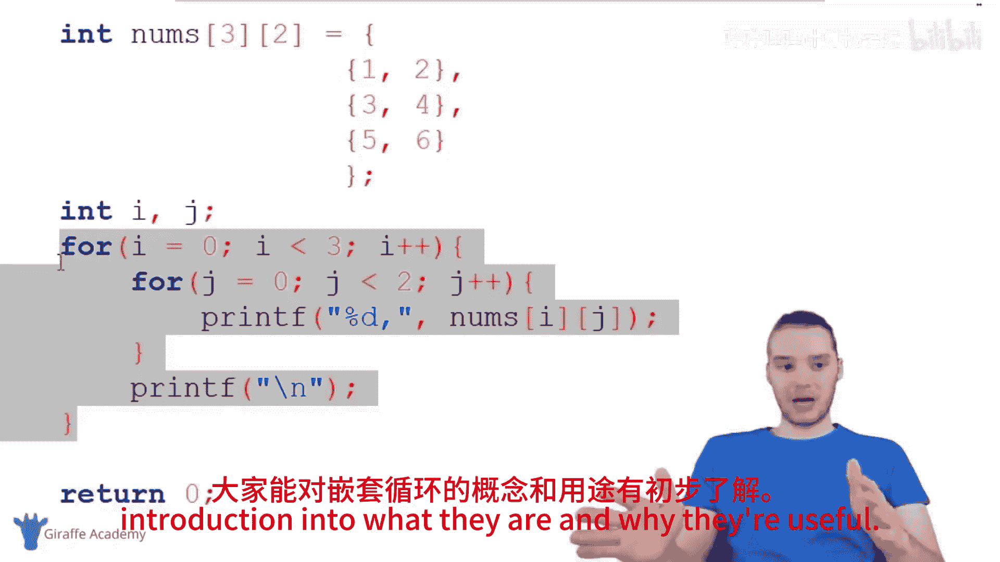

# 025：二维数组与嵌套循环 📚

在本节课中，我们将要学习两个核心概念：**二维数组**和**嵌套循环**。我们将首先了解什么是二维数组，然后学习如何使用嵌套循环来遍历和操作二维数组中的数据。这两个概念经常结合使用，是处理表格数据、矩阵运算等复杂数据结构的基础。

## 二维数组 📊

上一节我们介绍了普通的一维数组，本节中我们来看看**二维数组**。二维数组本质上是一个数组，但这个数组中的每一个元素本身也是一个数组。你可以把它想象成一个表格，有行和列。

### 创建二维数组

要创建一个二维数组，我们需要使用两对方括号 `[][]`。第一对方括号指定外层数组的大小（可以理解为行数），第二对方括号指定每个内层数组的大小（可以理解为列数）。

以下是创建一个二维整数数组的示例：

```c
int nums[3][2] = {
    {1, 2},
    {3, 4},
    {5, 6}
};
```

在这个例子中，我们创建了一个名为 `nums` 的二维数组。它包含3个元素（3行），每个元素本身又是一个包含2个整数的数组（2列）。因此，这个数组的结构如下：
- 第一行：`{1, 2}`
- 第二行：`{3, 4}`
- 第三行：`{5, 6}`

### 访问二维数组元素





要访问二维数组中的特定元素，我们需要使用两个索引：第一个索引指定行，第二个索引指定列。索引从0开始计数。





以下是访问元素的示例：

```c
printf("%d", nums[0][0]); // 输出第一行第一列的元素：1
printf("%d", nums[1][1]); // 输出第二行第二列的元素：4
```

## 嵌套循环 🔄

理解了二维数组的结构后，我们来看看如何系统地遍历它的所有元素。这就需要用到**嵌套循环**。嵌套循环是指在一个循环的内部，又包含了另一个完整的循环。

### 使用嵌套循环遍历二维数组

嵌套循环非常适合用来遍历二维数组。外层循环控制行索引，内层循环控制列索引。

以下是使用嵌套 `for` 循环打印二维数组所有元素的代码：

```c
int i, j;
for (i = 0; i < 3; i++) {        // 外层循环，遍历每一行
    for (j = 0; j < 2; j++) {    // 内层循环，遍历当前行的每一列
        printf("%d, ", nums[i][j]); // 打印当前元素
    }
    printf("\n"); // 每打印完一行后换行
}
```

让我们分析一下这段代码的执行过程：
1.  外层循环开始，`i = 0`。
2.  进入内层循环，`j` 从 0 到 1 变化，依次打印 `nums[0][0]` 和 `nums[0][1]`（即 `1, 2`）。
3.  内层循环结束，执行 `printf("\n")` 换行。
4.  外层循环进入下一次迭代，`i = 1`。
5.  重复内层循环，打印 `nums[1][0]` 和 `nums[1][1]`（即 `3, 4`）。
6.  以此类推，直到遍历完所有行和列。

运行这段代码，输出结果将是：
```
1, 2,
3, 4,
5, 6,
```

## 总结 🎯

本节课中我们一起学习了两个重要的C语言概念：
1.  **二维数组**：它是一种数组的数组，常用于表示表格或矩阵形式的数据。通过 `array[row][column]` 的格式来声明和访问。
2.  **嵌套循环**：它是一个循环内包含另一个循环的结构，是遍历和操作二维数组等多维数据的强大工具。通常外层循环控制“行”，内层循环控制“列”。




将二维数组与嵌套循环结合使用，可以高效地处理各种网格状数据，这是进行更复杂编程（如图形处理、游戏开发、科学计算）的基础。