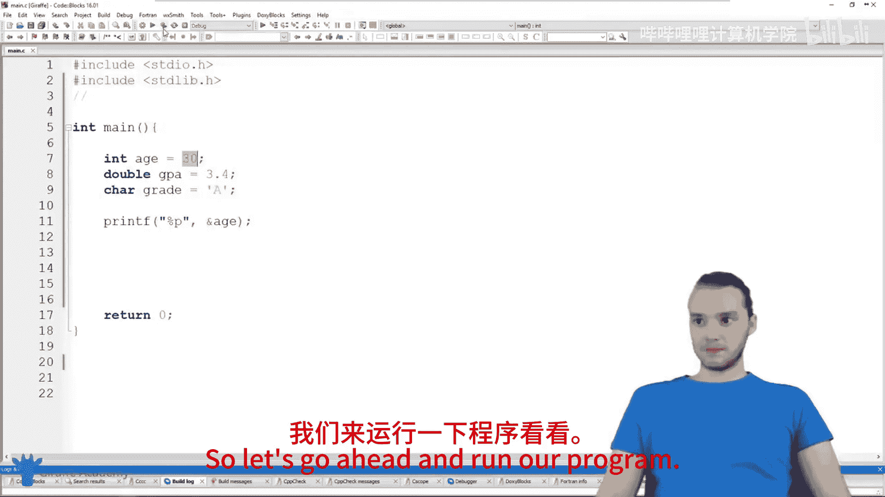
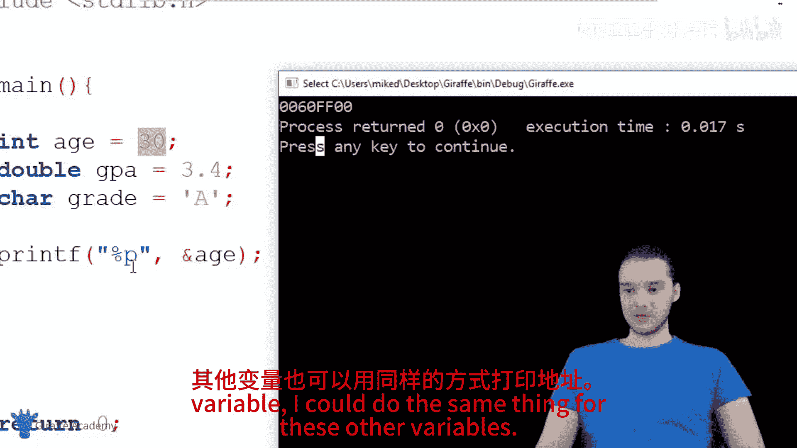
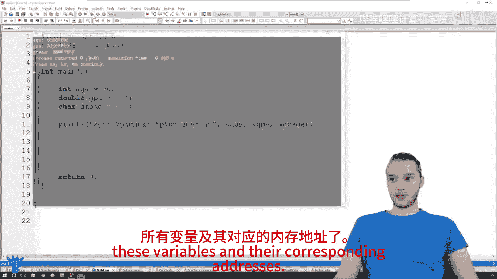
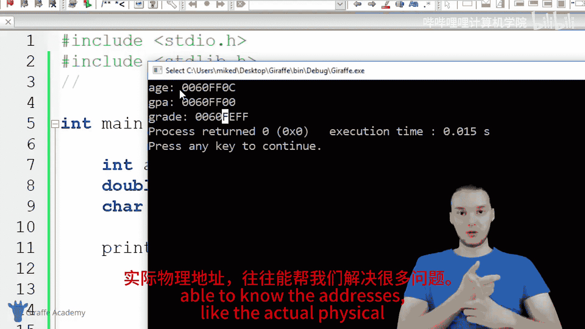
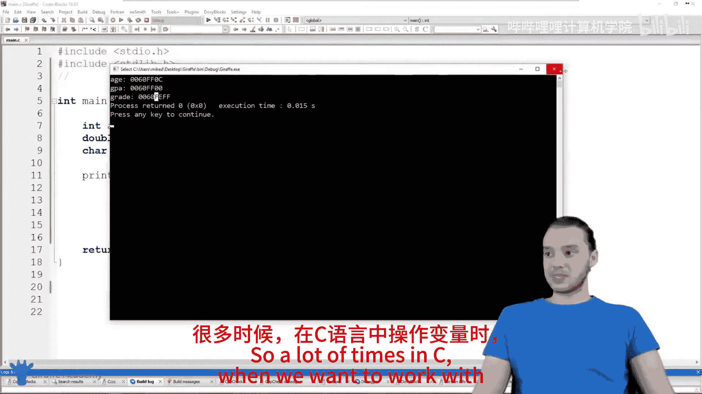
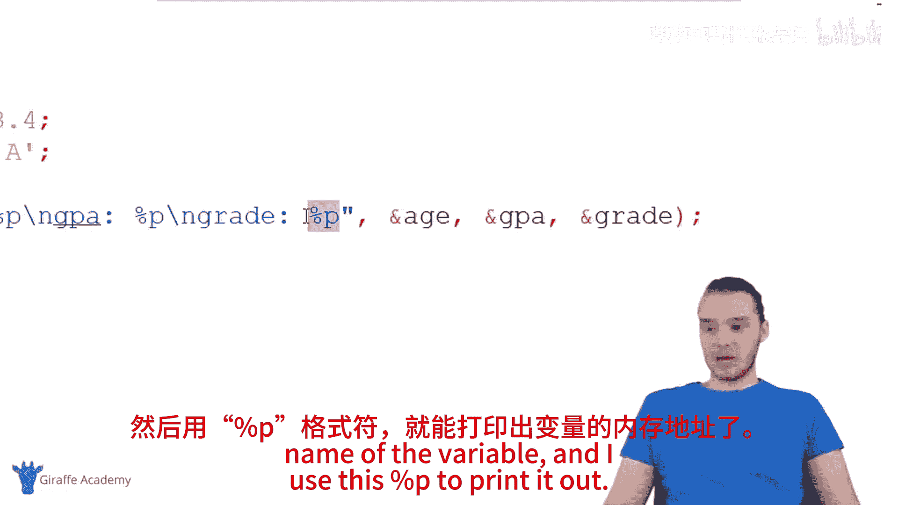

# 026：内存地址 💾

在本节课中，我们将要学习C语言中一个核心概念：内存地址。我们将了解变量在计算机内存中是如何存储的，以及如何访问和打印出这些变量的具体内存位置。

## 概述

在C语言编程中，我们经常需要存储各种信息。变量、数组和结构体等都是存储信息的工具。这些数据并非凭空存在，而是被存储在计算机的物理内存（通常称为RAM）中。每个存储的数据都有一个唯一的“地址”，就像房子有门牌号一样。理解内存地址是理解C语言如何与计算机硬件交互的关键一步。

上一节我们介绍了变量的基本使用，本节中我们来看看这些变量在计算机内存中究竟位于何处。

## 变量与内存

当我们创建一个变量时，例如 `int age = 30;`，C语言会做两件事：
1.  在内存（RAM）中找到一个空闲的位置。
2.  将值 `30` 存储在这个位置。

这个存储位置就是**内存地址**。虽然我们在代码中通过变量名 `age` 来访问值 `30`，但计算机内部是通过该值的内存地址来找到它的。

## 如何访问内存地址

在C语言中，我们可以使用**取址运算符** `&` 来获取一个变量的内存地址。

以下是访问内存地址的基本步骤：
1.  使用 `&` 运算符放在变量名前。
2.  使用 `printf` 函数配合 `%p` 格式说明符来打印这个地址。

`%p` 中的 “p” 代表指针（Pointer），它是专门用于打印内存地址（以十六进制格式显示）的格式符。

## 实践：打印变量地址



让我们通过一个例子来演示如何打印不同变量的内存地址。



```c
#include <stdio.h>

int main() {
    int age = 30;
    double gpa = 3.4;
    char grade = 'A';

    printf("变量 age 的内存地址是：%p\n", &age);
    printf("变量 gpa 的内存地址是：%p\n", &gpa);
    printf("变量 grade 的内存地址是：%p\n", &grade);

    return 0;
}
```



运行这段代码，你会在控制台看到类似以下的输出（具体地址值因计算机和运行环境而异）：
```
变量 age 的内存地址是：0x7ffd5a3b4b2c
变量 gpa 的内存地址是：0x7ffd5a3b4b30
变量 grade 的内存地址是：0x7ffd5a3b4b2b
```
这些以 `0x` 开头的十六进制数字就是各个变量值在内存中的“门牌号”。

## 为什么内存地址很重要？

理解内存地址非常重要，原因如下：
*   **计算机的工作方式**：CPU（中央处理器）通过内存地址来读写数据。我们使用变量名是为了编程方便，但最终计算机会将其转换为对内存地址的操作。
*   **高级主题的基础**：内存地址是学习后续更强大概念（如**指针**）的基石。指针本质上就是一个存储内存地址的变量。
*   **高效的数据处理**：通过直接操作地址，可以在函数间高效地传递和修改大量数据，而无需进行耗时的数据复制。

简单来说，内存地址是连接我们编写的高级C语言代码与计算机底层硬件的桥梁。

## 总结

本节课中我们一起学习了C语言中的内存地址。
1.  我们了解到，程序中定义的每个变量都存储在计算机内存的特定位置。
2.  我们学会了使用取址运算符 `&` 来获取变量的内存地址。
3.  我们掌握了使用 `printf` 和 `%p` 格式说明符来打印这个地址的方法。








记住，虽然我们现在可以直接使用变量名，但了解其背后的内存地址机制，能帮助我们更好地理解程序是如何运行的，并为学习更复杂的C语言特性（如指针）打下坚实的基础。在接下来的教程中，我们将看到如何利用这些地址做更多有趣和强大的事情。