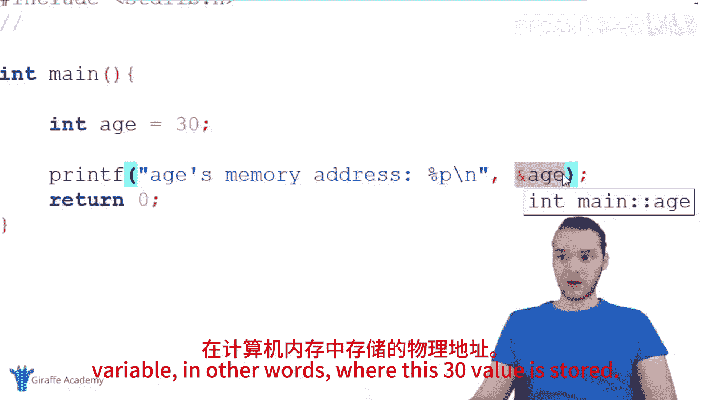
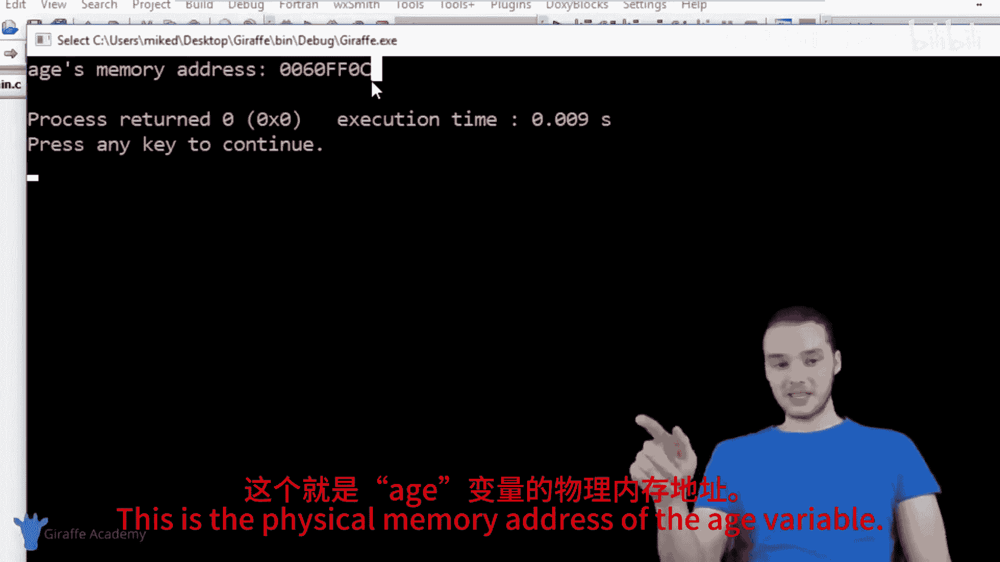
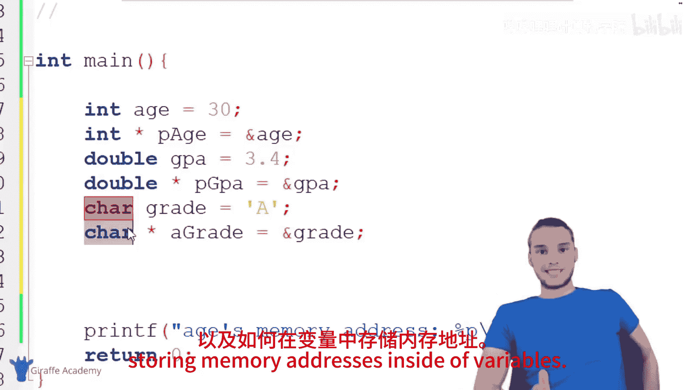

# 027：指针入门指南 🧭

在本节课中，我们将要学习C语言中一个核心概念：指针。指针是C语言中一种特殊的数据类型，它存储的是内存地址。理解指针对于深入学习C语言至关重要。

## 概述

指针是C语言中的一种数据类型，它代表一个内存地址。内存地址指向计算机内存中存储特定值的位置。虽然指针常被认为是复杂的概念，但实际上，它只是一种数据形式，就像整数、双精度浮点数或字符一样简单。

## 什么是指针？

指针本质上是一种数据类型，用于存储内存地址。内存地址是计算机内存中存储数据的物理位置。

**指针的定义**：`数据类型 *指针变量名;`

例如，一个整数指针可以这样声明：`int *p;`

## 访问变量的内存地址






在C语言中，我们可以使用取地址运算符`&`来获取变量的内存地址。

以下是一个示例代码，展示如何获取并打印变量的内存地址：

```c
#include <stdio.h>

int main() {
    int age = 30;
    printf("age的内存地址是: %p\n", &age);
    return 0;
}
```

运行这段代码，会输出`age`变量的内存地址，这是一个十六进制数。这个地址就是一个指针。

## 创建指针变量

我们可以创建专门的变量来存储指针，即存储其他变量的内存地址。

创建指针变量的步骤如下：
1.  指定指针所指向变量的数据类型。
2.  使用星号`*`声明这是一个指针变量。
3.  为指针变量命名。
4.  使用取地址运算符`&`将另一个变量的地址赋值给指针变量。

以下是创建不同类型指针变量的示例：

```c
#include <stdio.h>

int main() {
    // 声明普通变量
    int age = 30;
    double gpa = 3.4;
    char grade = 'A';

    // 创建指针变量并存储对应变量的地址
    int *pAge = &age;     // pAge 存储了 age 的地址
    double *pGpa = &gpa;  // pGpa 存储了 gpa 的地址
    char *pGrade = &grade; // pGrade 存储了 grade 的地址

    // 打印指针（内存地址）
    printf("age的地址: %p\n", pAge);
    printf("gpa的地址: %p\n", pGpa);
    printf("grade的地址: %p\n", pGrade);

    return 0;
}
```

## 指针与数据类型的关系

指针变量在声明时，其数据类型必须与它将要指向的变量数据类型一致。这是因为不同类型的数据在内存中占用的空间大小不同，指针需要知道如何正确解释所指向的内存内容。

以下是不同类型指针的声明方式：
*   `int *p;` 指向整数的指针。
*   `double *p;` 指向双精度浮点数的指针。
*   `char *p;` 指向字符的指针。

## 总结

本节课中我们一起学习了C语言指针的基础知识。我们了解到：
1.  **指针是一种数据类型**，其值是内存地址。
2.  可以使用取地址运算符`&`获取任何变量的内存地址。
3.  可以创建指针变量来专门存储这些内存地址。
4.  声明指针时必须指明它所指向的数据类型。




记住，指针并不神秘，它只是我们程序中可以使用的另一种信息形式。掌握了指针，你就打开了高效管理内存和构建复杂数据结构的大门。在接下来的课程中，我们将学习如何使用指针来访问和修改它所指向的值。