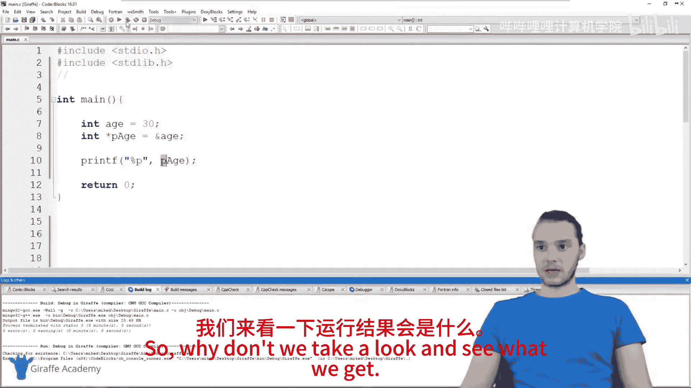
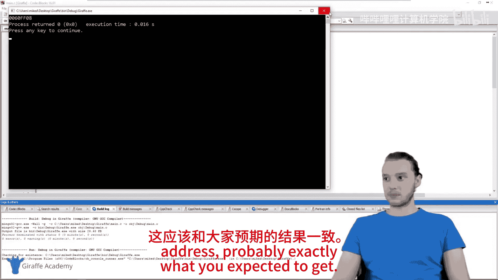
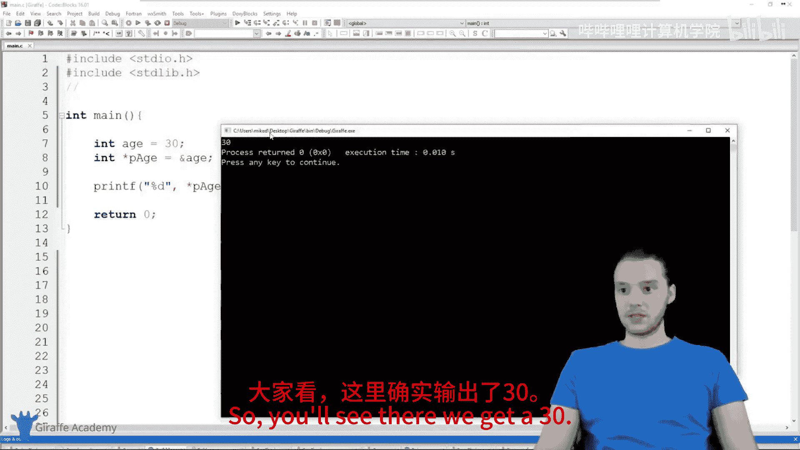
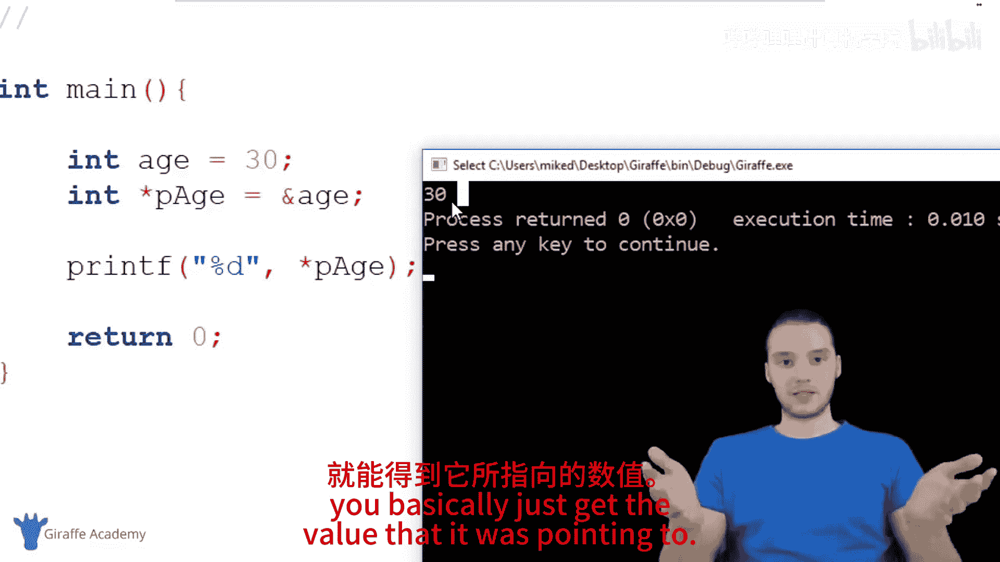
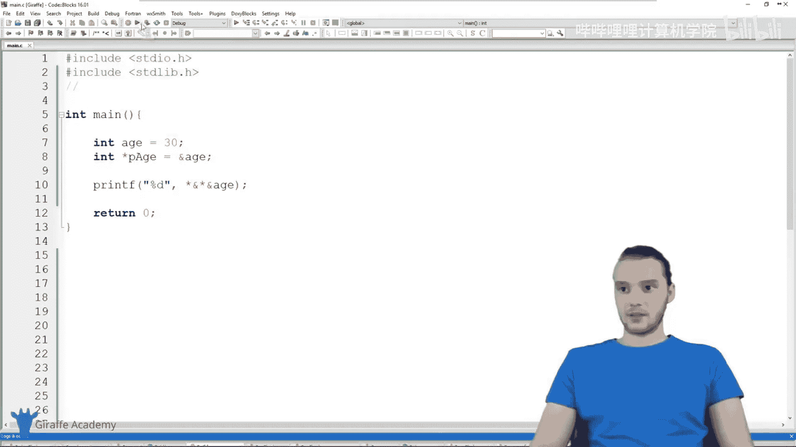
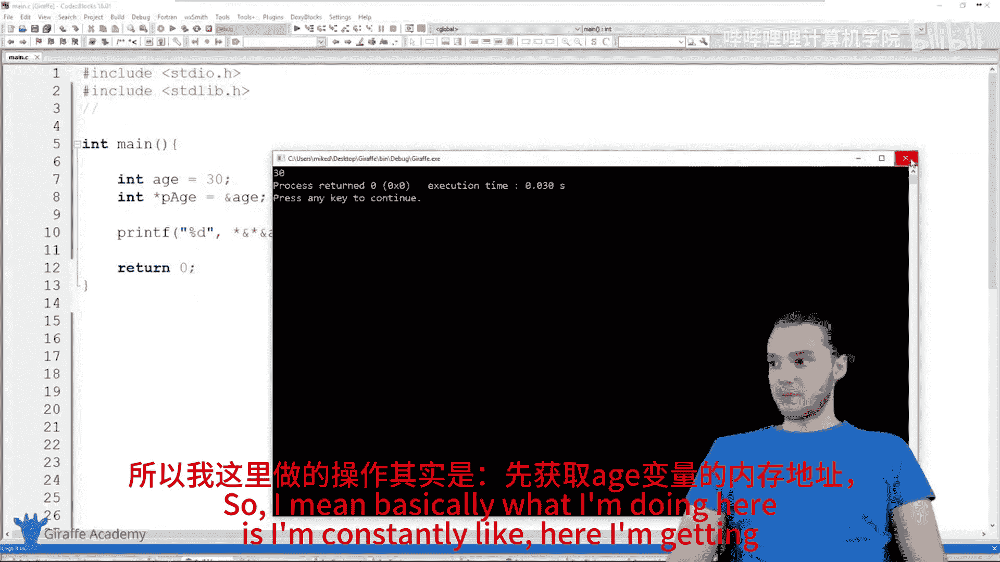
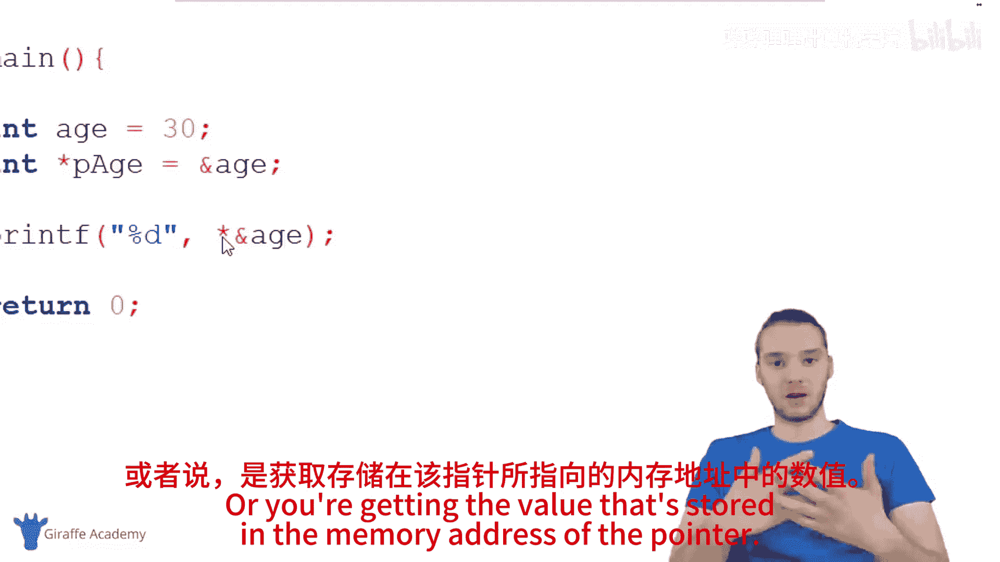

# 028：取消引用指针 📌

在本节课中，我们将要学习C语言中一个核心概念：**取消引用指针**。指针是程序中用于存储内存地址的一种数据类型。通过取消引用指针，我们可以访问该内存地址中存储的实际值。掌握这一操作对于深入理解内存管理和数据操作至关重要。

## 指针基础回顾

上一节我们介绍了指针的基本概念，本节中我们来看看如何通过取消引用指针来获取内存地址中存储的值。

指针本质上是一个内存地址。在程序中，我们有时需要直接操作内存地址，这些地址在C语言中被称为指针。例如，以下代码定义了一个整型变量和一个指向该变量的指针：

```c
int age = 30;
int *pAge = &age;
```

这里，`age` 存储整数值 `30`，`pAge` 存储 `age` 变量的内存地址。

## 什么是取消引用指针？

取消引用指针意味着访问指针所指向的内存地址，并获取该地址中存储的值。这一操作通过**星号（`*`）** 实现。

以下是取消引用指针的基本语法：

```c
int value = *pAge;
```

这行代码将 `pAge` 指向的内存地址中的值（即 `30`）赋给 `value` 变量。

## 取消引用指针的示例

让我们通过一个完整示例来演示取消引用指针的过程：





```c
#include <stdio.h>

int main() {
    int age = 30;
    int *pAge = &age;

    printf("内存地址: %p\n", pAge);
    printf("通过取消引用获取的值: %d\n", *pAge);

    return 0;
}
```

运行此程序，输出结果如下：

```
内存地址: 0x7ffeed42a7cc
通过取消引用获取的值: 30
```

可以看到，`pAge` 输出的是内存地址，而 `*pAge` 输出的是该地址中存储的值 `30`。

## 多层取消引用操作

取消引用操作可以多层嵌套，进一步展示指针与值之间的关系。以下是多层取消引用的示例：


```c
#include <stdio.h>

int main() {
    int age = 30;

    printf("直接值: %d\n", age);
    printf("地址: %p\n", &age);
    printf("取消引用一次: %d\n", *(&age));
    printf("再次获取地址: %p\n", &(*(&age)));
    printf("再次取消引用: %d\n", *(&(*(&age))));

    return 0;
}
```

输出结果：

```
直接值: 30
地址: 0x7ffeed42a7cc
取消引用一次: 30
再次获取地址: 0x7ffeed42a7cc
再次取消引用: 30
```





通过这个示例，可以清晰地看到：
- `&age` 获取 `age` 的内存地址。
- `*(&age)` 取消引用该地址，获取值 `30`。
- 多层操作最终仍指向相同的值和地址。

## 取消引用指针的应用场景

取消引用指针在以下场景中非常有用：
- 动态内存分配：通过指针访问堆内存中的数据。
- 函数参数传递：通过指针修改函数外部的变量值。
- 数组和字符串操作：直接访问数组元素或字符串字符。

例如，通过指针修改变量值：

```c
#include <stdio.h>

void changeValue(int *ptr) {
    *ptr = 99;
}

int main() {
    int num = 42;
    printf("修改前: %d\n", num);
    changeValue(&num);
    printf("修改后: %d\n", num);
    return 0;
}
```



输出：

```
修改前: 42
修改后: 99
```

## 注意事项



在使用取消引用指针时，需要注意以下几点：
- 确保指针已正确初始化，指向有效的内存地址。
- 避免对空指针（`NULL`）进行取消引用，这会导致程序崩溃。
- 指针类型应与所指数据类型匹配，否则可能导致未定义行为。

## 总结




本节课中我们一起学习了C语言中取消引用指针的概念和操作方法。我们了解到，指针是内存地址，通过星号（`*`）可以取消引用指针，获取该地址中存储的实际值。我们还通过示例代码演示了单层和多层取消引用操作，并探讨了其常见应用场景和注意事项。掌握取消引用指针是深入理解C语言内存管理的关键步骤，为后续学习动态内存分配和高级数据结构打下坚实基础。