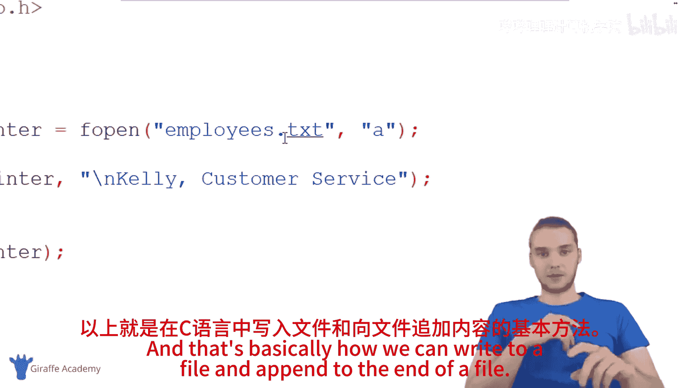

# 029：写入文件 📝

在本节课程中，我们将学习如何在C语言中向文件写入数据。C语言允许我们创建、修改和写入文件，这是处理数据持久化存储的重要技能。我们将涵盖创建文件、写入文件以及向文件追加内容的基本操作。

## 创建并打开文件

上一节我们介绍了文件的基本概念，本节中我们来看看如何实际操作文件。首先，我们需要在程序中创建一个文件指针，并使用`fopen`函数打开（或创建）一个文件。

```c
FILE *fpointer;
fpointer = fopen("employees.txt", "w");
```

**代码解释**：
*   `FILE *fpointer;`：声明一个指向`FILE`类型结构的指针。`FILE`是一个在`stdio.h`中定义的数据类型，用于表示文件流。
*   `fopen("employees.txt", "w");`：调用`fopen`函数。它接收两个参数：
    1.  文件名（例如 `"employees.txt"`）。
    2.  文件模式（例如 `"w"`）。

文件模式决定了我们对文件的操作意图。以下是三种基本模式：

*   `"r"`：**读取**。打开文件用于读取数据。文件必须存在。
*   `"w"`：**写入**。打开文件用于写入数据。如果文件不存在，则创建新文件；**如果文件已存在，则清空其原有内容**。
*   `"a"`：**追加**。打开文件用于在文件末尾追加数据。如果文件不存在，则创建新文件。

在本例中，我们使用`"w"`模式。即使`employees.txt`文件最初不存在，此操作也会在程序运行目录下创建它。

**重要提示**：操作文件后，必须使用`fclose`函数关闭文件。这会将数据从内存缓冲区写入磁盘，并释放相关资源。

```c
fclose(fpointer);
```

## 向文件写入数据

成功打开文件后，我们可以使用`fprintf`函数向其中写入数据。`fprintf`函数与常用的`printf`函数非常相似，区别在于它需要一个文件指针作为第一个参数，以指定写入的目标文件。

以下是向文件写入多行员工信息的示例：

```c
fprintf(fpointer, "Jim, Salesman\n");
fprintf(fpointer, "Pam, Receptionist\n");
fprintf(fpointer, "Oscar, Accounting\n");
```

**代码解释**：
*   `fprintf(fpointer, ...)`：第一个参数是文件指针`fpointer`，它指向我们之前打开的`employees.txt`文件。
*   后续参数的格式与`printf`完全相同。`\n`代表换行符，确保每个员工信息独占一行。

运行包含以上代码的程序后，你会在程序所在目录下找到一个名为`employees.txt`的新文件，其内容如下：

```
Jim, Salesman
Pam, Receptionist
Oscar, Accounting
```

**关于写入模式(`"w"`)的注意事项**：以`"w"`模式打开文件并写入时，**会覆盖文件的全部现有内容**。例如，如果你之后只写入一行`fprintf(fpointer, "Overridden");`，那么`employees.txt`中将只剩下`"Overridden"`这一行文本。

## 向文件追加数据

如果我们不想覆盖原有内容，而是想在文件末尾添加新数据，就需要使用**追加模式(`"a"`)**。

首先，以追加模式重新打开文件：

```c
fpointer = fopen("employees.txt", "a");
```

然后，使用`fprintf`写入新内容。由于文件指针现在位于文件末尾，新内容会自动接在后面。为了格式清晰，我们通常先写入一个换行符。

```c
fprintf(fpointer, "\nKelly, Customer Service");
```

运行程序后，`employees.txt`文件的内容将变为：

```
Jim, Salesman
Pam, Receptionist
Oscar, Accounting
Kelly, Customer Service
```

可以看到，`"Kelly, Customer Service"`被成功地添加到了文件末尾，而没有影响原有的三行数据。

## 总结

本节课中我们一起学习了C语言文件写入的核心操作：

1.  **创建/打开文件**：使用`FILE *指针 = fopen("文件名", "模式");`。关键模式包括创建/覆盖写入的`"w"`和尾部追加的`"a"`。
2.  **写入数据**：使用`fprintf(文件指针, "格式字符串", ...);`函数，其用法与`printf`类似，但第一个参数指定了目标文件。
3.  **关闭文件**：操作完成后，务必使用`fclose(文件指针);`来确保数据保存和资源释放。




通过组合使用`"w"`和`"a"`模式，配合`fprintf`函数，你可以创建、修改各种类型的文本文件（如`.txt`、`.html`、`.css`等），实现数据的持久化存储。记住，始终在文件操作结束时关闭文件，这是一个良好的编程习惯。