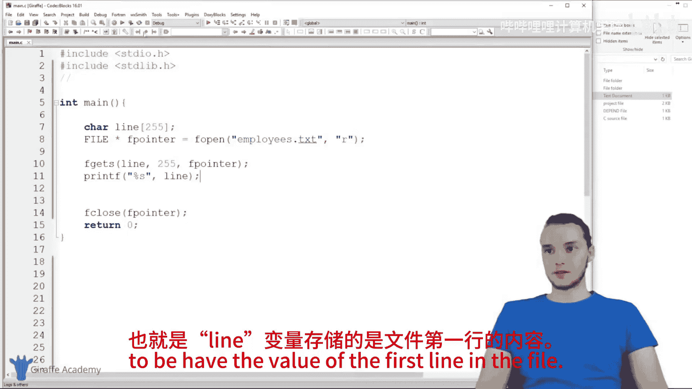
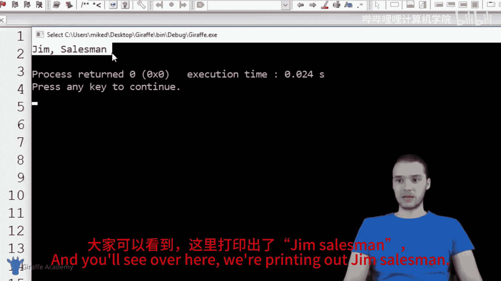
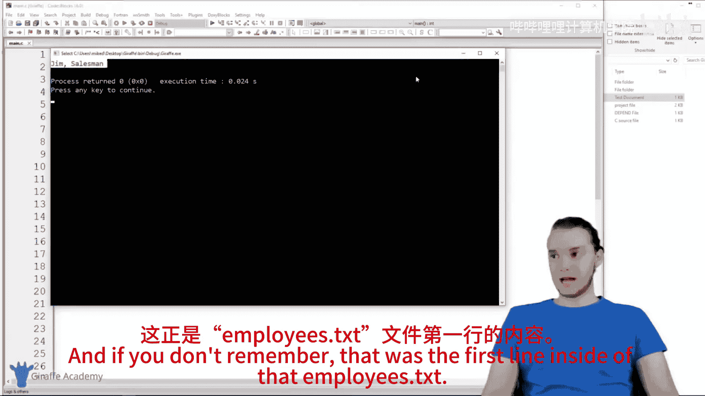
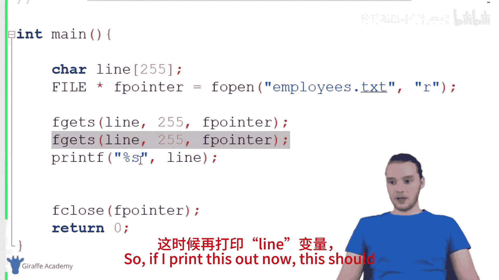
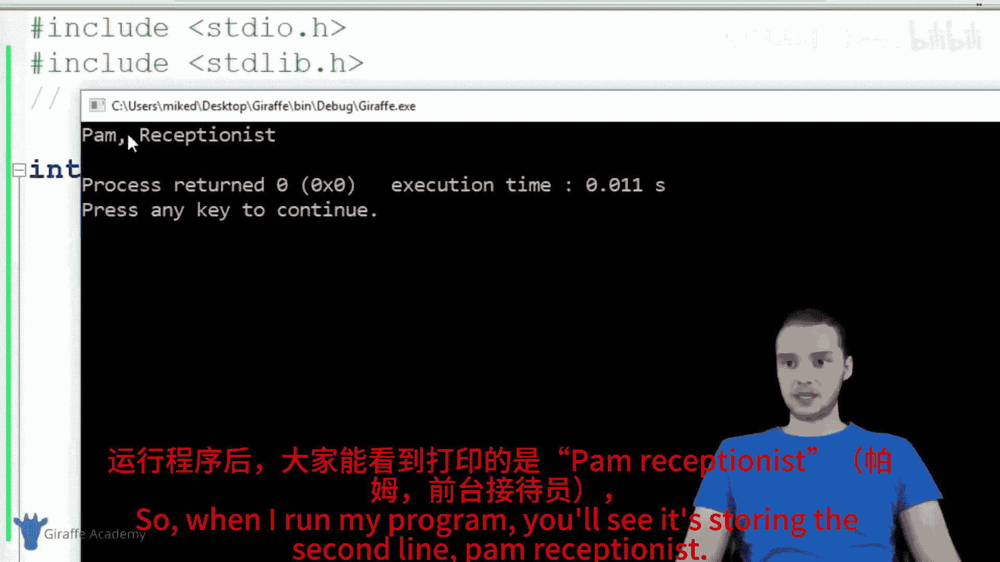
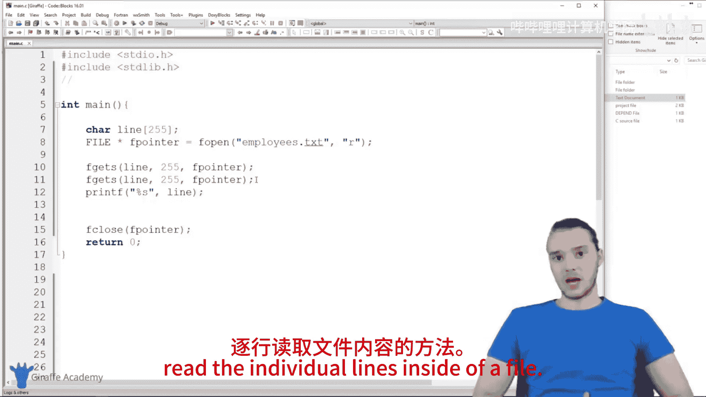

# 030：文件读写操作 📄

在本节课中，我们将学习如何在C语言中创建、写入、追加和读取文件。文件操作是C语言中一项强大的功能，它允许程序与计算机的文件系统进行交互，从而持久化存储数据。

## 概述
我们将首先学习如何创建新文件并向其中写入数据，然后了解如何向现有文件追加内容，最后学习如何从文件中读取信息。掌握这些技能将使你的程序能够处理外部数据。

---

### 创建与写入文件 ✍️

上一节我们介绍了程序的基本结构，本节中我们来看看如何操作文件。在C语言中，我们可以修改、更改甚至创建新的文件。

首先，我们需要在`main`函数中创建一个文件指针。文件指针是一个指向计算机上物理文件的内存地址。

```c
FILE *fpointer;
fpointer = fopen("employees.txt", "w");
```

*   **`FILE *fpointer;`**: 这行代码声明了一个指向`FILE`类型的指针，名为`fpointer`。`FILE`是一个特殊的数据类型，用于表示文件。
*   **`fopen("employees.txt", "w");`**: 这个函数用于打开一个文件。它接受两个参数：
    1.  文件名（例如 `"employees.txt"`）。
    2.  文件模式，它告诉C语言我们想对文件做什么操作。

以下是三种最基本的文件模式：
*   **`"r"`** (Read): 以只读方式打开文件。
*   **`"w"`** (Write): 以写入方式打开文件。如果文件不存在，则创建它；如果文件已存在，则**覆盖**其原有内容。
*   **`"a"`** (Append): 以追加方式打开文件。将新数据添加到文件末尾，而不删除原有内容。

在本例中，我们使用`"w"`模式。即使`employees.txt`文件不存在，程序也会创建它。

**非常重要的一点是**，操作完文件后，必须将其关闭。这会将文件从内存中移除，并确保所有更改都被保存。

```c
fclose(fpointer);
```

`fclose`函数接收文件指针作为参数，用于关闭对应的文件。

现在，让我们向文件中写入一些数据。我们可以使用`fprintf`函数，它的工作方式与熟悉的`printf`函数类似，但它是将内容写入文件，而非打印到控制台。

```c
fprintf(fpointer, "Jim, Salesman\nPam, Receptionist\nOscar, Accounting\n");
```

*   **`fprintf(fpointer, ...)`**: 第一个参数是文件指针，它告诉函数应该将数据写入哪个文件。
*   第二个参数是格式字符串，与`printf`的用法完全相同。

运行此程序后，你会在程序所在的目录下找到一个名为`employees.txt`的新文件，其中包含我们写入的三行员工信息。

需要注意的是，每次以`"w"`模式运行此程序，都会**覆盖**文件中的全部旧内容。

---

### 向文件追加内容 ➕

上一节我们学习了如何创建和覆盖文件，本节中我们来看看如何在不删除旧数据的情况下向文件添加新内容。

如果我们想向`employees.txt`文件添加一名新员工，而不是重写整个文件，就需要使用**追加**模式。

只需将`fopen`中的文件模式从`"w"`改为`"a"`即可。

```c
fpointer = fopen("employees.txt", "a");
fprintf(fpointer, "\nKelly, Customer Service");
```

*   **`"a"`** 模式：此模式会在文件末尾添加新数据。
*   我们在字符串开头添加了`\n`（换行符），以确保新内容从新的一行开始。

运行此程序后，打开`employees.txt`文件，你会看到“Kelly, Customer Service”被添加到了文件末尾，而原有的员工信息保持不变。

---

### 从文件读取内容 👀

上一节我们介绍了如何写入文件，本节中我们来看看如何从文件中读取信息。

要读取文件，我们需要使用**读取**模式（`"r"`）。

```c
FILE *fpointer;
fpointer = fopen("employees.txt", "r");
```

为了存储从文件中读取的内容，我们需要一个字符数组（字符串）。

```c
char line[255];
```

现在，我们可以使用`fgets`函数来逐行读取文件内容。

```c
fgets(line, 255, fpointer);
printf("%s", line);
```

以下是`fgets`函数的参数说明：
1.  **`line`**: 用于存储读取到的那一行内容的字符数组。
2.  **`255`**: 指定最多读取多少个字符（通常与数组大小匹配，防止溢出）。
3.  **`fpointer`**: 文件指针，指向我们要读取的文件。

`fgets`函数每次被调用时，都会读取文件的下一行，并将文件指针移动到该行之后。因此，多次调用`fgets`可以依次读取文件的所有行。

例如，要读取并打印文件的前两行，可以这样做：

```c
fgets(line, 255, fpointer); // 读取第一行
printf("%s", line);

fgets(line, 255, fpointer); // 读取第二行
printf("%s", line);
```





通过循环使用`fgets`，你可以读取整个文件的内容。



---

## 总结
本节课中我们一起学习了C语言中基本的文件操作。





1.  **写入文件 (`"w"` 模式)**: 用于创建新文件或覆盖现有文件。使用`fprintf`函数写入内容。
2.  **追加文件 (`"a"` 模式)**: 用于在现有文件末尾添加新内容，而不影响原有数据。
3.  **读取文件 (`"r"` 模式)**: 用于从文件中获取数据。使用`fgets`函数可以方便地逐行读取。




记住，使用`fopen`打开文件后，务必使用`fclose`关闭文件，这是一个良好的编程习惯。掌握了这些操作，你的程序就能与外部文件进行有效的输入输出交互了。