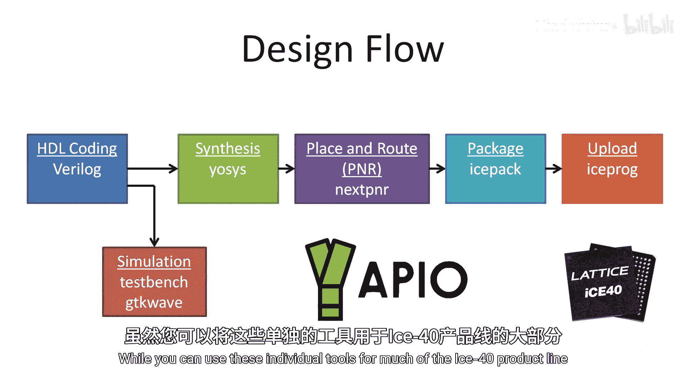
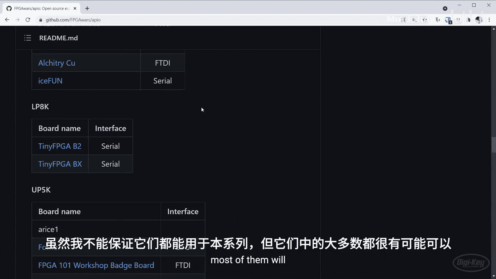
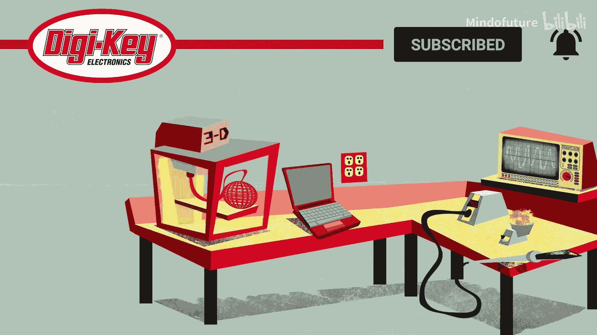

FPGA编程入门：P01：什么是FPGA？🔌

在本节课中，我们将要学习什么是现场可编程门阵列（FPGA）。我们将探讨FPGA的基本概念、它与传统微控制器的区别、其典型应用场景，以及如何开始为FPGA创建设计。课程内容将尽可能简单直白，适合初学者理解。

---

### 概述

FPGA代表现场可编程门阵列。它是一种集成电路或芯片，允许你设计完全自定义的数字逻辑电路。在接下来的课程中，我将展示如何开始使用FPGA，以便你能创建自己的自定义数字电路。

我建议先理解一些数字逻辑的基础知识，例如二进制以及与门、或门、非门的工作原理。因为我们将主要专注于使用硬件描述语言来实现这些设计。

然后，我将展示如何将你的设计上传到FPGA，以便你能看到它们实际工作。

让我们开始吧。

---

### FPGA是什么？🧩

我经常听到的一个核心问题是：我能用FPGA做什么？你可能会得到诸如“它比微控制器更快”或“它允许你并行处理事情”之类的回答。这些说法可能正确，但并未完整描绘出FPGA的全貌。

如果你只追求快速和并行，或许直接购买一块强大的显卡或将多个处理器连接在一起会是更好的选择。

FPGA由许多逻辑单元组成，这些单元是创建数字电路的基本构建模块。我们将在本系列后续课程中深入探讨这些单元的内部结构，但现在你可以将它们想象成一堆积木。

你可以配置单个单元以特定方式工作，并将这些单元连接起来，形成任何数字电路的基础。这就像用乐高积木搭建一辆玩具车一样。你还可以访问时钟信号和用于存储数据的RAM块等资源。请注意，一些FPGA可能还包含其他外设，如模数转换器或模拟输出。

逻辑单元通常被分组到逻辑块中，这种可重构的、相互连接的硬件组通常被称为FPGA架构。

---

### FPGA与微控制器的对比 ⚖️

回到我们的汽车类比，如果你只是想要一辆玩具车来玩跳跃，直接购买一辆玩具车可能更好。这很可能比自己动手制作更容易，也可能更便宜。

这类似于使用微控制器。微控制器能够做很多事情，但它是一个具有特定用途的处理器，附带一些静态外设，你可以用来连接传感器、电机、灯光等。

与此形成对比的是FPGA，它为你提供了构建更多东西的模块。事实上，你可以使用这些构建模块在FPGA内部制作你自己的处理器。这被称为软核处理器，它允许你像在微控制器或微处理器上一样运行代码。

如果你有足够的空间，甚至可以在一个FPGA上实现多个处理器。请注意，你可能无法访问微控制器上常见的某些外设，比如那些模数转换器。

实现软核处理器非常流行，因为它允许你既自定义处理器，又将其连接到你在FPGA架构上创建的其他数字电路。

如果时间允许，我的目标是在本系列后续课程中展示如何在某个FPGA架构上加载一个非常简单的RISC-V处理器。但在那之前，让我们先看看一些你可能想使用FPGA而非微控制器或微处理器的示例用例。

---

### FPGA的应用实例 💡

例如，这些令人着迷的LED立方体就是由FPGA控制的。大多数微控制器都难以以如此高的速率向所有那些面板提供如此大量的数据。

你还可以发现FPGA被用于通信设备中，执行各种数字信号处理任务，如滤波、压缩和计算傅里叶变换。虽然处理器也可用于DSP，但FPGA中的自定义逻辑可能更适合处理更高的频率和更高的数据速率。

你甚至可以在一些消费电子产品中找到FPGA。例如，对梅赛德斯-奔驰信息娱乐中心的拆解显示，其PCB上有一个赛灵思FPGA。有时，使用像FPGA这样的可重构逻辑比生产自己的芯片更便宜，因为后者可能产生高昂的模具成本。

除了制造自己的芯片，你还可以使用FPGA作为快速原型设计的方法，因为它们可以被反复重新配置。如果你打算生产成千上万或数百万个单元，并且现成的集成电路无法满足需求，你可以制造一个专用集成电路。

请注意，有时，如果你只生产少量单元（就像我们刚才看到的梅赛德斯-奔驰信息娱乐中心的情况），将FPGA直接放入最终产品中可能更具成本效益。

如果我拆开我心爱的Analog Discovery设备，你可以在这里找到另一个赛灵思FPGA。它被用于数据采集，可以非常快速地从示波器的模拟前端或作为逻辑分析仪的一部分采样和缓冲数据。

你还可以发现非常庞大和强大的FPGA被用于专门的计算，例如挖掘加密货币或训练神经网络。这些操作所使用的特定计算可以在硬件层面进行优化。因此，你经常会发现，对于某一特定应用，FPGA的性能可以超过通用处理器或图形处理单元。

我希望这些例子能让你对FPGA的应用领域有一些概念。

---

### 为何选择FPGA？ 🤔

让我们花点时间总结一下，为什么你可能想使用FPGA而不是传统的微控制器或微处理器。

最重要的一点是，你可以在FPGA中创建自定义的、可重构的数字逻辑电路。如果你找不到一个拥有你所需外设的处理器（比如，三个USB主机控制器），你或许可以在FPGA中自己制作一个。

你可以将FPGA用作外部芯片来增强你的处理器，或者你可以在FPGA本身内部实现一个处理器。一些CPU设计，例如许多RISC-V实现，是开源的。这意味着你可以查看和修改源代码，从而开启了改变处理器功能的可能性。

如果你需要添加一个独特的汇编指令或支持一些专门功能（例如在单个时钟周期内完成乘加运算的能力），你可以在FPGA中实现。它们还提供了创建优化数字电路的能力，用于执行专门计算，例如在仅几个时钟周期内计算快速傅里叶变换。对于特定应用，微控制器或微处理器可能太慢，无法满足你的需求。

最后，如果你打算将你的数字逻辑制造成芯片用于销售或作为大型项目的一部分，FPGA是一个帮助你进行原型设计的好工具。

---

### 如何为FPGA设计？ 🛠️

现在，让我们谈谈如何“编程”或更准确地说，如何为你的FPGA创建设计。

在大多数情况下，你将使用硬件描述语言（如Verilog或VHDL）来描述你想要创建的电路。虽然其中一些语法可能看起来像C或Python，但重要的是要注意，HDL并不像编程语言那样运行，因为我们不是在为处理器创建一系列顺序执行的指令。

相反，将HDL更多地看作是你用来设计网站的标记语言。所有事情或多或少都是同时发生的，因为各个行不是按顺序执行的。我展示的这段Verilog代码片段将定义这个简单的逻辑电路。请注意，FPGA如何实现这个电路可能并不完全是一堆逻辑门的集合。我们将在未来的课程中探讨这是如何工作的。

你将遇到两种最常见的硬件描述语言：VHDL和Verilog。VHDL代表超高速集成电路硬件描述语言，Verilog是“验证”和“逻辑”的合成词。两者都于20世纪80年代初被引入。

VHDL由美国国防部开发。它是一种强类型语言，通常被认为非常严格和冗长。Verilog由Gateway Design Automation公司创建，该公司后来被Cadence Design Systems收购。它是一种弱类型语言，语法更接近C语言。

这两种语言都是寄存器传输级设计的例子。它们描述了电路如何在寄存器之间移动和操作数据，但并未描述实现这一功能所需的精确硬件。你会在网上找到许多讨论，争论一种语言相对于另一种语言的优点。事实是，它们都是行业标准，并且足够相似，一旦你熟练掌握了其中一种，另一种就相对容易上手。

因为本系列课程中我们将要使用的开源工具集目前仅支持Verilog，所以我们将使用它。

---

### 其他工具与设计流程 📋

你还应该了解一些其他语言和工具。SystemVerilog非常流行，因为它简单地扩展了2005版Verilog的功能，增加了帮助你编写测试平台的功能，这些测试平台用于验证你的设计是否正常工作。

许多大型FPGA供应商正在推广高级综合工具。这些工具是强大的程序，可以自动将C、C++和MATLAB等高级语言转换为RTL代码。它们允许新手用更熟悉的语言编写程序，然后将其转换为FPGA的设计。虽然这可能不如手动编写RTL代码那样优化，但它有可能为你节省大量的设计时间。

你还可以通过使用知识产权核来节省时间。你通常可以从主要的FPGA供应商或其合作伙伴那里下载或购买IP核。这些就像你在编写软件时可能使用的闭源库。它们会占用你的一些逻辑块，并具有你可以连接的文档化接口。然而，你看不到内部是什么。它们可以提供各种功能，如软核处理器、专用DSP滤波器、压缩、神经网络等。有了IP核，你通常不需要担心制作困难的部分，而是可以专注于为你的特定应用创建连接逻辑。

创建FPGA应用的术语与你可能听说的编写软件的术语有很大不同，因为这里没有编译器或汇编器。以下是一个典型的设计流程：

1.  首先，你用硬件描述语言编写代码（本课程我们将使用Verilog）。
2.  之后，你通常希望仿真你的设计。许多FPGA开发环境都包含仿真器，但我们将使用开源的GTKWave作为可视化工具。你通常需要编写Verilog来测试你的原始设计，这被称为测试平台。虽然通常建议在综合之前进行仿真，但我们将把它留到本系列课程的后面，因为在真实硬件上操作设计要有趣得多。
3.  接下来，我们综合我们的代码，我们将为此使用开源的Yosys工具。综合工具将你的HDL代码转换为门级表示。此步骤的输出类似于一个网表，它告诉FPGA各种单元、逻辑和寄存器应如何连接。然而，这个网表是相当通用的，我们特定的FPGA可能不知道如何处理它。
4.  因此，我们有一个布局布线步骤，就像你设计印刷电路板时会做的那样。这是另一个自动化工具，它将综合输出的网表转换为需要在我们的特定FPGA中建立的实际门和连线连接。我们将为此使用nextpnr。像其他工具一样，这也是一个开源工具。
5.  我们的PNR工具的输出是一个ASCII文件，它确切地告诉FPGA需要做什么才能创建我们在代码中定义的电路。然而，它主要是人类可读的格式，所以我们使用icepack工具将其转换为FPGA配置过程实际可以读取的二进制文件。
6.  最后，我们使用iceprog将该二进制文件上传到连接到FPGA的外部闪存芯片。

为了使整个过程更容易，并且你不需要记住所有这些工具的名称，我们将使用apio，这是一个为我们调用所有这些底层工具的工具。请注意，我们将要使用的这套工具仅适用于莱迪思的iCE40系列FPGA。这些通常被认为是相当低功耗且价格低廉的FPGA，但这对于我们的学习体验来说是完美的。

虽然你可以将这些独立工具用于iCE40产品线的大部分，但apio是为开发板设计的。如果你查看nextpnr的GitHub页面，你可以看到其图形化布局布线工具的示例。这是一个可选功能，欢迎你尝试，但我们在本系列课程中不需要使用它。你可以看到该工具如何在你的FPGA中的各个单元之间进行实际的布线连接。

如果你访问apio的GitHub页面并在README上向下滚动，你可以看到apio支持的各种开发板。虽然我不能保证它们都适用于本系列课程，但大多数很可能可以。我将使用莱迪思的iCEstick。

这是一款围绕iCE40 HX1K FPGA构建的开发板。我建议为它准备一根USB延长线，并且你需要一些基本组件，如面包板、跳线和一些按钮。我将在每节课中告知你是否需要额外的组件。

---

### 总结

在本节课中，我们一起学习了FPGA的基本概念。我们了解到FPGA是一种可重构的数字逻辑芯片，由可配置的逻辑单元组成，能够实现从简单逻辑电路到完整处理器的各种设计。我们对比了FPGA与微控制器的区别，探讨了FPGA在高速数据处理、原型设计、专用计算等领域的应用优势。最后，我们介绍了使用Verilog硬件描述语言进行FPGA设计的基本流程，以及相关的开源工具链。

本系列课程的目标是为你提供开始使用FPGA创建项目所需的基本构建模块。在下一节课中，我们将安装apio工具集并上传我们的第一个FPGA设计。

祝你学习愉快！